# 049：8——评估（上） - 吴恩达大模型 🧪

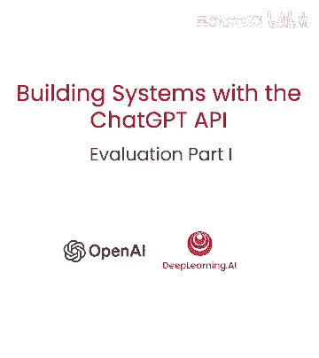

## 概述

在本节课中，我们将要学习如何评估基于大型语言模型（LLM）构建的应用系统的性能。我们将探讨与传统监督学习不同的评估工作流程，并学习如何通过逐步构建测试集、自动化评估指标来迭代和改进系统。

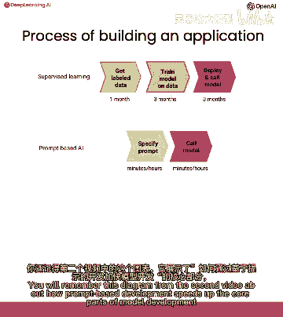

---

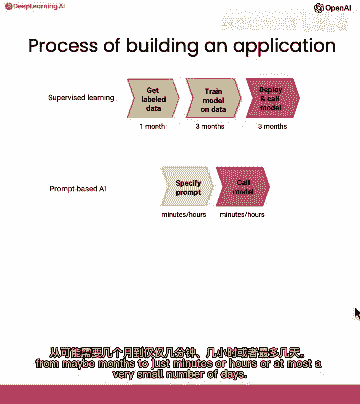

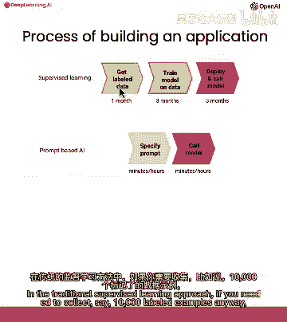

## 评估LLM应用与传统机器学习的区别

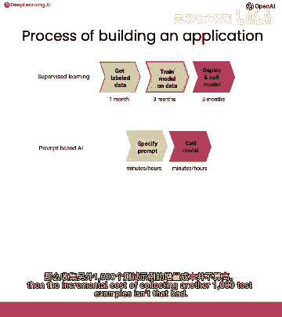

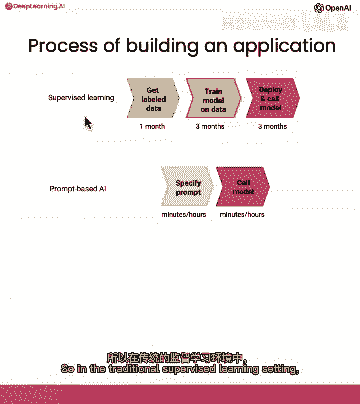

上一节我们介绍了如何构建一个LLM应用。本节中我们来看看如何评估它的表现。

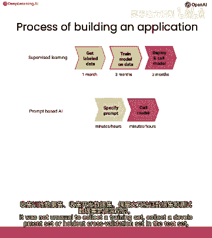

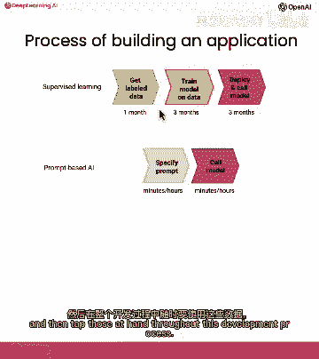

在传统监督学习中，开发流程通常从收集大规模的训练集、开发集和测试集开始。然而，在使用LLM构建应用时，情况有所不同。核心区别在于开发速度。

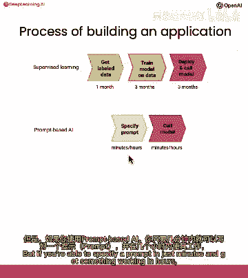

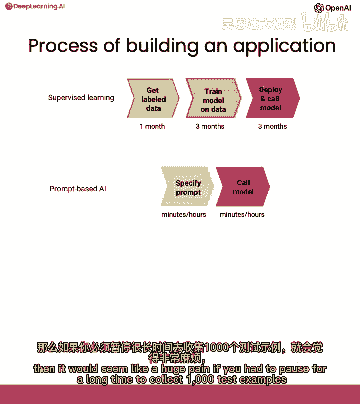

**传统监督学习流程**：
1.  收集大量（例如一万个）标记数据。
2.  划分训练集、开发集和测试集。
3.  模型开发周期可能长达数月。

**基于提示的LLM开发流程**：
1.  可以从零个训练样本开始。
2.  通过编写和调整提示来快速构建应用。
3.  开发周期可缩短至几分钟、几小时或几天。

因此，评估LLM应用通常不是从一个大型测试集开始，而是从一个**逐渐增长的小型开发集**开始。

---

## LLM应用的迭代评估流程

以下是评估和迭代LLM应用的典型步骤：

1.  **初始提示调整**：使用少量（例如1-5个）精心挑选的示例来调整提示，直到在这些示例上工作良好。
2.  **收集困难案例**：当系统在实际使用中遇到失败案例时，将这些“棘手”的示例添加到你的开发集中。
3.  **建立自动化评估**：当手动检查每个示例变得繁琐时，为你的开发集定义评估指标（如平均准确率）并编写代码进行自动化测试。
4.  **收集更大规模随机样本**：如果你需要对系统性能有更高精度的估计，可以收集一个更大的、随机的开发集样本。
5.  **使用留出测试集**：只有当你需要一个完全无偏的、在调整模型时从未见过的性能估计时，才需要收集和使用独立的留出测试集。

**重要警告**：对于任何**高风险应用**（存在偏见或不适当输出可能对他人造成伤害），必须严格遵循步骤4和5，收集足够大的数据集来负责任地评估系统性能。

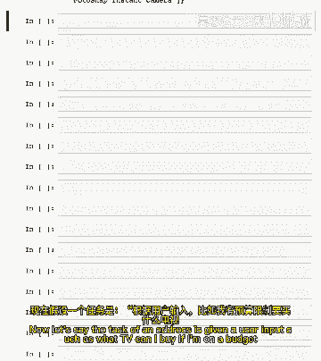

---

## 实践示例：构建产品检索系统

让我们通过一个产品检索系统的例子来实践上述流程。假设任务是根据用户查询，从数据库中检索相关的产品类别和产品列表。

首先，我们定义一个初始提示（`prompt`），它包含系统指令和一个良好的输出示例（单样本提示）。

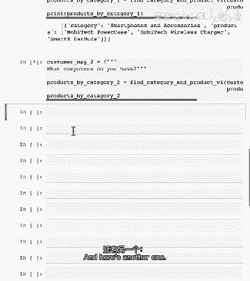

```python
# 示例：初始提示 (prompt v1)
system_message = """
你是一个购物助手。根据用户查询，从给定的产品信息中检索相关的类别和产品。
以JSON列表格式输出，每个元素是一个包含“category”和“products”键的字典。
不要输出任何额外的文本。
"""
# ... (包含一个用户查询和助手正确响应的示例)
```

我们可能在几个示例上测试这个提示，并发现它工作良好。

---

## 识别问题并扩展开发集

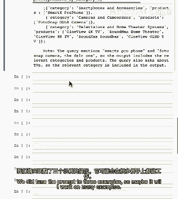

当我们让系统处理更多用户查询时，可能会遇到失败的案例。例如，对于查询“告诉我关于smiprofile和全屏快照相机的信息，你还有什么电视”，系统可能输出了正确的JSON数据，但末尾附加了大量无关的“垃圾”文本，这破坏了输出的结构。

此时，我们应：
1.  将这个失败的示例记录下来。
2.  将其添加到我们的开发集中。

随着时间推移，我们可能会收集到多个这样的困难示例（例如，索引为3和4的查询）。现在我们的开发集从最初的3个示例增长到了5个。

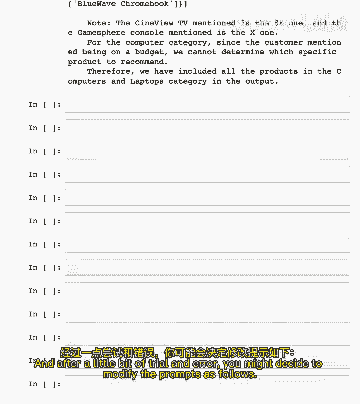

---

## 改进提示并验证

为了解决输出额外文本的问题，我们修改提示，明确强调“**不要输出任何额外的文本，只输出JSON格式**”，并可能添加更多的正确输出示例（少样本提示）。我们称这个为`prompt_v2`。

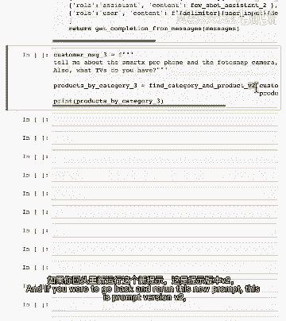

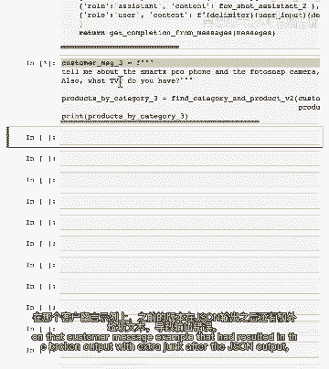

在应用新提示后，我们必须**重新运行整个开发集**（现在有5个示例）以确保：
1.  新提示修复了之前失败案例（索引3和4）的问题。
2.  新提示没有破坏之前工作良好的案例（索引0, 1, 2）——这称为**回归测试**。

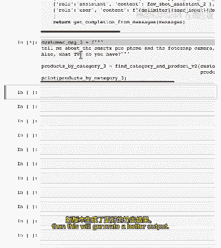

---

## 自动化评估流程

当开发集增长到一定规模（例如10个示例）时，手动检查每个输出变得低效。我们需要自动化评估。

以下是实现自动化评估的关键步骤：

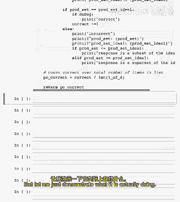

首先，我们需要一个包含输入（客户消息）和预期输出（理想答案）的开发集。

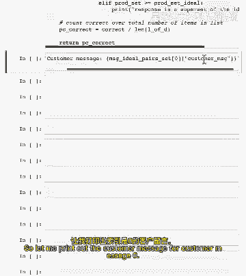

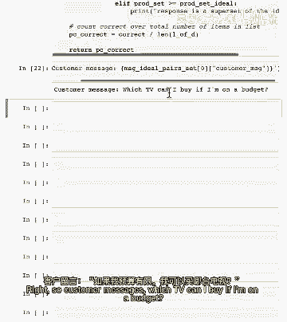

```python
# 示例：开发集结构
dev_set = [
    {
        "customer_message": "如果我在预算内可以买什么电视？",
        "ideal_answer": [{"category": "电视和家庭影院系统", "products": ["电视A", "电视B"...]}]
    },
    # ... 更多示例
]
```

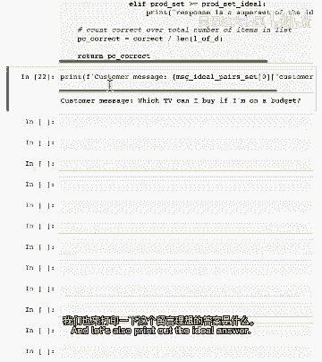

其次，编写一个评估函数，用于比较LLM的实际输出与理想答案。

```python
def evaluate_response(response, ideal_answer):
    """
    评估单个查询的响应。
    比较响应中的类别和产品列表是否与理想答案匹配。
    返回一个分数（例如，1表示完全匹配，0表示不匹配）。
    """
    # 实现细节：解析response JSON，与ideal_answer逐项比较
    if response == ideal_answer:
        return 1
    else:
        return 0
```

最后，遍历整个开发集，计算总体性能指标。

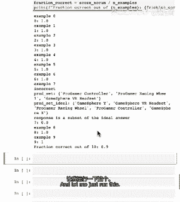

```python
def evaluate_on_dev_set(prompt, dev_set):
    """
    在整个开发集上评估提示的性能。
    """
    scores = []
    for example in dev_set:
        customer_msg = example["customer_message"]
        ideal_answer = example["ideal_answer"]
        # 使用当前prompt和customer_msg调用LLM，获得实际响应
        response = get_llm_response(prompt, customer_msg)
        # 评估单个响应
        score = evaluate_response(response, ideal_answer)
        scores.append(score)
    # 计算平均准确率
    average_score = sum(scores) / len(scores)
    return average_score
```

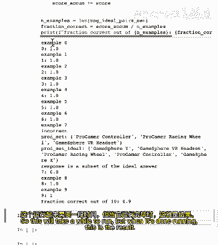

运行这个评估脚本后，我们可以得到一个量化的性能指标（例如，90%的准确率）。每次修改提示后，重新运行评估，就能客观地知道修改是提升了还是降低了系统性能。

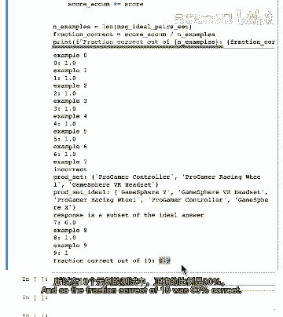

---

## 总结

本节课中我们一起学习了评估基于LLM的应用系统的核心方法。

我们认识到，其工作流程与传统监督学习不同，更侧重于**快速迭代**和**基于困难示例的渐进式开发**。评估通常始于一个小型、手工挑选的开发集，并通过自动化测试来量化提示修改的效果。对于大多数中低风险应用，这个过程可能就足够了。但对于高风险应用，必须进行更严格的大规模数据集评估。

一个有趣的发现是，即使是一个很小的开发集（例如10个精心挑选的困难示例），在指导提示迭代和帮助团队达成有效系统方面，也可能非常强大。

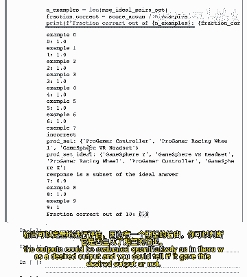

在下一个视频中，我们将继续探讨评估的另一个重要方面：当输出没有单一“正确”答案时，如何进行评估。