# 050：评估（下）🔍


## 概述

在本节课中，我们将学习如何评估大型语言模型（LLM）生成的文本输出。当输出没有唯一正确答案时，我们需要系统的方法来判断其质量。我们将介绍两种核心评估方法：使用评分标准（Rubric）和使用专家答案（Golden Answer）进行对比。

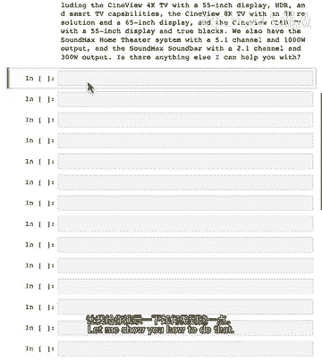

---

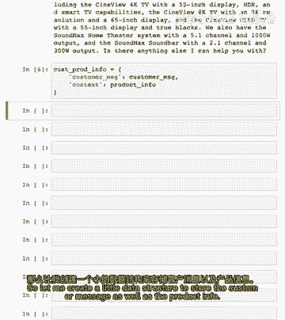

## 评估文本输出的挑战

上一节我们介绍了如何评估具有明确分类或列表的LLM输出。本节中我们来看看如何评估那些开放式、仅有一段文本的LLM输出。

例如，对于一个客户服务问题，可能存在许多“好”的答案。如何判断LLM给出的答案是否令人满意呢？

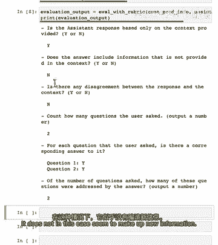

---

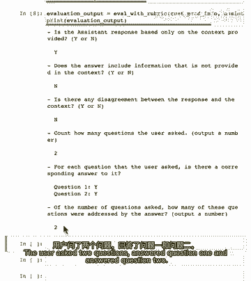

## 方法一：使用评分标准（Rubric）进行评估

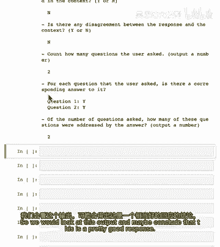

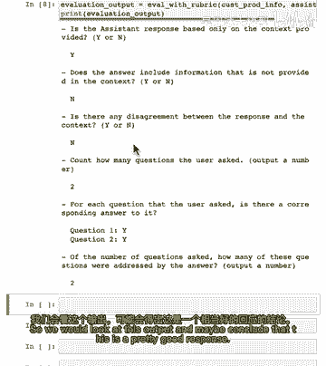

一种评估方法是创建一个评分标准，即一份评估答案不同维度的指南，然后根据它来决定答案是否合格。

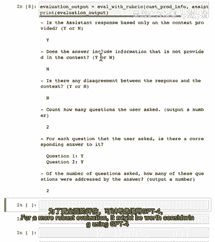

以下是创建和使用评分标准的关键步骤：

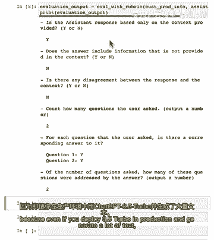

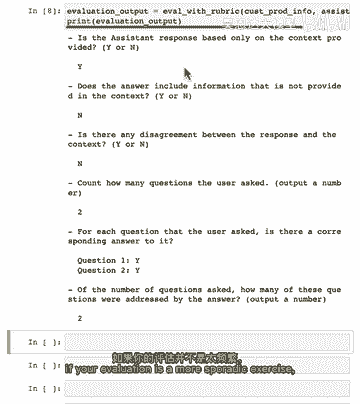

1.  **准备数据**：首先，我们需要组织好客户消息、相关的产品信息以及LLM生成的助手答案。
    ```python
    # 示例数据结构
    data = {
        "customer_message": "告诉我关于配置和全步相机等",
        "product_info": {...}, # 产品信息字典
        "assistant_answer": "你肯定得帮助智能手机，智能，等等..."
    }
    ```

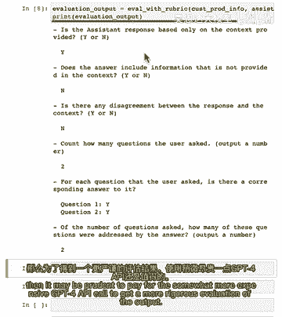

2.  **设计评估提示**：编写一个系统提示，指导LLM扮演评估员的角色。
    *   **角色**：你是一个评估客户服务代理回答效果的专家。
    *   **输入**：提供`客户消息`、`产品信息（上下文）`和`LLM生成的助手答案`。
    *   **评分标准**：明确列出评估维度，例如：
        *   答案是否仅基于提供的上下文？（是否编造了新信息？）
        *   答案与上下文之间是否存在不一致？
        *   是否完整回答了用户的问题？
    *   **输出格式**：要求LLM输出“是”或“否”等明确结论。

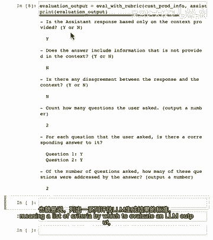

3.  **执行评估**：将上述提示和数据发送给另一个LLM（如GPT-3.5-Turbo或GPT-4）进行评估。

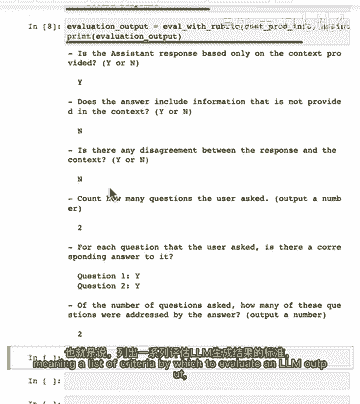

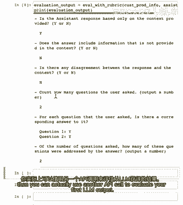

**重要提示**：对于生产环境或更严格的评估，建议使用能力更强的模型（如GPT-4）作为“评估员”，即使你的应用本身使用更轻量的模型（如GPT-3.5-Turbo）。因为评估通常调用频率较低，使用更可靠的模型能确保评估质量。

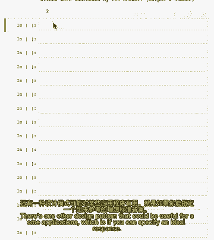

**核心设计模式**：你可以通过一个API调用生成内容，再通过另一个API调用（使用评分标准）来评估第一个输出的质量。这是一个强大且实用的模式。

---

## 方法二：与专家答案（Golden Answer）对比

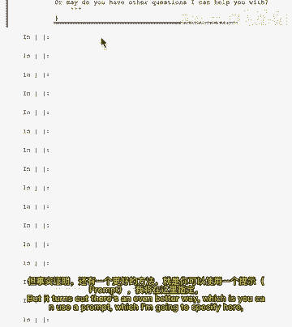

如果你拥有人类专家编写的理想答案（Golden Answer），你可以通过对比来评估LLM的输出。

以下是具体操作步骤：

1.  **准备专家答案**：由领域专家针对客户问题撰写一个高质量的参考答案。
    ```python
    golden_answer = “这是一个理想的专家答案，它详细、准确且有用...”
    ```

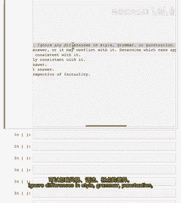

2.  **设计对比提示**：使用一个提示要求LLM比较自动生成的答案与专家答案。
    *   这个提示可以基于开源评估框架（如OpenAI的Evals框架）中的评分标准。
    *   要求LLM忽略风格、语法等表面差异，专注于**事实内容**的比较。

3.  **定义评分等级**：通常可以定义一个从A到E的等级，例如：
    *   **A**：提交的答案是专家答案的**子集**，且完全一致。
    *   **B**：提交的答案是专家答案的**超集**，且完全一致（可能包含额外但正确的事实）。
    *   **C**：答案包含专家答案的所有关键细节。
    *   **D**：答案与专家答案**存在分歧**。
    *   **E**：答案与专家答案**完全不同**或包含幻觉。

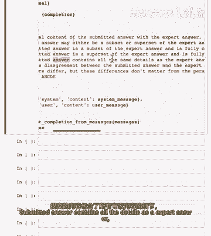

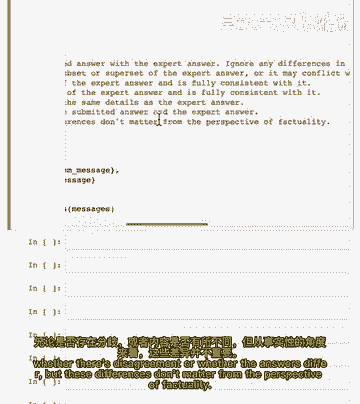

4.  **执行评估**：将客户消息、专家答案和待评估的LLM答案发送给评估模型。

**示例结果**：
*   一个简洁但正确的LLM答案可能被评为 **A**（是专家答案的子集）。
*   一个完全无关或错误的答案（如引用电影台词）可能被评为 **D** 或 **E**。

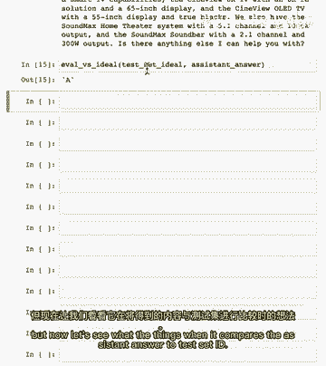

---

## 总结

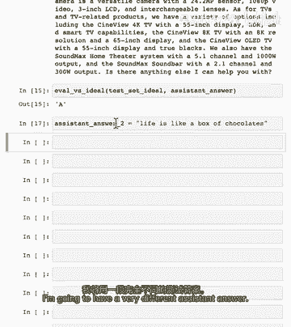

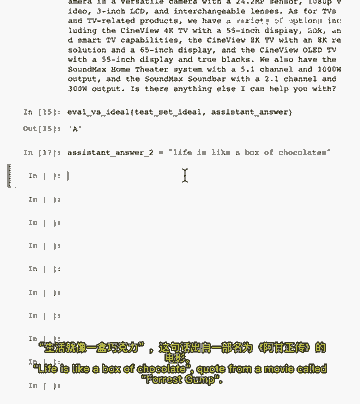

本节课中我们一起学习了两种评估LLM文本输出的有效方法：

1.  **使用评分标准（Rubric）**：当你无法定义唯一正确答案时，可以通过制定详细的评估维度，利用另一个LLM来评判输出的质量。
2.  **与专家答案（Golden Answer）对比**：当你拥有高质量的参考回答时，可以设计提示让LLM进行内容对比，并给出等级评分。

掌握这些评估方法，能帮助你在开发过程中持续优化提示词和系统流程，并在系统上线后有效监控其性能表现。