# 053：NLP 任务接口 🛠️


在本节课中，我们将学习如何使用 Gradio 快速构建两个自然语言处理应用的用户界面。这两个应用分别是文本摘要和命名实体识别。我们将使用专门为这些任务设计的专家模型，并通过简单的代码将它们包装成易于分享和测试的 Web 应用。


---

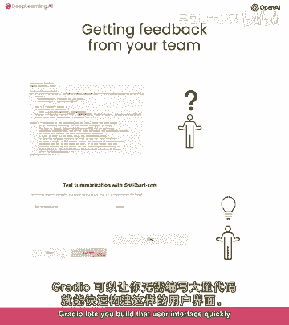

## 概述 📋

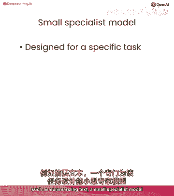

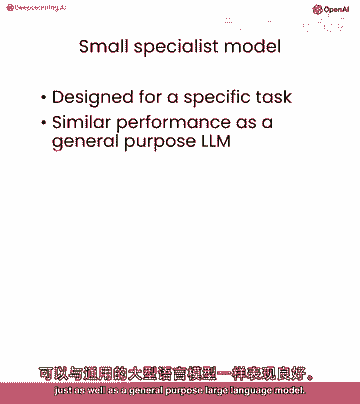

构建生成式 AI 应用时，与团队或社区分享并获取反馈至关重要。为他们提供一个无需运行代码的用户界面非常有帮助。Gradio 让你能够快速构建这样的界面，而无需编写大量代码。

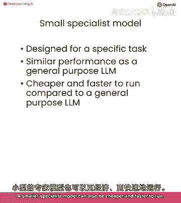

当你有特定的任务（例如总结文本）时，一个专门为该任务设计的小型专家模型可以执行得与通用的大型语言模型一样好，甚至更便宜、更快。


在本节中，你将构建一个可以执行两个 NLP 任务的应用程序：总结文本和识别命名实体。我们将使用为这两个任务设计的两个专家模型。

---

## 第一步：设置环境与辅助函数

首先，我们需要设置 API 密钥和辅助函数。课程中使用的模型托管在服务器上，通过 API 端点访问。如果你在本地运行，代码会略有不同。

以下是调用文本摘要模型的辅助函数示例：

```python
# 假设的 API 调用函数
def get_completion(endpoint, input_text):
    # 这里会向指定的端点发送请求并返回结果
    pass
```

我们使用的摘要模型是 `bart-cnn`，它是一个专门为文本摘要构建的蒸馏模型，基于 Facebook 训练的大型 BART 模型。蒸馏过程使用大型模型的预测来训练小型模型，从而在保持相似性能的同时，降低成本和提高速度。

---

## 第二步：构建文本摘要应用 📝

上一节我们介绍了模型的基本调用方式，本节中我们来看看如何用 Gradio 为其构建一个用户界面。

我们将定义一个名为 `summarize` 的函数，它接受输入文本，调用我们的 `get_completion` 函数，并返回摘要。

以下是构建 Gradio 界面的核心步骤：

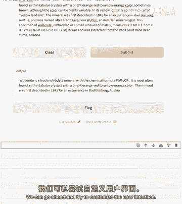

1.  导入 Gradio 库。
2.  定义处理函数。
3.  使用 `gr.Interface` 创建界面，指定输入和输出类型。
4.  启动应用。

```python
import gradio as gr

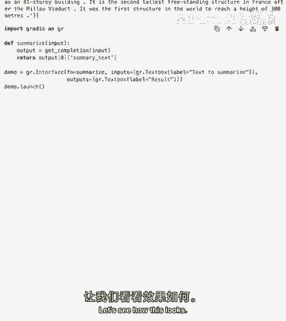

def summarize(input_text):
    # 调用摘要模型的 API 端点
    summary = get_completion("SUMMARY_ENDPOINT", input_text)
    return summary

# 创建简单的界面
demo = gr.Interface(fn=summarize, inputs="text", outputs="text")
demo.launch()
```

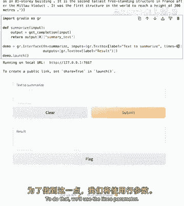

运行这段代码后，你将获得一个基础的 Web 界面，可以粘贴文本并获取摘要。

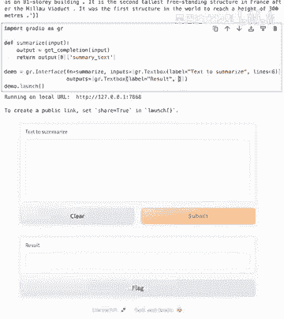

---

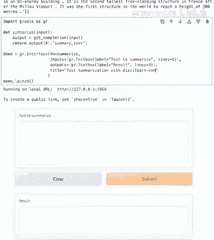

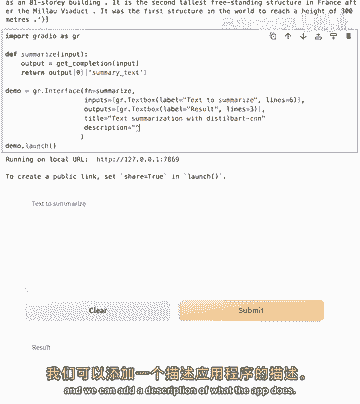

### 自定义用户界面

基础的界面功能完备，但我们可以让它对用户更友好。以下是几个自定义选项：

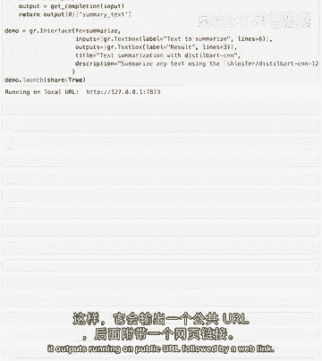

*   **添加标签**：将简单的 `inputs=“text”` 替换为 `gr.Textbox` 组件，并为其添加标签。
*   **调整文本框大小**：使用 `lines` 参数控制文本框的高度，提示用户可以输入多行文本。
*   **添加标题和描述**：让用户更清楚应用的功能。
*   **分享应用**：通过设置 `share=True`，可以生成一个公共链接，方便与他人分享。

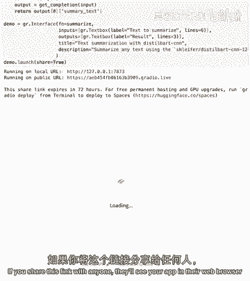

以下是改进后的代码示例：

```python
demo = gr.Interface(
    fn=summarize,
    inputs=gr.Textbox(label="输入要总结的文本", lines=6),
    outputs=gr.Textbox(label="总结结果", lines=3),
    title="📄 Bart-CNN 文本摘要器",
    description="使用专门的摘要模型为长文本生成简洁的总结。"
)
demo.launch(share=False) # 在课程中本地显示，如需分享可设为 True
```

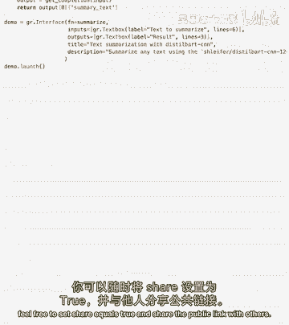

---

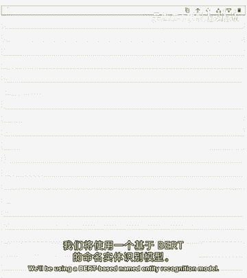

## 第三步：构建命名实体识别应用 🏷️

接下来，我们将构建第二个应用：命名实体识别。该模型能识别文本中的人名、机构名、地名等实体。

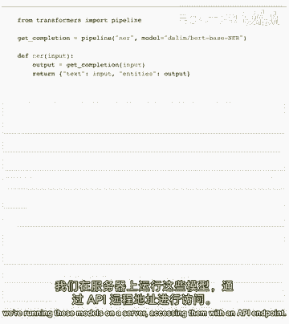

我们使用的模型是基于 BERT 的，并经过微调以在此任务上达到先进性能。它可以识别四种实体类型：**地理位置**、**组织**、**人**和其他。

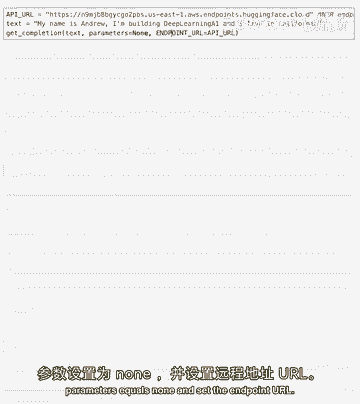

与摘要应用类似，我们首先通过 API 调用模型，它会返回一个包含实体信息的列表。

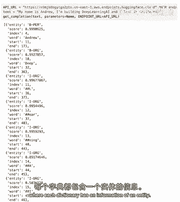

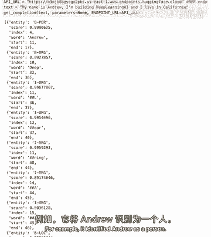

```python
# 调用 NER 模型
entities = get_completion("NER_ENDPOINT", input_text)
# 返回示例：[{"entity": "PER", "word": "Andrew", ...}, ...]
```

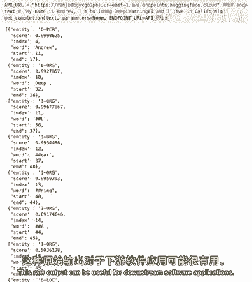

这种原始输出对软件处理有用，但对普通用户不够直观。接下来，我们用 Gradio 让它变得可视化。

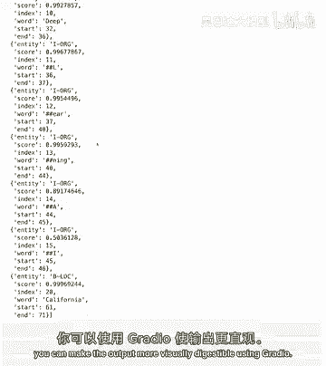

---

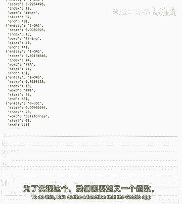

### 创建可视化 NER 界面

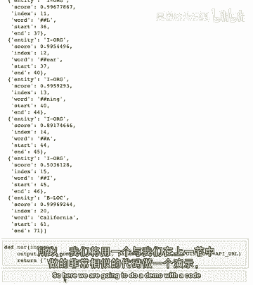

我们将定义一个函数 `ner` 来调用模型，并使用 Gradio 的 `gr.HighlightedText` 组件来高亮显示文本中的实体。

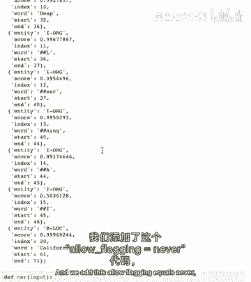

以下是构建此应用时引入的新功能：

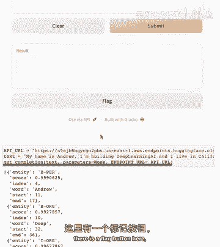

*   **高亮输出**：使用 `gr.HighlightedText` 作为输出类型，直观展示实体。
*   **隐藏标记按钮**：通过 `allow_flagging=“never”` 隐藏默认的标记反馈按钮。
*   **提供示例**：在界面中添加示例文本，帮助用户快速理解应用用法。

```python
def ner(input_text):
    # 调用 NER 模型的 API 端点
    entities = get_completion("NER_ENDPOINT", input_text)
    # 返回原始文本和实体列表，供 HighlightedText 组件渲染
    return input_text, entities

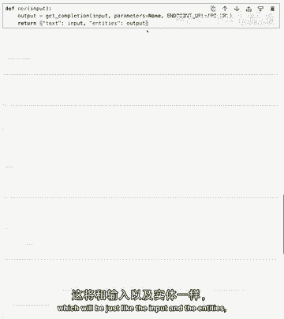

# 示例文本
examples = [
    ["Andrew is building a course for the Hugging Face team in Paris."],
    ["My name is Polly and I work at Hugging Face in Vienna."]
]

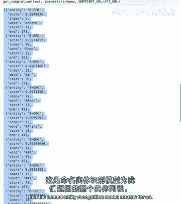

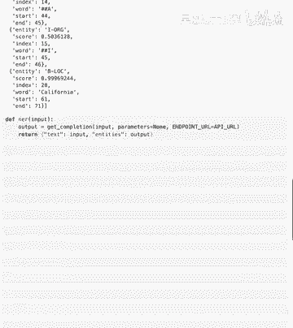

demo = gr.Interface(
    fn=ner,
    inputs=gr.Textbox(label="输入文本", placeholder="在此输入包含人名、地名、机构名的句子..."),
    outputs=gr.HighlightedText(label="识别出的实体"),
    title="🔍 命名实体识别器",
    description="识别文本中的人名、地名、组织机构名。",
    examples=examples,
    allow_flagging="never"
)
demo.launch()
```

运行后，界面会高亮显示识别出的实体，例如人名显示为黄色，地名显示为绿色等。

---

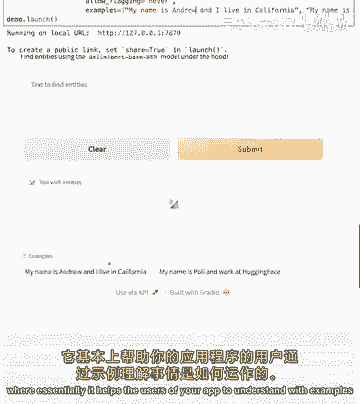

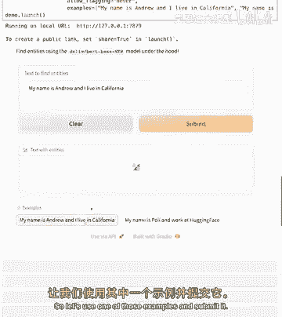

### 处理标记合并

你可能会注意到，模型有时会将一个单词拆分成多个“标记”（Token）输出（例如，“Hugging” 和 “Face” 被分开识别）。这是为了提高模型效率。

对于面向用户的应用，我们可能希望将属于同一实体的多个标记合并显示为一个完整的单词。我们可以编写一个后处理函数来实现：

```python
def merge_tokens(entities):
    merged = []
    for entity in entities:
        # 简化逻辑：如果当前标记是中间标记(‘I-‘开头)，则与上一个开始标记(‘B-‘开头)合并
        # 此处省略具体实现代码
        pass
    return merged

# 在 ner 函数中调用 merge_tokens 处理 entities
```

将处理后的实体列表返回给 Gradio，用户就能看到更整洁、完整的实体高亮效果了。

---

## 总结 🎉

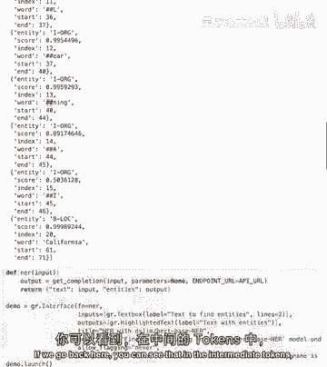

在本节课中，我们一起学习了：

1.  **构建 Gradio 应用的基本流程**：从定义处理函数到创建和启动界面。
2.  **创建了文本摘要应用**：使用专门的 `bart-cnn` 模型，并学会了如何自定义界面元素（如标签、大小、标题）以提升用户体验。
3.  **创建了命名实体识别应用**：使用基于 BERT 的 NER 模型，利用 `gr.HighlightedText` 组件可视化实体，并通过提供示例和合并标记来优化显示效果。

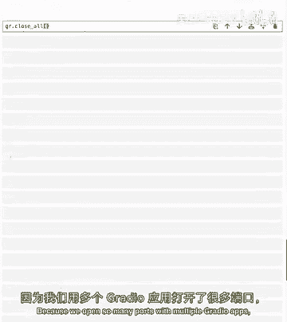

你已成功构建了前两个 Gradio 应用！鼓励你尝试输入不同的句子（例如包含自己名字、所在地或公司的句子），测试模型的表现。

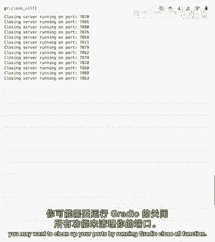

**提示**：由于在 Jupyter 中运行了多个 Gradio 应用，可能会打开多个端口。在结束本课或开始下一课前，记得关闭所有正在运行的 Gradio 实例以清理端口。

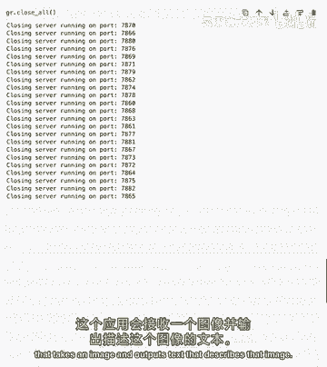

在下一节课中，我们将超越文本输入，构建一个**图像描述应用**，它接受一张图像作为输入，并输出描述该图像的文本。