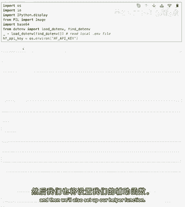
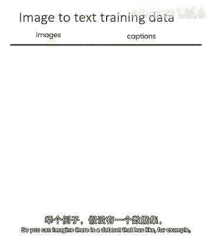
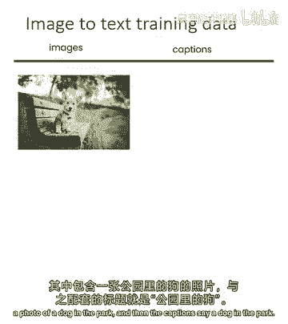
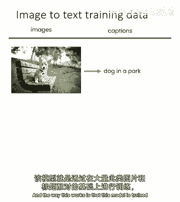
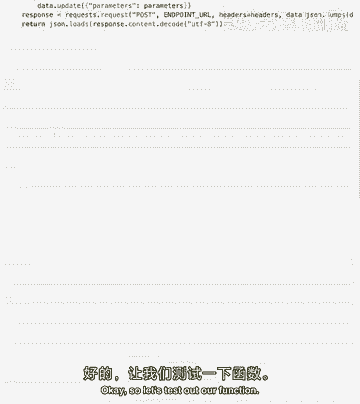
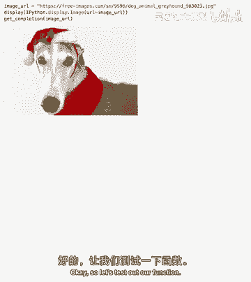
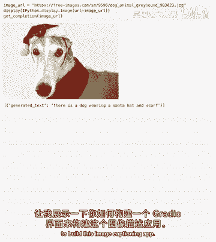
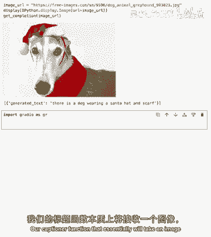
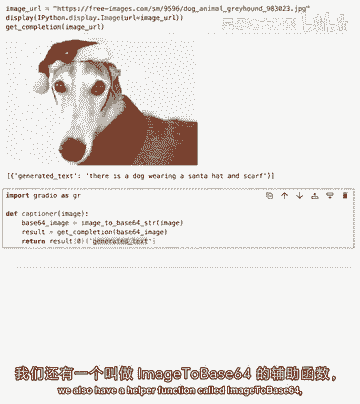
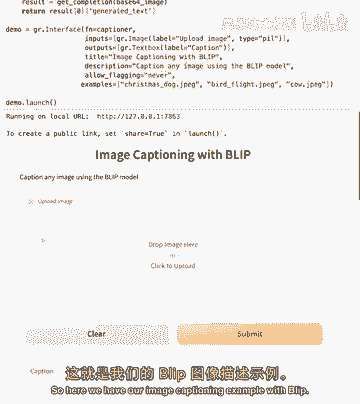

# 054：图片描述应用 📸


在本节课中，我们将学习如何构建一个图像标题生成应用。我们将使用开源的图像到文本模型，通过API调用，将上传的图片转换为描述性的文字标题。课程内容包括设置环境、理解模型原理以及构建一个交互式的Web界面。

---

## 设置环境与辅助函数 🔧



首先，我们需要设置API密钥并准备一些辅助函数。这些函数将帮助我们与图像描述模型进行通信，并处理图像数据格式。

以下是设置步骤：

1.  导入必要的库。
2.  设置API密钥。
3.  定义用于调用图像描述模型的函数。
4.  定义一个将图像转换为base64格式的函数，因为某些API需要这种格式的输入。

```python
import requests
import base64



# 设置API密钥
API_KEY = "your_api_key_here"
API_URL = "https://api-inference.huggingface.co/models/Salesforce/blip-image-captioning-base"

# 定义调用模型的函数
def get_completion(image_base64):
    headers = {"Authorization": f"Bearer {API_KEY}"}
    response = requests.post(API_URL, headers=headers, data=image_base64)
    return response.json()



# 定义图像转base64的函数
def image_to_base64(image_path):
    with open(image_path, "rb") as image_file:
        return base64.b64encode(image_file.read()).decode('utf-8')
```

---



## 理解图像描述模型原理 🤖

上一节我们介绍了如何设置环境，本节中我们来看看图像描述模型是如何工作的。



我们使用的模型是Salesforce的Blip图像标题生成模型。它是一个“图像到文本”模型，接收图像作为输入，并输出对该图像的描述。

这个模型的工作原理基于深度学习训练。它在一个包含数百万张图片及其对应文字描述的数据集上进行训练。例如：



*   **图片**：一张公园里小狗的照片。
*   **标题**：“公园里的一只狗”。

模型通过学习图片像素特征与文字描述之间的关联，从而学会预测新图片的标题。当它看到一张从未见过的图片时，就能生成一个合理的描述。

---



## 测试图像描述功能 ✅

现在，让我们来测试一下我们的函数是否工作正常。我们将使用一张网络图片的URL进行测试。



以下是测试步骤：

1.  获取一张测试图片。
2.  调用我们的`get_completion`函数。
3.  查看模型生成的描述。

```python
# 假设我们有一张图片的base64编码数据
test_image_base64 = image_to_base64("test_dog.jpg")
result = get_completion(test_image_base64)
print(f"生成的标题是：{result[0]['generated_text']}")
```
**输出示例**：`生成的标题是：一只戴着牛仔帽和围巾的狗。`



测试成功！模型准确地描述了图片内容。接下来，我们将为这个功能构建一个用户友好的界面。

---

## 构建交互式Web界面 🌐

我们将使用Gradio库来快速构建一个简单的Web应用界面。这个界面允许用户上传图片，并立即看到模型生成的标题。

以下是构建界面的核心组件：



*   `gr.Image`：一个用于上传图片的输入组件。
*   `gr.Textbox`：一个用于显示生成标题的输出组件。
*   `gr.Examples`：提供一些示例图片，方便用户快速体验。

```python
import gradio as gr

# 定义标题生成函数，供界面调用
def caption_generator(image):
    # 将Gradio的图片对象转换为base64
    img_base64 = image_to_base64_from_gradio(image)
    result = get_completion(img_base64)
    return result[0]['generated_text']

# 创建Gradio界面
with gr.Blocks() as demo:
    gr.Markdown("# 图像标题生成器")
    with gr.Row():
        image_input = gr.Image(type="filepath", label="上传图片")
        text_output = gr.Textbox(label="生成的标题")
    submit_btn = gr.Button("生成标题")
    submit_btn.click(fn=caption_generator, inputs=image_input, outputs=text_output)

    # 添加示例
    gr.Examples(
        examples=["example1.jpg", "example2.jpg"],
        inputs=image_input,
        outputs=text_output,
        fn=caption_generator,
        cache_examples=True
    )

demo.launch()
```

运行此代码后，你将得到一个本地网页。你可以上传自己的图片，或者点击提供的示例图片，应用会自动调用模型并显示生成的标题。

---

## 总结 📝

本节课中我们一起学习了如何构建一个完整的图像标题生成应用。

我们首先设置了必要的API和辅助函数，然后理解了图像描述模型背后的训练原理。接着，我们测试了模型功能，并最终使用Gradio库构建了一个直观的Web界面，让用户可以轻松上传图片并获得文字描述。

通过这个项目，你将掌握调用外部AI模型API、处理图像数据以及构建简单AI应用界面的基本流程。