# 055：图像生成应用 🖼️

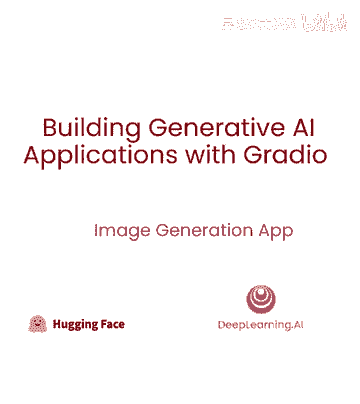

## 概述

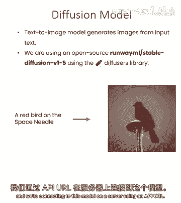

在本节课中，我们将学习如何构建一个图像生成应用。我们将使用开源的文本到图像模型，通过API连接到服务器，并创建一个交互式的用户界面，让用户可以输入文本描述来生成图像。

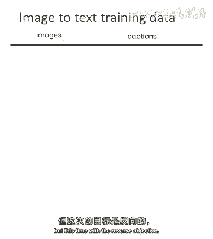

---

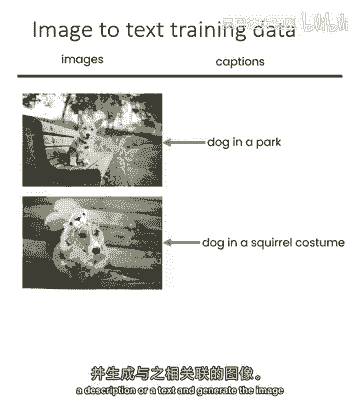

## 构建图像生成应用

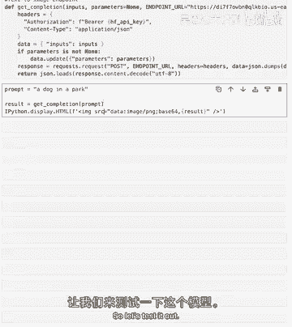

上一节我们介绍了文本到图像模型的基本概念，本节中我们来看看如何具体实现一个应用。

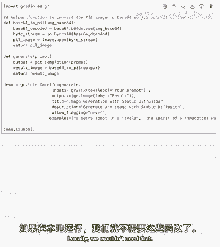

图像生成模型通常是扩散模型。我们将通过一个API URL来连接服务器。

### 设置API与模型

首先，我们需要设置API密钥，并定义一个用于调用文本到图像端点的函数。这与我们之前使用的图像到文本端点相反。

**核心概念**：模型在训练时接收图像和对应的文本描述，但目标是学习从文本生成图像。

```python
# 伪代码示例：设置API并定义生成函数
api_key = "YOUR_API_KEY"
def generate_image(prompt):
    # 调用文本到图像API
    response = call_api(api_key, prompt)
    return response.image
```

### 测试图像生成

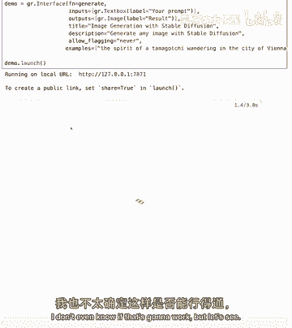

定义好函数后，我们可以进行测试。输入一段文本描述，模型将尝试生成相关的图像。

例如，输入提示“一只可爱的猫在沙发上”，模型会生成对应的图像。测试成功后，我们就可以开始构建应用界面了。

---

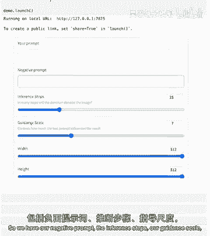

## 构建基础用户界面

我们将使用Gradio库来构建一个简单的Web应用。这个应用将包含一个文本输入框和一个图像显示区域。

以下是构建基础UI的关键步骤：

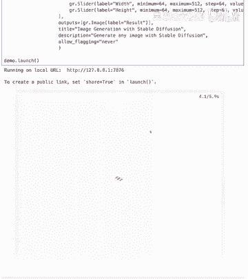

1.  **导入库**：导入Gradio和其他必要的库。
2.  **定义界面函数**：创建一个函数，接收文本提示作为输入，调用我们的`generate_image`函数，并返回生成的图像。
3.  **创建界面**：使用Gradio的`Interface`类，将函数、输入组件和输出组件绑定在一起。

```python
import gradio as gr

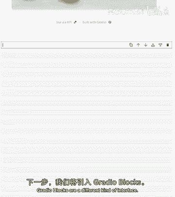

def generate_image_from_prompt(prompt):
    image = generate_image(prompt) # 调用之前定义的函数
    return image

# 创建简单的界面
demo = gr.Interface(
    fn=generate_image_from_prompt,
    inputs=gr.Textbox(label="请输入图像描述"),
    outputs=gr.Image(label="生成的图像"),
    title="文本到图像生成器"
)
demo.launch()
```

运行这个应用，你就可以在文本框中输入任何描述来生成图像了。例如，尝试输入“塔玛哥奇精灵漫步在维也纳城市”，你会得到一张风格独特的图像。

你可以反复使用同一个提示，每次都会生成略有不同的新图像，这带来了无限乐趣。你也可以尝试描述你周围房间里的物体，看看模型如何诠释。

---

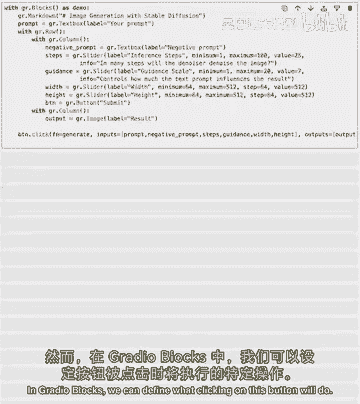

## 添加高级参数控制

稳定扩散等模型通常支持更多参数，以精细控制生成结果。为了让应用更强大，我们可以添加这些控制选项。

上一节我们构建了基础应用，本节中我们来看看如何让它支持高级参数。

我们将添加以下控制选项：
*   **负面提示**：指定你不想在图像中出现的内容。
*   **推理步数**：控制生成过程的精细度，步数越多，质量可能越高，但耗时也更长。
*   **引导尺度**：控制模型遵循提示的严格程度。
*   **图像尺寸**：设置生成图像的宽度和高度。

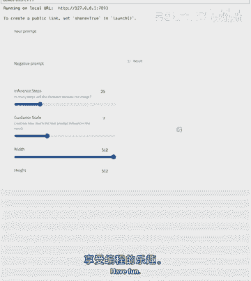

以下是更新后的UI构建思路，我们将使用Gradio Blocks来获得更灵活的布局控制：

```python
with gr.Blocks() as demo:
    gr.Markdown("## 🎨 高级图像生成器")
    with gr.Row():
        prompt = gr.Textbox(label="正面提示", scale=4)
        submit_btn = gr.Button("生成", scale=1, min_width=50)

    with gr.Accordion("高级选项", open=False):
        negative_prompt = gr.Textbox(label="负面提示（不希望出现的内容）")
        with gr.Row():
            inference_steps = gr.Slider(minimum=1, maximum=100, value=20, label="推理步数")
            guidance_scale = gr.Slider(minimum=1, maximum=20, value=7.5, label="引导尺度")
        with gr.Row():
            width = gr.Slider(minimum=64, maximum=1024, value=512, step=64, label="宽度")
            height = gr.Slider(minimum=64, maximum=1024, value=512, step=64, label="高度")

    output_image = gr.Image(label="输出图像")

    # 定义按钮点击事件
    submit_btn.click(
        fn=generate_image_with_params, # 这是一个支持所有参数的新函数
        inputs=[prompt, negative_prompt, inference_steps, guidance_scale, width, height],
        outputs=output_image
    )
```

在这个界面中：
*   主要提示和生成按钮在同一行。
*   高级选项（如负面提示、推理步数等）被放在一个可折叠的面板中，使界面更简洁。
*   使用`gr.Row()`和`gr.Column()`（通过`scale`参数模拟）来组织布局。
*   明确定义了按钮点击后要执行的函数及其输入输出。

这种使用**Gradio Blocks**的方式比简单的`Interface`更灵活，允许你完全自定义UI的结构，适合构建更复杂的应用。而**Gradio Interface**则胜在代码极其简洁，能快速构建功能。

---

## 总结

本节课中我们一起学习了如何构建一个完整的文本到图像生成应用。

1.  **我们首先**了解了使用扩散模型通过API生成图像的基本原理。
2.  **接着**，我们构建了一个基础的Gradio应用，实现了从文本输入到图像输出的核心功能。
3.  **然后**，我们扩展了应用，添加了负面提示、推理步数等高级参数控制，使用户能更精细地操控生成结果。
4.  **最后**，我们介绍了如何使用Gradio Blocks来构建更复杂、更自定义的用户界面，并与简单的Interface方法进行了对比权衡。

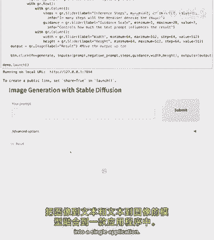

通过本课，你掌握了创建交互式AI图像生成工具的全流程。你可以继续调整UI布局、尝试不同的提示词，探索生成式AI的乐趣。