# 056：图文互生游戏 🎮🖼️

在本节课中，我们将学习如何整合之前课程中学到的“文本到图像”和“图像到文本”技术，构建一个有趣的图文互生游戏应用。我们将从回顾基础开始，逐步构建一个可以玩耍的交互式应用。

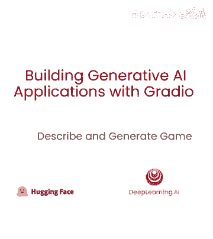

## 概述 📋

本课内容是将之前学过的文本到图像和图像到文本技术整合到一个有趣的应用中。在之前的课程中，我们学习了如何构建NLP应用的Gradio应用、如何构建字幕应用以及如何构建文本到图像应用。

现在，让我们整合其他课程学到的知识，在本游戏中构建一个酷游戏。这个游戏将从图像生成字幕开始，然后根据该字幕生成一张新的图像。

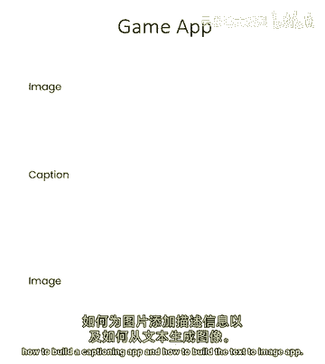

## 环境准备与导入 📦

首先，我们需要进行常规的库和函数导入。

```python
# 导入必要的库
import gradio as gr
import base64
from PIL import Image
import requests
```

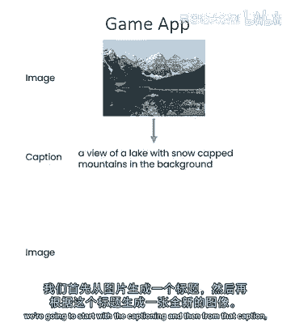

在辅助函数中，我们需要设置API端点。本节课将使用两个API：文本到图像API和图像到文本API。

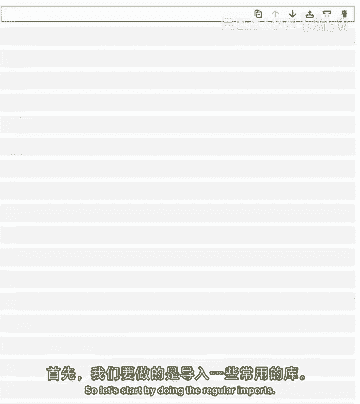

```python
# API端点配置
TEXT_TO_IMAGE_API_URL = "YOUR_TEXT_TO_IMAGE_API_ENDPOINT"
IMAGE_TO_TEXT_API_URL = "YOUR_IMAGE_TO_TEXT_API_ENDPOINT"
```

接下来，我们从第3和第4课引入核心功能函数：图像到base64编码、base64到图像解码、生成字幕的函数以及根据文本生成图像的函数。

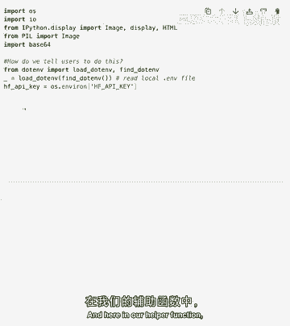

```python
def image_to_base64(image_path):
    """将图像转换为base64字符串。"""
    with open(image_path, "rb") as image_file:
        return base64.b64encode(image_file.read()).decode('utf-8')

def base64_to_image(base64_string):
    """将base64字符串转换回图像。"""
    image_data = base64.b64decode(base64_string)
    return Image.open(io.BytesIO(image_data))

def captioner(image):
    """接受图像并生成描述性字幕。"""
    # 调用图像到文本API的逻辑
    # ...
    return generated_caption

def generate_image_from_text(text):
    """接受文本描述并生成图像。"""
    # 调用文本到图像API的逻辑
    # ...
    return generated_image
```

## 构建基础应用 🛠️

现在，让我们开始构建应用。我们将使用Gradio创建一个简单的界面，允许用户上传图像并生成字幕。

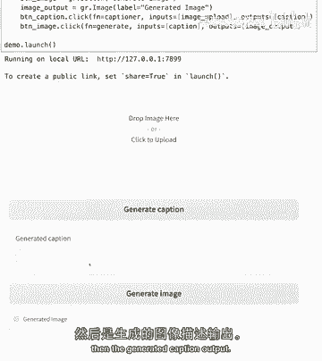

```python
# 构建简单的字幕应用
with gr.Blocks() as demo:
    gr.Markdown("## 图文互生游戏")
    with gr.Row():
        image_input = gr.Image(label="上传图像", type="filepath")
        caption_output = gr.Textbox(label="生成的字幕")
    caption_button = gr.Button("生成字幕")

    # 定义按钮点击事件
    caption_button.click(fn=captioner, inputs=image_input, outputs=caption_output)

demo.launch()
```

这个应用允许用户上传一张图像，点击“生成字幕”按钮后，会输出对该图像的描述。

## 实现图文互生游戏 🎲

上一节我们介绍了基础的图像字幕功能。本节中，我们来看看如何扩展它，实现从字幕生成新图像，从而构成一个完整的“电话游戏”循环。

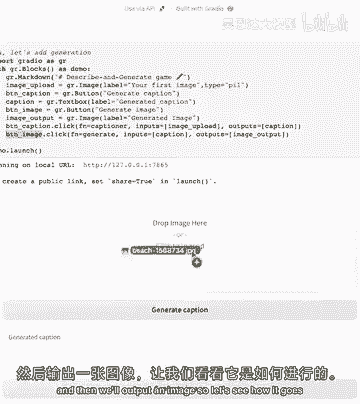

如何做到这一点？本质上，我们可以使用Gradio的交互块和两个按钮。一个按钮用于生成字幕，另一个按钮用于根据生成的字幕来创建图像。

以下是实现步骤的详细说明：

1.  **“生成字幕”按钮**：调用 `captioner` 函数，输入是用户上传的图像，输出是生成的文字描述。
2.  **“生成图像”按钮**：调用 `generate_image_from_text` 函数，输入是上一步生成的字幕文本，输出是一张新的图像。

让我们看看代码实现的效果。

```python
with gr.Blocks() as game_demo:
    gr.Markdown("## 图文互生游戏 - 分步版")
    with gr.Row():
        img_upload = gr.Image(label="上传初始图像", type="filepath")
    with gr.Row():
        caption_btn = gr.Button("🔄 生成字幕")
        image_btn = gr.Button("🎨 从字幕生成图像")
    with gr.Row():
        generated_caption = gr.Textbox(label="图像字幕")
        generated_image = gr.Image(label="根据字幕生成的新图像")

    # 连接第一个按钮：图像 -> 字幕
    caption_btn.click(fn=captioner, inputs=img_upload, outputs=generated_caption)
    # 连接第二个按钮：字幕 -> 图像
    image_btn.click(fn=generate_image_from_text, inputs=generated_caption, outputs=generated_image)

game_demo.launch()
```

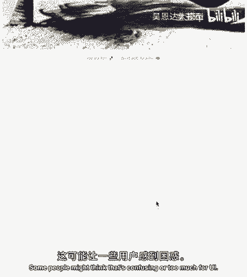

在这个版本中，用户可以上传一张图像，点击“生成字幕”获得描述，然后使用该描述点击“生成图像”来创造一张全新的图片。你可以玩一个“电话游戏”：上传图像A，得到字幕A1，用A1生成图像B，再把图像B传回第一步生成字幕B1，如此循环。观察经过几轮后，主题是保持不变还是发生了有趣的演变。

## 创建简洁一体化版本 ✨

分步版的应用功能明确，但操作需要两步。有些人可能希望有一个更简洁的版本。这完全取决于你的设计偏好，但这里我想展示一个一体化版本。

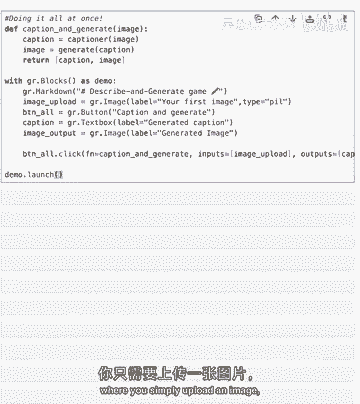

在这个版本中，我们创建一个单一的函数，它包含字幕生成和图像生成两个步骤，然后以更简洁的方式呈现游戏，用户只需上传一次图片。

```python
def caption_and_generate(image):
    """一体化函数：接受图像，生成字幕后立即根据字幕生成新图像。"""
    caption = captioner(image)
    new_image = generate_image_from_text(caption)
    return caption, new_image

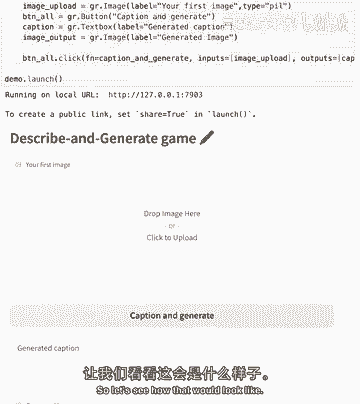

with gr.Blocks() as concise_demo:
    gr.Markdown("## 图文互生游戏 - 简洁版")
    image_input = gr.Image(label="上传一张图片", type="filepath")
    action_button = gr.Button("🚀 字幕并生成图像")
    with gr.Row():
        output_caption = gr.Textbox(label="生成的字幕")
        output_image = gr.Image(label="根据字幕生成的新图像")

    action_button.click(fn=caption_and_generate, inputs=image_input, outputs=[output_caption, output_image])

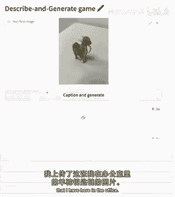

concise_demo.launch()
```

在这个界面中，用户上传图片后，只需点击一次“字幕并生成图像”按钮，就可以同时获得字幕和新生成的图像，体验更加流畅。

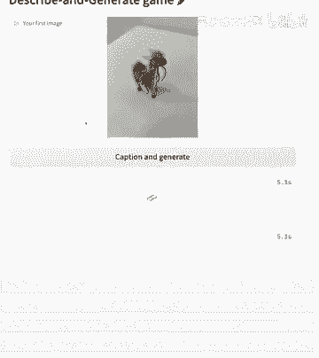

## 尝试与探索 🔍

现在，让我们尝试运行这个简洁版的应用。例如，上传一张办公室里的羊驼钥匙扣图片。

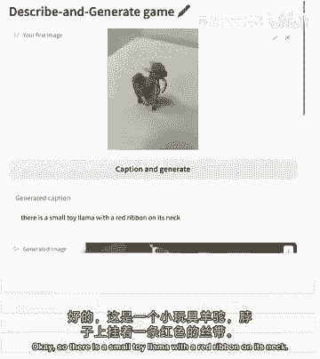

点击按钮后，应用可能会同时生成这样的字幕：“脖子上有红丝带的迷你玩具羊驼”。并根据这个描述，生成一张符合该描述的、可爱的卡通羊驼图像。

鼓励你尝试拍摄周围的事物，或者使用电脑里存储的有趣图片，观察字幕模型如何描述它们，以及下游的图像生成模型如何根据这些文字描述创造出新的视觉内容。

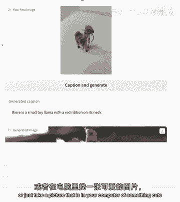

本节课主要想展示的是两种构建方式：一种是一次完成两个任务的一体化简洁模型，另一种是步骤更清晰、分为两步生成的复杂模型。两者各有优势，适用于不同的场景。

## 总结 🎯

在本节课中，我们一起学习了如何利用Gradio构建你的第一个图文互生游戏。我们成功地将从“文本到图像”和“图像到文本”课程中学到的知识，整合到了一个非常简单的交互式应用中。

你学会了：
1.  回顾并导入图像与文本互转的核心函数。
2.  构建分步式的图文生成应用，明确分离字幕生成和图像生成步骤。
3.  构建一体化式的简洁应用，一键完成从图到文再到图的完整循环。
4.  通过“电话游戏”的概念，探索了生成式AI模型迭代创作的有趣现象。

恭喜你！你已经掌握了组合不同AI模块来创建互动应用的基本方法。在下一课中，我们将继续探索更复杂的应用场景。