# 057：构建与大语言模型交互的聊天应用 🚀


在本节课中，我们将学习如何使用开源大语言模型（LLM）构建一个功能完整的聊天应用。我们将从简单的模型调用开始，逐步引入对话历史管理、流式响应和高级参数控制，最终打造一个强大的聊天界面。


---

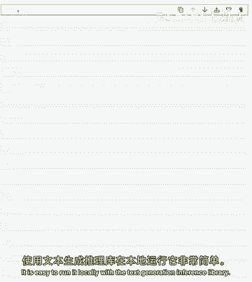

## 概述

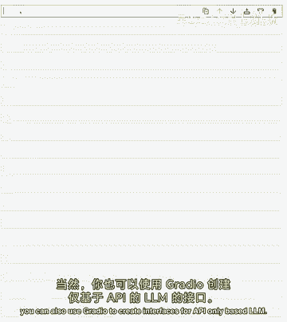

与像 ChatGPT 这样的闭源模型聊天可能成本高昂且缺乏定制性。本课程将指导你使用开源模型 Falcon-7B-Instruct，通过推理端点或本地部署，构建一个可定制、能理解上下文对话的聊天应用。我们将使用 Gradio 库来创建用户界面。

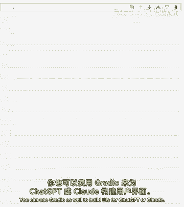

---


## 1. 选择与设置模型 🤖

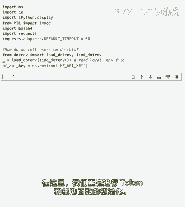

上一节我们介绍了课程目标，本节中我们来看看如何选择并设置我们将要使用的开源大语言模型。

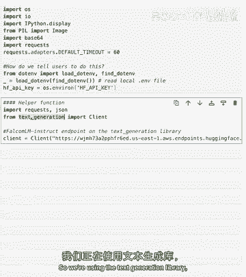

我们将使用 Falcon-7B-Instruct，这是目前最佳的开源大型语言模型之一。你可以通过云端的推理端点来运行它，这样成本更低，也便于定制。当然，你也可以使用 `text-generation-inference` 库在本地轻松运行它。

以下是设置模型 API 端点和辅助函数的基本代码框架：

```python
import os
from gradio_client import Client

# 设置 API 令牌（此处为示例，请替换为你的实际令牌）
HF_TOKEN = os.getenv('HF_TOKEN', 'your_huggingface_token_here')
# 初始化客户端，连接到 Falcon-7B-Instruct 推理端点
client = Client("huggingface-projects/llama-2-7b-chat")
```

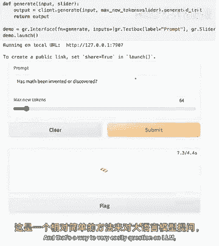

---

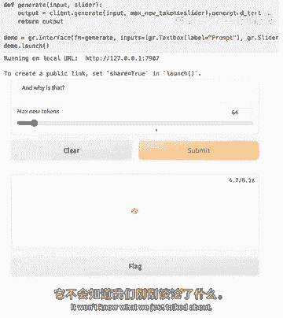

## 2. 实现基础问答功能 💬

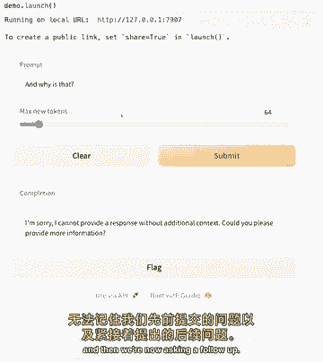

现在我们已经设置了模型，本节中我们来实现一个基础的单轮问答功能。

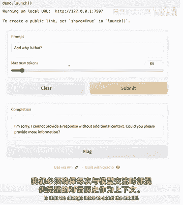

首先，我们创建一个简单的函数来向模型发送提示并获取回复。这还不是“聊天”，因为模型没有记忆，无法理解对话的上下文。

```python
def generate_response(prompt, max_tokens=256):
    """
    向模型发送单个提示并获取回复。
    :param prompt: 用户输入的提示文本
    :param max_tokens: 生成回复的最大令牌数
    :return: 模型的回复文本
    """
    result = client.predict(
        prompt,
        api_name="/predict"
    )
    # 假设返回结果是字典，包含生成的文本
    return result['generated_text'][:max_tokens]

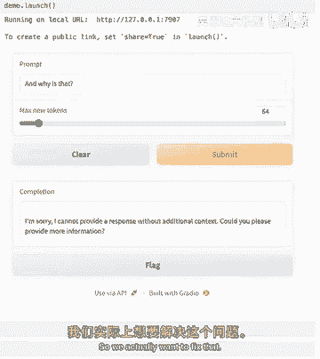

# 测试函数
question = "马特发明或发现了什么？"
answer = generate_response(question, max_tokens=256)
print(answer)
```

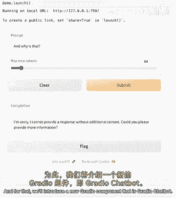

使用这个函数，我们可以通过更新 `prompt` 变量来问不同的问题。但是，如果你尝试问一个后续问题，比如“为什么？”，模型将无法理解，因为它不知道之前的对话内容。

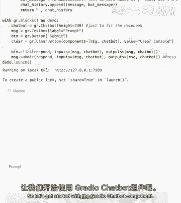

---

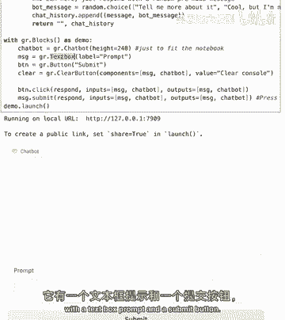

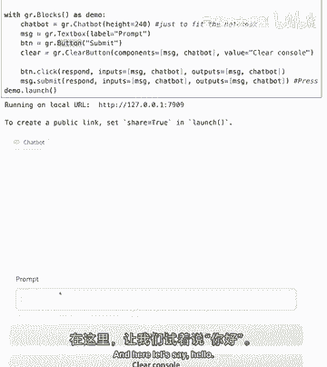

## 3. 引入对话历史管理 📚

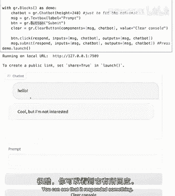

上一节我们构建了基础问答，但模型缺乏记忆。本节中我们来看看如何管理对话历史，使模型能够进行多轮对话。

为了实现真正的聊天，我们需要在每次请求时，将整个对话历史（包括用户的问题和模型的回答）都发送给模型。手动构建这个上下文很麻烦，而 Gradio 的 `Chatbot` 组件可以简化这个过程。

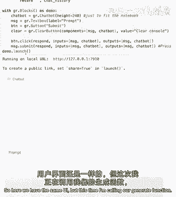

首先，我们初始化一个简单的聊天界面：

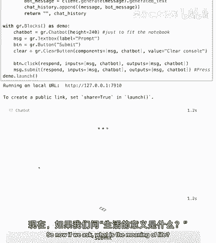

```python
import gradio as gr

# 创建一个聊天机器人界面，包含输入框和提交按钮
with gr.Blocks() as demo:
    chatbot = gr.Chatbot()
    msg = gr.Textbox()
    clear = gr.Button("Clear")

    def respond(message, chat_history):
        # 初始版本：仅将用户消息发送给模型，没有历史上下文
        bot_message = generate_response(message)
        chat_history.append((message, bot_message))
        return "", chat_history

    msg.submit(respond, [msg, chatbot], [msg, chatbot])
    clear.click(lambda: None, None, chatbot, queue=False)

demo.launch()
```

然而，这个版本仍然只发送了用户的最新消息。为了修复这个问题，我们必须格式化聊天提示，使其包含完整的对话历史，并明确区分用户和助手（模型）的消息。

---

## 4. 格式化聊天提示与上下文 🔧

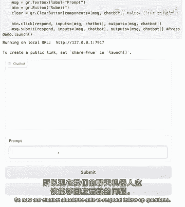

为了启用上下文感知的对话，我们需要定义一个函数来格式化聊天历史。

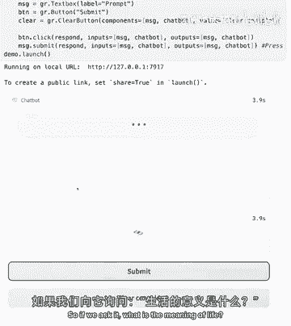

这个函数会将对话历史转换成模型能理解的格式，通常是在每轮对话前加上“用户：”或“助手：”的标签。

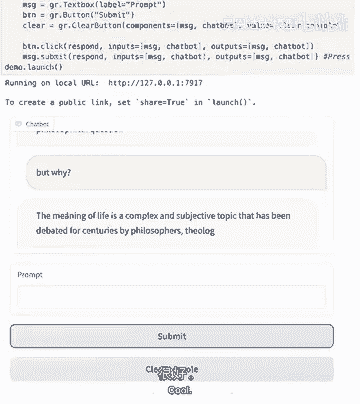

```python
def format_chat_prompt(message, chat_history, system_message=""):
    """
    将对话历史格式化为模型可理解的提示。
    :param message: 用户的新消息
    :param chat_history: 之前的对话历史列表，格式为 [(用户消息, 助手消息), ...]
    :param system_message: 可选的系统指令（如“你是一个有帮助的助手”）
    :return: 格式化后的完整提示字符串
    """
    prompt = system_message
    for user_msg, assistant_msg in chat_history:
        prompt += f"\n用户：{user_msg}\n助手：{assistant_msg}"
    prompt += f"\n用户：{message}\n助手："
    return prompt

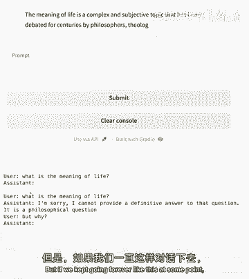

# 更新响应函数，使用格式化后的提示
def respond_with_history(message, chat_history):
    formatted_prompt = format_chat_prompt(message, chat_history)
    bot_message = generate_response(formatted_prompt, max_tokens=124)
    chat_history.append((message, bot_message))
    return "", chat_history
```

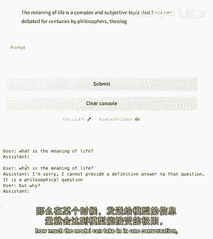

现在，我们的聊天应用可以回答后续问题了。例如，先问“生命的意义是什么？”，再问“为什么？”，模型能够基于上下文给出合理的回答。

---

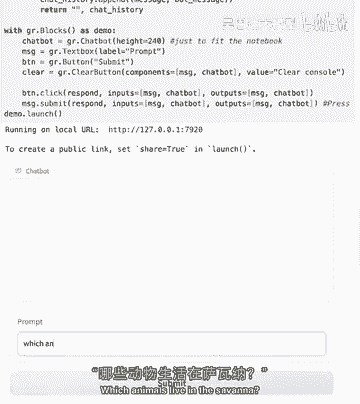

## 5. 处理长对话与停止序列 ⏹️

随着对话轮次增加，上下文会越来越长，最终可能超过模型一次能处理的令牌限制（上下文窗口）。此外，模型有时会“自言自语”，即开始生成用户和助手两方的对话。

为了解决这些问题，我们可以采取以下措施：

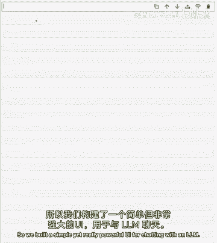

1.  **限制最大新令牌数**：确保单次回复不会过长，为后续对话留出空间。
2.  **使用停止序列**：告诉模型在生成到特定字符串（如“\n用户：”）时停止，防止它冒充用户提问。

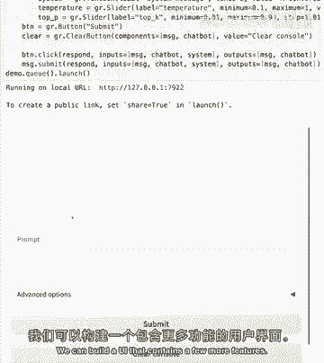

以下是更新后的生成函数，包含了停止序列：

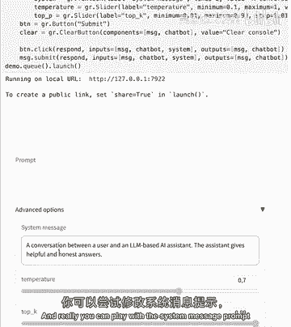

```python
def generate_response_with_stop(prompt, max_new_tokens=124, stop_sequence="\n用户："):
    """
    生成回复，并在遇到停止序列时提前终止。
    """
    # 调用API时传递停止序列参数（具体参数名取决于API）
    result = client.predict(
        prompt,
        max_new_tokens=max_new_tokens,
        stop_strings=[stop_sequence],
        api_name="/predict"
    )
    return result['generated_text']
```

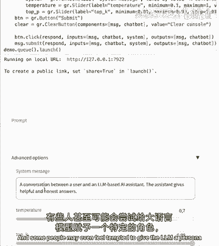

---

## 6. 添加高级功能与流式响应 ⚙️

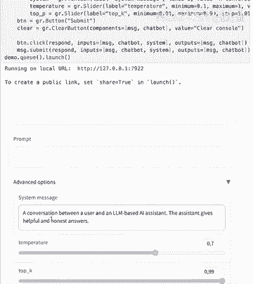

我们已经构建了一个能进行上下文对话的聊天应用。本节中我们为其添加更多高级功能，以提升用户体验和可控性。

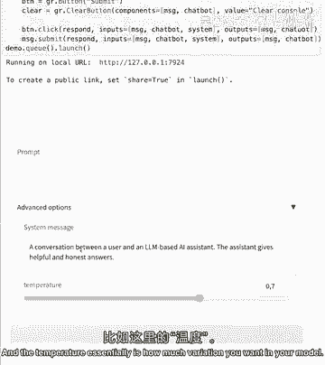

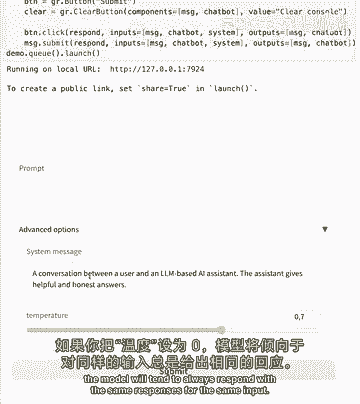

一个功能完善的聊天UI通常包括：

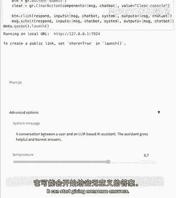

*   **系统消息**：用于设定AI的角色和行为（例如，“你是一名律师”或“请用幽默的语气回答”）。
*   **温度参数**：控制回复的随机性和创造性。公式表示为：`温度 → 0` 时输出确定性高，`温度 → 1` 时创造性高。
*   **流式响应**：让回复像打字一样逐个令牌实时显示，无需等待整个答案生成完毕。

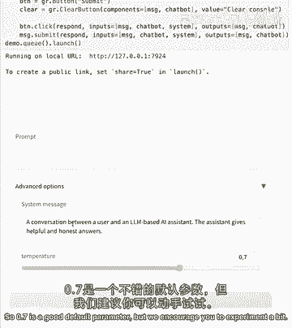

以下是整合了这些功能的最终版应用代码框架：

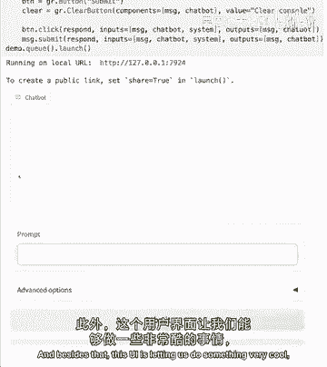

```python
def format_chat_prompt_advanced(message, chat_history, system_message="你是一个有帮助的助手。"):
    """增强版提示格式化函数，包含系统消息。"""
    prompt = f"系统指令：{system_message}\n"
    for user_msg, assistant_msg in chat_history:
        prompt += f"用户：{user_msg}\n助手：{assistant_msg}\n"
    prompt += f"用户：{message}\n助手："
    return prompt

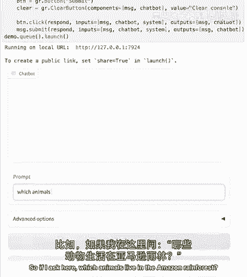

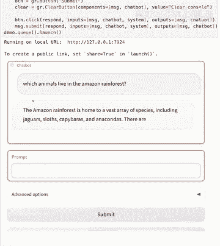

def respond_stream(message, chat_history, system_message, temperature=0.7):
    """实现流式响应的函数。"""
    formatted_prompt = format_chat_prompt_advanced(message, chat_history, system_message)
    # 假设API支持流式输出，我们逐个令牌获取并yield
    full_response = ""
    for token in stream_from_api(formatted_prompt, temperature=temperature):
        full_response += token
        # 每次收到新令牌，就更新聊天历史中的最后一条助手消息
        yield chat_history + [(message, full_response)]

# 构建完整的Gradio界面
with gr.Blocks() as advanced_demo:
    gr.Markdown("# 高级聊天应用")
    chatbot = gr.Chatbot()
    with gr.Row():
        msg = gr.Textbox(placeholder="输入你的问题...", scale=4)
        submit_btn = gr.Button("发送", scale=1)
    with gr.Accordion("高级选项", open=False):
        system_msg = gr.Textbox(label="系统消息", value="你是一个有帮助的助手。")
        temperature = gr.Slider(0, 1, value=0.7, label="温度 (创造性)")
        clear_btn = gr.Button("清空对话")

    # 连接事件
    submit_event = msg.submit(respond_stream, [msg, chatbot, system_msg, temperature], chatbot)
    submit_btn.click(respond_stream, [msg, chatbot, system_msg, temperature], chatbot)
    clear_btn.click(lambda: [], None, chatbot)

    # 流式响应需要特殊的处理队列
    advanced_demo.queue()
    advanced_demo.launch()
```

你可以尝试修改系统消息，例如要求AI用法语回答，或者扮演生物学家的角色，观察模型行为的变化。

---

## 总结 🎉

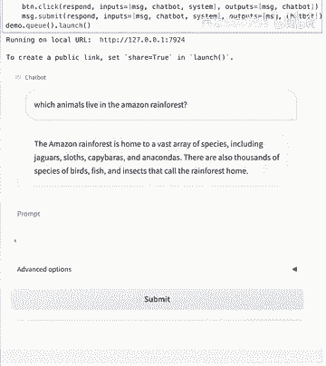

在本节课中，我们一起学习了如何从零开始构建一个与开源大语言模型交互的聊天应用。

我们首先设置了 Falcon-7B-Instruct 模型，然后实现了基础的单轮问答。接着，我们通过引入对话历史管理和提示格式化，使应用能够进行连贯的多轮对话。为了完善应用，我们添加了处理长对话的机制、停止序列，并最终整合了系统消息、温度控制和流式响应等高级功能。

你现在已经拥有了一个强大且可定制的聊天应用原型。鼓励你在此基础上继续探索，例如重新设计UI布局，或者尝试不同的开源模型和参数，以更好地满足你的需求。