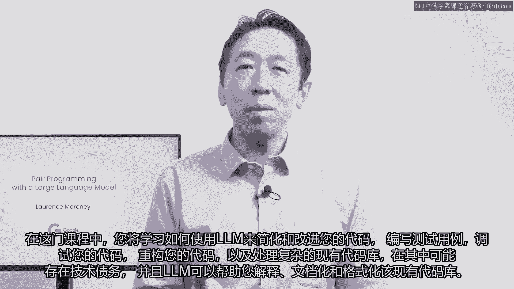

# 058：使用大型语言模型进行配对编程 🧑‍💻🤖

在本节课中，我们将学习如何利用大型语言模型（LM）作为编程伙伴，来简化、改进和加速我们的软件开发工作流程。我们将探讨如何让LM协助编写代码、处理错误、进行性能优化以及理解复杂代码库。

---

## 概述

大型语言模型正在改变我们编写代码的方式。在本课程中，我们将与谷歌AI的首席倡导者劳伦斯·莫罗尼一起，学习如何有效地使用LM（例如通过PaLM API）来辅助编程。课程将涵盖从代码生成、测试、调试到重构以及与现有代码库协作的全过程。

---

## 课程内容

上一节我们概述了LM在编程中的潜力，本节中我们来看看课程的具体内容和讲师介绍。

### 讲师与课程背景

本课程的讲师是谷歌AI的首席倡导者劳伦斯·莫罗尼。课程内容基于其使用PaLM API等工具的实际经验，旨在分享如何利用LM提升开发效率。

课程中也提到了来自深度学习AI团队的艾迪·舒和迪亚拉·阿齐内的参与。

### LM在编程中的应用价值

如果我们只将LM视为从零开始创造代码的工具，那就错过了其带来的许多价值。LM的真正优势在于能够协助处理已有代码、解释复杂逻辑、编写测试和重构代码。

以下是LM可以协助的几个关键领域：
*   帮助编写不熟悉库或框架的代码初稿。
*   协助调试和修复代码错误。
*   进行代码性能分析和改进。
*   解释复杂的现有代码库和技术债务。
*   辅助编写文档和格式化代码。

### 第一课预告

在接下来的第一课中，我们将具体学习如何开始使用PaLM API来改进和简化您的代码。

---

## 总结

本节课中，我们一起学习了大型语言模型作为编程伙伴的引入。我们了解了LM如何改变编码方式，并预览了本课程将涵盖的核心主题：代码生成、测试、调试、重构以及与复杂代码库的协作。希望这些内容能激发您的兴趣，帮助您成为一名更高效的软件工程师。