# 059：使用 PaLM API 进行基础代码生成 🚀

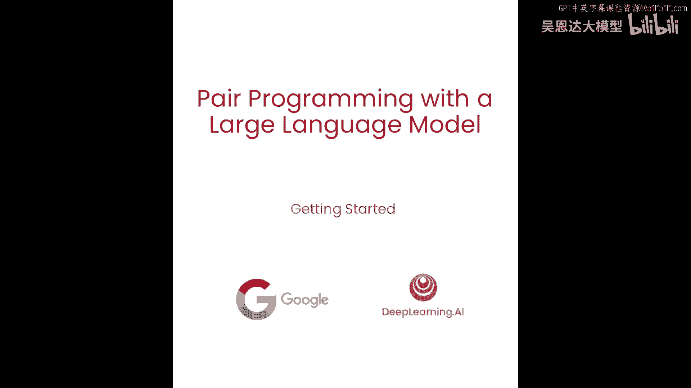

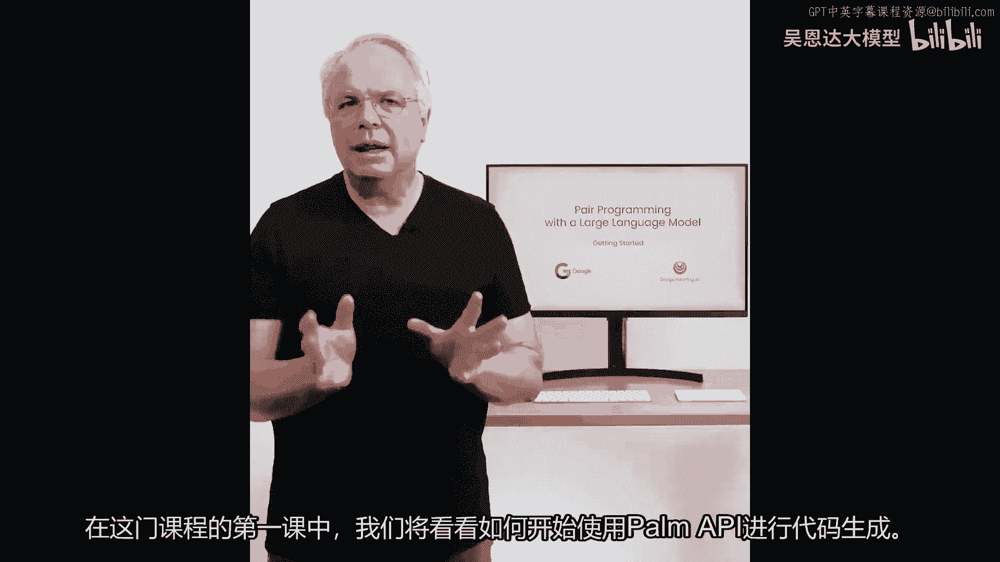

在本节课中，我们将学习如何使用 Google 的 PaLM API 来生成代码。我们将从环境设置开始，逐步了解如何调用 API、选择模型，并最终通过简单的提示词来生成和运行 Python 代码。


---


## 概述 📋

本节课我们将学习如何设置并使用 Google 的 PaLM API 进行基础的代码生成。主要内容包括获取 API 密钥、安装必要的库、探索可用的模型，以及编写一个简单的提示词来生成 Python 代码。


---

## 环境设置 ⚙️

要开始使用 PaLM API，我们需要完成一些必要的设置。PaLM API 及其相关工具（如 Maker Suite 和 Vertex AI）在 Google 的生成式 AI 网站上持续更新。本课程的重点是通过编码接口访问谷歌的大型语言模型。

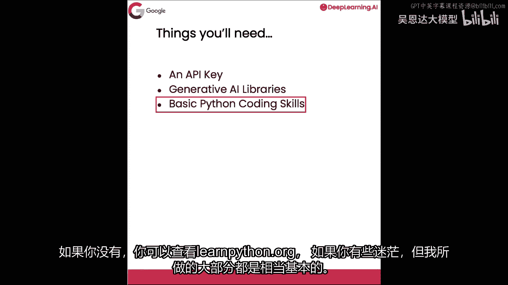

以下是开始前需要准备的清单：


*   **API 密钥**：这是调用 API 的凭证。在实际操作中，你需要从 Google 的开发者网站获取。为了本课程，我们已经为你准备了一个。
*   **Google 生成式 AI 库**：我们将使用 Python 版本的库。你需要通过 pip 安装它。
*   **Python 技能**：本课程需要基础的 Python 编程知识。

现在，让我们看看如何获取并使用 API 密钥。这里有一个辅助函数来帮助我们获取密钥。

```python
# 导入 Google 生成式 AI 库
import google.generativeai as palm

# 使用你的 API 密钥进行配置
palm.configure(api_key='YOUR_API_KEY')
```

如果你在自己的系统中操作，需要使用以下命令安装库：

```bash
pip install google-generativeai
```

---

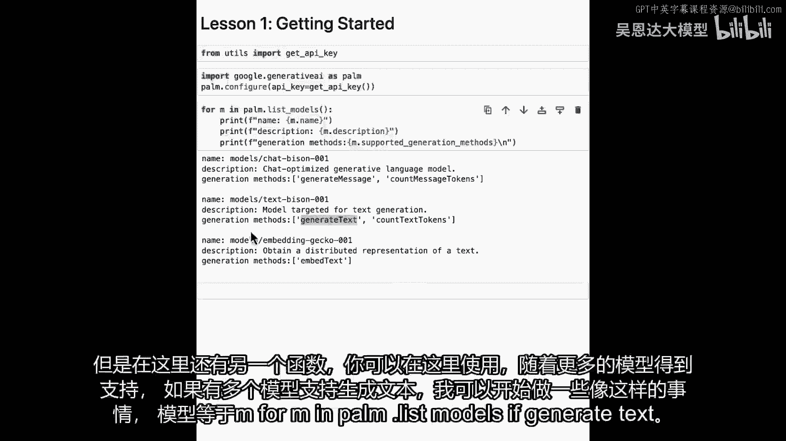

## 探索可用模型 🦬🦎

上一节我们介绍了如何配置环境，本节中我们来看看 PaLM API 提供了哪些模型。PaLM 提供了多种不同用途的后端模型，它们的命名很有趣，通常动物体型越大，对应的模型也越大。

我们可以使用 `palm.list_models()` 函数来列出所有可用的模型。

```python
# 列出所有模型并打印其关键信息
for model in palm.list_models():
    print(f"名称: {model.name}")
    print(f"描述: {model.description}")
    print(f"支持的方法: {model.supported_generation_methods}")
    print("-" * 40)
```

运行上述代码，你可能会看到类似 `chat-bison-001`、`text-bison-001` 和 `embedding-gecko-001` 的模型。其中，`bison`（野牛）是较大的模型，而 `gecko`（壁虎）是较小的模型。

`chat-bison` 更优化于多轮对话场景，能跟踪上下文。`text-bison` 则更优化于单次提示和回答，通常对代码生成任务效果更好。我们今天将使用 `text-bison` 模型。

为了专注于文本生成，我们可以筛选出支持 `generate_text` 方法的模型：

```python
# 筛选出支持文本生成的模型
text_models = [m for m in palm.list_models() if 'generateText' in m.supported_generation_methods]
for model in text_models:
    print(model.name)
```

目前，`text-bison-001` 是主要支持文本生成的模型。我们将其赋值给一个变量以便后续使用。

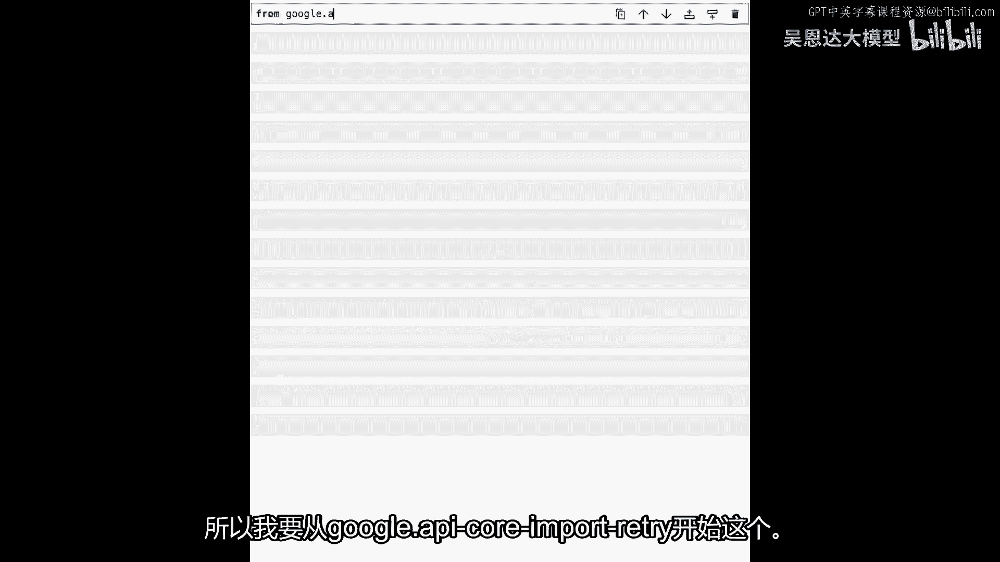

```python
model_bison = 'models/text-bison-001'
```

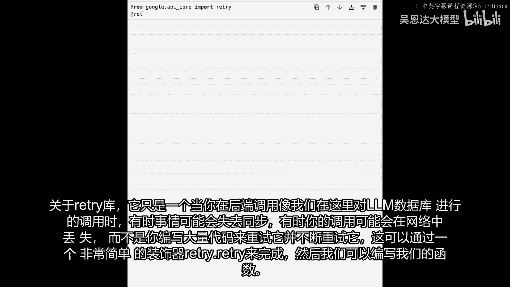

---

## 创建文本生成辅助函数 🔧

为了在后续的代码中避免重复，我们将创建一个辅助函数来封装文本生成的过程。这个函数会处理 API 调用，并包含重试逻辑以应对可能出现的网络问题。

我们将从 `google.api_core` 导入 `retry` 库，它可以帮助我们在调用失败时自动重试。

```python
from google.api_core import retry

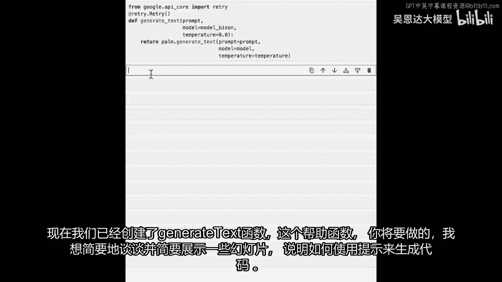

@retry.Retry()
def generate_text(prompt, model=model_bison, temperature=0.0):
    """
    使用指定模型和温度生成文本。
    温度设为 0.0 会使模型的输出更确定。
    """
    completion = palm.generate_text(
        model=model,
        prompt=prompt,
        temperature=temperature
    )
    return completion.result
```

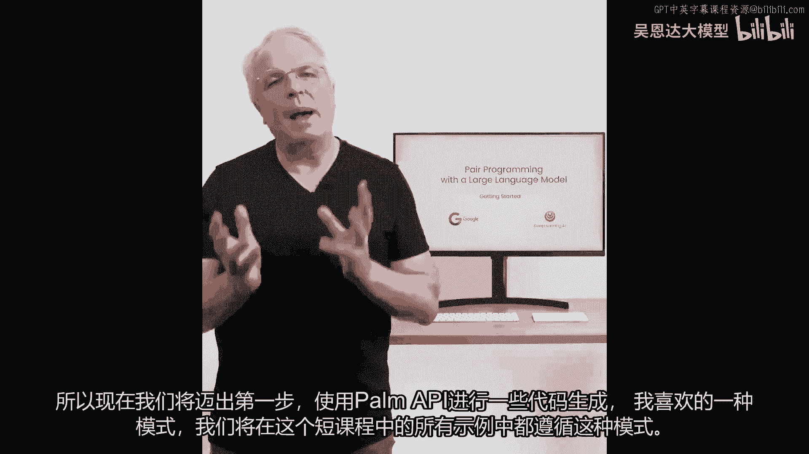


现在，我们已经有了一个方便的工具函数 `generate_text`，它接受提示词、模型和温度参数，并返回模型生成的文本结果。

---

## 基础代码生成流程 💻

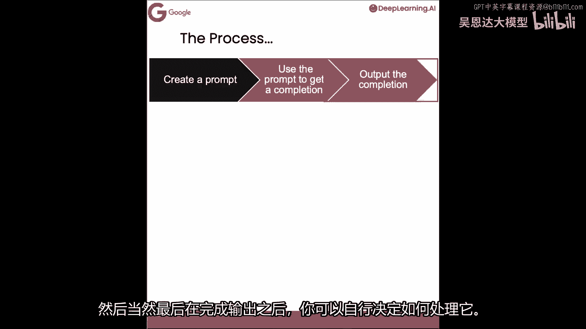

有了辅助函数，我们就可以开始进行代码生成了。本节中我们来看看使用 PaLM API 生成代码的标准流程。所有示例都将遵循这个简单的三步模式：

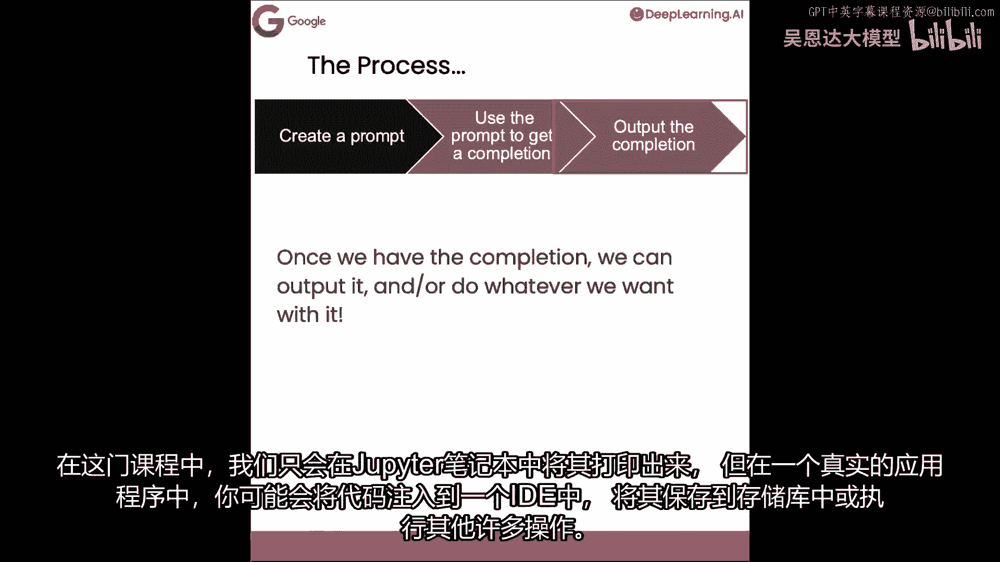

1.  **创建提示**：编写发送给大语言模型的基本指令。我们从简单的静态字符串开始，后续会展示如何增强它。
2.  **获取补全结果**：使用我们创建的 `generate_text` 函数和选定的模型来获取输出。大语言模型会根据你的提示预测接下来的文本（即“补全”你开始的字符串）。
3.  **输出结果**：处理并展示生成的代码。在本课程中，我们将在 Jupyter 笔记本中打印出来；在实际应用中，你可能会将代码注入 IDE 或保存到文件中。

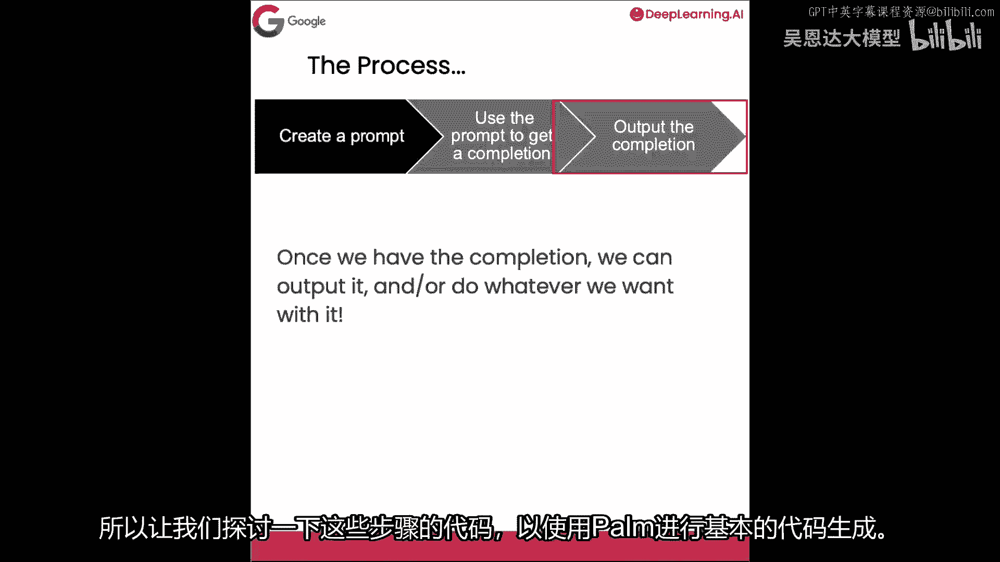

让我们通过一个具体的例子来探索这些步骤。

---

## 实践：生成遍历列表的代码 📝

现在，让我们运用刚才学到的流程，进行一些非常基础的代码生成实践。我们将尝试让模型生成在 Python 中遍历列表的代码。

首先，我们创建一个提示。注意，不同的措辞会导致不同的输出风格。

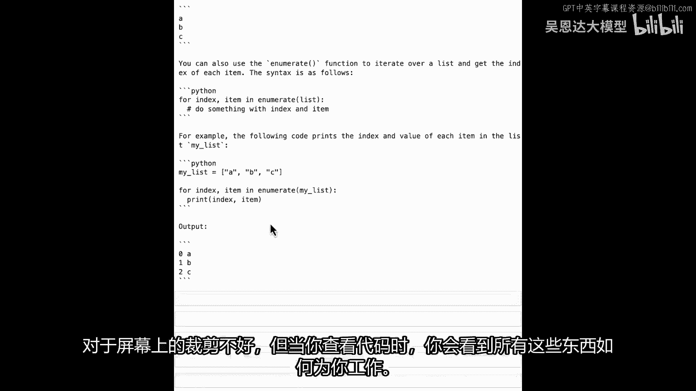

```python
# 提示词示例1：要求“展示如何做”
prompt = “如何在 Python 中遍历一个列表？”
completion = generate_text(prompt)
print(completion)
```

运行上述代码，你可能会得到一个包含代码示例和解释的详细回答，例如介绍 `for` 循环和 `enumerate` 函数。

接下来，我们尝试一个更直接的、要求“编写代码”的提示。

```python
# 提示词示例2：要求“编写代码”
prompt = “编写遍历 Python 列表的代码。”
completion = generate_text(prompt)
print(completion)
```

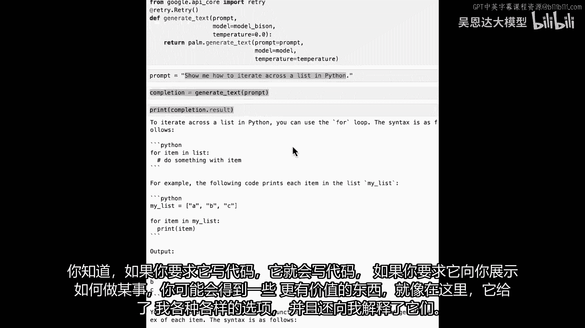

这次，输出可能更简洁，只给出核心的代码片段和少量注释。

我们可以将模型生成的代码复制出来，粘贴到新的单元格中并运行，以验证其正确性。

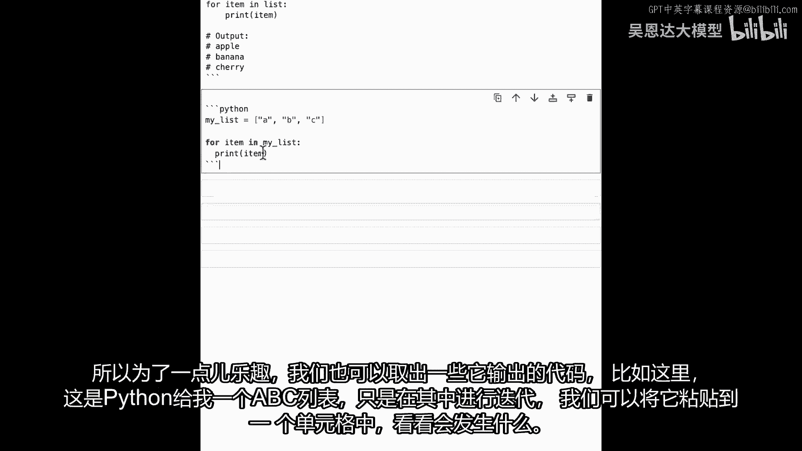

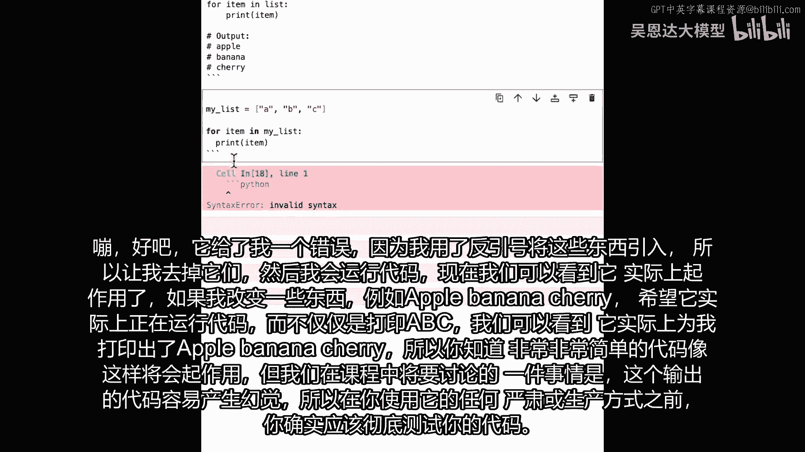

```python
# 示例：运行模型生成的代码
my_list = [“苹果”, “香蕉”, “樱桃”]
for item in my_list:
    print(item)
```

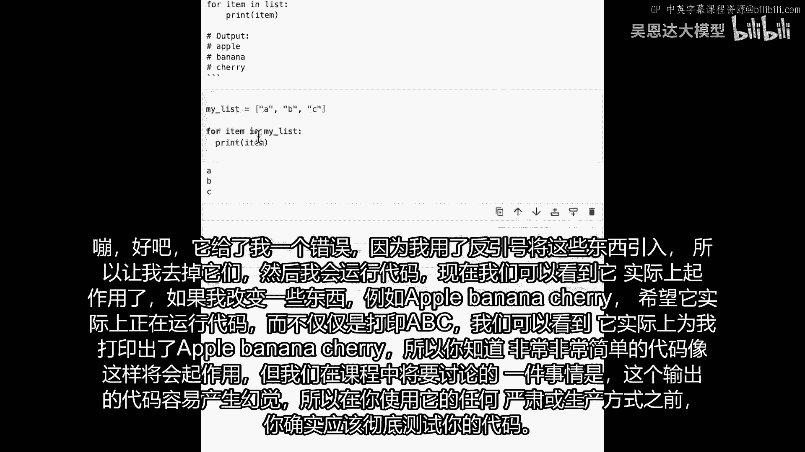

**重要提示**：大语言模型生成的代码容易产生“幻觉”（即看似合理但实际错误的代码）。因此，在实际使用任何生成的代码之前，务必进行彻底的测试。

---


## 总结与练习 🎯

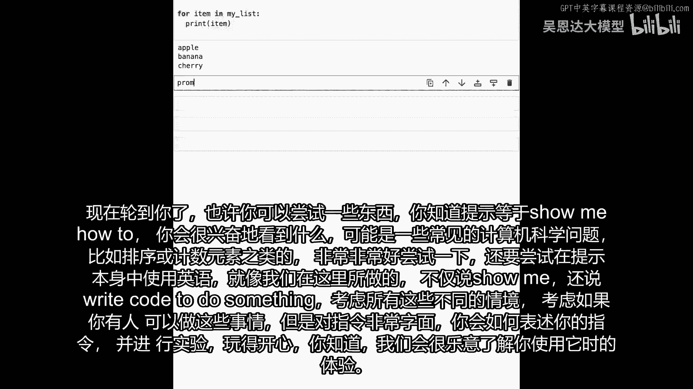

本节课中，我们一起学习了如何使用 PaLM API 进行基础的代码生成。我们完成了从环境配置、模型探索到编写提示词并生成代码的全过程。


核心步骤可以总结为以下公式：
**生成代码 = 创建提示(Prompt) → 调用API(Generate_Text) → 验证结果(Test)**

现在轮到你了！请尝试创建自己的提示词，例如：
*   “展示如何对列表进行排序”
*   “编写一个函数来计算列表中元素的个数”
*   “用 Python 实现一个简单的计算器”

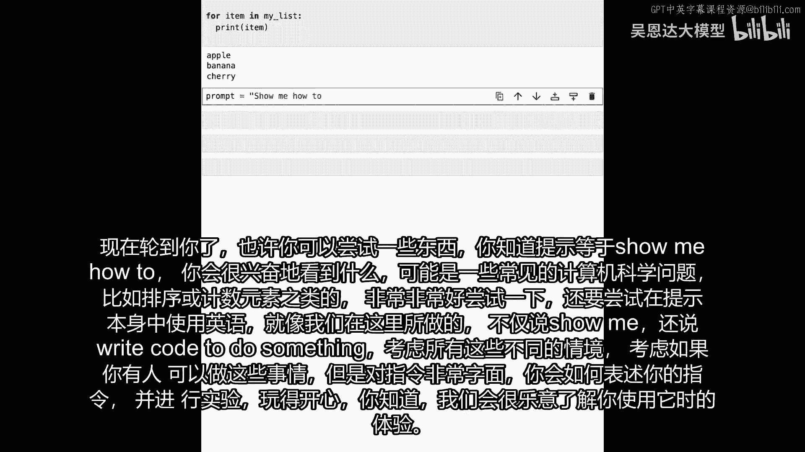

请像与一位需要非常明确指令的同事沟通一样，仔细思考你的提示词语句。尝试不同的表达方式，观察输出结果的变化，并享受探索的乐趣。我们期待看到你的实践成果！

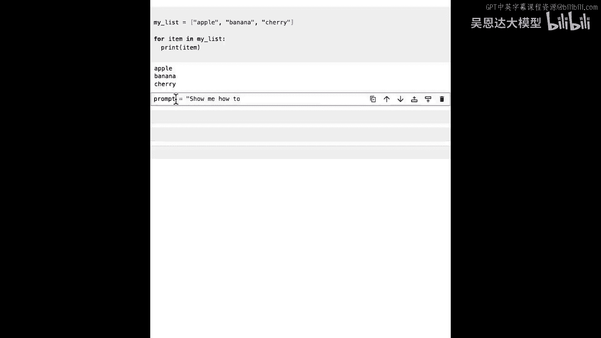

在下节课中，我们将学习如何让这些提示词变得更加高效和强大。