# 060：3.SC-Laurence_L2_v03.zh - 吴恩达大模型 🧠


## 概述
在本节课中，我们将学习一种与大语言模型交互的有效方法：通过使用结构化的提示模板来引导模型生成特定类型的内容。我们将重点介绍如何将提示分解为“预热”、“问题”和“装饰器”三个部分，并通过字符串模板进行组合，从而获得更高质量、更符合预期的输出。


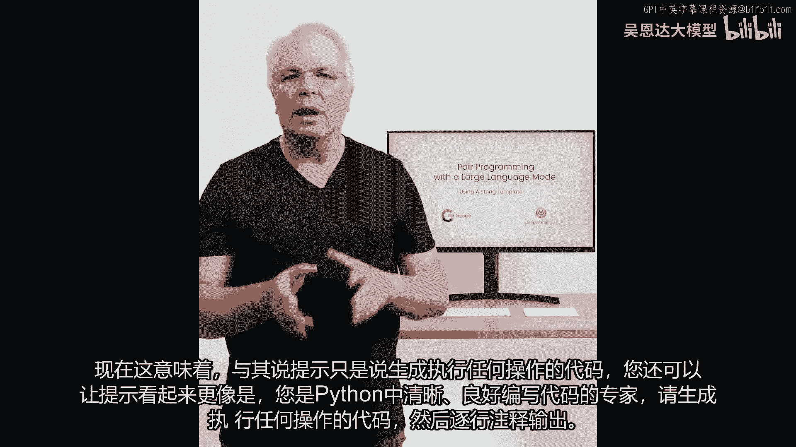

---


## 核心概念：结构化提示模板
一种与大语言模型交互非常有用的方法是，预先为特定的行为类型进行训练，使用结构化的提示。这意味着，与其使用一个简单的指令（如“生成做任何事情的代码”），不如设计一个更清晰、更专业的提示，类似于精心设计的Python代码。

我们可以将提示看作由三个核心部分组成：
1.  **提示预热**：设定模型的角色和任务背景。
2.  **问题**：具体的任务或请求。
3.  **装饰器**：对输出格式和方式的额外要求。

通过这种方式，你可以将期望的行为“嵌入”到主提示中，从而获得更好的性能。

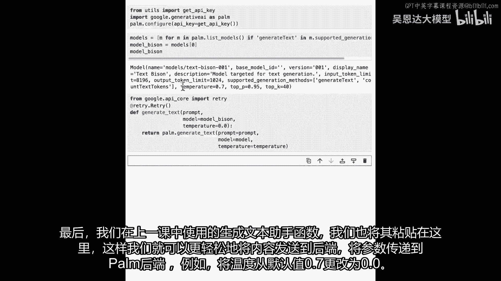

---

## 环境准备与设置
上一节我们介绍了结构化提示的概念，本节中我们来看看如何具体实现。首先，我们需要设置好编程环境。

以下是设置步骤：
1.  导入必要的API密钥并配置Palm模型后端。
2.  选择用于生成文本的模型（例如 `Bison`）。
3.  定义一个辅助函数 `generate_text`，用于更方便地向模型发送请求和调整参数（如温度 `temperature`）。

相关代码示例：
```python
# 假设的配置代码
import os
os.environ[‘API_KEY‘] = ‘your_api_key_here‘

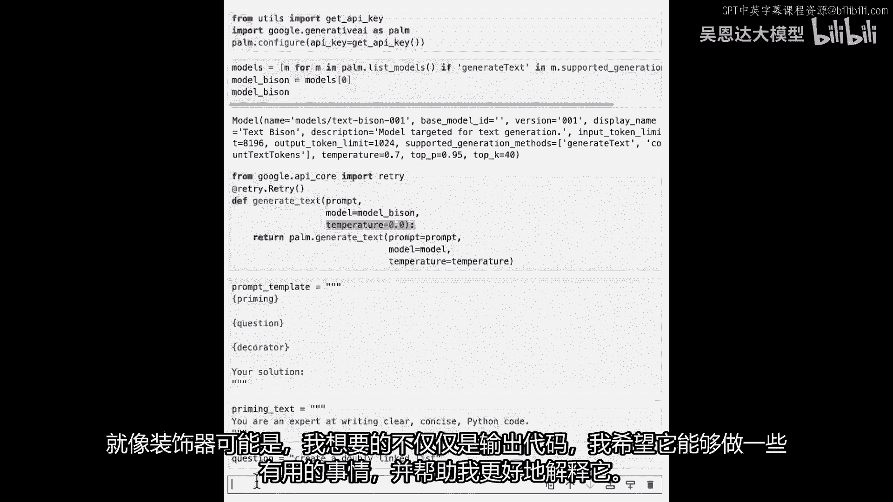

# 配置模型
model_name = ‘models/text-bison-001‘

# 辅助生成函数
def generate_text(prompt, temperature=0.7):
    # 调用模型API的逻辑
    response = palm.generate_text(model=model_name, prompt=prompt, temperature=temperature)
    return response.result
```

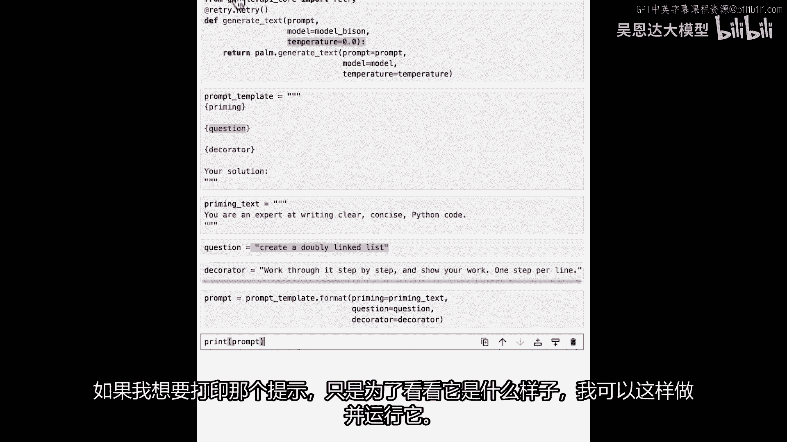

---

## 构建提示模板
现在，让我们看看如何格式化之前提到的字符串模板。我们的目标是创建一个可复用的提示结构。

一个完整的提示模板可以这样构建：
```python
prompt_template = “““
{preheat}

{question}

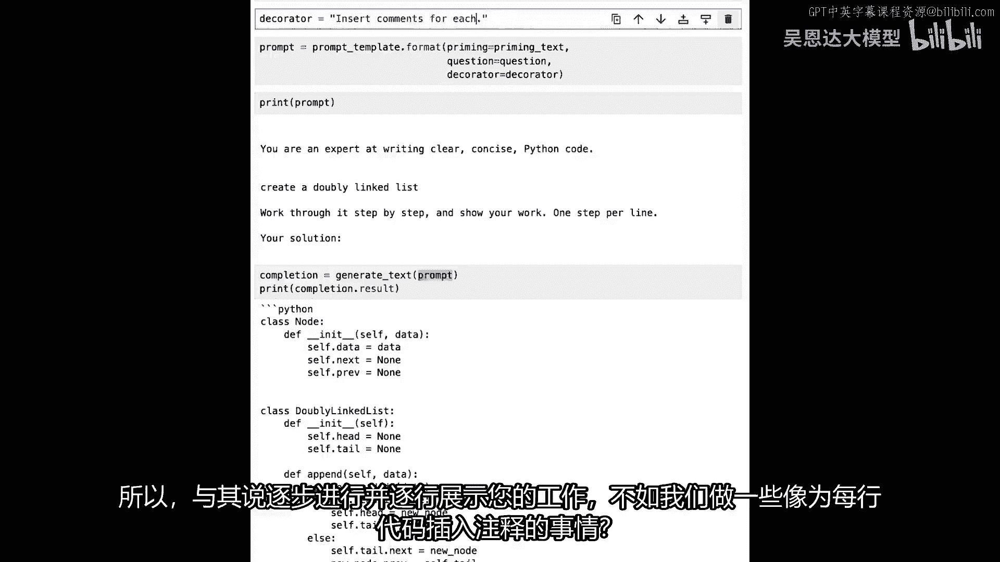

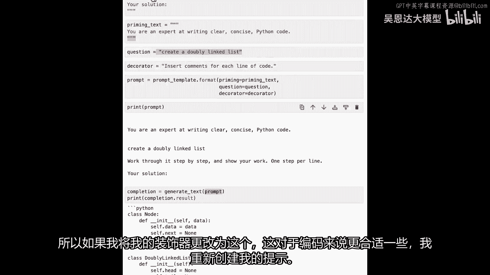

{decorator}
“““
```
然后，我们可以动态地填充这三个部分。

以下是各部分的具体说明：
*   **预热文本**：用于“预热”模型，设定其角色。例如：“你是一位擅长编写清晰、简洁Python代码的专家。”
*   **问题**：具体的任务描述。例如：“创建一个双向链表。”
*   **装饰器**：对输出格式的最终指示。例如：“为每一行代码插入注释。”

通过字符串格式化，我们可以轻松组合出最终的提示：
```python
final_prompt = prompt_template.format(
    preheat=preheat_text,
    question=question_text,
    decorator=decorator_text
)
```

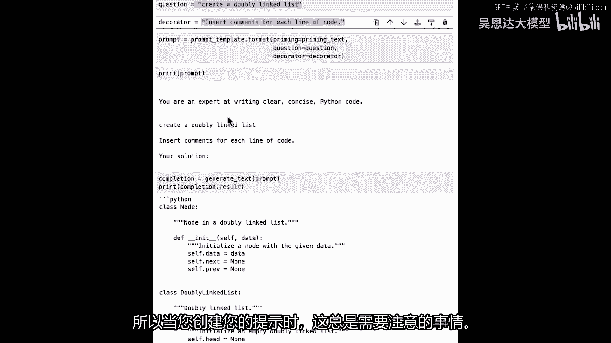

---

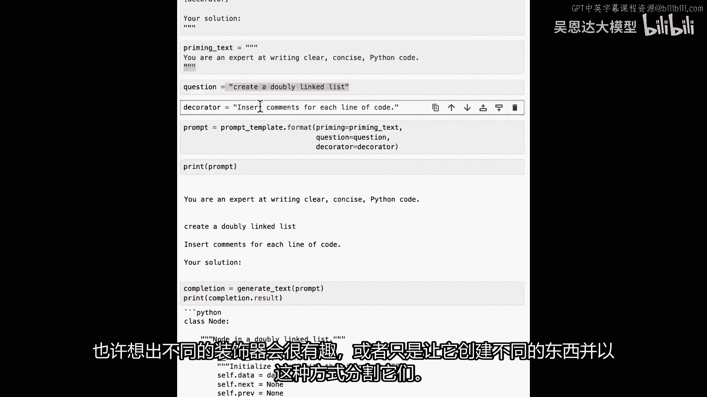

## 实践案例：生成带注释的代码
让我们通过一个具体例子来实践。我们将请求模型生成一个双向链表的Python代码，并要求它为每一行代码添加注释。

首先，我们定义模板的各个部分并组合成最终提示：
```python
preheat_text = “你是一位擅长编写清晰、简洁Python代码的专家。”
question_text = “创建一个双向链表。”
decorator_text = “为每一行代码插入注释。”

final_prompt = prompt_template.format(
    preheat=preheat_text,
    question=question_text,
    decorator=decorator_text
)
```
然后，我们将这个 `final_prompt` 发送给模型并获取结果。模型返回的代码将会是结构清晰、带有详细注释的双向链表实现。

---

## 调整装饰器以优化输出
装饰器的选择对输出结果影响很大。针对不同任务，我们需要设计合适的装饰器。

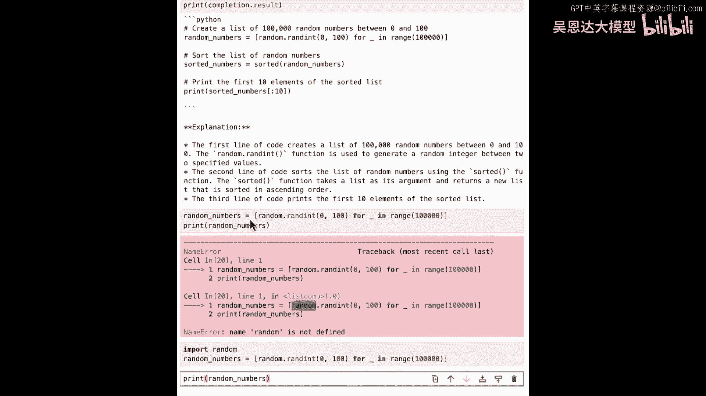

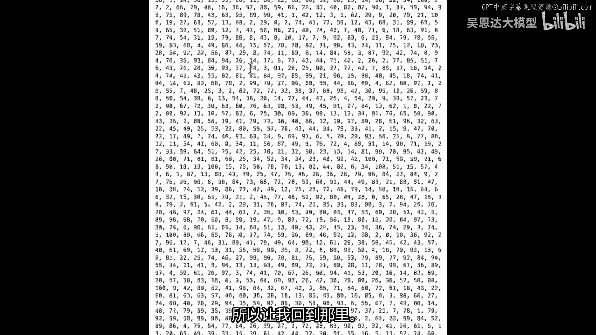

例如，对于生成代码的任务，“为每一行代码插入注释”比“一步一步地展示你的工作”更为合适。后者可能更适用于解决数学谜题或分步推理任务。

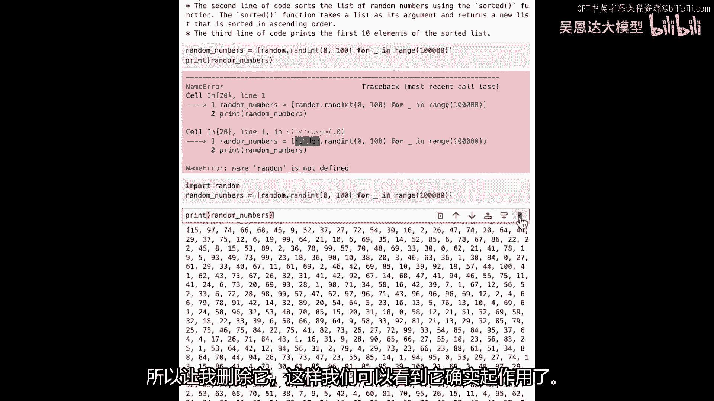

我们可以轻松更换装饰器来探索不同效果：
```python
# 尝试另一种装饰器
new_decorator_text = “首先解释算法思路，然后给出完整代码。”
new_prompt = prompt_template.format(
    preheat=preheat_text,
    question=question_text,
    decorator=new_decorator_text
)
```
模板化的优点在于，你可以保持预热和问题的核心不变，只调整装饰器来获得不同风格的输出。

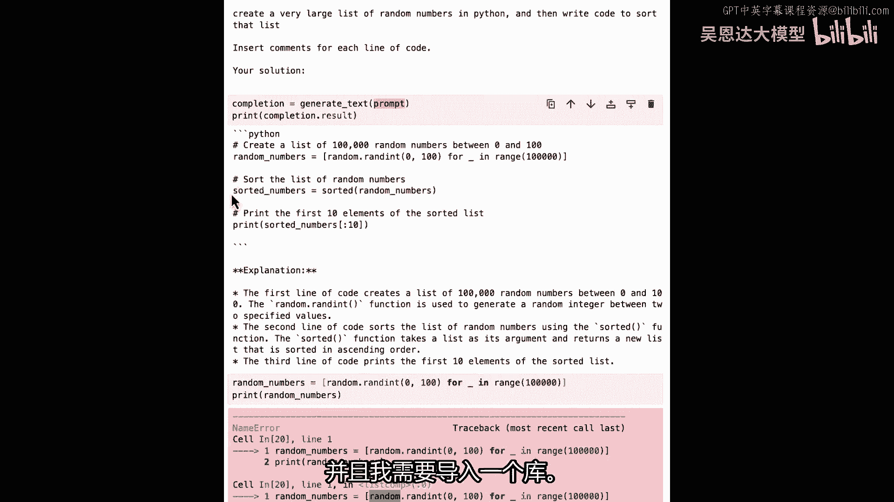

---

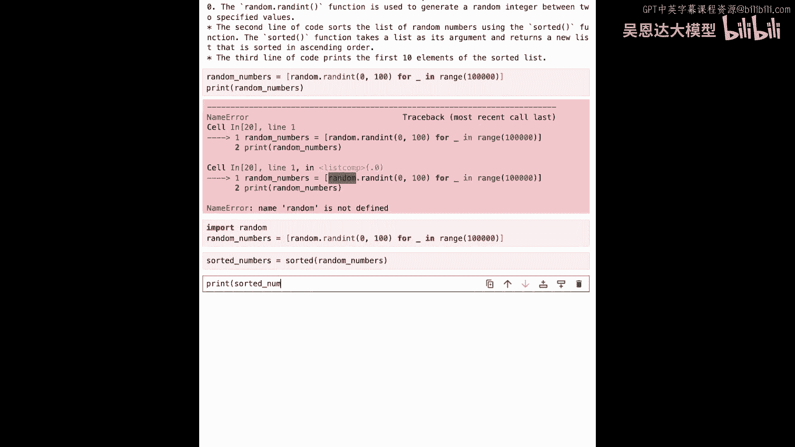

## 复杂任务测试
为了验证方法的有效性，我们可以尝试一个更复杂的编程任务。

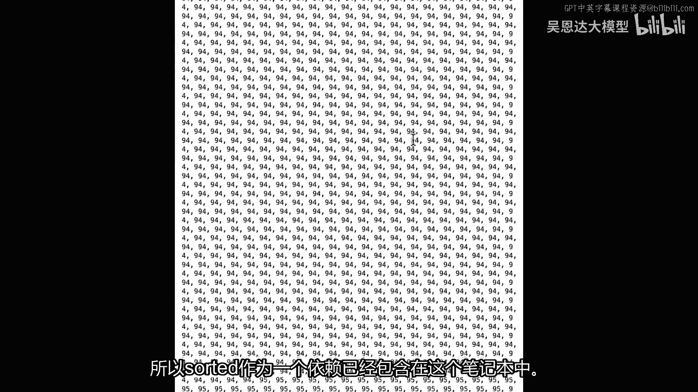


以下是新的问题定义：
```python
question_text = “创建一个包含10万个随机数的Python列表，并编写代码对其进行排序。”
```
我们保持预热文本和装饰器（“为每一行代码插入注释”）不变，生成新的提示并发送给模型。模型成功生成了创建大型随机列表并使用内置 `sorted` 函数进行排序的代码，并且每一行都有注释。生成的代码可以直接运行并验证结果。

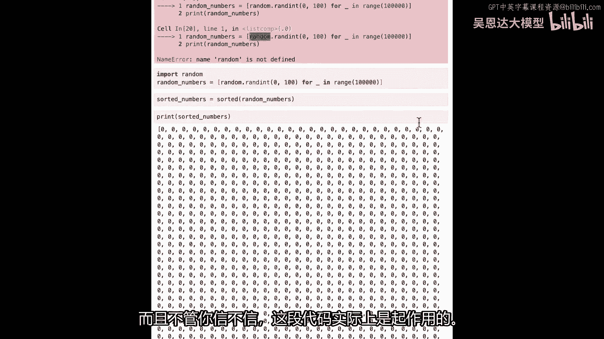

这个例子表明，结构化的提示能够引导模型处理复杂任务，并产生高质量、可执行的代码。

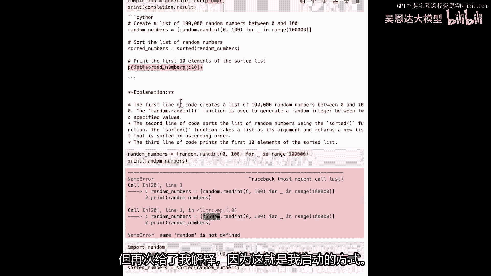

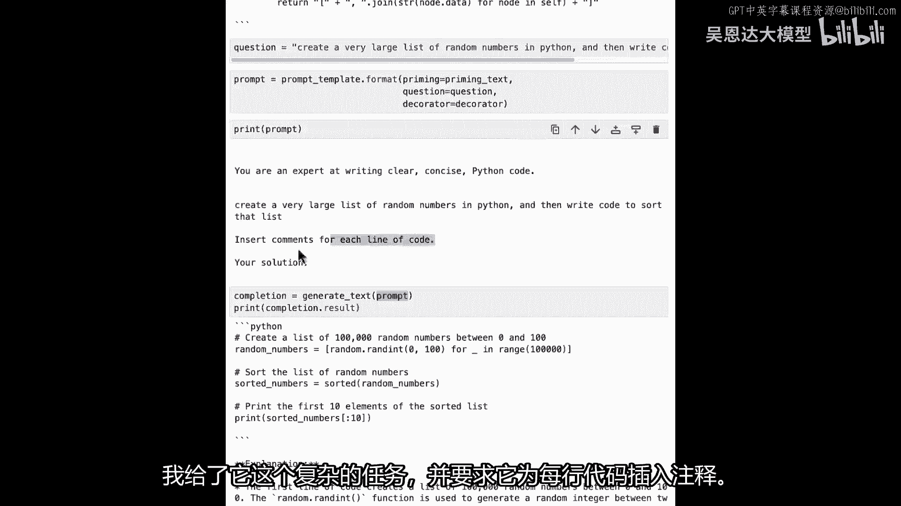

---

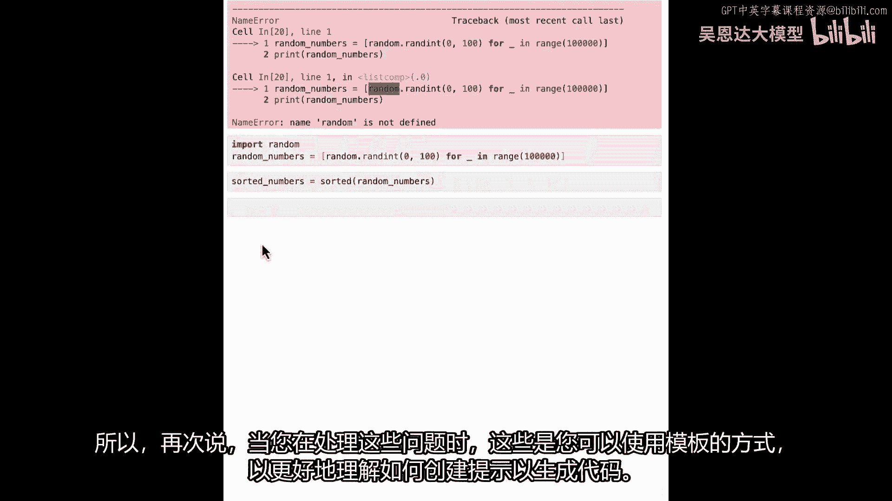

## 总结
本节课中我们一起学习了如何使用结构化的提示模板来提升与大语言模型交互的效果。我们介绍了将提示分解为 **预热**、**问题** 和 **装饰器** 三部分的方法，并通过字符串模板进行灵活组合。这种方法使得提示更加清晰、专业，能够有效引导模型生成更符合预期的输出，特别是在代码生成等任务上效果显著。

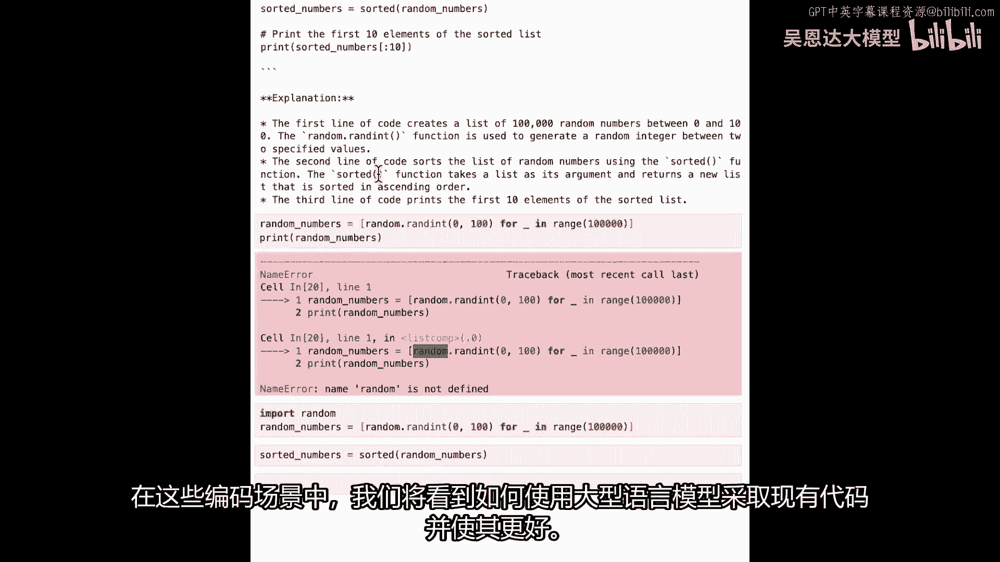

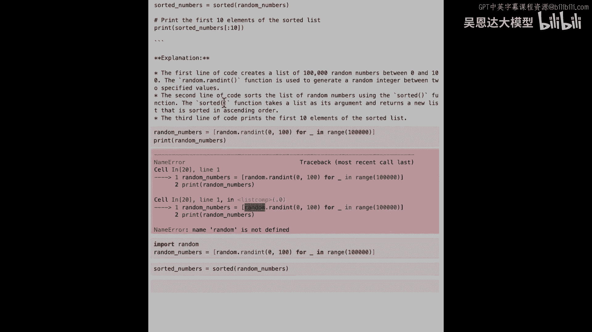

在下一节课中，我们将处理一些更有趣的编码场景，进一步探索提示工程的强大功能。