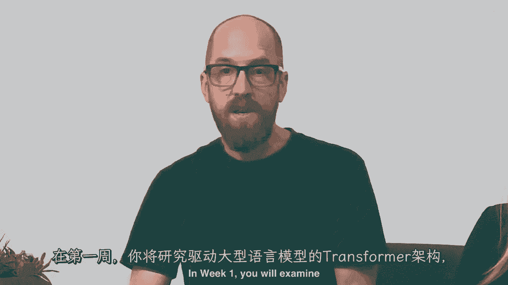
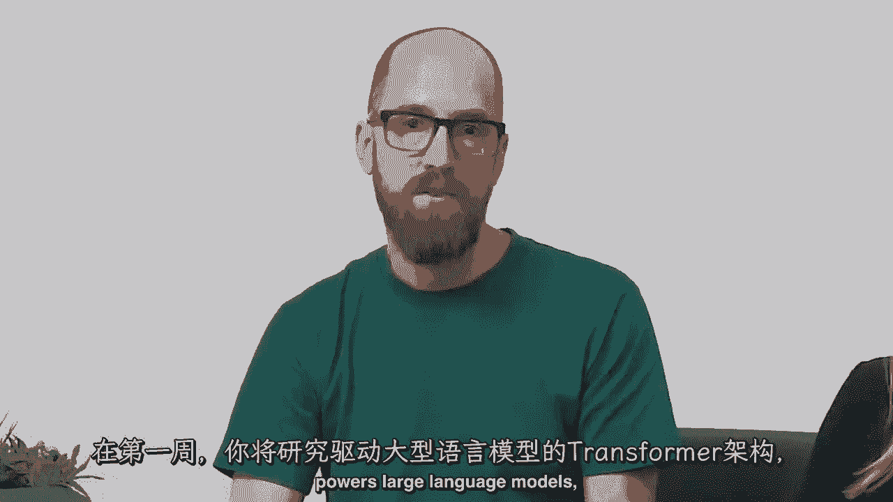
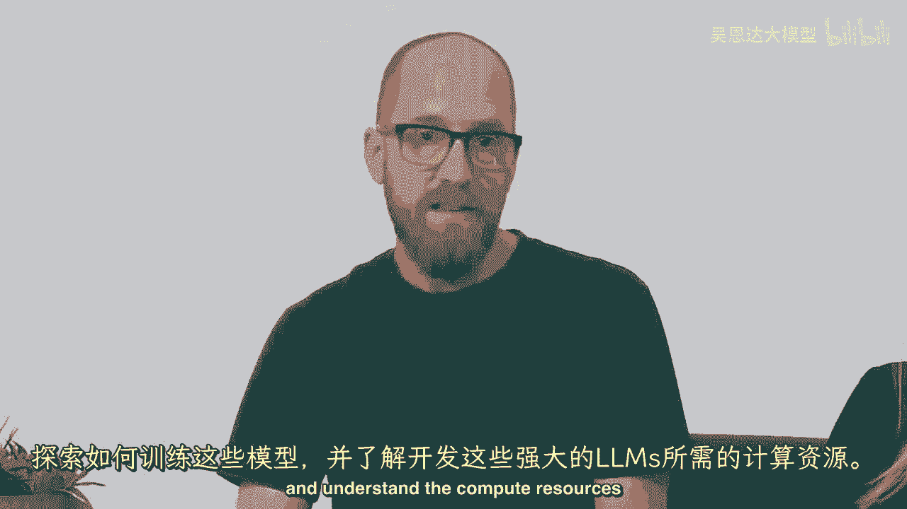
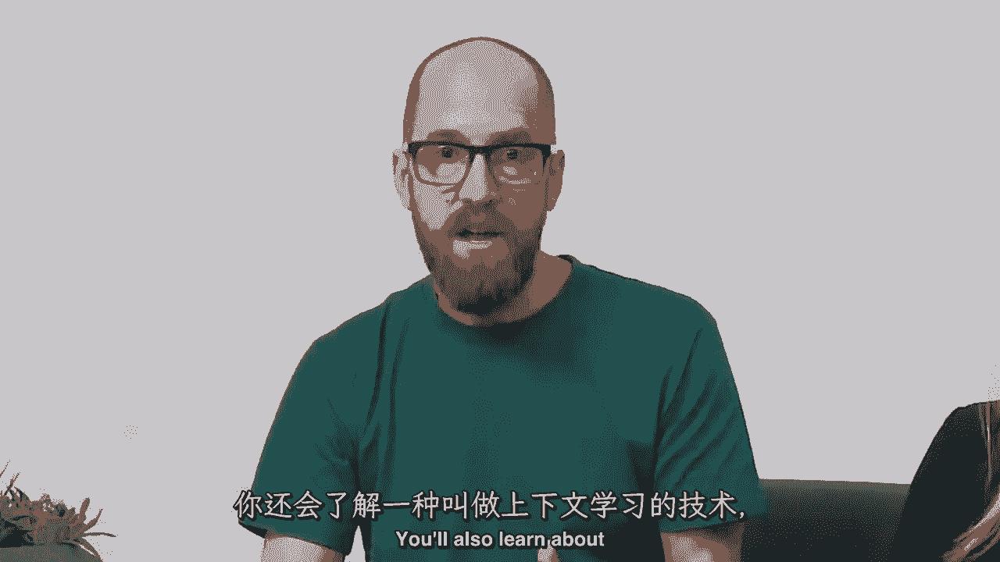
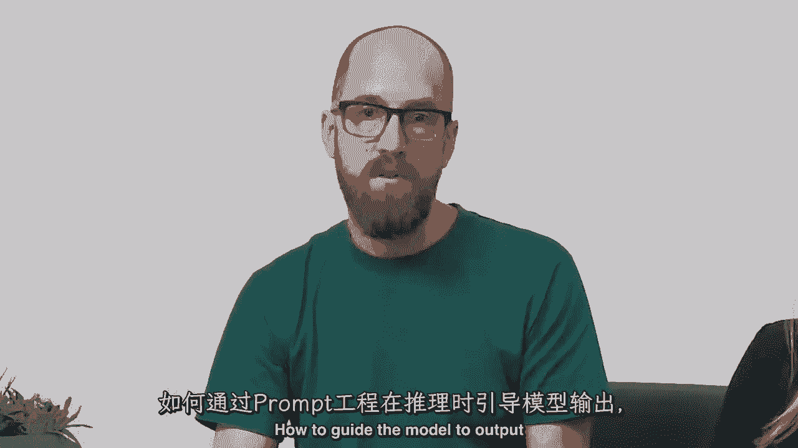
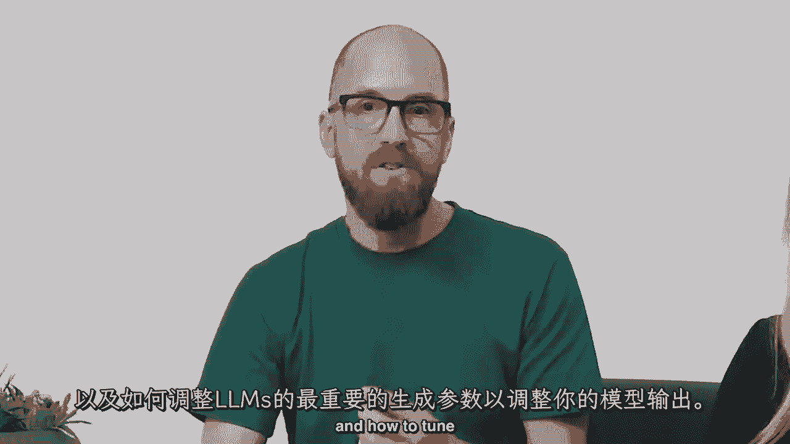
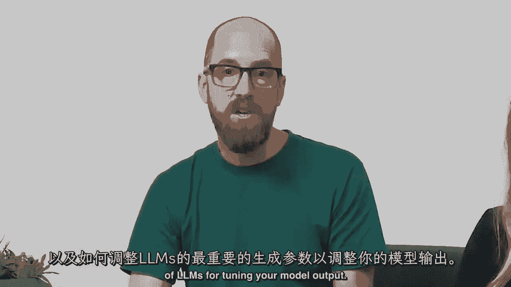
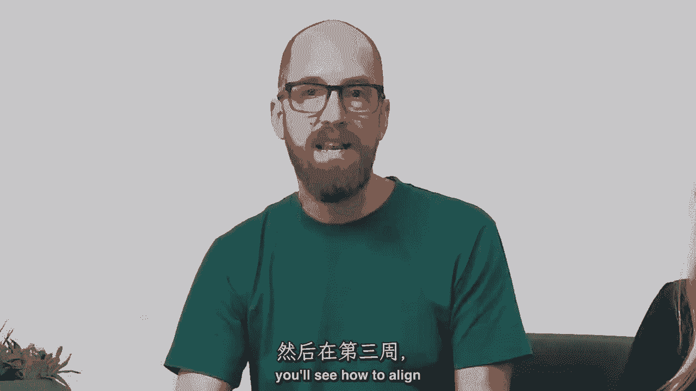
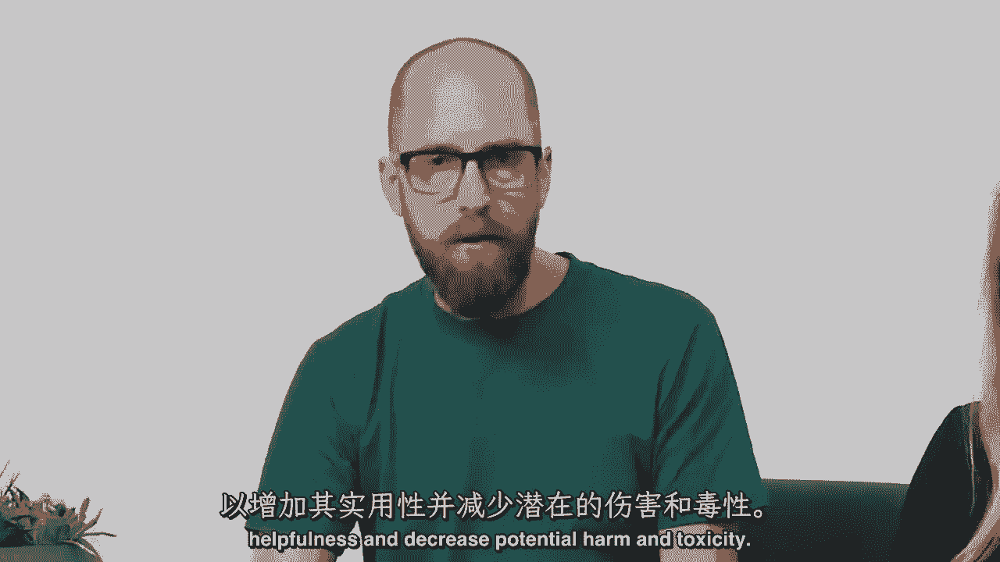

# 064：《大语言模型与生成式AI》- 介绍LLM和生成式AI项目的生命周期 🚀

在本节课中，我们将要学习大规模语言模型与生成式人工智能的基本概念，并了解构建相关项目的完整生命周期框架。课程将涵盖从模型基础原理到实际应用部署的全过程。

---

欢迎参加这门关于大规模语言模型与生成式人工智能的课程。大规模语言模型是一种非常令人兴奋的技术。尽管存在许多喧嚣和炒作，许多人仍然低估了它们作为开发工具的力量。

具体来说，许多以前需要数月才能构建的机器学习和AI应用，现在可以在几天甚至几小时内完成。这门课程将深入探讨LLM技术如何实际工作，包括许多技术细节，例如模型训练、指令调整、微调。

课程还将介绍生成式AI项目生命周期框架，以帮助您规划并执行项目。生成式AI和LLMs是一种通用技术。这意味着，类似于其他通用技术如深度学习和电力，它们不仅限于单个应用。

它们对于跨越经济各个角落的许多不同应用都有用。因此，类似于深度学习大约十五年前开始兴起，现在有许多重要的工作等待完成，需要许多人在未来多年里共同努力。我希望，包括您在内，能够识别用例并构建特定应用。

由于许多这类技术都非常新，真正知道如何使用它们的人很少。许多公司目前正忙于寻找和雇佣真正知道如何构建LLM应用的人才。我希望这门课程也能帮助您，如果您希望更好地定位自己以获得这些工作。

我很高兴能为您带来这门课程，以及由AWS团队组成的一群出色的讲师：Ana、Mike Chambers、Shelby Eigenberg今天与我一起在这里，以及第四位讲师Chris Freely，他将呈现一些实验内容。Ana和Mike都是生成式AI开发者倡导者，Shelby和Chris都是AI解决方案架构师。他们都有很多经验，帮助许多不同的公司使用LLMs构建了许多创新的应用。

我期待他们都能在这门课程中分享他们丰富的实践经验。这门课程的内容开发，得到了许多来自亚马逊AWS、Hugging Face和世界各地顶尖大学的行业专家与应用科学家的输入。

Andrew，你能再多说一些关于这门课程的事情吗？当然，Andrew。很高兴再次与您合作完成这门课程，以及这个关于大规模语言模型与生成式AI的激动人心领域。

我们创建了一系列旨在吸引AI爱好者的课程。课程面向想要学习LLMs技术基础的工程师或数据科学家。除了培训的最佳实践之外，课程还涵盖根据前提条件进行调优和部署。

我们假设你已经熟悉Python编程。如果你对PyTorch或TensorFlow有一些经验，这在这门课程中应该足够了。你将详细探索构成典型生成式人工智能项目生命周期的步骤。

从定义问题和选择语言模型开始，到优化模型以部署和集成到您的应用程序中。这门课程不仅覆盖了所有主题，而且会深入探讨，同时会花时间确保你离开时对所有这些技术有深入的理解。

并且能够真正了解你在构建自己生成式AI项目时的工作。这将使你在实践中处于有利地位。Mike，当你构建自己生成式AI项目时，为什么不告诉我们一些关于学习者将在每周看到的更多细节？在每个星期，当然，Ana，谢谢。

## 第一周内容概览 🧠

在第一周，你将研究驱动大型语言模型的变换器架构。

你将探索这些模型如何训练，并理解开发这些强大LLMs所需的计算资源。

你还将学习一种叫做**上下文学习**的技术。

你将学习如何通过**提示工程**引导模型在推理时输出。

以及如何调整LLMs中最重要的生成参数以调整您模型的输出。

## 第二周与第三周内容概览 ⚙️

在第二周，你将探索适应预训练模型到特定任务和数据集的选项，通过被称为**指令微调**的过程。

在第三周，你将看到如何将语言模型的输出与人类价值观对齐，以增加帮助性和减少潜在的伤害和毒性。

## 实践环节介绍 🛠️

但我们不局限于理论。每周都包括一次动手实验。在那里，你将有机会亲自尝试这些技术。实验在一个包括所有必要资源以处理大型模型的AWS环境中进行，对你来说免费。Shelby，你能告诉我们一些关于动手实验的更多信息吗？

当然可以，Mike。在第一次动手实验中，你将构建并比较给定生成任务的不同提示和输入。在这种情况下，任务是对话摘要。你还将探索不同的分类参数和采样策略，以获得更深入的理解，了解如何进一步改进生成模型的响应。

在第二个实践实验室，你将微调Hugging Face上现有的大型语言模型。Hugging Face是一个开源模型库。你将既进行全参数微调，又进行参数高效微调。参数高效微调简称**PEFT**。你将看到PEFT如何让你的工作流程更加高效。

在第三个实验室，你将通过**人类反馈的强化学习**来接触强化学习。你将构建一个奖励模型分类器来标记模型响应，并将其标记为有毒或不有毒。

所以不要担心，如果你还不理解所有这些术语和概念。在接下来的课程中，你将对这些主题进行更深入的探讨。

---

我非常高兴有Ana、Mike和Chris为您呈现这门深入技术探讨LLMs的课程。你从这门课程中离开时，已经实践了如何构建或使用LLMs的许多不同具体代码示例。

我确信许多代码片段最终都将直接有用于您自己的工作。我希望您喜欢这门课程，并将所学用于构建一些真正令人兴奋的应用程序。

所以，让我们继续到下一个视频，在那里，我们将开始深入探讨如何使用LLMs来构建应用程序。

---

**本节课总结**：在本节课中，我们一起学习了《大语言模型与生成式AI》课程的总体介绍。我们了解了课程的目标、讲师团队、以及为期三周的核心教学内容，包括变换器架构、模型训练、提示工程、指令微调、对齐技术以及配套的动手实验。这为后续深入学习构建生成式AI应用奠定了坚实的基础。