# 066：生成式AI与大语言模型的输出 🚀

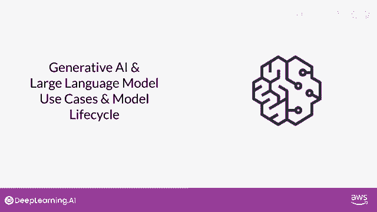

在本节课中，我们将学习生成式AI与大语言模型（LLM）如何产生输出。我们将探讨模型如何工作、什么是提示与完成，以及如何通过自然语言与这些强大的模型进行交互。

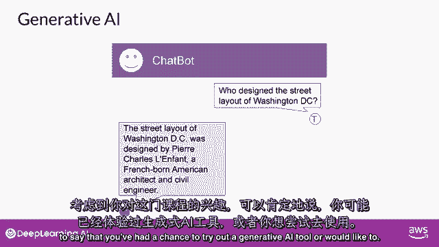

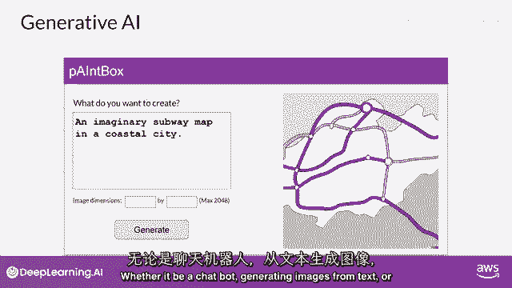

---

上一节我们介绍了生成式AI项目的生命周期。本节中，我们来看看生成式AI与大语言模型的核心输出机制。

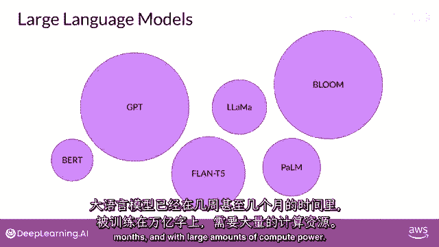

可以说，你可能已经尝试过生成式AI工具。无论是聊天机器人、从文本生成图像，还是使用插件来帮助开发代码，你在这些工具中看到的，是一台能够创建模仿或近似人类能力的机器。

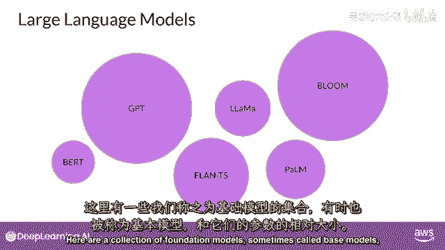

生成式AI是传统机器学习的一个子集。支撑生成式AI的机器学习模型通过找到统计模式来学习这些能力。这些模型在大量由人类生成的内容数据集中进行训练。大规模的语言模型已经在数周数月的时间内训练了万亿个单词，并且使用了大量的计算资源。

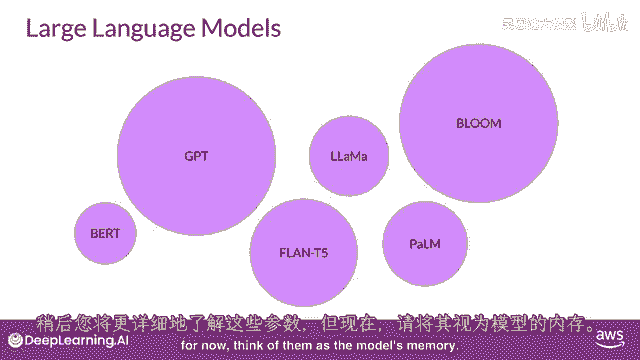

这些基础模型拥有亿级别的参数，展现出超越语言本身的涌现特性。研究者们正在解锁它们分解复杂任务的能力。推理和解决问题是一系列基础模型的集合，有时被称为基础模型。模型的相对大小以参数来衡量。

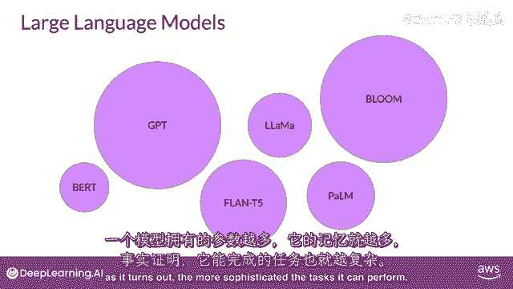

以下是关于模型参数的核心概念：
*   **参数**：可以看作是模型的“记忆”。一个模型拥有的参数越多，它就需要更多的记忆，并且能够完成的任务就越复杂。其关系可以简化为：`模型能力 ∝ 参数数量`。

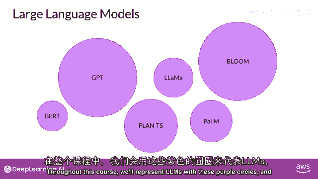

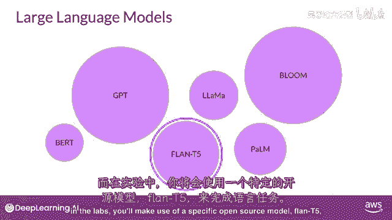

我们将用紫色圆圈来表示LLMs。

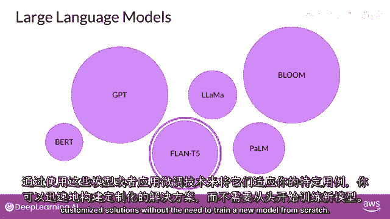

在实验室中，你将使用特定的开源模型，例如 **Flan-T5** 用于执行语言任务。你可以通过使用这些模型本身，或者通过应用微调技术来适应你的特定用例。你现在可以快速构建定制的解决方案，无需从头训练一个新的模型。

虽然生成式AI模型正在为多个模态创建，包括图像、视频、音频和语音，但在这个课程中，你将专注于大型语言模型及其自然语言生成的使用。

你与语言模型互动的方式与其他机器学习和编程范式有很大的不同。在这些情况下，你使用正式语法的计算机代码与库和API进行交互。相比之下，大型语言模型能够处理自然语言或人类编写的指令，并执行任务。

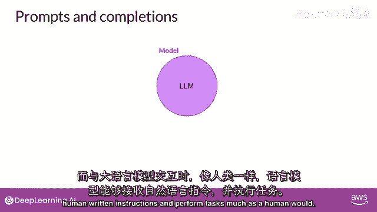

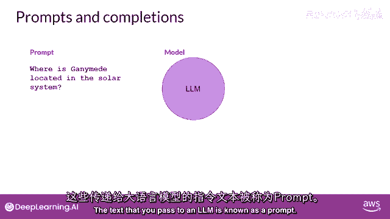

就像人类一样，你传递给LLM的文本被称为 **提示（Prompt）**。可用给提示的空间或内存被称为 **上下文窗口（Context Window）**，它通常足够大以容纳数千个单词，但与模型不同，其大小是有限的。

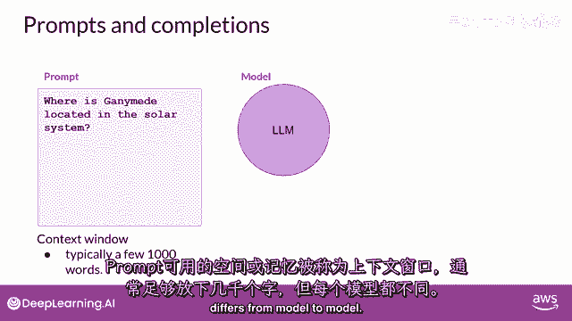

在这个例子中，你问模型“甘尼米德（Ganymede）在太阳系中的位置在哪里”。提示被传递给模型，模型然后预测下一个单词。因为你的提示包含一个问题，这个模型生成了一个答案。

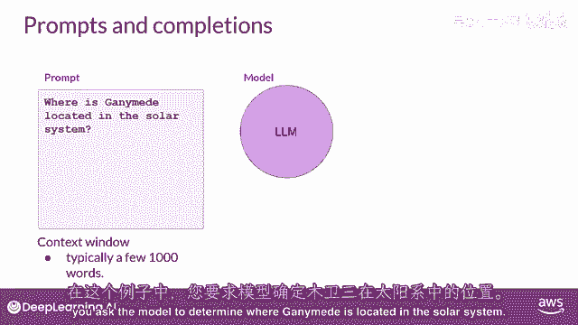

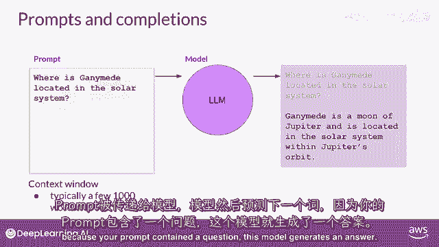

模型的输出被称为 **完成（Completion）**。使用模型生成文本的行为被称为 **推理（Inference）**。

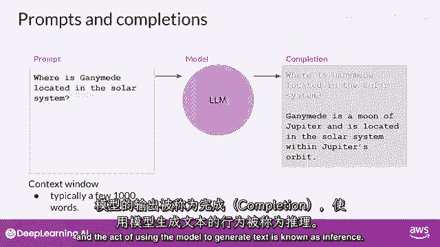

完成由原始提示中包含的文本组成，跟随生成的文本。你可以看到，这个模型做得很好，回答了你的问题。它正确地识别出甘尼米德是木星的卫星，并生成了对你问题的合理答案，指出卫星位于木星的轨道中。

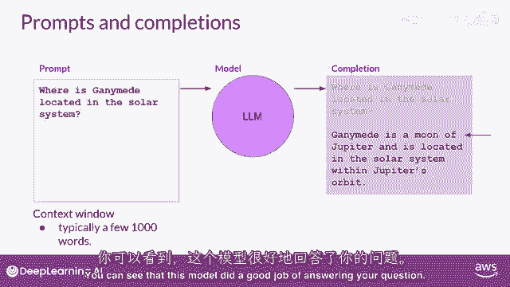

---

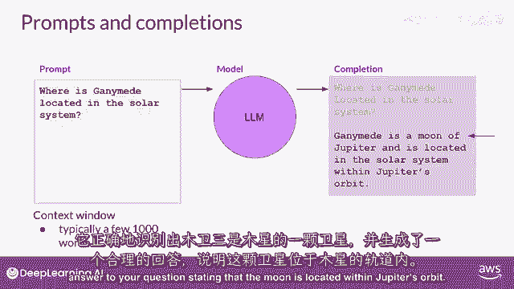

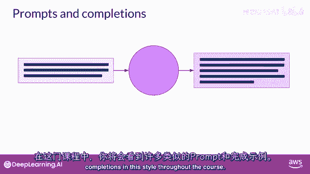

本节课中我们一起学习了生成式AI与大语言模型如何工作。我们明确了**提示（Prompt）**、**完成（Completion）** 和**推理（Inference）** 这些核心概念，并理解了模型通过分析海量数据中的统计模式来学习生成类人文本。下一节，我们将深入探讨如何设计有效的提示来引导模型产生我们期望的输出。