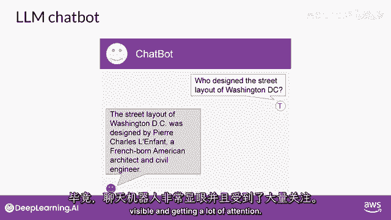
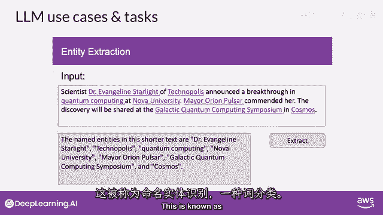
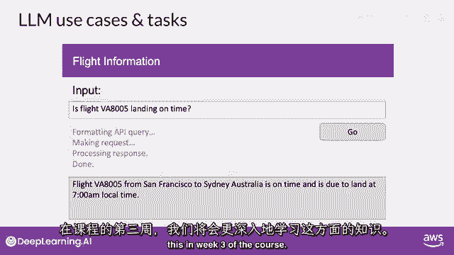
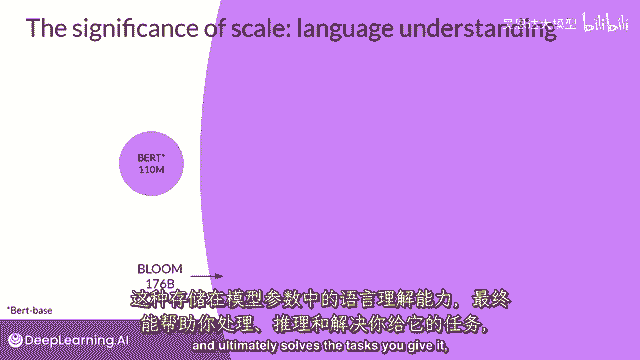

# 067：LLM与生成式AI项目生命周期（四）—— LLM的应用场景与任务 🚀

在本节课中，我们将探讨大型语言模型（LLM）和生成式AI的多种实际应用案例与任务。我们将了解，除了广为人知的聊天功能外，LLM如何被应用于文本生成、翻译、信息检索以及与现实世界的交互等广泛领域。

---

## 超越聊天：LLM的核心能力与应用

你可能会认为LLM和生成式AI主要专注于聊天任务，毕竟聊天机器人非常可见，得到了很多关注。

然而，**下一个词预测**是许多不同能力的基础概念。从基本的聊天机器人开始，你可以用这个简单的技术来完成文本生成中的各种其他任务。

上一节我们介绍了LLM的基础能力，本节中我们来看看它具体能完成哪些类型的任务。

以下是LLM在文本生成领域的一些典型应用：

*   **文本摘要**：例如，你可以要求模型根据提示写一篇总结对话的论文。你需要将对话作为提示的一部分提供，而模型将利用这些数据及其理解自然语言的能力来生成摘要。
*   **翻译任务**：LLM可以进行各种翻译任务。这包括传统的两种不同语言之间的翻译（例如，法语和德语，或者英语和西班牙语），也包括将自然语言翻译成机器代码。
*   **代码生成**：例如，你可以要求模型“编写一些Python代码，返回数据框中每列的平均值”。模型将生成你可以传递给解释器执行的代码。

## 信息提取与理解

除了生成内容，LLM还能执行像信息检索这样小而专注的任务。

例如，你可以请求模型识别一篇新闻文章中所有提及的人名和地点。这被称为**命名实体识别**，是词性分类的一种。

存储在模型参数中的知识使其能够正确理解并完成这项任务，返回你所要求的结构化信息。

## 连接外部世界：增强的LLM

增强大型语言模型的一个活跃领域是将它们连接到外部数据源，或使用它们来调用外部API。

这种能力让你可以为模型提供它在预训练阶段未曾接触过的信息，并使你的模型能够驱动与现实世界的交互。你将在课程第三周学习更多关于如何实现这一点的内容。

## 模型规模与能力的关系

开发者发现，随着基础模型的参数规模从数百亿增长到数千亿，模型对语言的主观理解能力也随之增强。

这种语言理解存储在模型的参数中，其处理方式是模型能够最终解决你交给它的任务的根本原因。

但是，也确实有小型模型可以通过精调，在特定的、专注的任务中表现良好。你将在课程第二周学习更多关于如何做到这一点的内容。

过去几年中，LLMs展现出的能力迅速增长，主要归功于驱动它们的架构创新。

---

本节课中我们一起学习了LLM的多样化应用场景，从文本生成、翻译、信息提取到连接外部API。我们了解到，LLM的能力不仅限于聊天，其核心的“下一个词预测”机制支撑了广泛的任务。同时，模型规模的增长和特定任务的精调都是提升其表现的关键因素。