# 068：介绍LLM和生成式AI项目的生命周期5——Transformer之前的文本生成 🧠

在本节课中，我们将要学习Transformer架构出现之前的文本生成技术，特别是循环神经网络（RNN）的工作原理及其局限性。理解这段历史有助于我们更好地欣赏现代生成式AI模型的突破性进展。

## 早期文本生成：循环神经网络（RNN）

上一节我们介绍了生成式AI的基本概念，本节中我们来看看在Transformer出现之前，主流的文本生成模型——循环神经网络（RNN）。

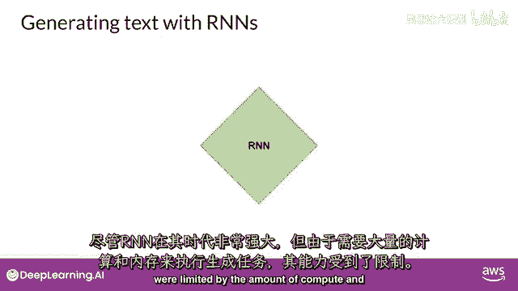

生成算法并非全新概念。在Transformer之前，语言模型主要使用循环神经网络，即RNN。RNN在当时虽然强大，但其能力受限于计算资源和内存。

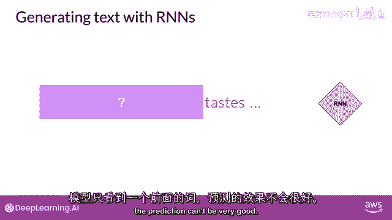

## RNN的工作原理与局限

让我们通过一个简单的例子来理解RNN的工作方式。以下是RNN进行简单单词预测的一个示例，在这个任务中，模型只能看到前一个词。

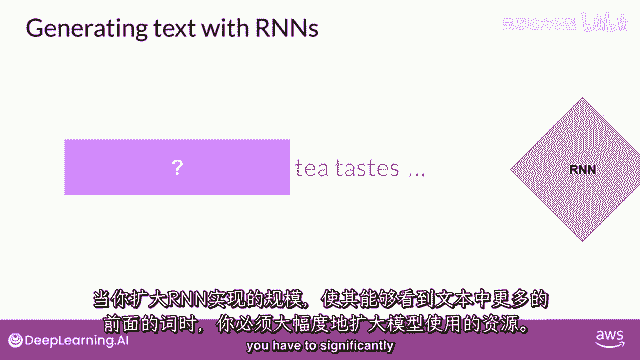

基于如此有限的信息，模型的预测效果自然不会很好。一个改进思路是扩大RNN的视野，让它能看到更多的上文。但这需要大幅扩展模型的计算和内存资源。

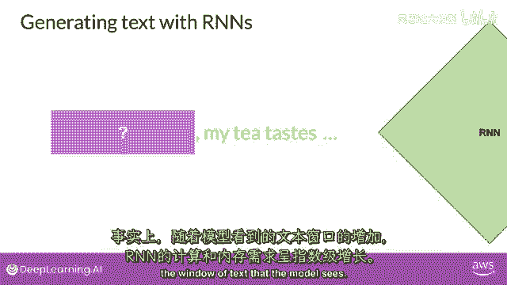

实际上，RNN的计算和内存需求会随着模型可见文本窗口的增加而呈指数级增长。

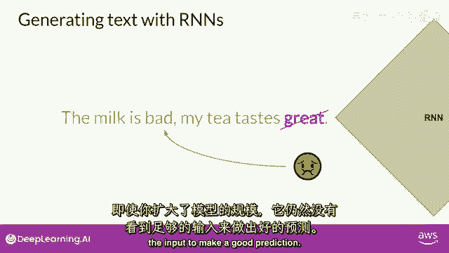

## 理解语言的复杂性

即使扩展了模型，它可能仍然无法看到足够的输入信息来做出好的预测。成功的预测往往需要模型理解更多的上下文，甚至需要理解整个句子或整个文档。

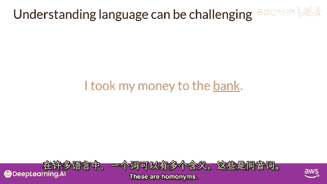

问题的核心在于人类语言的复杂性。在许多语言中，一个词可能具有多种含义，这些词被称为同音异义词。

在这种情况下，只有结合整个句子的语境，才能确定“银行”具体指的是金融机构还是河岸。

此外，句子结构本身也可能存在歧义，即句法歧义。例如下面这个句子：“老师用书教学生。”

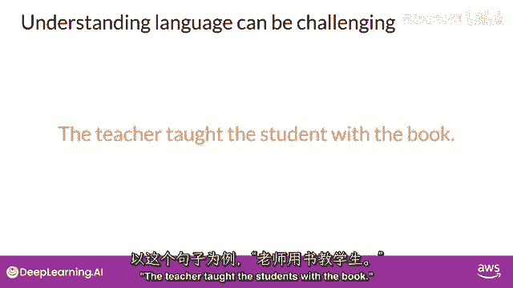

这个句子可以有不同的理解：是老师用书来教学，还是学生有书？或者是两者都有？算法该如何准确地理解这些人类语言中的微妙之处呢？

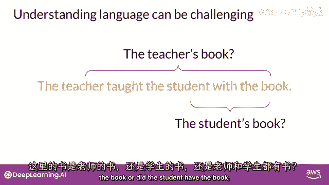

## 变革的到来：注意力机制与Transformer

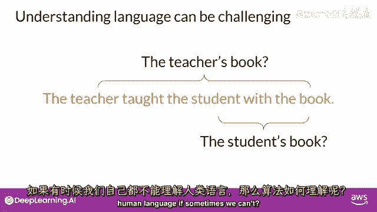

在2017年一篇具有里程碑意义的论文发表后，情况发生了根本性的改变。这篇由谷歌和多伦多大学研究人员发表的论文题为《Attention Is All You Need》。

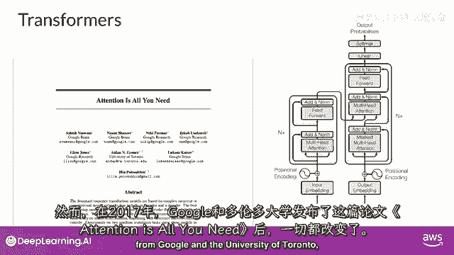

一切都变了，Transformer架构的时代已经到来。这种新方法开启了当今生成式AI飞速进步的序幕。

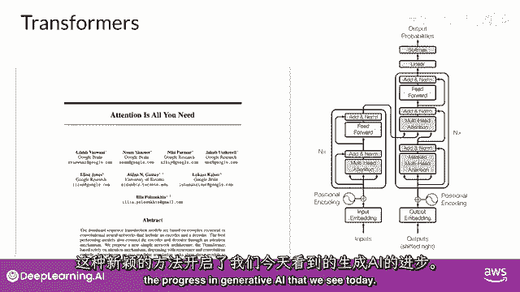

Transformer架构的核心优势包括：
*   **高效扩展**：能够高效地扩展到多核GPU上进行计算。
*   **并行处理**：可以并行处理输入数据，从而利用更大的训练数据集。
*   **注意力机制**：最关键的是，它引入了注意力机制，使模型能够动态地关注输入序列中不同部分的重要性。

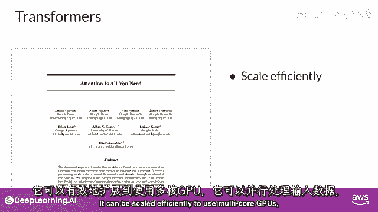

处理与关注，即模型所需的一切。

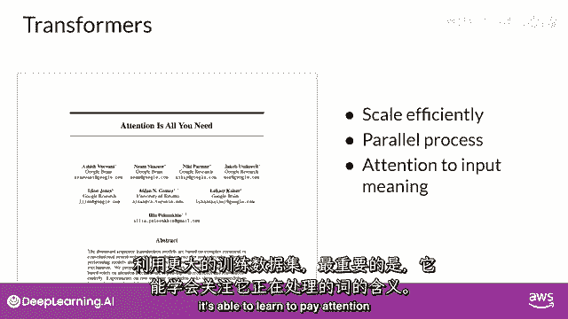

## 总结

本节课中我们一起学习了Transformer架构出现前的文本生成技术。我们回顾了循环神经网络（RNN）的基本原理，并探讨了其因计算限制和难以捕捉长距离依赖关系而面临的挑战。这些局限性最终催生了以注意力机制为核心的Transformer架构，为现代大型语言模型（LLM）的强大能力奠定了基础。理解这一演进过程，能让我们更深刻地认识到当前AI技术的突破性所在。