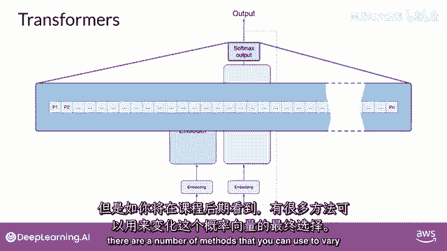
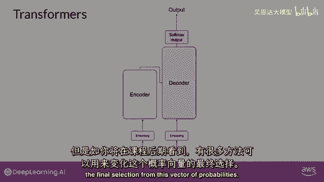

# 069：Transformer架构详解 - P69

## 📖 概述
在本节课中，我们将要学习Transformer架构，这是构建现代大型语言模型（LLM）的核心技术。我们将了解它如何通过“自注意力”机制显著提升模型对自然语言的理解与生成能力，并逐步拆解其编码器与解码器的工作流程。

---

## 🔑 Transformer架构的核心优势
Transformer架构的引入，显著提升了大型语言模型在各类自然语言任务上的性能，其能力超越了早期的循环神经网络（RNN）。该架构的核心力量在于其能够学习句子中**每个词与其他所有词**之间的相关性与上下文信息，而不仅仅是相邻词汇。

这种机制通过“注意力权重”来量化词与词之间的关系，这些权重在模型训练过程中被学习。无论词汇在输入序列中的位置如何，模型都能学习到它们之间的关联。例如，模型可以学会“书”与“教师”之间存在强关联。

**核心概念：自注意力（Self-Attention）**
这种能够在整个输入序列中学习词汇间关系的能力，极大地增强了模型的语言编码能力。用于可视化这些注意力权重的图表被称为“注意力图”。

---

## 🏗️ Transformer架构总览
上一节我们介绍了自注意力的核心思想，本节中我们来看看Transformer架构的整体设计。为了便于理解，下图展示了一个简化的Transformer架构，它主要分为两个部分：**编码器（Encoder）**和**解码器（Decoder）**。

请注意，此图源自原始论文《Attention Is All You Need》。模型的输入位于底部，输出位于顶部，我们将沿用这个约定。

---

## 🔢 第一步：文本分词（Tokenization）
机器学习模型本质上是处理数字的复杂计算系统。因此，在将文本输入模型前，必须先将单词转换为数字，这个过程称为**分词（Tokenization）**。

简单来说，分词就是将单词映射到模型词典中对应位置ID的过程。分词方法有多种选择：
*   **整词匹配**：每个完整的单词对应一个独立的标记ID。
*   **子词划分**：使用标记ID来表示单词的一部分（如前缀、后缀）。

**关键点**：一旦在模型训练时选定了一种分词器，在后续使用模型生成文本时，**必须使用相同的分词器**以保证一致性。

---

## 🧭 第二步：词嵌入（Embedding）
当输入文本被转化为数字ID后，下一步是将其传递给**嵌入层（Embedding Layer）**。

这一层是一个可训练的多维向量空间。词汇表中的每个标记ID都会被匹配到一个唯一的向量，该向量在此空间中有一个特定的位置。直觉上，这些向量能够学习如何编码单个标记在输入序列中的**语义和上下文信息**。

词嵌入的概念在自然语言处理中已应用多年，早期的词向量模型（如Word2Vec）就使用了类似思想。

**公式/代码示意**：
假设我们有一个简单的句子：“The cat sits”。经过分词和嵌入后，每个词被映射为一个高维向量（例如512维）。为简化理解，我们可以想象一个3维空间：
*   `“cat” -> [0.2, 0.8, -0.1]`
*   `“dog” -> [0.25, 0.7, -0.05]`
*   `“car” -> [-0.5, 0.1, 0.9]`

在这个空间中，语义相近的词（如“cat”和“dog”）其向量距离会更近，这赋予了模型从数学上理解语言关系的能力。

---

## 📍 第三步：位置编码（Positional Encoding）
Transformer模型并行处理所有输入标记，因此它本身并不理解单词的顺序。为了保留序列中词汇的位置信息，我们需要在词嵌入向量的基础上添加**位置编码（Positional Encoding）**。

这样，模型就能同时获取词汇的语义信息及其在句子中的位置信息。

---

## 🧠 第四步：自注意力层（Self-Attention Layer）
将融合了位置信息的向量输入到**自注意力层**。这一层会分析输入序列中所有标记之间的关系，计算每个词对于序列中其他所有词的“关注”程度（即注意力权重）。

以下是自注意力机制的关键特性：

*   **动态权重**：在训练过程中学习的注意力权重，反映了每个词相对于其他所有词的重要性。
*   **多头注意力（Multi-Head Attention）**：Transformer并不只有一个注意力头，而是有多个（常见数量在12到100之间）。这些“头”并行且独立地学习。
    *   **直觉**：每个头可能会专注于语言的不同方面。例如，一个头可能学习实体间的关系，另一个头可能关注句子中的活动，第三个头可能捕捉韵律等属性。
    *   **重要提示**：我们并不预先指定每个头学习什么。它们的权重随机初始化，在大量训练数据的作用下，各自会学习到语言的不同特征。有些注意力图（如“书”和“教师”）易于解释，有些则可能不那么直观。

---

## 🧮 第五步：前馈网络与输出（Feed-Forward Network & Output）
应用完所有注意力权重后，数据会通过一个**全连接前馈网络**进行处理。该网络的输出是一个“逻辑值（logits）”向量，其长度与词汇表大小相同，向量中的每个值与该位置对应词汇的预测得分成正比。

随后，逻辑值向量被送入**Softmax层**进行归一化，转化为每个词的概率分布。最终输出是词汇表中每个词成为下一个词的概率分数。

**核心概念：模型输出**
此时，模型会输出一个包含数千个概率值的向量。通常，其中一个标记的概率得分会远高于其他标记，这就是模型预测的“最可能的下一个词”。当然，在课程后续我们会看到，利用这个概率分布有多种生成文本的策略（如贪婪解码、采样等）。

---

## ✅ 总结
本节课中，我们一起学习了Transformer架构的核心原理与工作流程。我们从其核心优势——**自注意力机制**开始，逐步拆解了从**文本分词**、**词嵌入**、**位置编码**，到**多头自注意力计算**，最后经由**前馈网络**得到概率输出的完整过程。理解这一架构是掌握现代大型语言模型如何工作的基础。