# 070：Transformer模型文本生成全流程解析 🧠

在本节课中，我们将学习Transformer模型如何从输入到输出完成一个完整的文本生成过程。我们将通过一个具体的翻译任务示例，详细拆解编码器与解码器如何协同工作，并了解不同Transformer架构变体的应用场景。

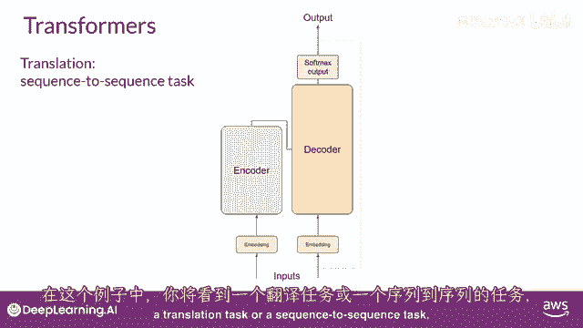

---

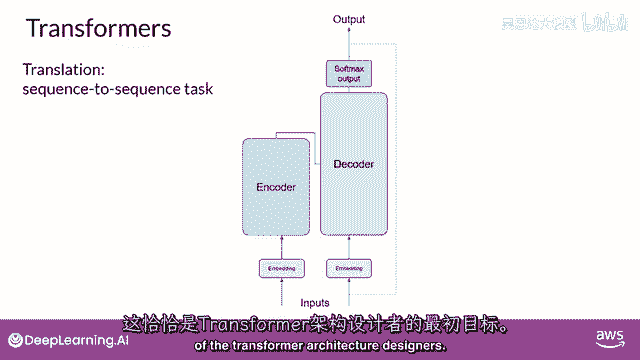

## 概述：Transformer的文本生成流程

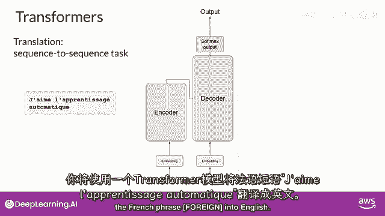

上一节我们介绍了Transformer架构中的主要组件。本节中，我们将通过一个具体的序列到序列（Seq2Seq）任务——法语到英语的翻译，来完整地走一遍Transformer模型从接收输入到产生输出的预测过程。这是Transformer架构设计者的原始目标。

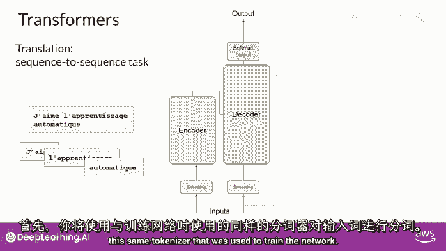

---

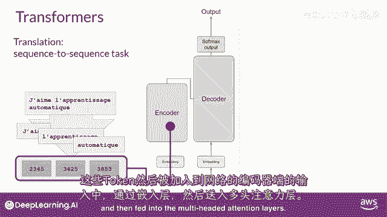

## 第一步：输入处理与编码

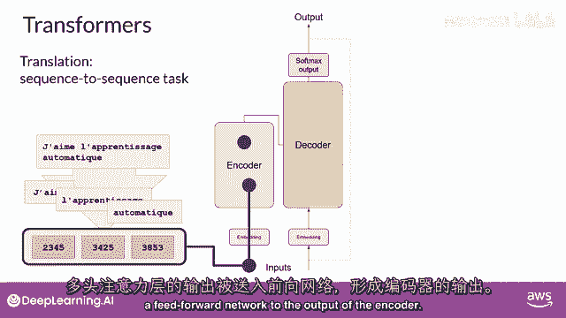

首先，使用与训练网络时相同的分词器对输入的法语短语 **“J’aime le machine learning”** 进行分词。

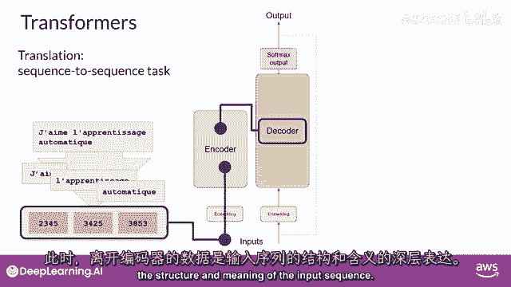

这些分词后的标记（Tokens）会被送入网络的输入端，经过嵌入层（Embedding Layer）转换为向量，然后输入到多头注意力层（Multi-Head Attention Layer）。

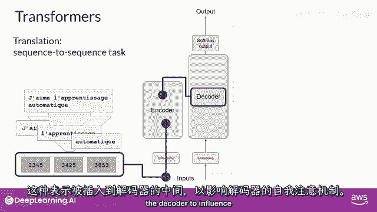

多头注意力层的输出被馈送到前馈网络（Feed-Forward Network），最终从编码器输出。

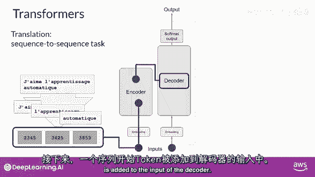

此时，离开编码器的数据是输入序列及其含义的一个深度表示。

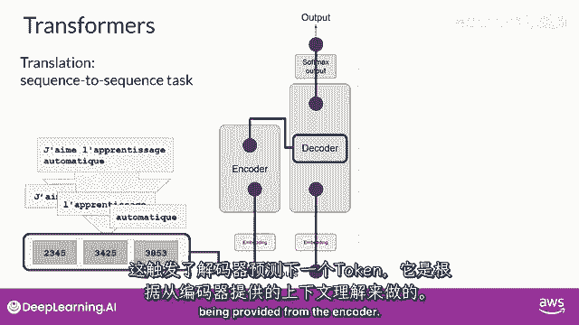

---

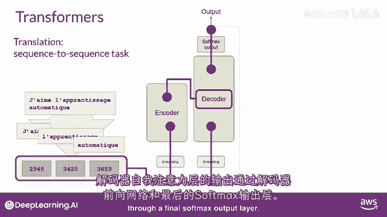

## 第二步：解码与文本生成

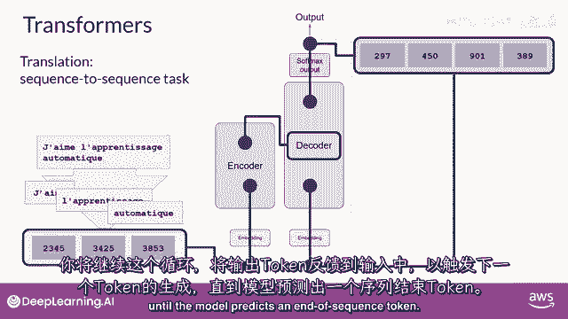

编码器输出的深度表示被送入解码器的中间部分，影响解码器的自注意力机制。

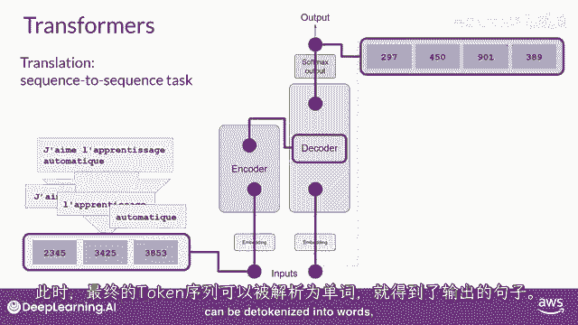

接下来，在解码器的输入端添加一个 **`<start>`**（序列开始）标记。这触发了解码器基于编码器提供的上下文理解，来预测下一个标记。

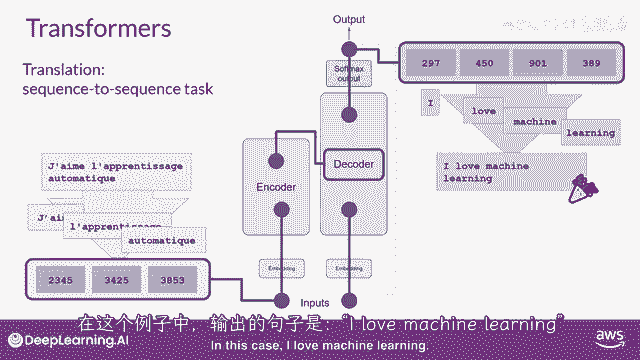

解码器自注意力层的输出会传递给解码器的前馈网络，并通过一个最终的 **`Softmax`** 输出层，生成第一个预测出的标记（Token）。

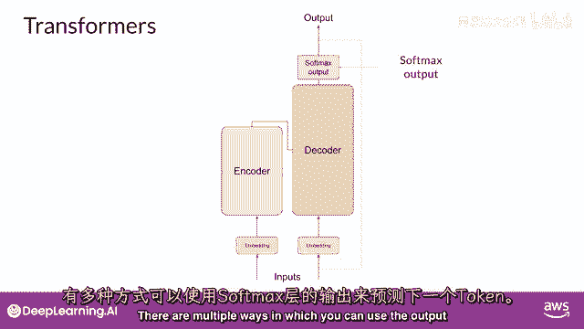

---

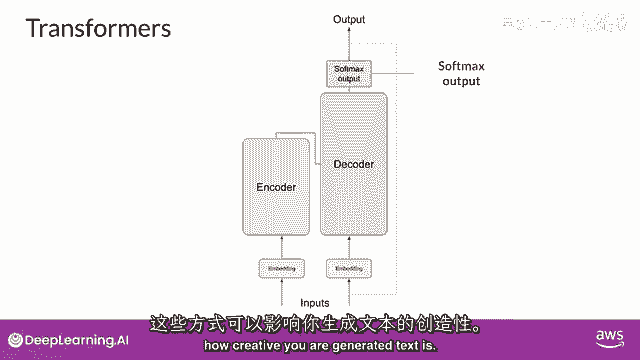

## 第三步：循环生成与输出

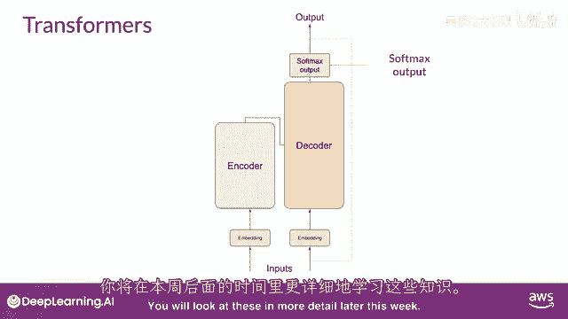

此时，我们得到了第一个输出标记。模型会持续这个循环：将当前输出的标记作为新的输入，反馈给解码器，以触发下一个标记的生成。这个过程会一直持续，直到模型预测出 **`<end>`**（序列结束）标记。

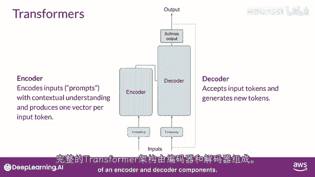

当生成过程结束时，最终的标记序列会被“解标记化”（Detokenize）为人类可读的单词。

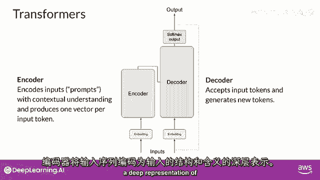

在这个例子中，我们得到了翻译结果：**“I love machine learning.”**

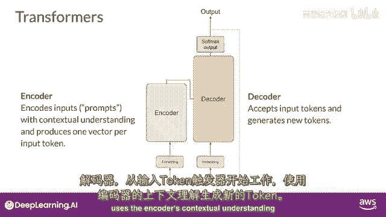

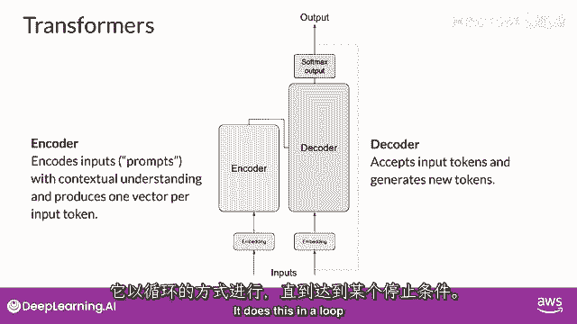

---

## 生成策略与模型变体

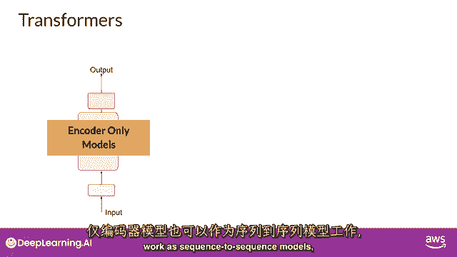

模型通过 **`Softmax`** 层的输出来预测下一个标记。有多种策略可以影响这个过程，从而控制生成文本的创造性（例如，贪婪搜索、束搜索、随机采样等）。我们将在本周晚些时候详细探讨这些策略。

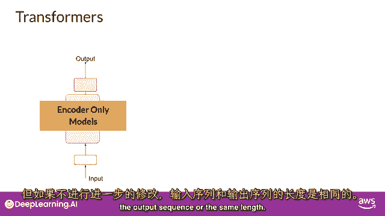

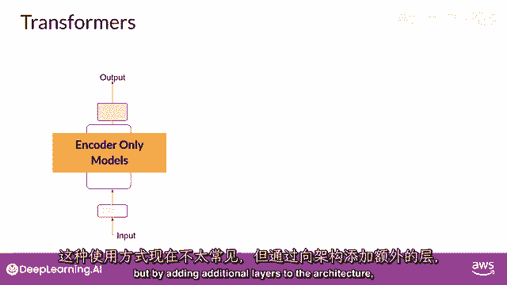

---

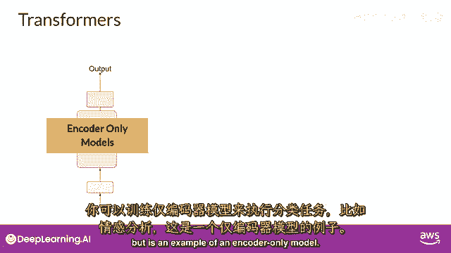

## 总结：Transformer架构家族

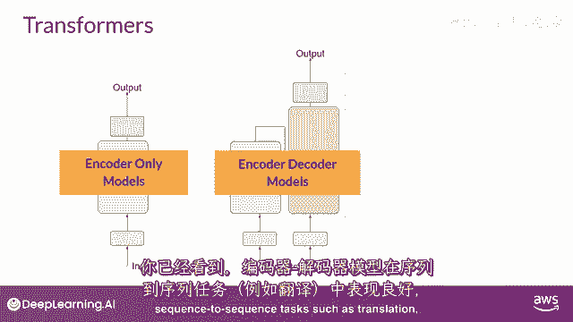

本节课中，我们一起学习了Transformer模型的完整工作流程。让我们总结一下核心要点：

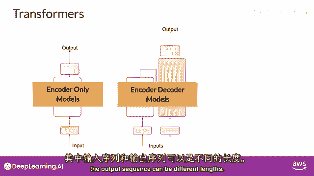

完整的Transformer架构由编码器（Encoder）和解码器（Decoder）组件构成。
*   **编码器**：将输入序列编码为一个深层次的、包含其意义的表示。
*   **解码器**：从起始标记开始工作，利用编码器的上下文理解，循环生成新的标记，直到满足停止条件。

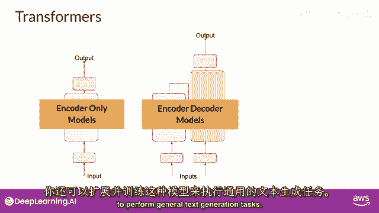

根据任务需求，Transformer架构可以演变为不同的变体：

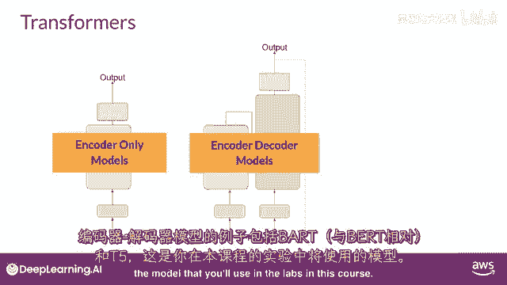

以下是三种主要的Transformer模型类型：

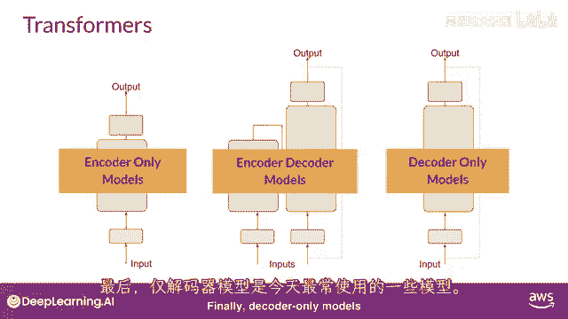

1.  **仅编码器模型（Encoder-Only）**
    *   这类模型（如 **`BERT`**）将输入序列编码为表示，通过添加额外层（如分类头）可以执行情感分析等任务。它们也可用于序列到序列任务，但输入与输出序列长度通常相同。

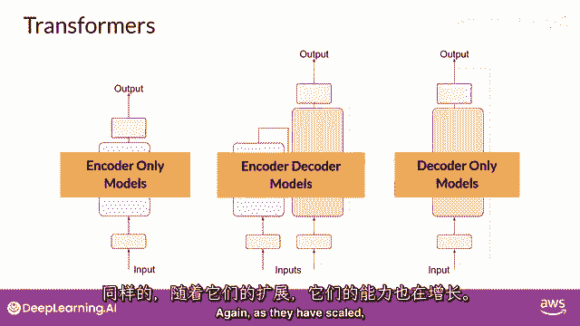

2.  **编码器-解码器模型（Encoder-Decoder）**
    *   正如我们在翻译示例中看到的，这类模型（如 **`BART`**, **`T5`**）在输入与输出序列长度可能不同的序列到序列任务（如翻译、摘要）中表现优异。也可扩展用于通用文本生成。

3.  **仅解码器模型（Decoder-Only）**
    *   这是目前最常使用的类型。由于其强大的扩展能力，这类模型（如 **`GPT`** 系列、**`Bloom`**, **`LLaMA`**）已经能够泛化到大多数任务，成为当前大语言模型的主流架构。

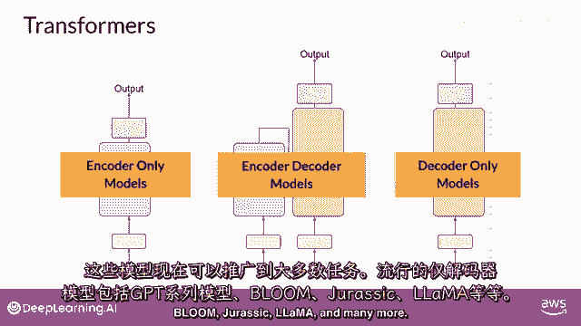

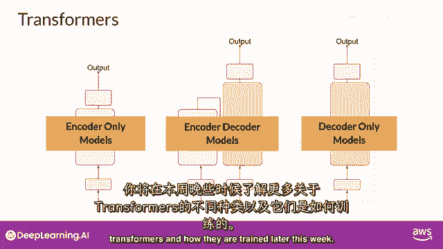

---

## 结语

Transformer模型概述的主要目标是为你提供足够的背景知识，以理解世界上各种主流模型之间的差异，并能够阅读相关模型文档。

请记住，你无需担心记住所有底层架构细节。在实际应用中，你将主要通过**提示工程（Prompt Engineering）**——即用自然语言编写提示词——来与这些强大的模型交互，而不是直接编写代码。这正是本课程下一部分将要探索的核心内容。