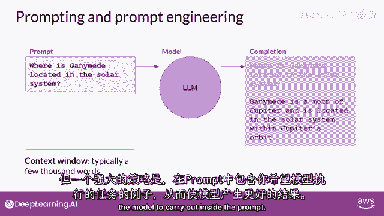
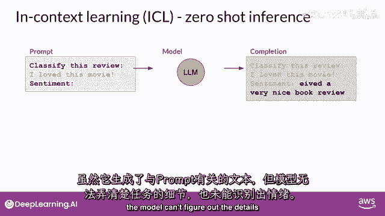
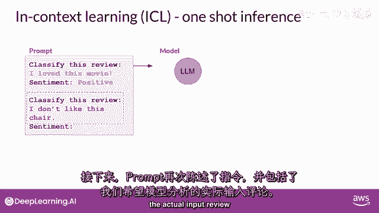
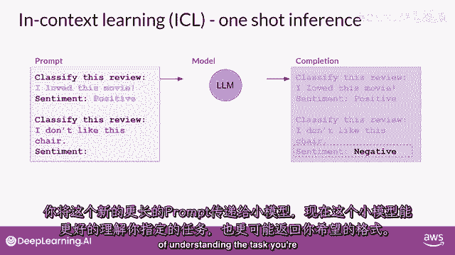
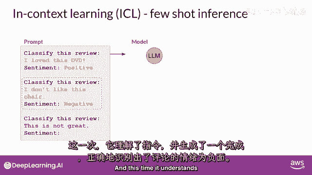
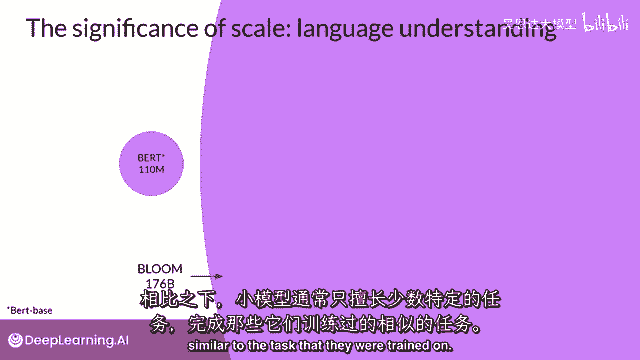

# 071：LLM与生成式AI项目生命周期（8）——提示与提示工程 📝

在本节课中，我们将要学习大型语言模型（LLM）中“提示”的基本概念，并深入探讨如何通过“提示工程”来引导模型生成更符合预期的结果。我们将介绍零样本、单样本和少样本推理等核心策略。

## 核心概念定义

首先，我们来明确几个核心术语。

*   **提示**：你输入到模型中的文本。
*   **推理**：模型根据提示生成文本的行为。
*   **完成**：模型推理后输出的文本。
*   **上下文窗口**：模型在生成提示时，能够参考和利用的文本记忆量。



尽管有时模型能直接给出理想答案，但你经常会遇到模型初次尝试未能产生预期结果的情况。这时，你需要修改提示的语言或表达方式。这种发展和改进提示的方法，就称为**提示工程**。

## 上下文学习：通过示例引导模型

一种强大的提示工程策略是在上下文窗口中包含任务示例，这被称为**上下文学习**。它可以帮助模型更好地理解任务要求。

以下是几种主要的上下文学习方法。

### 零样本推理

在提示中仅包含指令和待处理的数据，不提供任何示例。这种方法被称为**零样本推断**。

**提示示例**：
```
分类这个评论：“这部电影太棒了，我强烈推荐！” 请在末尾输出情感。
```



最大的LLM在零样本推断方面表现优异，能够理解任务并返回正确答案（例如“积极”）。然而，较小的模型可能难以准确理解指令。

### 单样本推理

在提示中提供一个完整的任务示例，以演示期望的输入和输出格式。这被称为**单样本推断**。



**提示示例**：
```
请分类以下评论的情感。
示例：
评论：“我爱这部电影。”
情感：积极



现在请分类这个评论：“这部电影太糟糕了。”
情感：
```

包含一个示例可以显著提升较小模型的性能，因为它更清晰地指明了任务细节和响应格式。

### 少样本推理

有时一个例子不足以让模型充分学习。此时，可以在提示中包含多个示例，这被称为**少样本推断**。

**提示示例**：
```
请分类以下评论的情感。
示例1：
评论：“表演令人惊叹。”
情感：积极
示例2：
评论：“剧情非常无聊。”
情感：消极



现在请分类这个评论：“特效一流，但故事薄弱。”
情感：
```

提供多个不同类别的示例（如积极和消极）能帮助模型更全面地理解任务范围，从而生成更准确的完成。

## 模型规模与策略选择

上一节我们介绍了通过示例进行提示工程的方法，本节中我们来看看模型规模如何影响策略的选择。

随着模型规模增大，其多任务能力和零样本推理的表现会显著提升。参数更多的模型能够捕获更复杂的语言模式。

*   **大型模型**：通常在零样本推断中表现惊人，能够成功完成许多未经专门训练的任务。
*   **较小模型**：通常只在少数与其训练数据相似的任务上表现良好，往往需要依赖单样本或少样本推理来获得可接受的结果。

因此，在实际应用中，你可能需要尝试多个模型来找到最适合你用例的那一个。找到合适的模型后，你还可以调整一些设置来影响生成文本的结构和风格。



## 总结

本节课中，我们一起学习了提示与提示工程的核心概念。我们明确了提示、推理、完成和上下文窗口的定义。重点探讨了通过上下文学习来提升模型表现的三种策略：**零样本推理**、**单样本推理**和**少样本推理**。同时，我们也了解到模型规模是选择提示策略时需要考虑的关键因素。记住，如果你的任务非常复杂，即使提供多个示例（少样本推理）模型仍表现不佳，那么可能需要考虑对模型进行**微调**，这将在后续课程中详细展开。