# 072：生成配置详解

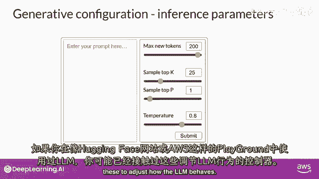

在本节课中，我们将学习如何通过调整推理时的配置参数，来影响大型语言模型的输出行为。这些参数不同于训练参数，它们是在模型使用时进行设置的，能帮助我们控制生成文本的长度、创意度和随机性。

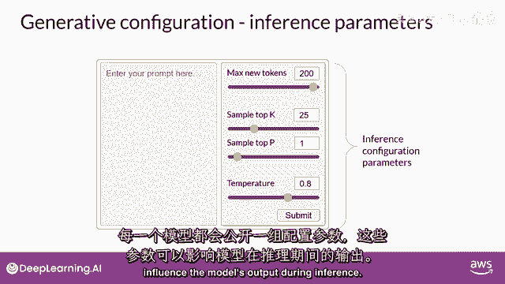

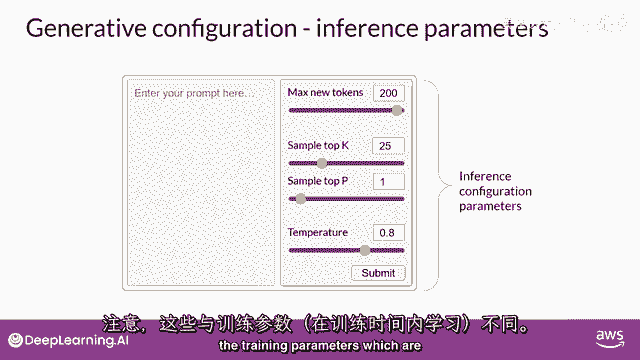

---

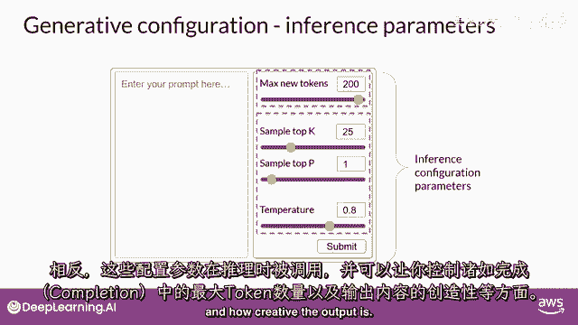

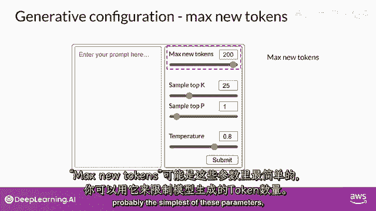

上一节我们介绍了提示工程，本节中我们来看看如何通过具体的配置参数来精细控制模型的生成过程。

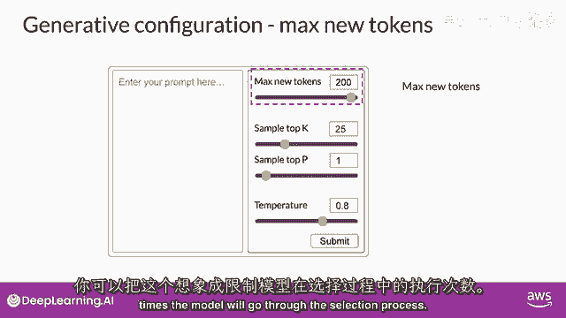

每个模型都提供了一组可以在推理时调整的配置参数。请注意，这些参数与训练时学习的参数不同，它们用于控制生成过程中的行为，例如完成的最大长度和输出的创意程度。

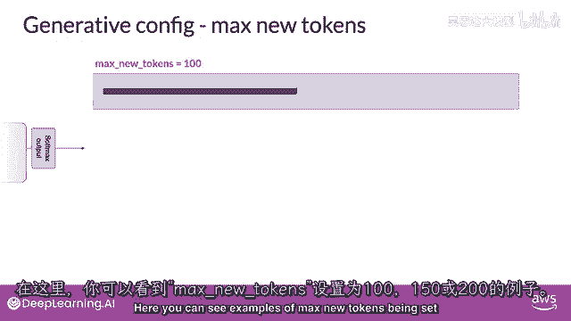

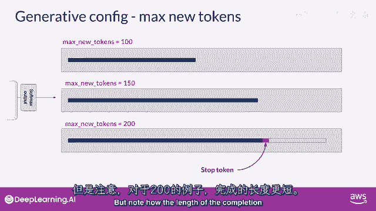

以下是几个关键的生成配置参数：

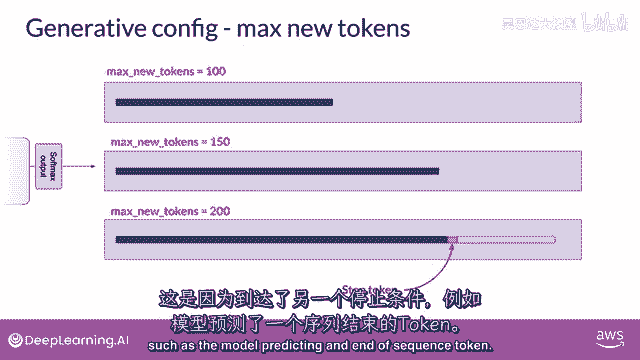

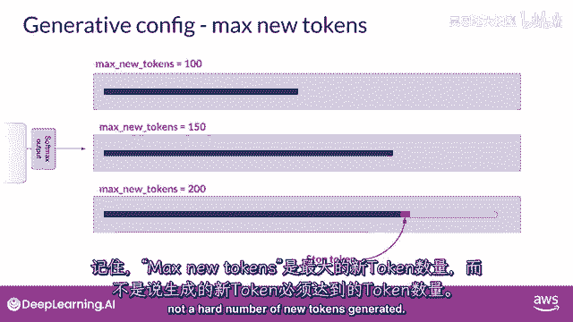

**最大新Token数** (`max_new_tokens`) 是最简单的参数之一。你可以用它来限制模型将生成的Token数量。这相当于设置了一个生成次数的上限。

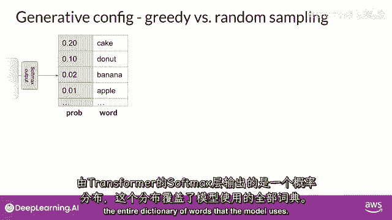

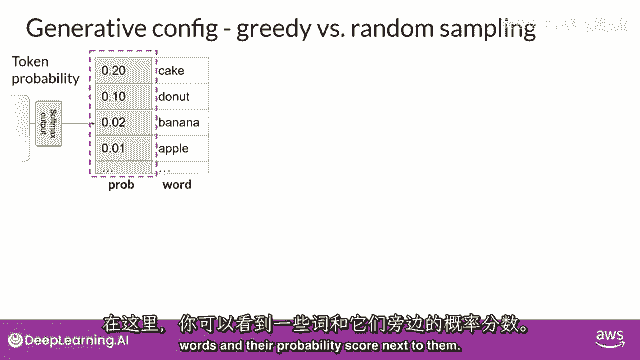

例如，你可以将 `max_new_tokens` 设置为100、150或200。但请注意，即使设置为200，生成的文本也可能更短，因为模型可能提前遇到了另一个停止条件，例如预测到了序列结束标记。记住，这是一个**最大**值，而非硬性规定必须生成的数量。

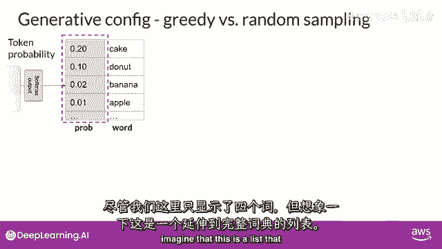

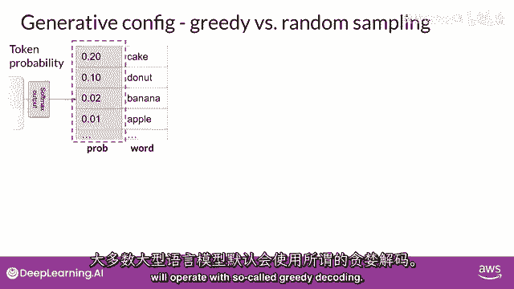

---

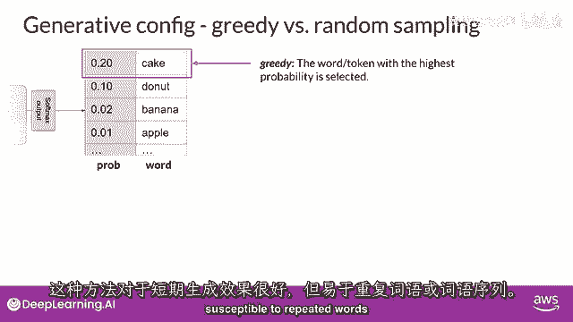

在了解了如何控制输出长度后，我们来看看如何影响模型对下一个词的选择。

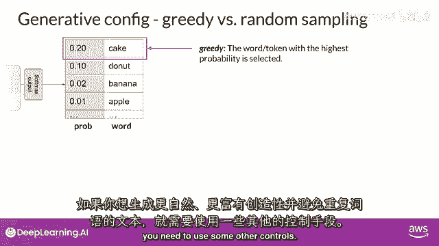

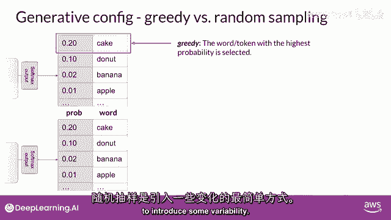

模型通过Softmax层输出一个覆盖整个词汇表的概率分布。大多数大型语言模型默认采用**贪婪解码**方式运行。这意味着模型在每一步都会选择概率最高的词。这种方法对于短文本生成有效，但容易导致词汇或词序的重复。

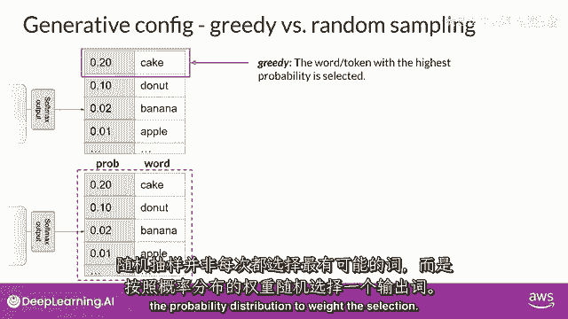

如果你想生成更自然、更具创意并能避免重复的文本，就需要引入一些随机性控制。

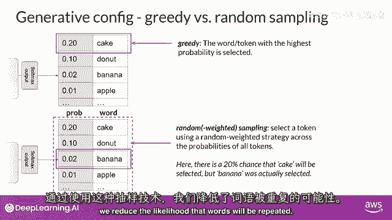

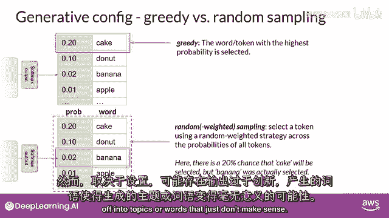

---

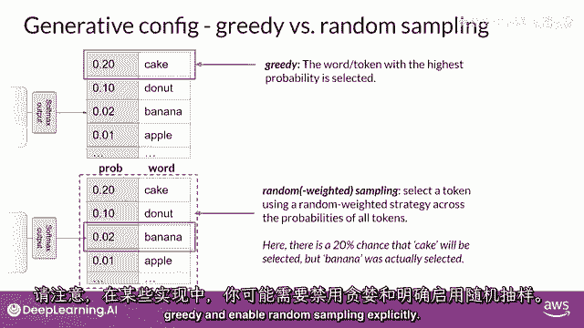

**随机采样** 是引入变化的最简单方法之一。使用随机采样时，模型不再总是选择概率最高的词，而是根据概率分布随机选择一个词。

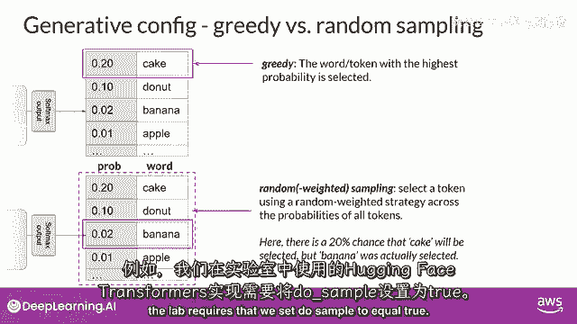

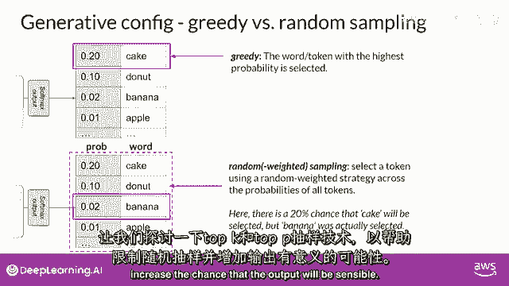

例如，如果“香蕉”一词的概率为0.02，那么随机采样时，它被选中的几率就是2%。这种技术可以减少词汇重复的可能性。

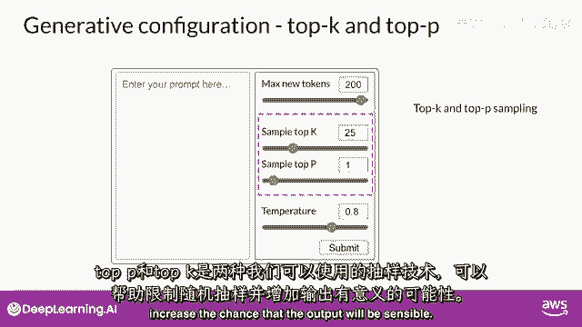

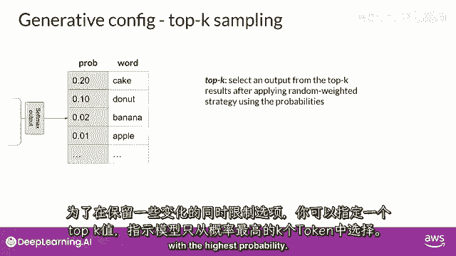

但是，如果设置不当，输出可能过于“创新”，导致生成偏离主题或无意义的词语。在某些实现中，你需要明确禁用贪婪解码并启用随机采样。例如，在Hugging Face Transformers库中，需要设置 `do_sample=True`。

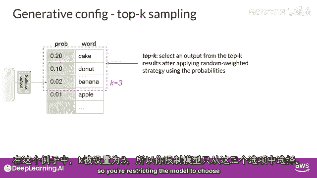

---

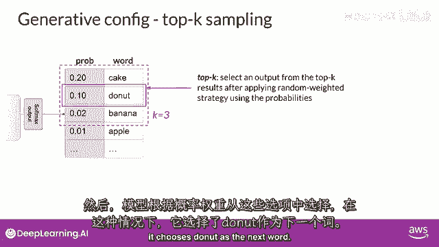

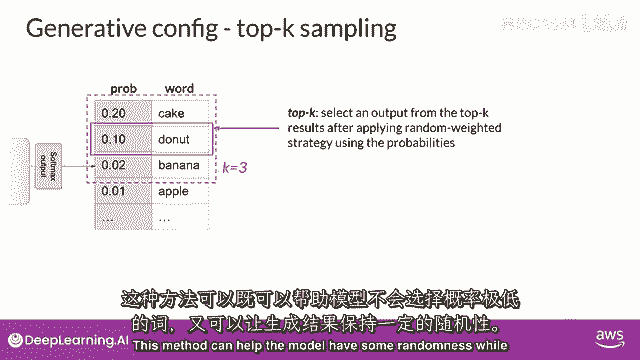

为了在引入随机性的同时保证输出的可理解性，我们可以使用以下两种采样技术。

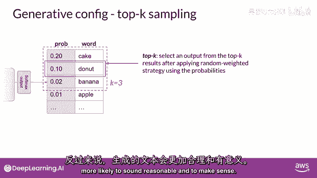

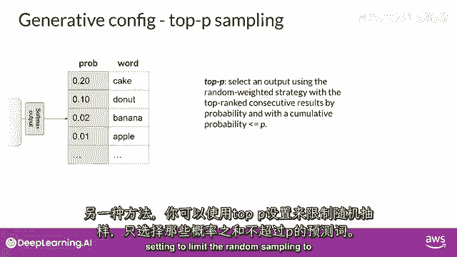

**Top-k采样** 和 **Top-p采样** 是两种帮助我们限制随机采样范围、增加输出合理性的技术。

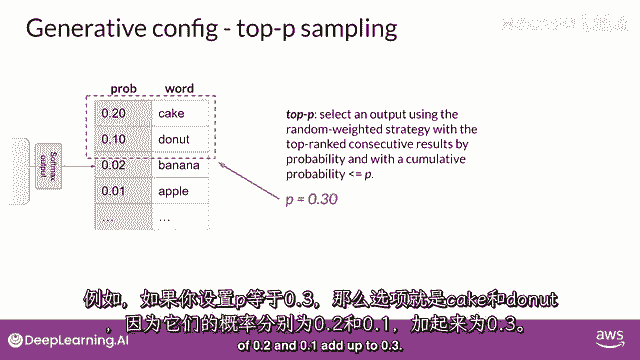

**Top-k采样** 指定模型仅从概率最高的k个标记中进行选择。例如，设置 `k=3`，模型就只从概率前三的选项中选择，并使用概率加权进行随机挑选。这种方法在保留随机性的同时，防止模型选择可能性极低的词。

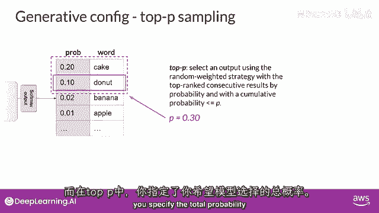

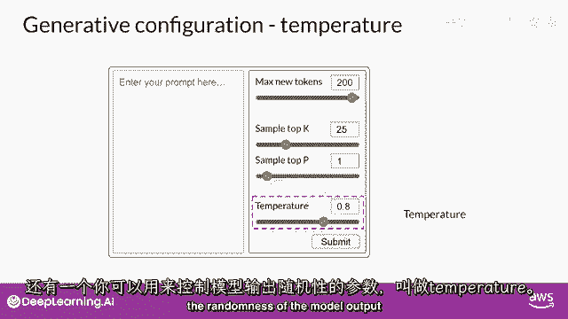

**Top-p采样**（又称核采样）则指定一个概率累计阈值p。模型会从概率最高的标记开始累加，直到总概率超过p，然后仅从这个集合中随机选择。例如，设置 `p=0.3`，模型会选取概率和刚好超过0.3的最小标记集合。

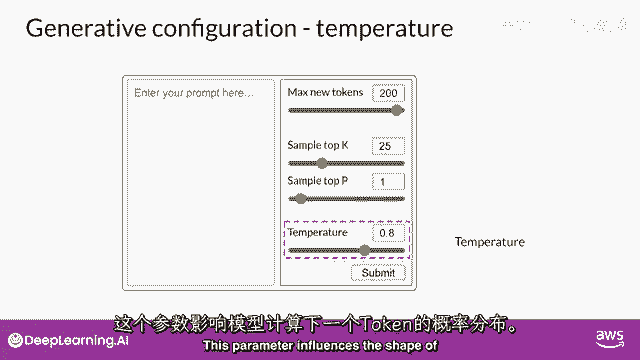

与Top-k指定数量不同，Top-p指定的是概率总和。

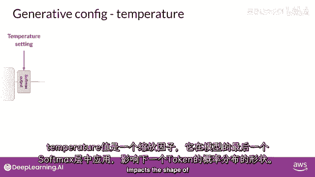

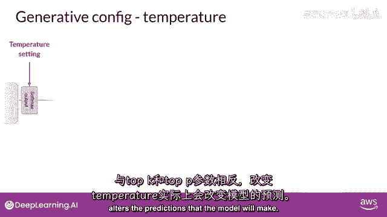

---

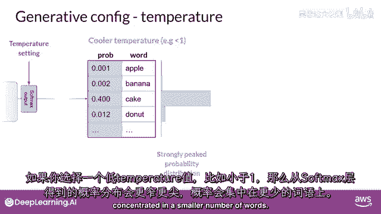

除了采样方法，另一个关键参数是**温度** (`temperature`)，它直接影响模型计算下一个标记的概率分布。

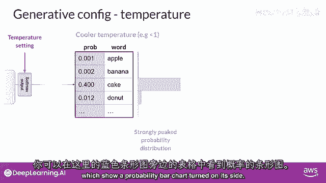

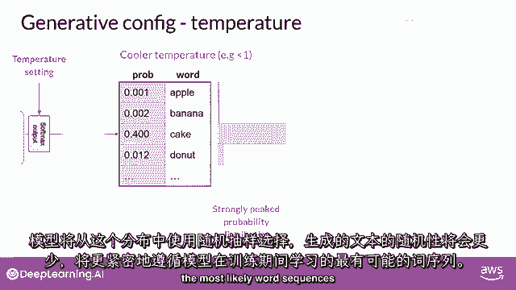

温度参数是一个在最终Softmax层应用的缩放因子。总的来说：
*   **温度越高**（>1），概率分布越平缓，随机性越高，输出更具创意和变异性。
*   **温度越低**（<1），概率分布越尖锐，概率集中在少数词上，随机性越低，输出更确定、更保守。
*   **温度等于1**，则使用模型原始的、未改变的Softmax概率分布。

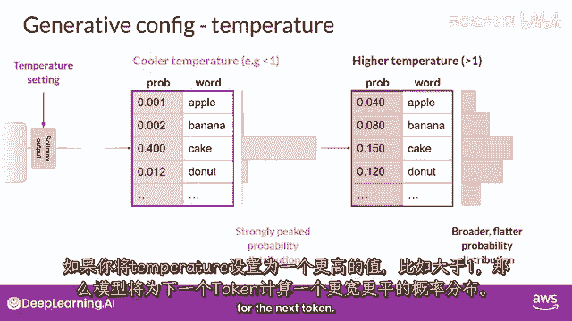

通过调整温度，你可以从根本上改变模型做出的预测，从而控制生成文本的风格。

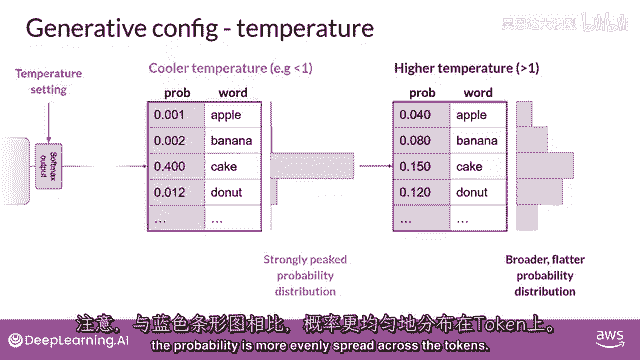

---

本节课中我们一起学习了影响LLM生成行为的核心配置参数。我们了解了如何通过 `max_new_tokens` 控制输出长度，通过启用随机采样（`do_sample=True`）来避免重复，并深入探讨了 **Top-k**、**Top-p** 和 **温度** 参数如何精细地平衡输出的确定性与随机性。掌握这些配置，是构建可控、可靠生成式AI应用的重要一步。在接下来的课程中，我们将基于这些知识进行实践。