# 073：生成式AI项目的生命周期 🚀

在本节课中，我们将学习开发和部署基于大语言模型应用的整体框架——生成式AI项目的生命周期。这个框架将引导你从项目构思到最终发布，帮助你理解关键决策点、潜在挑战以及所需的基础设施。

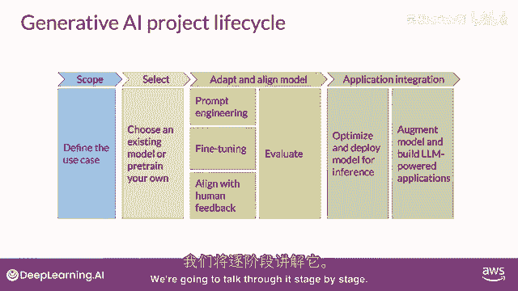

## 概述

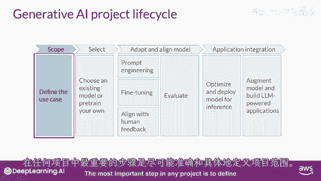

任何项目最重要的一步是定义范围。你需要尽可能准确和具体地界定项目目标。正如你在课程中所见，大语言模型有能力执行多种任务，但其能力强烈依赖于模型的**大小**和**架构**。因此，你必须仔细考虑LLM在你特定应用中的功能需求。

## 第一步：确定模型需求

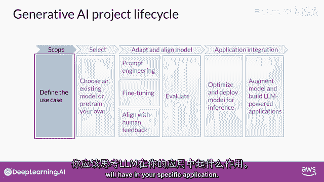

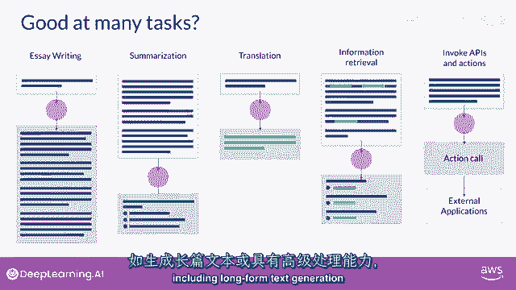

在开始开发前，你需要明确模型的具体需求。以下是需要考虑的关键点：

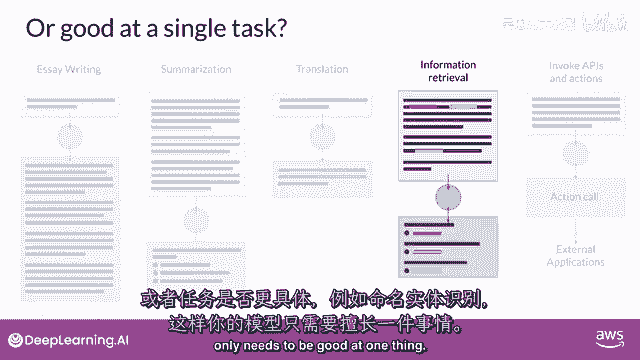

*   你的应用是否需要模型执行多种不同任务，包括**长文本生成**？
*   或者，任务是否更加具体，例如**命名实体识别**，因此模型只需要在某一件事情上表现出色？

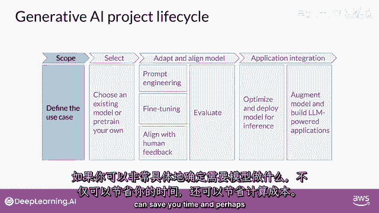

正如你将在课程后续部分看到的，对模型需要完成的任务定义得越具体，就越能节省你的时间，更重要的是，能更有效地控制成本。

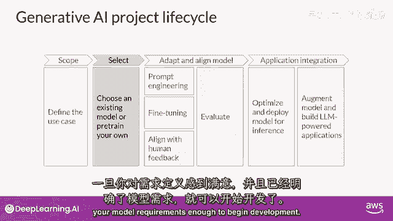

## 第二步：选择开发起点

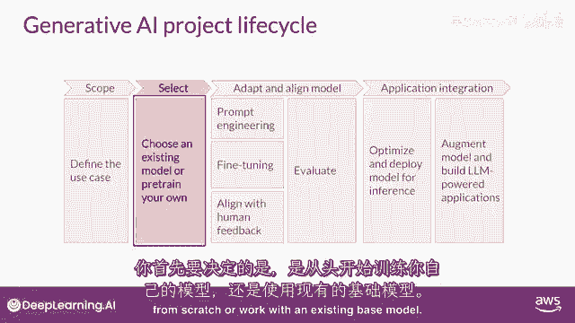

在你满意成本估算并明确定义模型需求后，便可以开始开发。你的第一个关键决策是：**从头训练一个模型**，还是基于**现有的基础模型**进行开发。

在大多数情况下，你会从一个现有模型开始。尽管存在一些需要从零开始训练模型的情况，但你将在本周晚些时候学习如何做出这个决定，并获得一些经验法则，以评估自行训练模型的可行性。

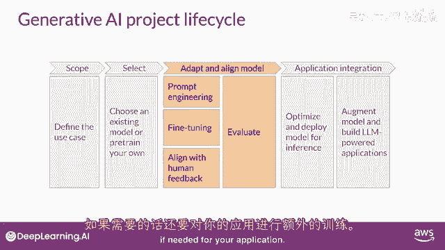

## 第三步：评估与模型适应

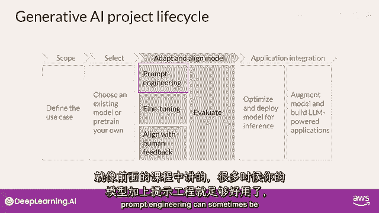

下一步是评估所选模型的性能，并根据需要进行额外的训练以适应你的应用程序。正如本周早些时候所学，**提示工程**有时足以让模型表现良好。

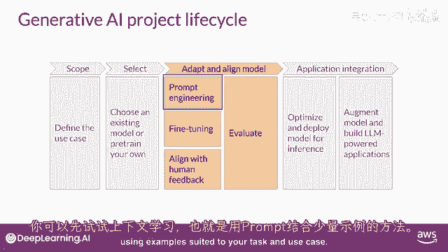

因此，你可能会首先尝试在特定上下文中，使用适合你任务和用例的示例进行**上下文学习**。

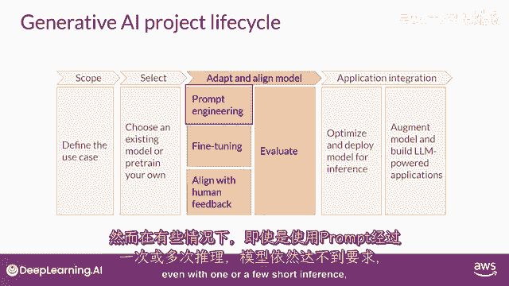

然而，仍然存在一些情况，即使经过一次或多次提示尝试，模型的表现仍无法达到你的要求。在这种情况下，你可以尝试**微调**你的模型。这个监督学习过程将在第二周详细讲解。

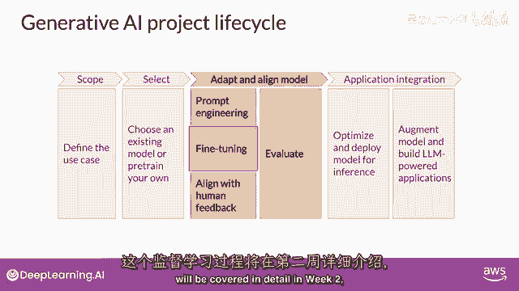

在第二周，你将有机会亲自尝试微调一个模型。

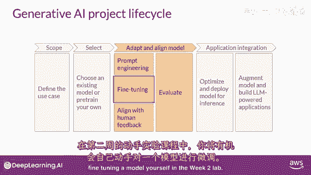

## 第四步：模型对齐与评估

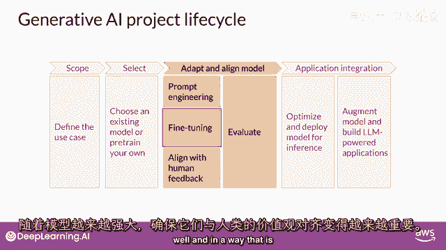

随着模型能力的增强，确保其行为符合人类偏好变得日益重要。在第三周，你将学习一种额外的微调技术，称为**基于人类反馈的强化学习**，这有助于确保你的模型表现良好。

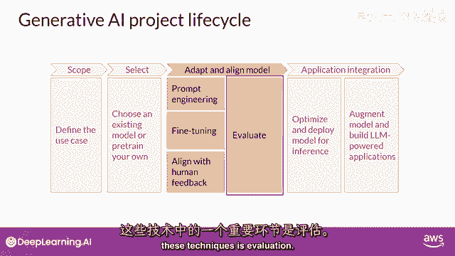

所有这些技术的一个重要方面是**评估**。下周，你将探索一些可用于衡量模型性能或其与人类偏好吻合程度的指标和基准。

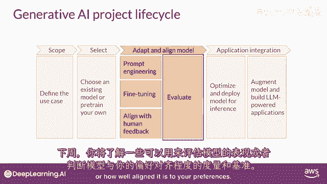

请注意，应用开发的“适应”和“对齐”阶段可能是高度迭代的。你可能从尝试提示工程并评估输出开始，然后使用微调来提高性能，接着再次回顾和优化提示工程，以确保获得所需的性能。

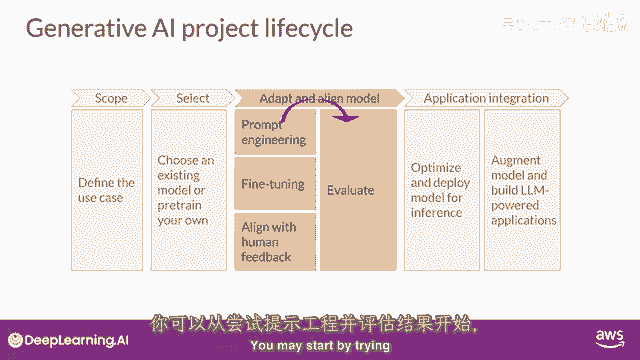

## 第五步：部署与优化

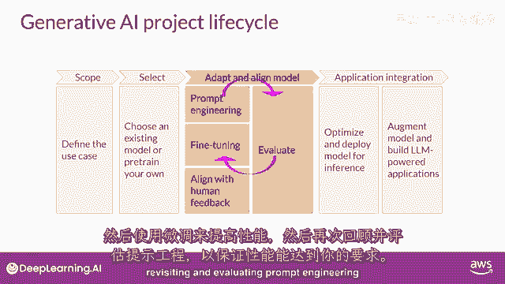

最后，当你拥有一个满足性能需求且与目标高度一致的模型时，可以将其部署到基础设施中并集成到你的应用程序里。在这个阶段，**优化模型以备部署**是一个重要步骤。

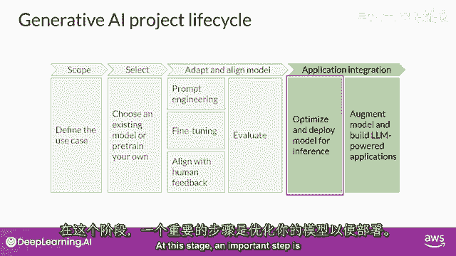

这可以确保你最大限度地利用计算资源，并为应用程序用户提供最佳的体验。

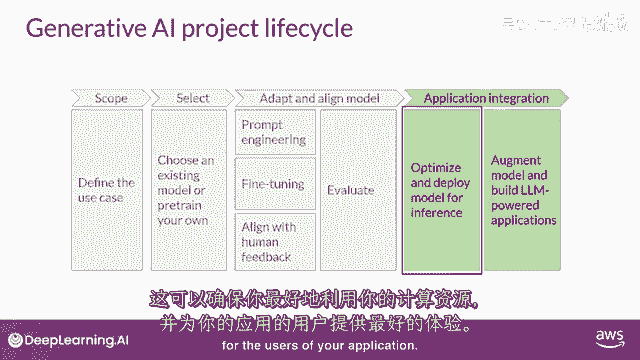

## 第六步：考虑额外基础设施

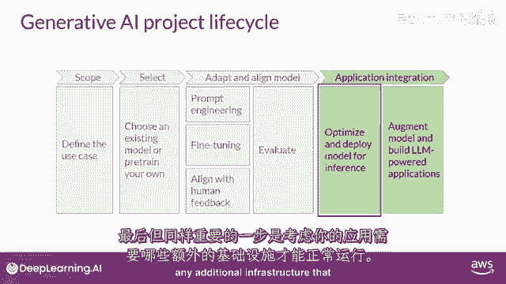

最后一个但非常重要的步骤，是考虑你的应用程序可能需要的任何额外基础设施，以确保其正常工作。

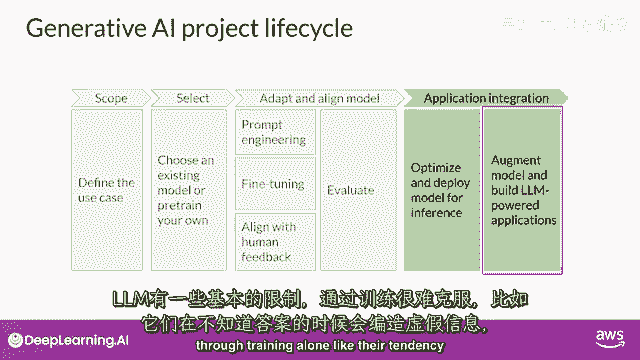

大语言模型存在一些基本限制，仅通过训练难以克服。例如，它们倾向于在不知道答案时**编造信息**，或者进行复杂推理和数学计算的能力有限。在本课程的最后部分，你将学习一些强大的技术来克服这些限制。

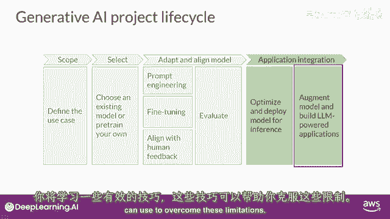

## 总结

本节课中，我们一起学习了生成式AI项目从概念到部署的完整生命周期。我们探讨了如何定义项目范围、选择开发起点、通过提示工程和微调来适应模型、确保模型与人类价值观对齐、进行评估，以及最终部署和优化模型。这个框架将贯穿整个课程，帮助你系统地构建基于大语言模型的应用。