# 075：使用指令对LLM进行微调2——指令微调 📝

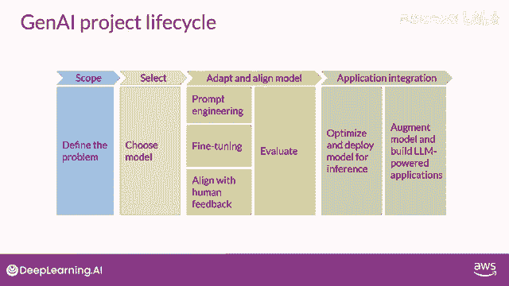

在本节课中，我们将要学习如何通过**指令微调**来改进大型语言模型在特定任务上的性能。我们将探讨指令微调的概念、具体步骤以及如何准备训练数据。

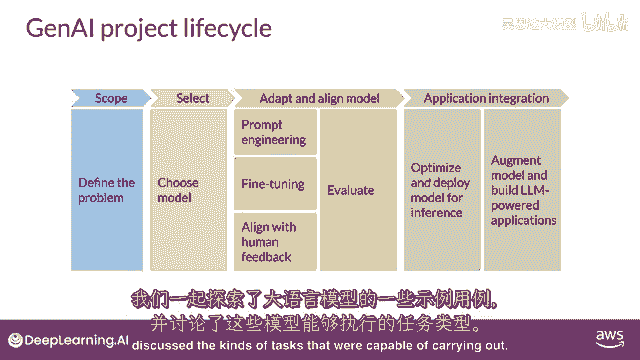

上周，我们介绍了生成式人工智能项目生命周期的概念，探索了大语言模型的示例用例，并讨论了能够在此任务中执行的类型。

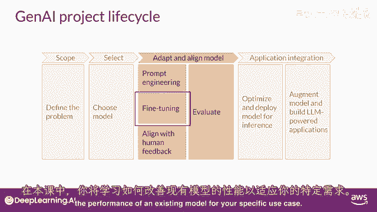

本节中，我们将学习可以改进现有模型性能的方法，针对你的特定用例。

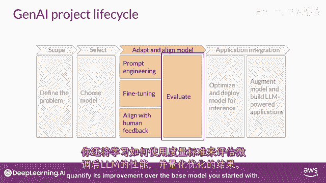

我们也将学习可以用于评估你微调LLM性能的重要指标，并量化其相对于你开始时的基础模型的改进。让我们从讨论如何使用指令提示来微调LLM开始。

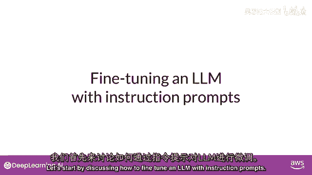

## 指令微调的概念 🔍

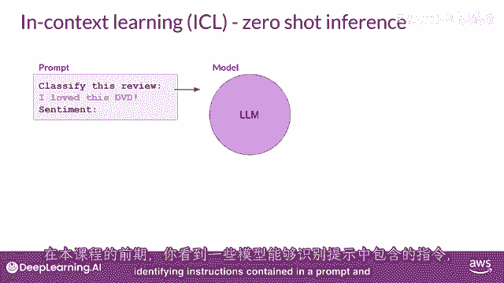

在本课程早期，我们看到一些模型能够识别提示中的指令，并正确执行零-shot推理。

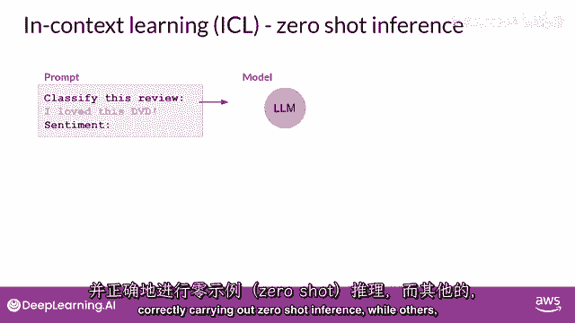

而其他如较小的LLM，可能无法执行任务。

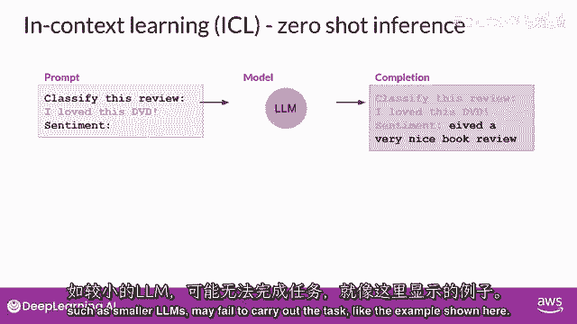

如这里所示的示例，我们也看到了包括一个或多个你想要模型执行的示例，被称为一-shot或少数示例推理，可以帮助模型识别任务并生成良好的完成。

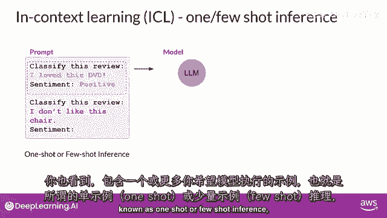

然而，这一战略有一些缺点。首先，对于较小的模型，它并不总是有效，即使包括五个或六个示例。其次，你在提示中包含的任何示例，都会占用上下文中宝贵的空间，减少你包括其他有用信息的空间。

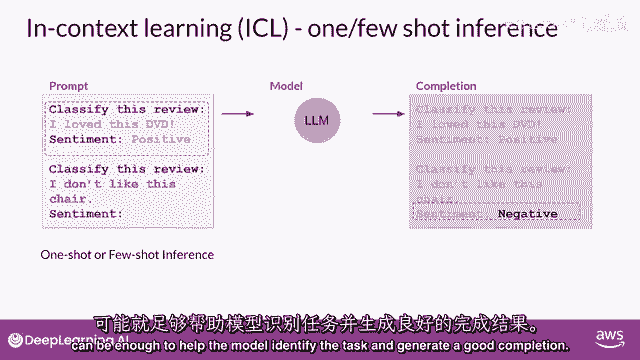

幸运的是，另一个解决方案存在。你可以利用被称为微调的过程来进一步训练基础模型。与预训练不同，在那里你使用大量的无结构文本数据来训练LLM，微调是一个监督学习过程。

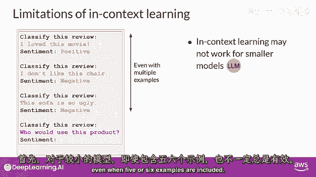

其中你使用标记的示例来更新LLM的权重。标记的示例是**提示-完成对**。

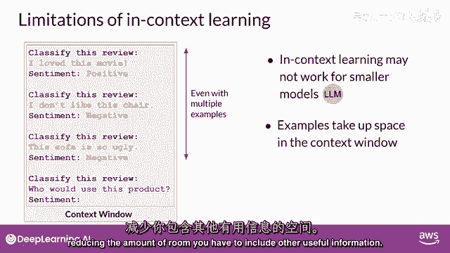

微调过程扩展了模型的训练，以提高其对特定任务的生成良好完成的能力。

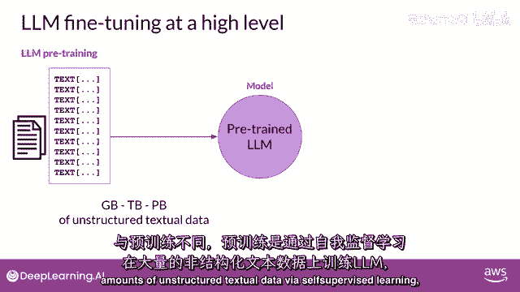

一种被称为**指令微调**的策略，特别擅长提高模型的在各种任务中的性能。让我们更详细地看看这个是如何工作的。

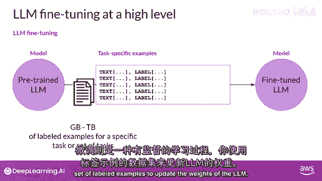

## 指令微调的工作原理 ⚙️

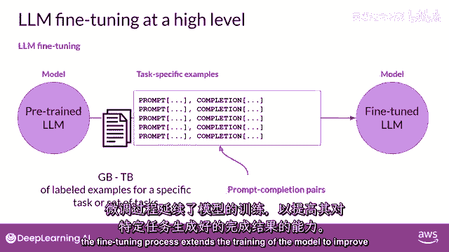

指令微调训练模型使用演示如何响应特定指令的示例。以下是几个演示这个想法的示例提示。

在两个示例中，指令都是“分类这个评论”，并期望的完成是一段以“情感”开始的文本字符串，跟随“积极”或“消极”。

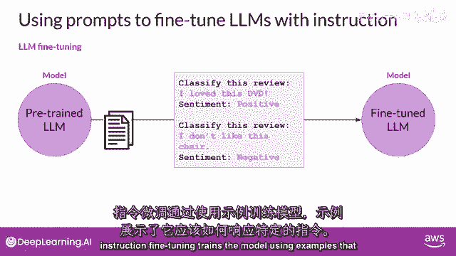

你用于训练的数据集包括许多**提示-完成对**，对于你感兴趣的任务，每个对都包括一个指令。

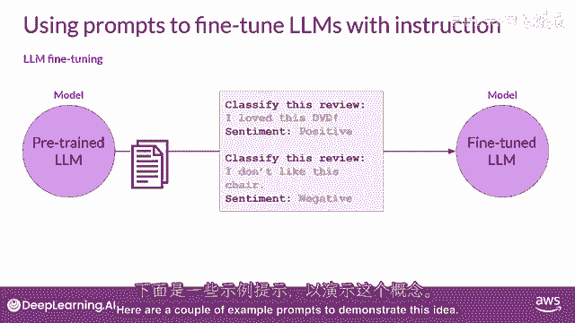

例如，如果你想提高模型的摘要能力，你构建一个数据集，其中包含以指令开始的示例，如“总结以下文本”或类似的短语。如果你正在提高模型的翻译技能，你的例子将包括像“翻译这个句子”这样的指令。这些提示完成示例允许模型学习生成遵循给定指令的响应。

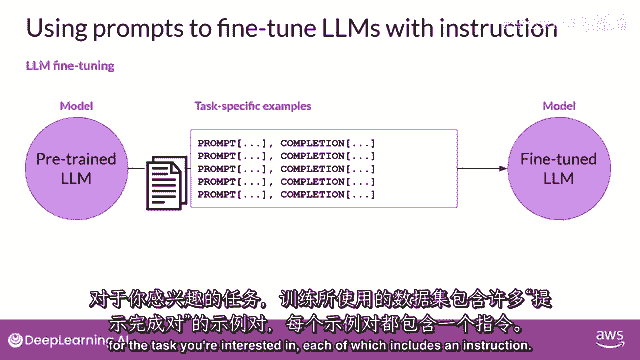

所有模型权重都被更新的指令微调，被称为**全面微调**。

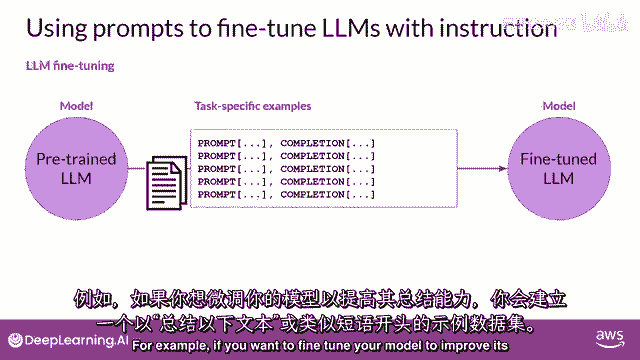

这个过程产生了一个带有更新权重的新模型版本。

需要注意的是，就像预训练一样，全面微调需要足够的内存和计算预算来存储和处理所有有梯度的数据，在训练过程中被更新的优化器和其他组件。

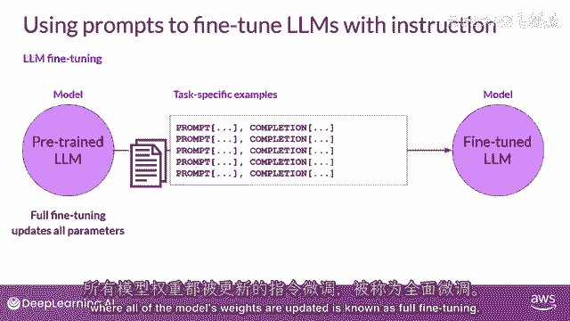

所以你可以受益于上周学到的记忆优化和并行计算策略。

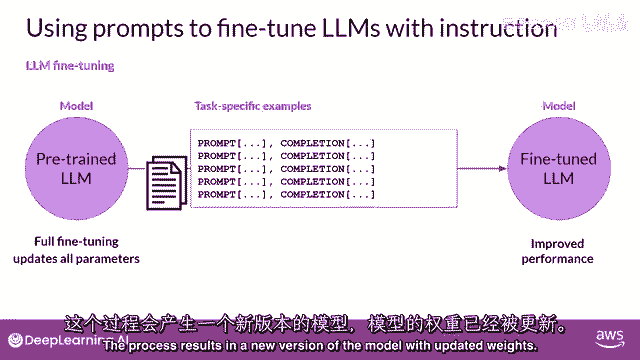

## 如何进行指令微调 📋

那么，你实际上如何进行指令微调LLM？第一步是准备你的训练数据。

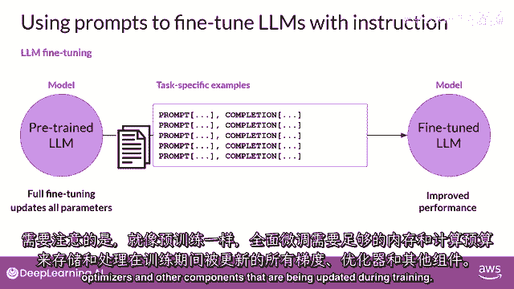

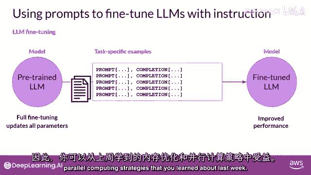

有许多公开可用的数据集，已经被用于训练早期的语言模型，尽管大多数它们不是格式化为指令的。幸运的是，开发者已经汇编了提示模板库。

可以用于使用现有数据集，例如，亚马逊产品评论的大型数据集，并将其转换为微调指令提示数据集。提示模板库包括许多适用于不同任务和不同数据集的模板。

以下是设计用于与亚马逊评论数据集合作的三个提示，并且可以用于分类模型的微调、文本生成以及文本摘要任务。

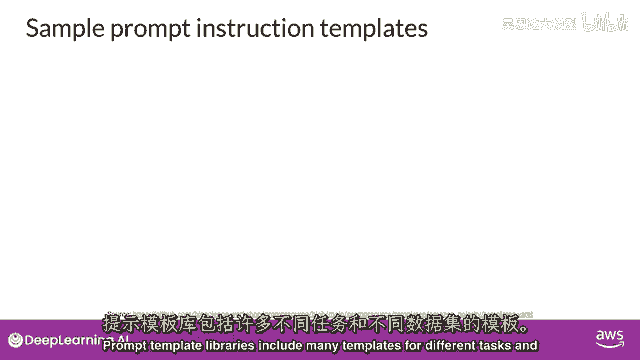

你可以看到在每个情况下，你都将原始评论传递到这里，称为“评论主体”到模板中，它被插入到以指令开始的文本中，类似于“预测相关的评分”、“生成五星级评价”或者“描述以下产品评论的一句话”。

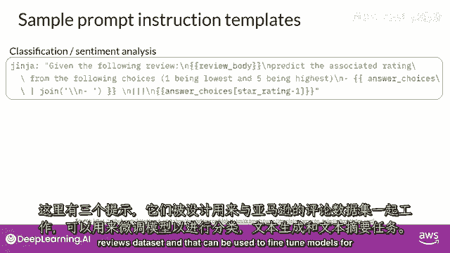

结果是一个现在包含指令和数据集示例的提示。

## 微调的训练与评估流程 📊

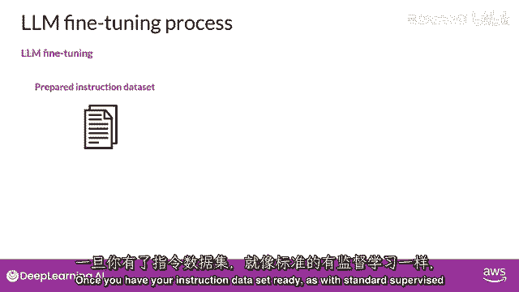

一旦你有你的指令数据集准备就绪，与标准监督学习类似，在微调期间，你将数据集分为训练、验证和测试分割。

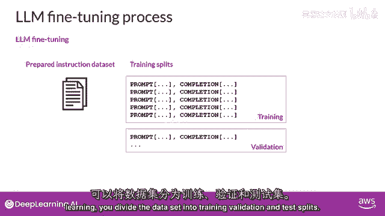

你从你的训练数据集中选择提示并将其传递给LLM。

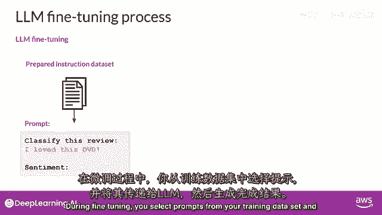

然后它生成完成。

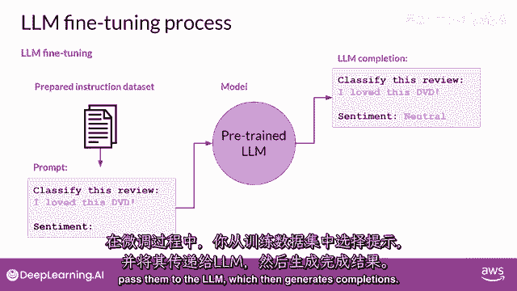

接下来，你将LLM完成与训练数据中指定的响应进行比较。

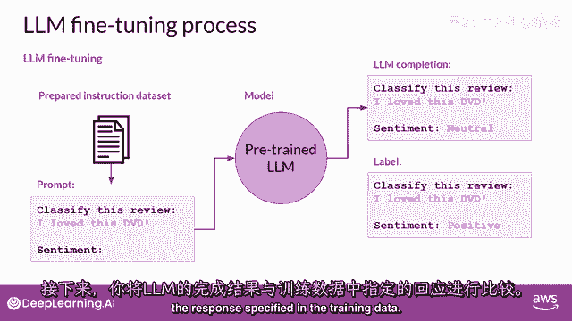

在这里，你可以看到模型做得并不好，它将评论分类为“中性”，这有些低估，评论明显非常积极。

记住，LLM的输出是一个标记在标记上的概率分布。所以，你可以比较完成和训练标签分布的分布，并使用标准交叉熵函数来计算两个标记分布之间的损失。

然后，使用计算出的损失来更新您模型的权重。在标准反向传播中，你将这样做许多为提示完成对匹配的批次，并且在多个时代中，更新权重，以便模型的任务性能提高。

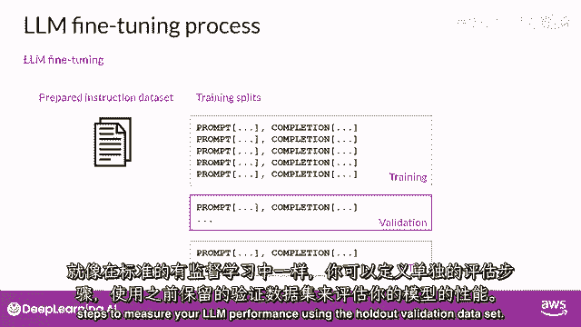

就像标准的监督学习一样，你可以定义单独的评估步骤来使用保留验证数据集测量你的LLM性能。

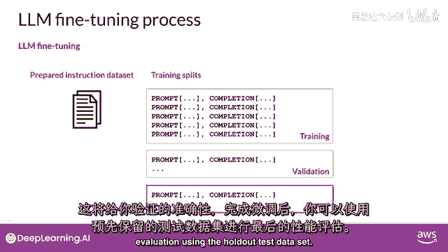

这将给你验证准确率。在你完成微调后，你可以使用保留测试数据集进行最终性能评估。

这将给你测试准确率。

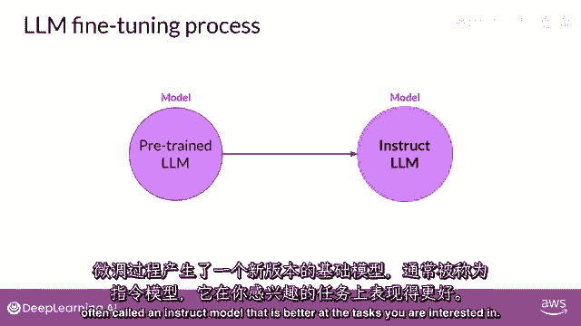

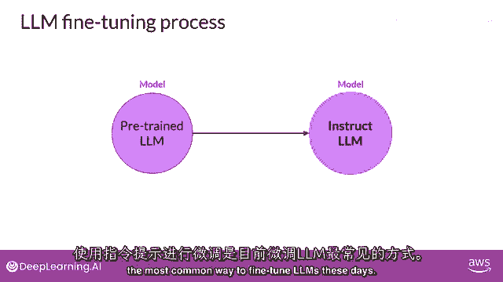

## 总结 🎯

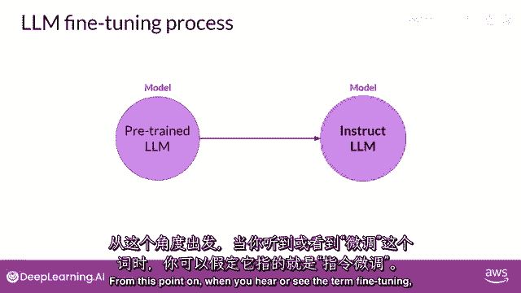

本节课中我们一起学习了**指令微调**。微调过程产生了基础模型的新版本，通常被称为**指令模型**，它在您感兴趣的任务上表现更好。使用指令提示进行微调是当今微调LLMs最常见的方式。

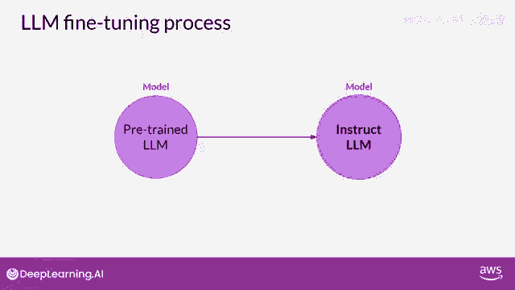

从此以后，当你听到或看到“微调”这个词时，通常指的就是这种通过指令数据集来训练模型的方法。