# 076：使用指令对LLM进行微调3——对单一任务进行微调 📝

在本节课中，我们将要学习如何针对单一任务对大型语言模型进行微调。我们将探讨其优势、所需的数据量，以及一个关键的潜在风险——灾难性遗忘，并简要介绍避免此问题的几种策略。

## 概述

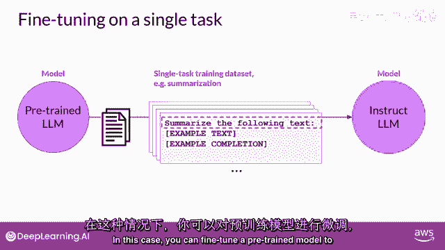

虽然大型语言模型以能够执行多种不同语言任务而闻名，但您的应用程序可能只需要专注于完成一个特定任务。在这种情况下，您可以对预训练模型进行微调，以提升其在该任务上的性能。

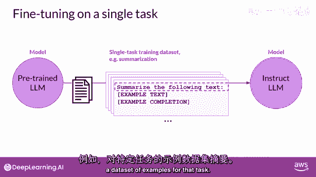

## 单一任务微调的优势

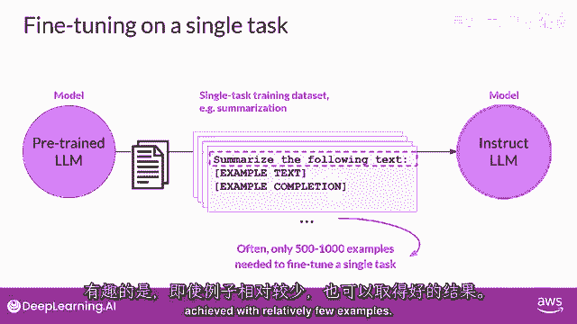

上一节我们介绍了微调的基本概念，本节中我们来看看针对单一任务进行微调的具体情况。

例如，如果您希望模型专门进行文本摘要，可以使用该任务的示例数据集对模型进行微调。

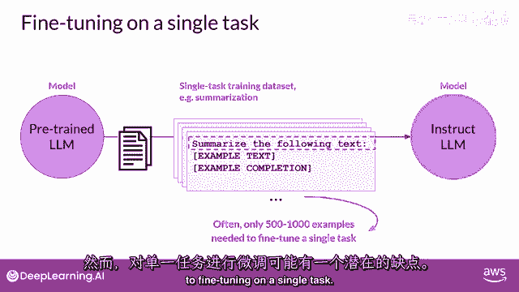

有趣的是，针对单一任务进行微调，通常只需要相对较少的示例就能获得良好的结果。

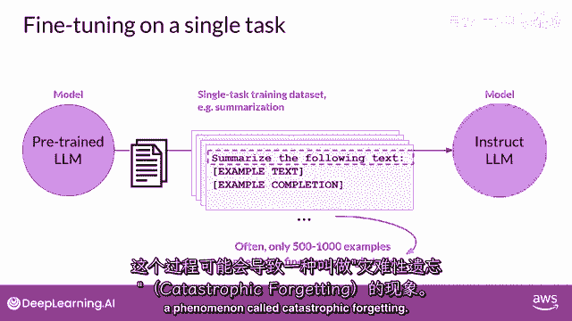

通常，**500到1000个示例**就足以带来显著的性能提升。

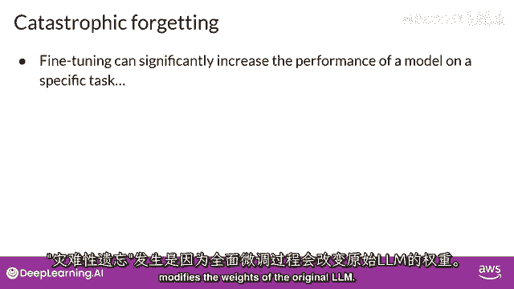

这与模型在预训练阶段所接触的**数十亿个文本片段**形成了鲜明对比，突显了微调的高效性。

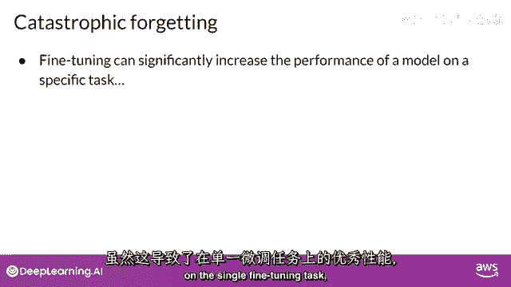

## 潜在风险：灾难性遗忘

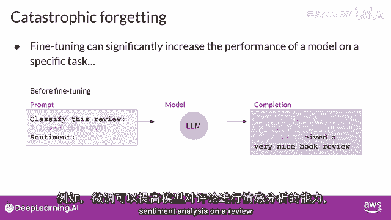

然而，针对单一任务进行微调也存在一个潜在的缺点。

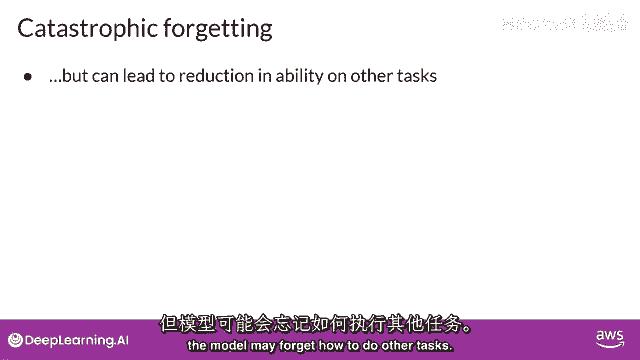

这个过程可能会导致一种称为“灾难性遗忘”的现象。

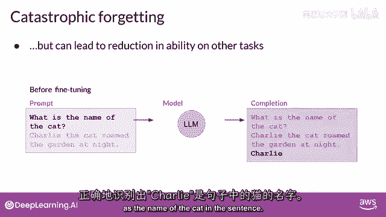

灾难性遗忘之所以发生，是因为完整的微调过程会修改原始LLM的权重。

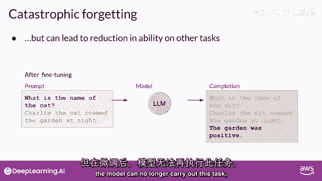

虽然这能极大地提高模型在单一微调任务上的性能，但它可能会降低模型在其他任务上的表现。

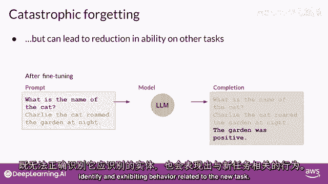

例如，微调可能提升了模型进行评论情感分析的能力，并产生高质量的完成结果。

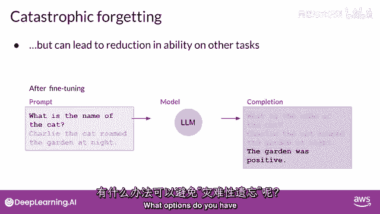

但模型可能会忘记如何执行其他任务。一个在微调前知道如何进行命名实体识别的模型，能够正确识别句子中的“查理”是猫的名字。

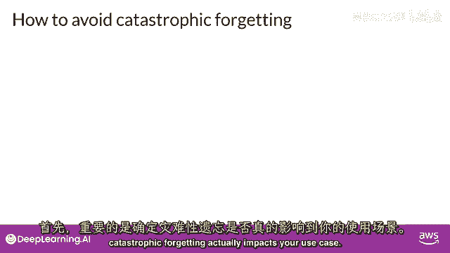

但在微调后，模型可能无法再执行这项任务，混淆了应该识别的实体，并表现出与新任务相关的行为。

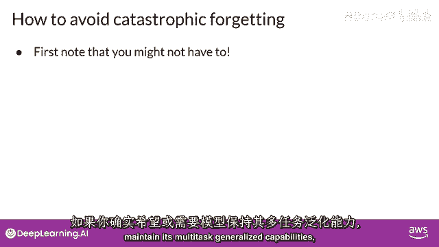

## 如何避免灾难性遗忘

那么，有哪些选项可以避免灾难性遗忘呢？

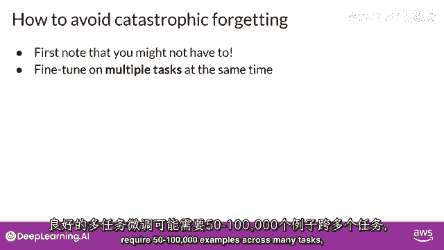

以下是几种主要的应对策略：

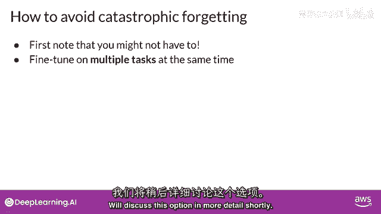

首先，需要评估灾难性遗忘是否会影响您的使用案例。如果您只需要模型在您微调的单个任务上保持可靠性能，那么模型无法泛化到其他任务可能就不是问题。

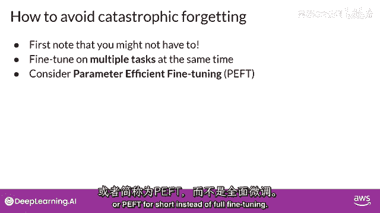

如果您希望或需要模型保持其多任务泛化能力，您可以考虑一次对多个任务进行微调。好的多任务微调可能需要**50万到100万个**横跨许多任务的示例，并且需要更多的数据和计算资源来训练。我们将在后续课程中详细讨论这个选项。

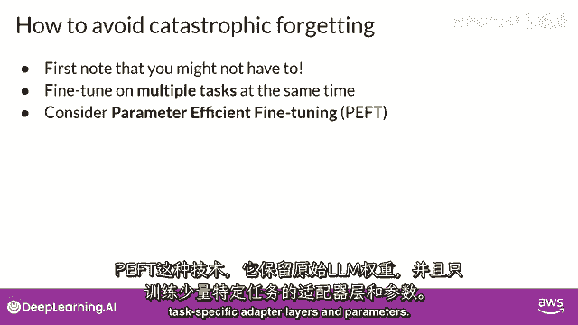

另一个选项是进行**参数高效的微调**，简称 **PEFT**。与完整的微调不同，PEFT 是一种保留原始LLM权重、只训练少量任务特定适配层和参数的技术。PEFT 对灾难性遗忘的抵抗力更强，因为大部分预训练的权重都被保留了下来。PEFT 是一个令人兴奋且活跃的研究领域，我们将在本周晚些时候进行覆盖。

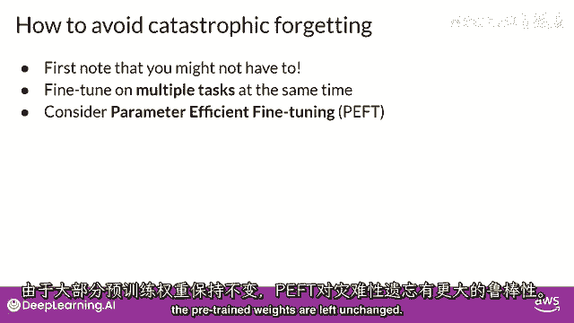

## 总结

本节课中，我们一起学习了针对单一任务对LLM进行微调的方法。我们了解到，虽然只需少量数据即可显著提升特定任务性能，但需警惕“灾难性遗忘”的风险。为此，我们探讨了评估需求、多任务微调以及参数高效微调等应对策略。接下来，让我们继续下一个视频，更深入地了解多任务微调。