# 077：使用指令对LLM进行微调4——多任务指令微调 🎯

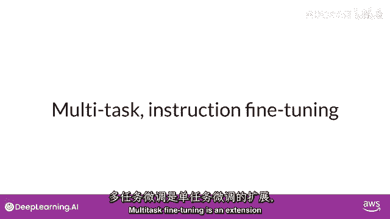

在本节课中，我们将要学习**多任务指令微调**。这是单任务微调的扩展，旨在让一个模型同时擅长处理多种不同的任务。我们将了解其原理、优势、挑战，并通过一个具体的模型家族（Flan）来加深理解。

## 概述

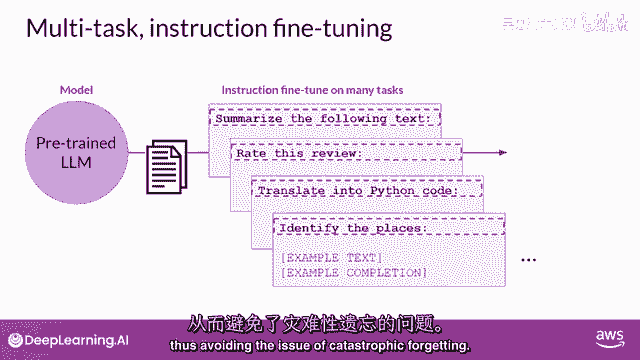

上一节我们介绍了单任务指令微调，本节中我们来看看如何将微调扩展到多个任务上。多任务微调的核心思想是，在一个包含多种任务示例的混合数据集上训练模型，使其能够同时提升在所有任务上的性能。

## 多任务微调的原理

多任务微调是单任务微调的扩展。其训练数据集包含多个任务的示例输入和输出。数据集包含指示模型执行各种任务的示例，这些任务可能包括：
*   摘要
*   评论
*   评分
*   代码翻译
*   实体识别

你在混合数据集上训练模型，以便同时提高模型在所有任务上的性能。这种方法有助于避免模型在多个训练周期中出现“灾难性遗忘”问题。

在训练过程中，示例的损失值被用于更新模型的权重，最终生成一个经过适应性调优的模型，这个模型学会了同时擅长多种任务。

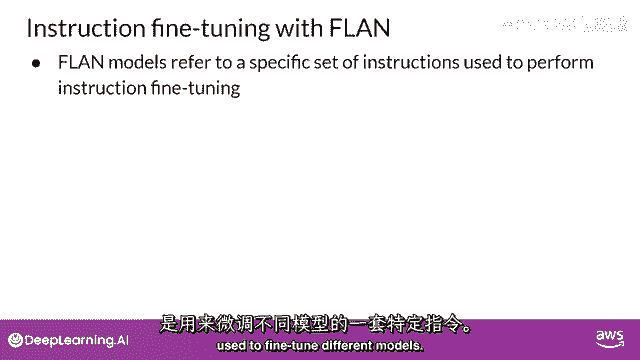

## 多任务微调的优缺点

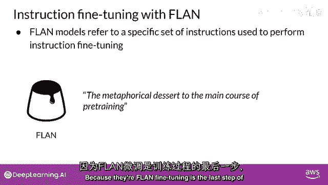

多任务微调的一个主要缺点是**需要大量数据**。训练集可能需要多达5万至10万个示例。但收集这些数据通常非常值得，因为生成的模型通常非常强大，尤其适用于需要模型在多项任务上都表现良好的应用场景。

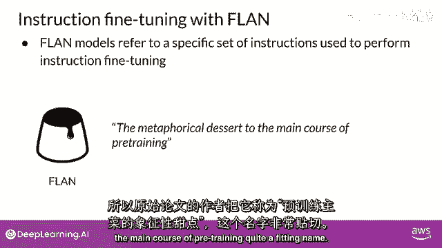

## Flan模型家族示例

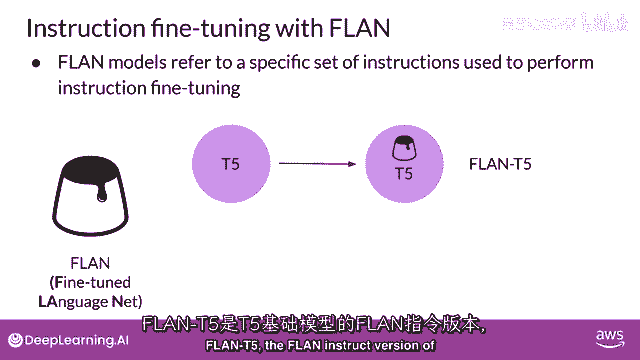

让我们看看一个使用多任务指令训练的模型家族。基于微调期间使用的数据集和任务，指令调优模型会产生不同的变体。微调数据集和任务决定了指令调优模型的具体形态。

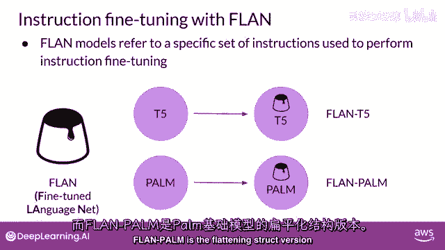

一个著名的例子是 **Flan 模型家族**。Flan（意为“微调语言网络”）是一组用于在不同基础模型上进行指令微调的特定指令集。

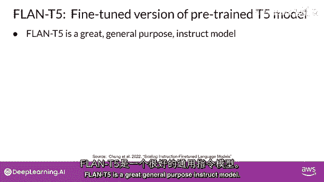

因为Flan微调通常是整个模型训练过程的最后一步，原始论文的作者将其比喻为“预训练主菜后的甜点”，这是一个相当贴切的称呼。

以下是Flan家族的一些具体模型：
*   **Flan-T5**：是Flan指令版的T5基础模型。
*   **Flan-PaLM**：是Flan指令版的PaLM基础模型。

你明白了这个模式。**Flan-T5** 是一个通用的指令模型，它已在473个数据集上进行了微调，涵盖了146个任务类别。这些数据集选自其他模型和论文。

## Flan-T5的微调数据示例

无需阅读所有细节，但如果你感兴趣，可以在课后查阅原文。这里以Flan用于摘要任务的一个数据集为例进行说明。

T5模型使用了“Samsung”数据集，它属于“Muffin”任务集，用于训练语言模型总结对话。Samsung数据集包含1.6万条类似聊天的对话和对应的摘要。

示例显示在左侧为对话，右侧为摘要。这些对话和摘要由语言学家精心制作，专为生成高质量的训练数据集而设计。语言学家被要求创建类似于他们日常写作的对话，并反映真实生活中聊天话题的比例。随后，其他语言专家为这些对话创建了简短的摘要，其中包含对话中的重要信息和人名。

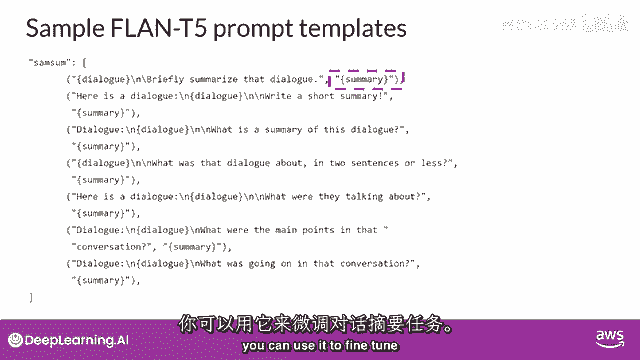

这是为Samsung对话摘要数据集设计的提示模板。模板实际上由几个不同的指令变体组成，它们基本上都要求模型做同一件事：总结对话。

例如：
*   “简要总结该对话。”
*   “这个对话的总结是什么？”
*   “那场对话中发生了什么？”

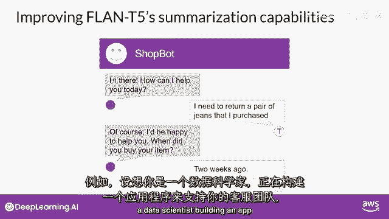

用不同的方式表达相同的指令有助于模型更好地泛化和表现。在每个案例中，将Samsung数据集的对话插入到模板的“对话”字段出现处，而“摘要”则用作训练标签。将此模板应用于Samsung数据集中的每一行，得到的组合数据就可用于微调模型的对话摘要任务。

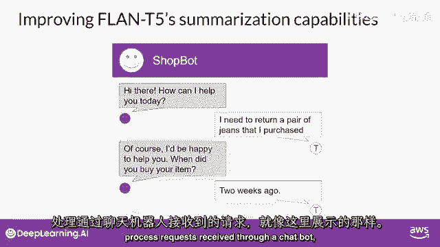

## 特定领域的进一步微调

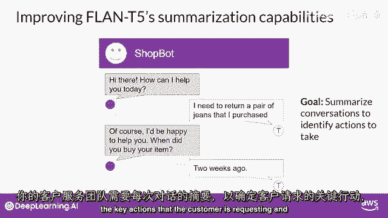

尽管Flan-T5作为通用模型表现良好，但在特定任务上仍有改进空间。例如，设想你是一位为客服团队构建应用程序的数据科学家。

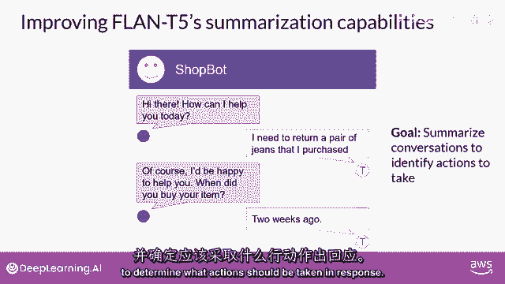

客服团队通过聊天机器人接收客户请求。他们需要每段对话的总结，以识别客户请求中的关键行动，并确定客服人员应采取的行动。

Samsung数据集赋予了Flan-T5总结对话的能力。然而，该数据集中的示例多为朋友间的日常对话，与客服聊天机器人的语言结构重叠不多。因此，你可以使用更接近客服场景的对话数据集对Flan-T5模型进行额外的微调。

本周的实验室将探索这个场景：使用一个专门的对话摘要数据集来提升Flan-T5的总结能力。该数据集包含1.3万组对话和摘要，这些对话是模型在先前训练中未曾见过的。

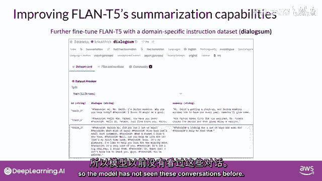

让我们看一个对话摘要的示例，并讨论如何进一步微调。这是一个典型的客服对话示例，客户正在与酒店前台交谈。聊天记录已经应用了提示模板，以便总结指令出现在文本开头。

观察Flan-T5在进一步微调前如何响应。提示现在显示在左侧，模型对指令的响应显示在右侧。模型表现尚可，能够识别出“为Tommy预订”这个关键点。

但它的总结不如人类生成的基准摘要完整，后者包含了“Mike询问信息以方便登记”等重要信息。同时，模型的总结还“虚构”了原始对话中没有的信息，特别是具体的酒店名称和所在城市。

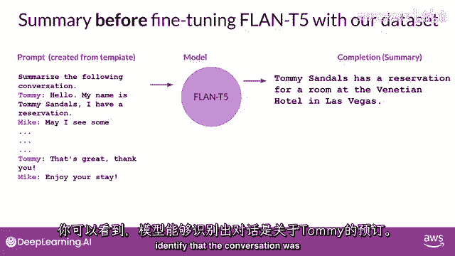

让我们看看模型在对话摘要数据集上微调后的表现。希望你会发现，微调后的总结更接近人类产生的摘要：没有虚构信息，并且包含了所有重要细节，比如参与对话的两人姓名。

此示例使用公共对话摘要数据集演示了在自定义数据上的微调。实际上，**使用公司自己的内部数据进行微调将获得最大收益**。例如，使用客户支持应用程序中真实的支持聊天对话。这将帮助模型学习公司偏好的总结方式，以及对客户服务同事最有用的信息类型。

我知道这里有很多内容需要理解，但别担心，这个示例将在实验室中详细覆盖，所以你会有机会看到实际操作并亲自尝试。

## 模型评估的重要性

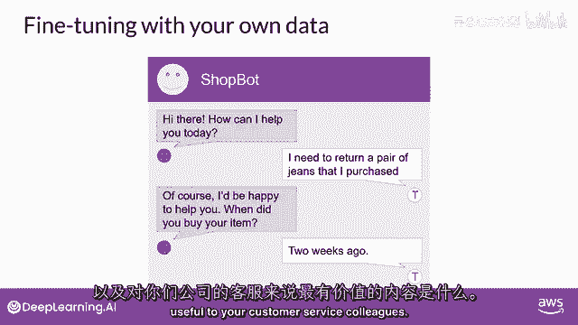

当进行微调时，需要考虑如何评估模型完成的质量。在下一个视频中，你将学习几种指标和基准，以确定模型的表现如何。

## 总结

本节课中我们一起学习了**多任务指令微调**。我们了解了它通过在混合任务数据集上训练来提升模型综合能力的原理，认识了像Flan这样的代表性模型家族，并探讨了在通用模型基础上针对特定领域（如客服对话总结）进行进一步微调的价值和过程。记住，使用与目标场景高度相关的数据进行微调，是提升模型在特定任务上性能的关键。