# 079：使用指令对LLM进行微调6——基准测试

在本节课中，我们将学习如何评估和比较大型语言模型的性能。我们将介绍几种常用的基准测试方法及其重要性，帮助你理解如何全面衡量一个模型的能力。

---

## 概述：为何需要基准测试？

大型语言模型既复杂又简单。像ROUGE和BLUR这样的评分，仅能告诉你模型能力的部分信息。为了全面评估和比较LLM，可以利用由研究人员专门建立的预存数据集和相关基准。选择合适的数据集至关重要，以便准确评估LLM的性能，理解其真正能力。

上一节我们介绍了模型微调的基本概念，本节中我们来看看如何科学地评估模型效果。

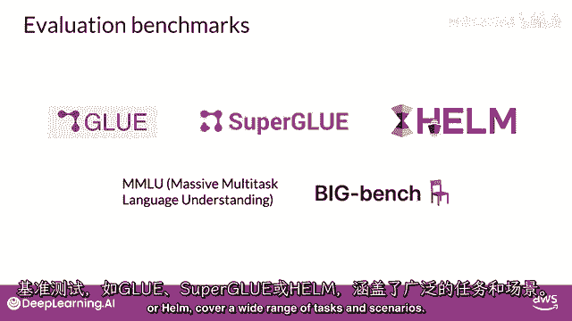

---

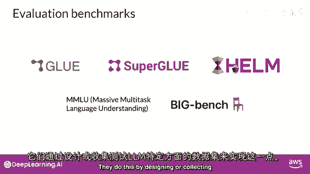

## 选择评估数据集的关键点

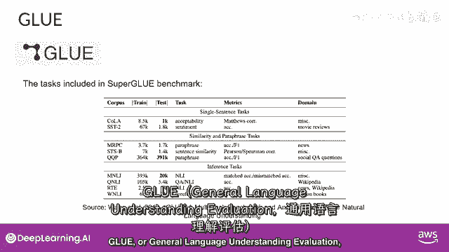

选择隔离特定模型技能的数据集将非常有用，例如针对推理或常识知识的测试。同时，需要关注潜在风险，如假信息或版权侵犯。应考虑模型是否在训练时见过评估数据，通过评估其在未见过的数据上的表现，可以更准确地评估模型能力。

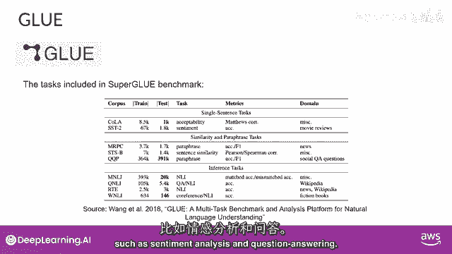

以下是选择数据集时需要考虑的几个方面：

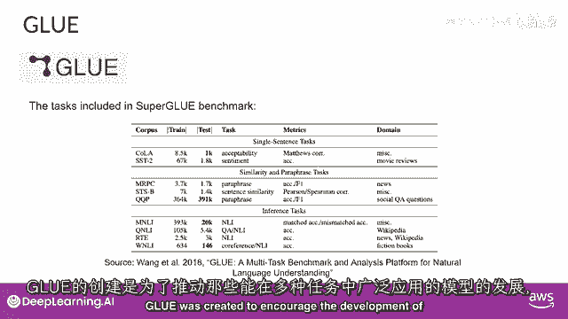

*   **技能隔离**：选择能测试特定能力（如逻辑推理、常识）的数据集。
*   **数据污染**：确保评估数据未在模型训练中出现过。
*   **风险考量**：评估模型生成有害或侵权内容的风险。

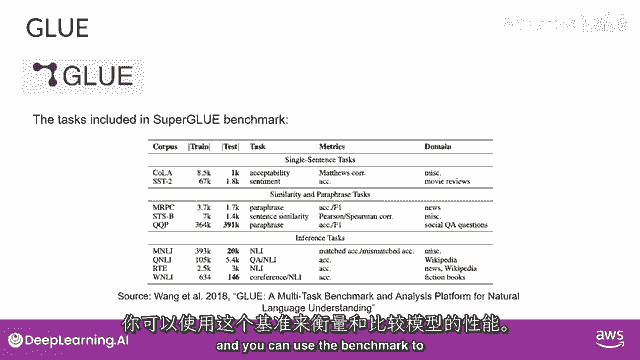

---

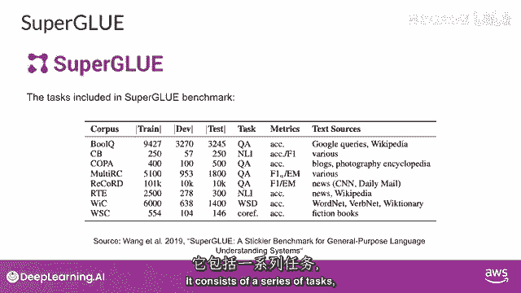

## 经典基准测试介绍

基准如GLUE、SuperGLUE或HELM涵盖了广泛的任务和场景，通过设计或收集测试特定方面的大型数据集来评估模型。

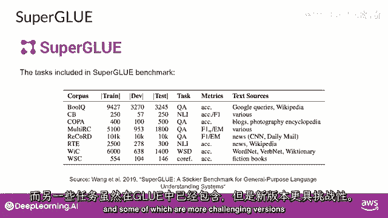

### GLUE（通用语言理解评估）

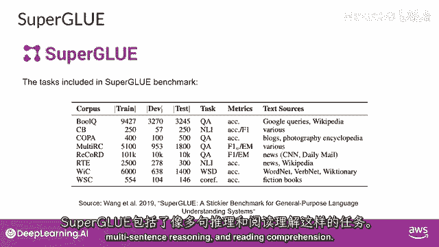

GLUE于2018年引入，是一个自然语言任务集合，例如情感分析和问答。其旨在促进跨多任务模型的开发。

### SuperGLUE

SuperGLUE于2019年推出，以解决其前身GLUE的限制。它由一系列任务组成，其中一些是GLUE中未包含的，另一些则是相同任务的更具挑战性版本。SuperGLUE包括多句推理和阅读理解等任务。

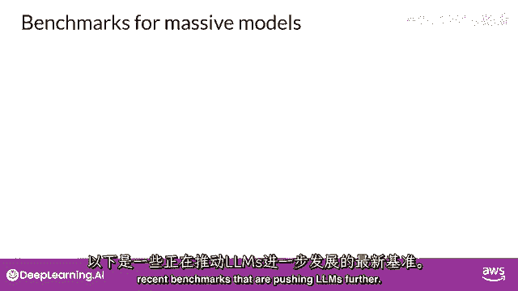

GLUE和SuperGLUE基准都设有排行榜，可用于比较不同模型。其结果页面是追踪LLMs进展的优质资源。随着模型规模增大，它们在诸如SuperGLUE等基准上的性能，在特定任务上开始匹配人类能力。但主观上看，它们在一般任务上仍未达到人类水平。因此，本质上，LLMs的涌现特性与衡量它们的基准之间存在一种“军备竞赛”。

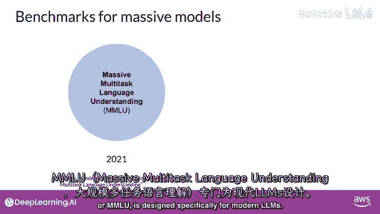

---

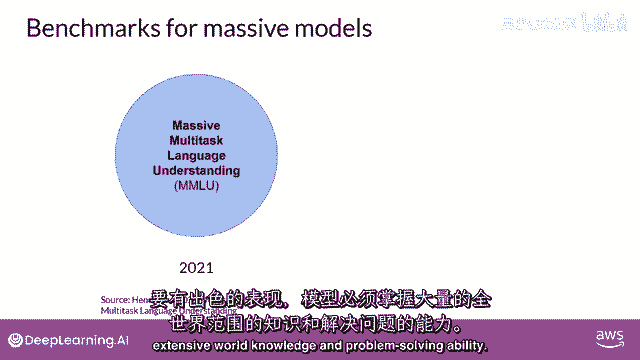

## 推动LLM发展的新基准

以下是几个近期推动LLMs发展的新基准。

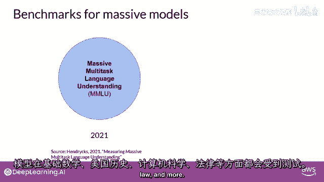

### MMLU（大规模多任务语言理解）

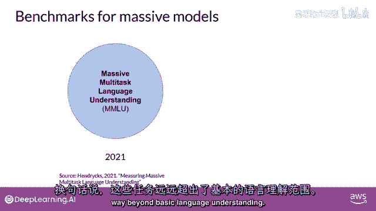

在此基准中，模型需具备广泛的世界知识。模型测试内容涵盖基础数学、美国历史、计算机科学、法律等，即超越基本语言理解的任务。

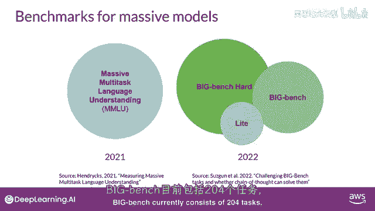

### BIG-Bench

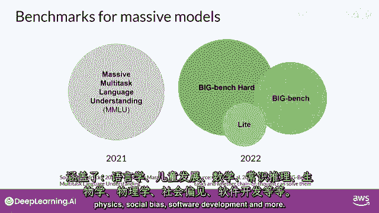

BIG-Bench目前包含204项任务，涵盖语言学、儿童发展、数学、常识、推理、生物学、物理学、社会偏见、软件开发等更多领域。BIG-Bench提供三种尺寸版本，部分原因是控制成本，因为这些大型基准测试会产生高昂的推断成本。

### HELM（语言模型的整体评估）

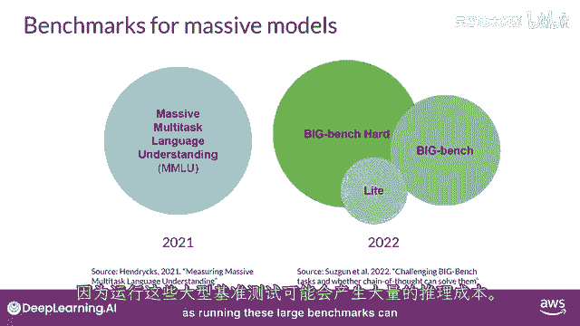

你应该了解的最终基准是HELM。HELM框架旨在提高模型的透明度，并为特定任务提供模型性能的指导。HELM采用多指标方法，在16个核心场景中测量7个指标，确保模型和指标之间的权衡清晰。

HELM的一个重要特点是评估超越基本准确度指标（如精确度或F1分数）。该基准还包括公平性、偏见和毒性指标。随着大型语言模型越来越能生成人类语言，并可能表现出潜在有害行为，HELM作为一个不断发展的基准，旨在随着新场景、指标和模型的添加而不断演进。你可以查看其结果页面，浏览已评估的LLMs。

---

## 总结

本节课中，我们一起学习了评估大型语言模型性能的关键方法。我们了解到，仅靠单一评分（如ROUGE）不足以全面衡量模型，需要借助GLUE、SuperGLUE、MMLU、BIG-Bench和HELM等专门设计的基准测试。这些基准通过多样化的任务和严谨的指标，帮助我们更准确、更全面地理解模型在知识、推理、安全性等各方面的能力，是追踪和比较LLM发展的重要工具。