# 080：参数高效微调1——参数高效微调（PEFT） 🎯

在本节课中，我们将要学习参数高效微调（PEFT）的基本概念。我们将了解为什么全量微调大型语言模型（LLM）在计算和存储上成本高昂，并探索PEFT如何通过仅更新一小部分参数来解决这些问题，使得在有限资源下微调大模型成为可能。

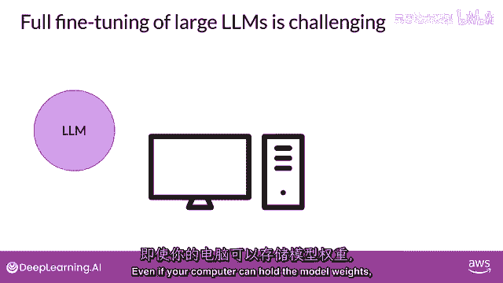

## 全量微调的挑战 💾

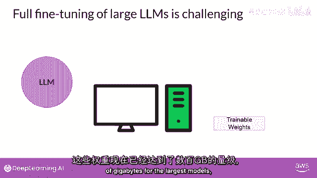

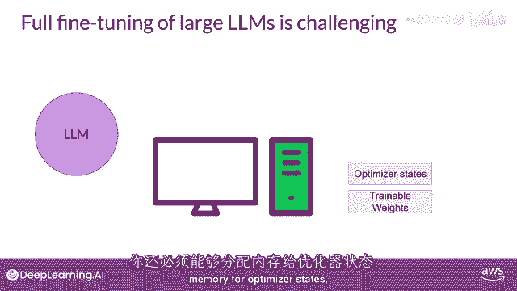

正如你在课程培训的第一周所看到的，LLM是计算密集型的。

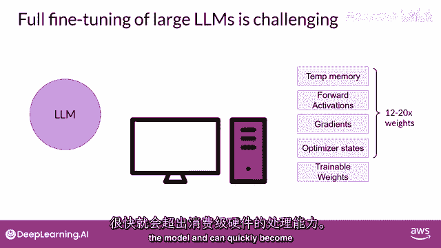

全量微调不仅需要存储模型，还需要在训练过程中所需的各种其他参数，即使你电脑可以持有模型权重。

这些权重对于最大的模型现在已经达到了数百吉字节的规模。

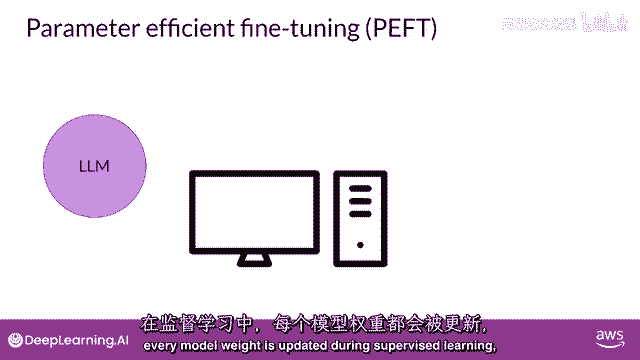

你也必须能够为优化器状态分配内存。

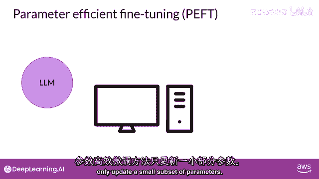

梯度、前向激活和训练过程中临时内存，这些额外的组件可以比模型大得多。

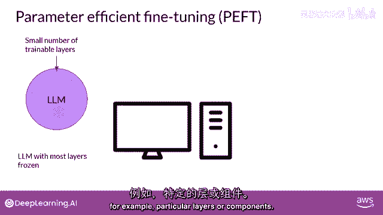

并且可以迅速变得过大以至于在消费者硬件上难以处理。

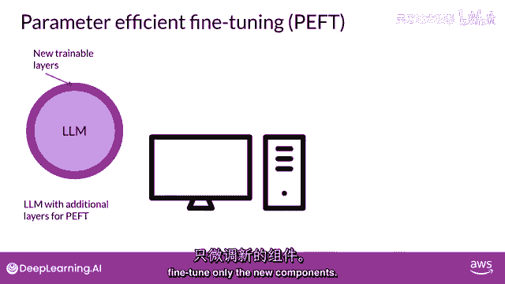

与全面精细调整不同，在那里每个模型权重都会在监督学习参数中更新。

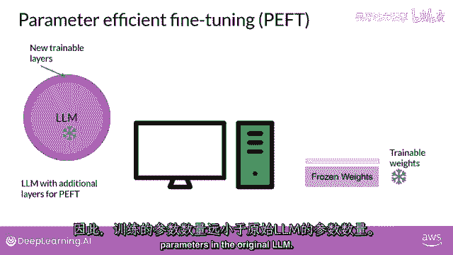

## 参数高效微调（PEFT）的核心思想 ⚙️

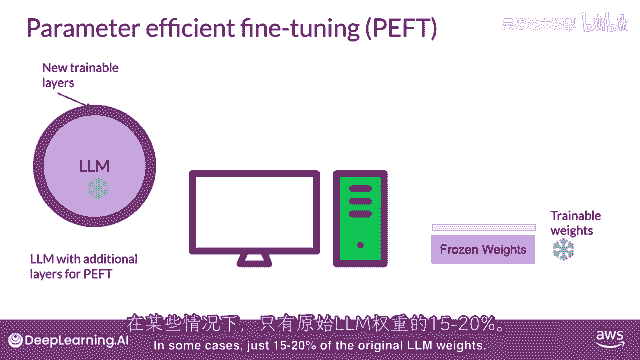

高效的精细调整方法只会更新参数集的一个小部分。

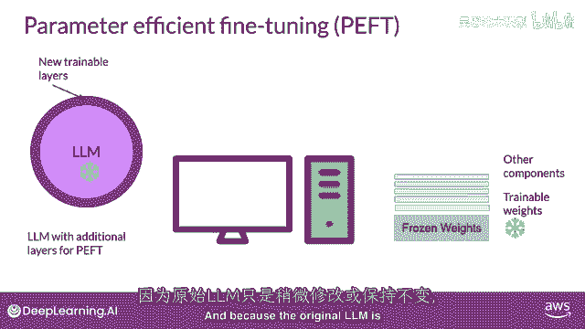

一些高效技术会冻结模型的大部分权重并专注于精细调整，例如，一个现有模型参数的子集，例如，特定的层或组件。

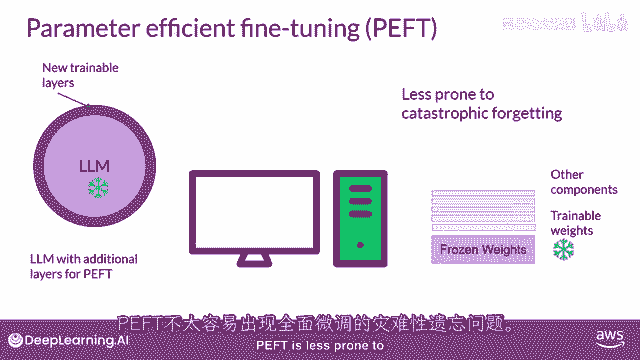

其他技术根本不接触原始的模型权重，而是添加一些新的参数或层，并仅对使用PEFT最新的组件进行精细调整。

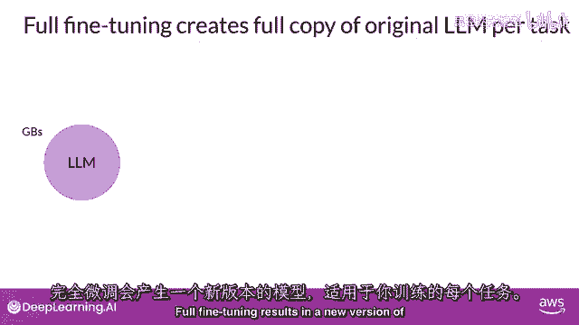

如果所有的LLM权重都没有被冻结，因此，训练的参数数量远小于原始LLM的参数数量。

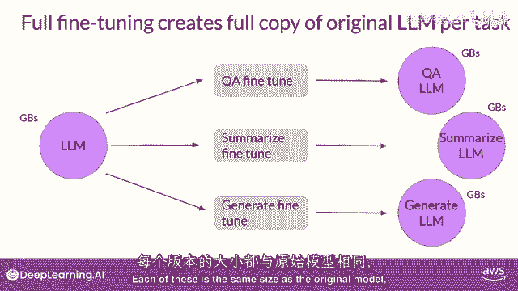

而且在一些情况下，只有原始LLM权重的十五到二十分之一。

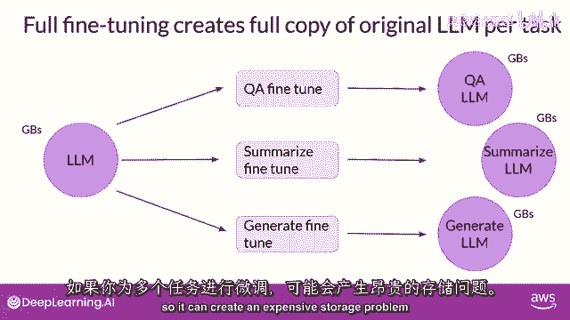

这使得训练所需的内存要求更加可管理，实际上，PEFT往往可以在单个GPU上进行。

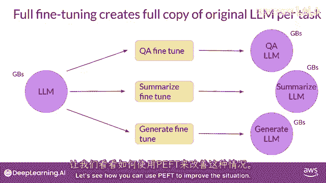

因为原始LLM只是被稍微修改或保持不变，更不容易受到灾难性的全精细调整“遗忘”问题的影响。

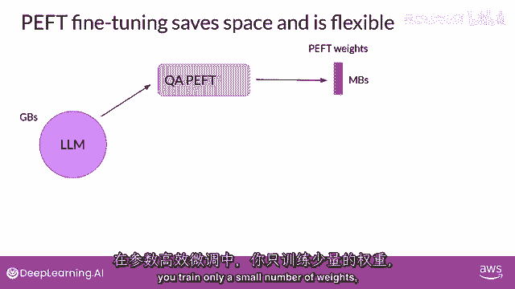

## PEFT的优势：存储与多任务适应 📦

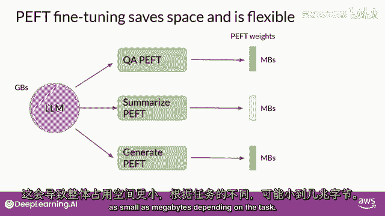

全精细调整将产生针对你训练的所有任务的新模型版本。

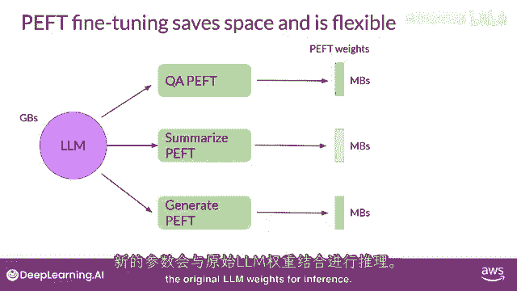

这些每个都与原始模型相同大小。

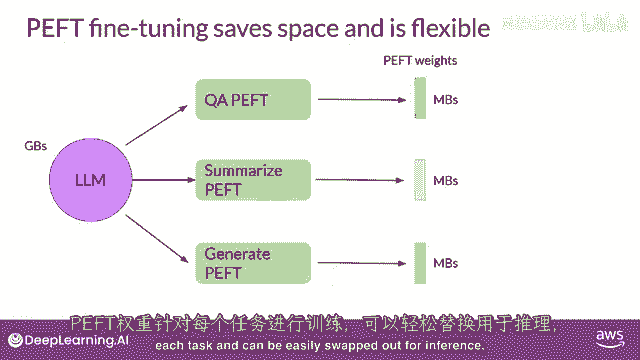

因此，如果你为多个任务进行微调，可能会出现昂贵的存储问题。

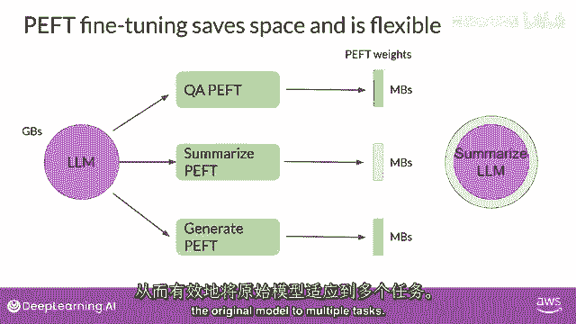

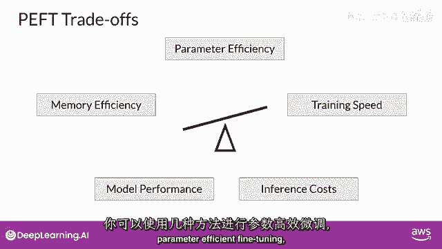

让我们看看如何使用PEFT来改善这种情况。

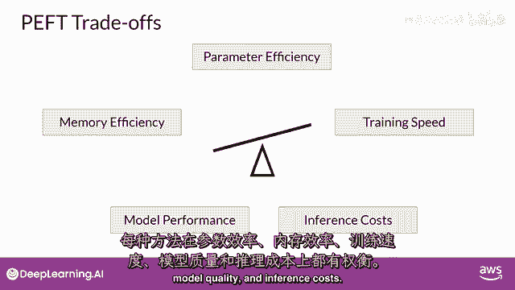

以参数高效的微调为例，你只训练一小部分权重。

这导致足迹大大减小，总的来说，小到兆字节。

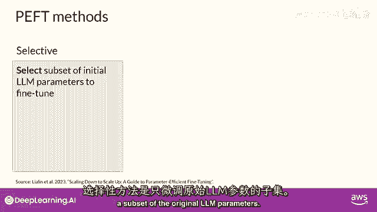

取决于任务，新的参数与原始LLM权重结合用于推理。

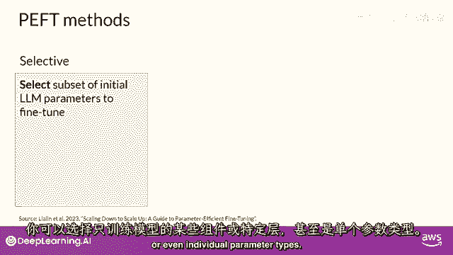

对于每个任务，都有专门的轻量级权重进行训练，并且可以在推理时轻易地替换出来。

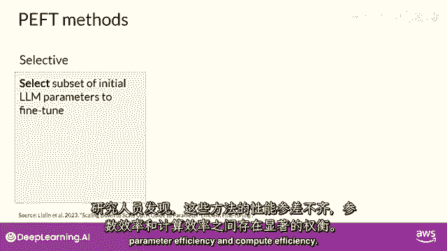

允许原始模型高效地适应多个任务。

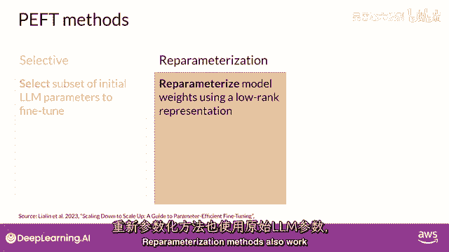

## PEFT的主要方法分类 🗂️

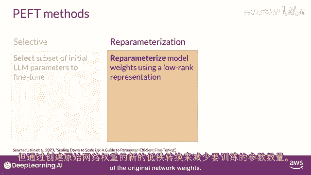

对于参数高效的方法，你有几种可以使用的微调方法。

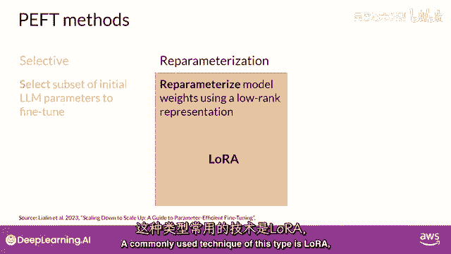

每种方法都有在参数效率、内存效率、训练速度、模型质量和推理成本上的权衡。

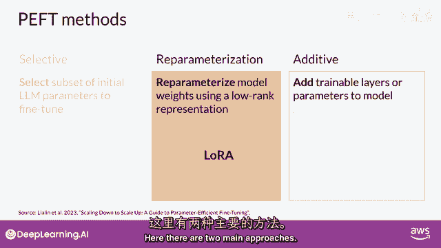

以下是轻量级权重方法的三种主要类别：

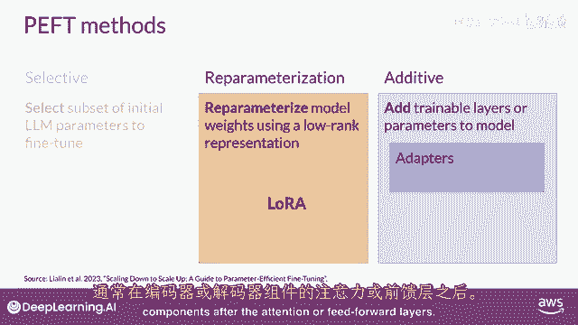

*   **选择性方法**：只精细调整原始LLM参数的一部分。你可以采取几种方法来确定你想要更新的参数，你有选择仅训练模型特定组件或层的选项，甚至特定参数类型。研究人员发现这些方法的性能参差不齐，并且在参数效率和计算效率之间存在显著的权衡。因此，我们在这门课程中不会专注于它们。
*   **重新参数化方法**：也工作于原始LLM参数，但通过创建新的参数来减少需要训练的参数数量，即对原始网络权重进行低秩变换。这种技术的一种常见方法是**LoRA**。你将在下一个视频中详细探索它。
*   **附加方法**：通过保持所有原始LLM权重冻结来进行微调，并在这里引入新的可训练组件。主要有两种方法：
    *   **适配器方法**：在模型架构中添加新的可训练层，通常在内部编码器或解码器的组件中，注意力或前馈层之后。
    *   **软提示方法**：保持模型架构固定和冻结，专注于操纵输入以实现更好的性能。这可以通过向提示嵌入添加可训练参数来实现，或保持输入固定，重新训练嵌入权重。

在这堂课中，你将首先看一下一种特定的软提示技术叫做提示微调。

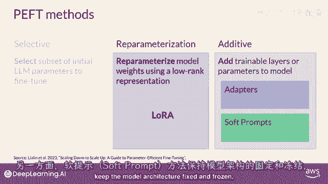

让我们继续到下一个视频，更深入地了解LoRA方法。

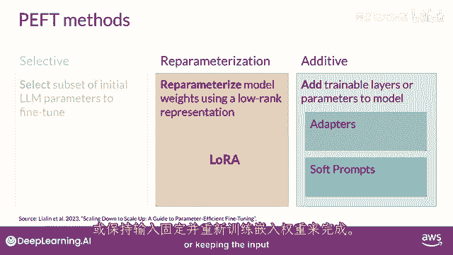

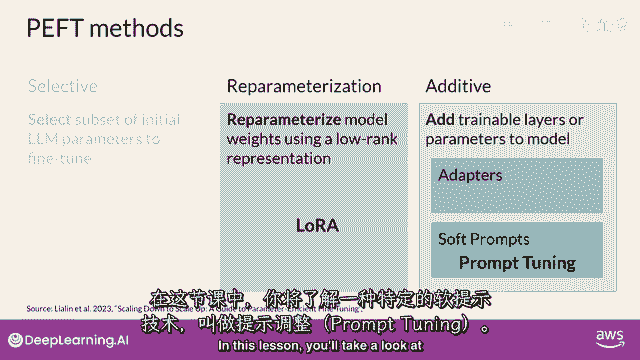

---

本节课中我们一起学习了参数高效微调（PEFT）的基本原理。我们了解到，与更新所有模型参数的全量微调相比，PEFT通过选择性更新、重新参数化或添加新组件的方式，极大地降低了微调所需的内存和计算资源。这使得在单个GPU上微调大模型成为可能，并解决了为不同任务存储多个完整模型副本的存储问题。我们还简要介绍了PEFT的三大类方法，为后续深入学习LoRA和提示微调等技术奠定了基础。