# 081：参数高效微调2——PEFT技术1 - LoRA（低秩适应） 🧠

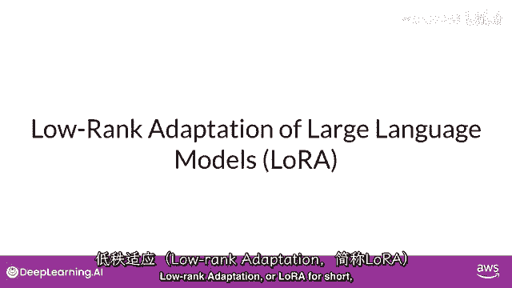

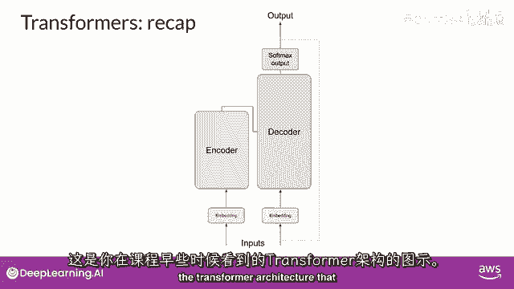

在本节课中，我们将要学习一种重要的参数高效微调技术——LoRA。我们将了解它的工作原理、优势以及如何在实际应用中显著减少训练所需的参数量。

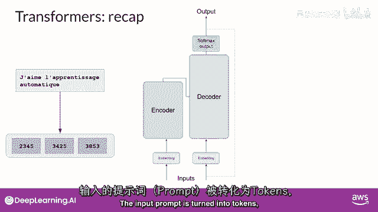

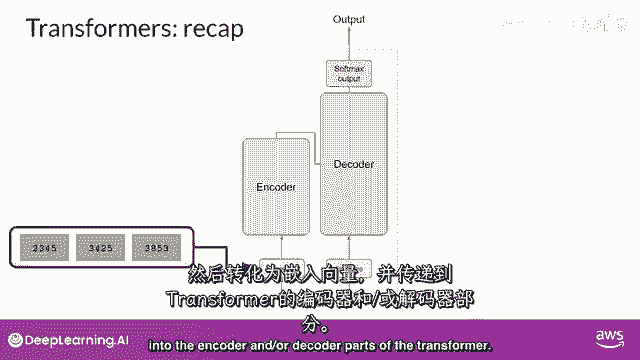

## 概述

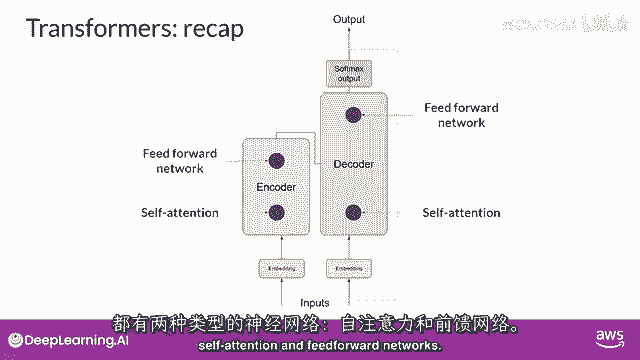

LoRA，即低秩适应，是一种属于重参数化类别的参数高效微调技术。它通过在原始模型权重旁注入可训练的小型矩阵，而非更新整个庞大的模型，来达到高效微调的目的。

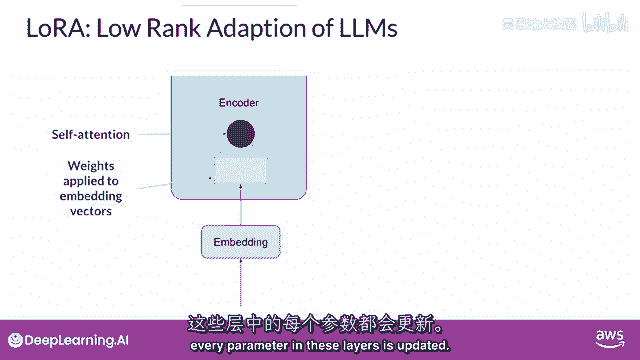

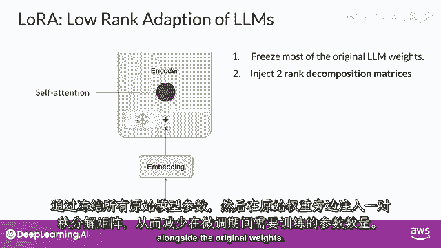

## LoRA 的工作原理

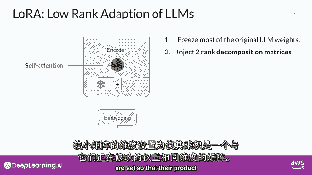

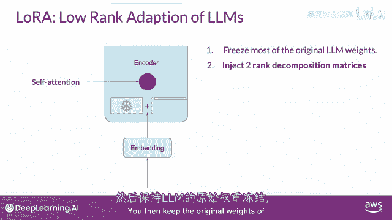

上一节我们介绍了参数高效微调的概念，本节中我们来看看LoRA的具体实现机制。

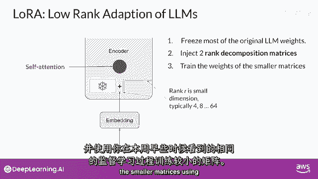

这是您在课程早期看到的Transformer架构图。输入提示被转换为标记，然后转换为嵌入向量，并传递到Transformer的编码器或解码器部分。

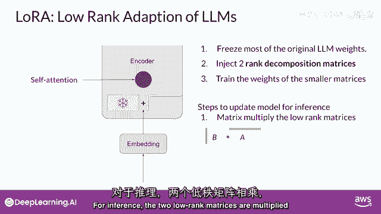

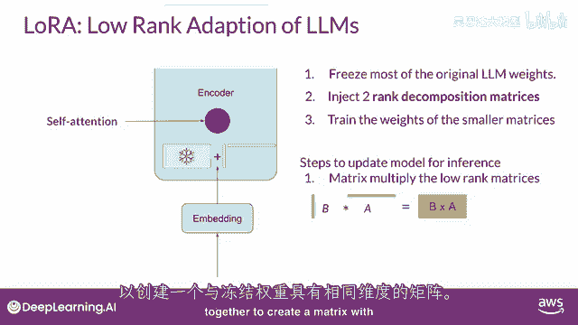

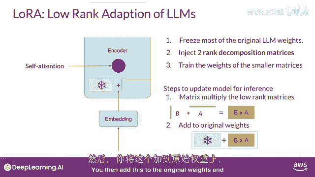

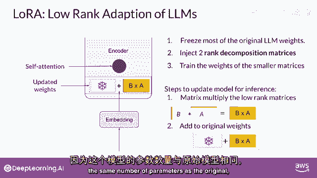

在这两个组件中，有两种主要的神经网络：自注意力层和前馈网络。这些网络的权重在预训练时学习。在全微调时，这些层的每个参数都会更新。

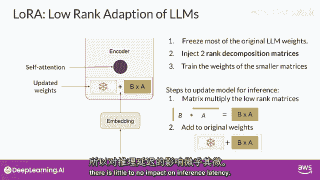

LoRA策略旨在减少微调时需要训练的参数数量。其核心方法是冻结原始模型的所有参数，并在原始权重矩阵旁注入一对低秩分解矩阵。

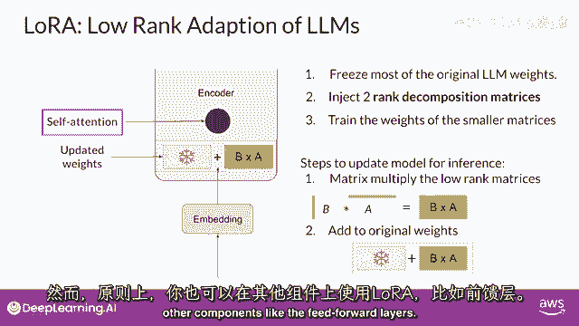

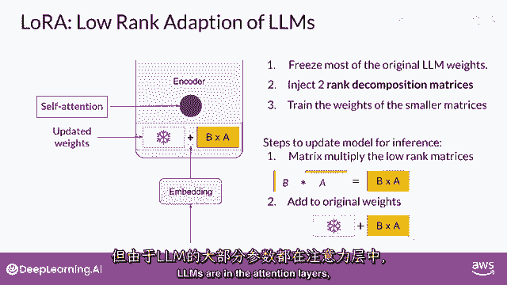

这两个小矩阵的尺寸经过设定，使得它们的乘积矩阵与待修改的原始权重矩阵尺寸相同。然后，我们冻结大语言模型的原始权重，只训练这两个小矩阵。训练过程使用监督学习。

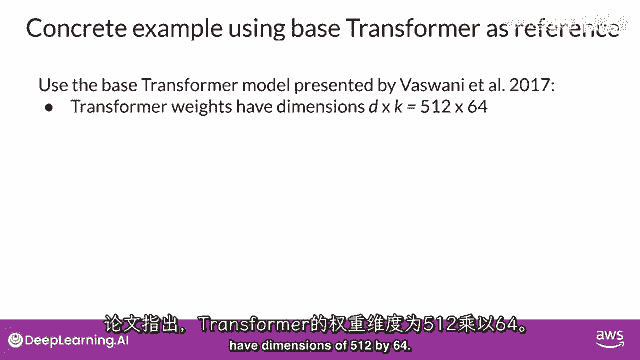

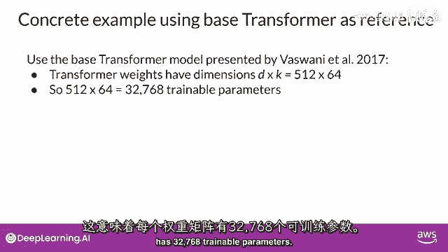

在推理时，将训练好的两个低秩矩阵相乘，生成一个与冻结的原始权重尺寸相同的更新矩阵。然后将这个更新矩阵加到原始权重上，并用这个总和替换模型中的对应权重。

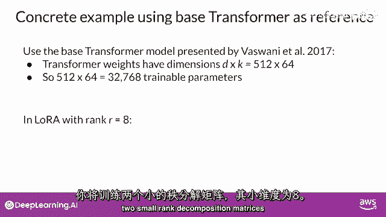

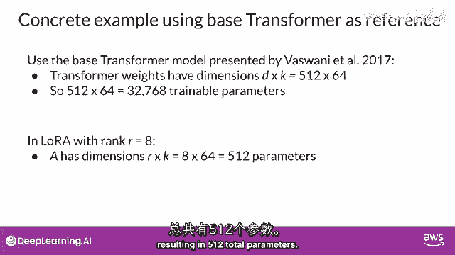

**公式表示如下：**
`更新后的权重 W' = W + ΔW`，其中 `ΔW = B * A`，A和B就是训练的低秩矩阵。

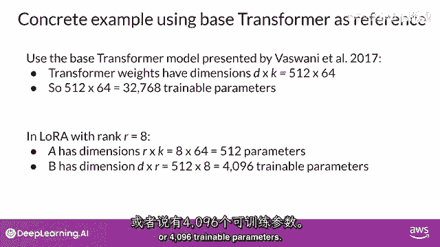

现在我们就得到了一个LoRA微调后的模型，可以执行特定任务。由于此模型与原始模型的参数总量相同，因此对推理延迟的影响非常小。

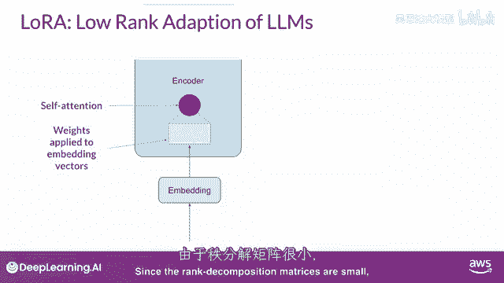

## LoRA 的应用位置

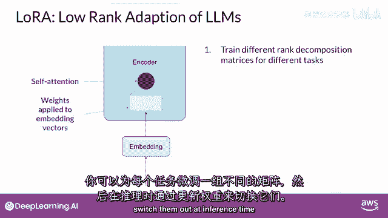

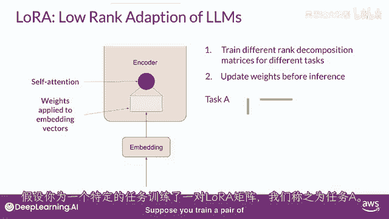

研究人员发现，仅将LoRA应用于Transformer模型中的自注意力层，通常就足以完成微调任务并实现性能提升。这是因为大多数LLM的参数都集中在注意力层。应用LoRA到这些权重上，可以节省最多的可训练参数量。

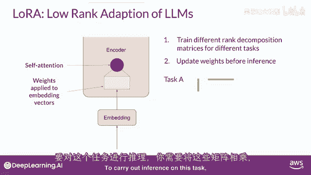

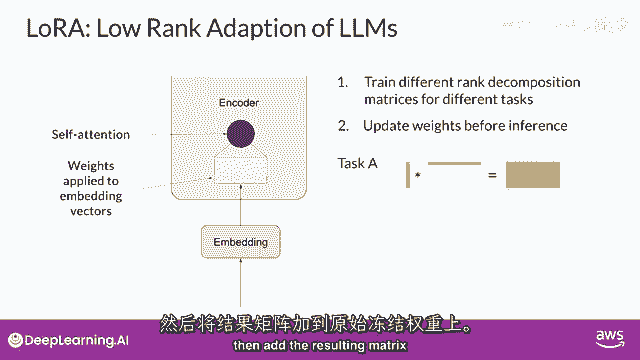

当然，原则上也可以将LoRA应用于其他组件，如前馈网络层。

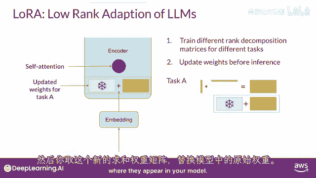

## LoRA 的优势：一个具体例子

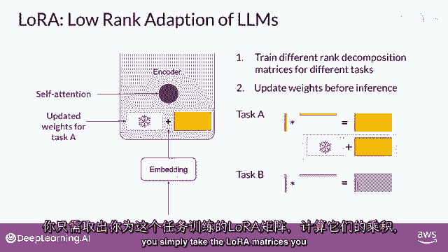

让我们看一个基于注意力机制的Transformer架构的实际例子。

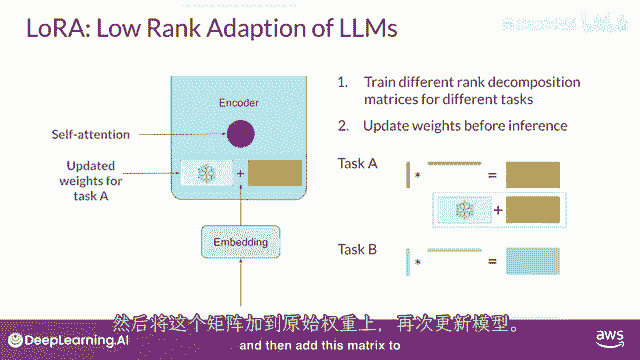

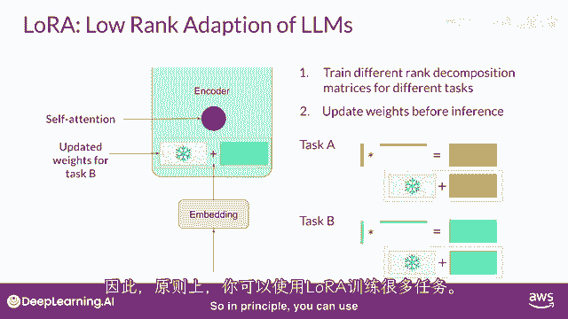

假设Transformer中某个权重矩阵的尺寸是 `512 x 64`，这意味着该矩阵有 `32,768` 个参数。

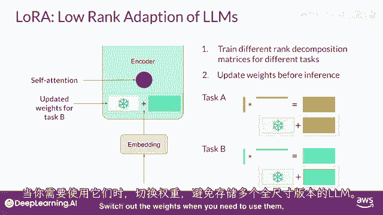

如果使用LoRA进行微调，并设定秩 `r=8`，我们将训练两个小的秩分解矩阵：
*   矩阵 **A** 的尺寸为 `8 x 64`，共有 `512` 个参数。
*   矩阵 **B** 的尺寸为 `512 x 8`，共有 `4,096` 个参数。

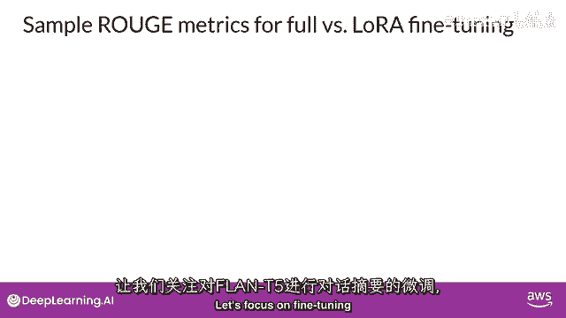

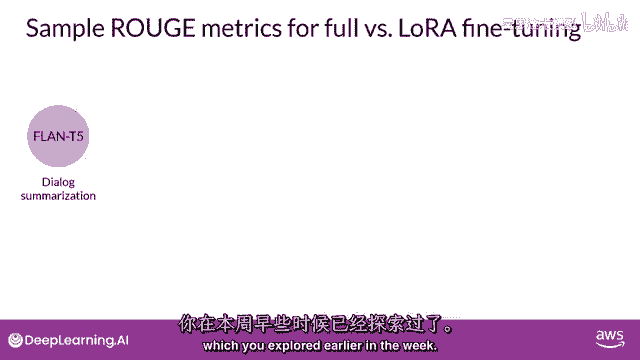

通过更新这两个低秩矩阵（共 `4,608` 个参数）的权重，而不是更新原始权重矩阵（`32,768` 个参数），可训练参数量减少了约 **86%**。

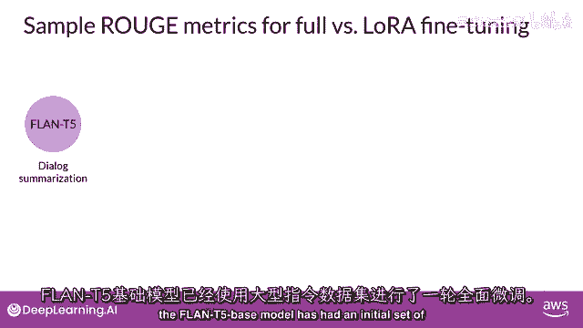

因为LoRA可以大幅减少可训练参数，通常只需单个GPU即可进行参数高效微调，避免了需要分布式GPU集群。同时，由于分解矩阵尺寸小，我们可以为许多不同任务训练不同的LoRA矩阵集合，并在推理时通过切换这些矩阵来快速适配不同任务。

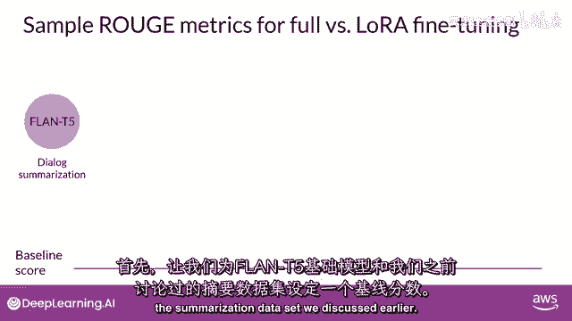

以下是任务切换的流程：
1.  为**任务A**训练一对LoRA矩阵（A_A, B_A）。
2.  推理时，计算 `ΔW_A = B_A * A_A`，然后 `W' = W + ΔW_A`，并更新模型权重。
3.  若要执行**任务B**，则取出为任务B训练的矩阵（A_B, B_B），计算 `ΔW_B = B_B * A_B`，然后 `W' = W + ΔW_B`，再次更新模型。

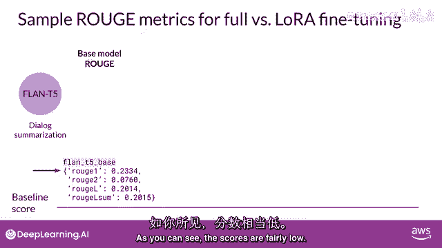

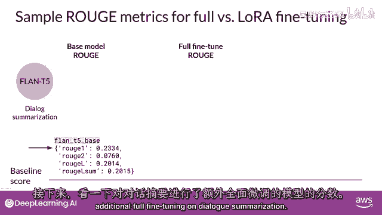

存储这些小型LoRA矩阵所需的内存很小，从而避免了存储多个完整尺寸的LLM副本。

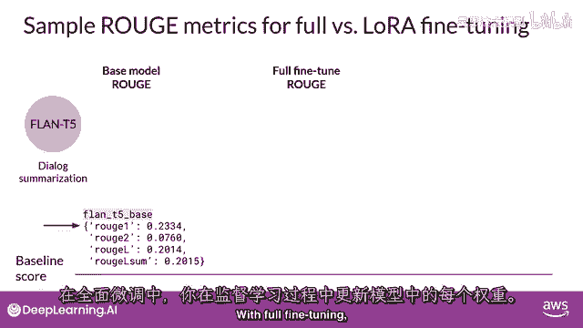

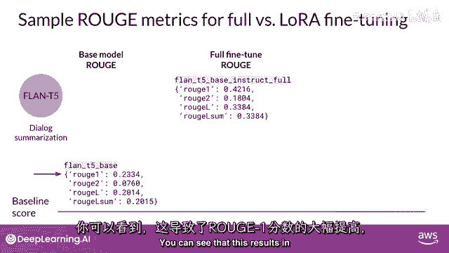

## LoRA 的性能表现

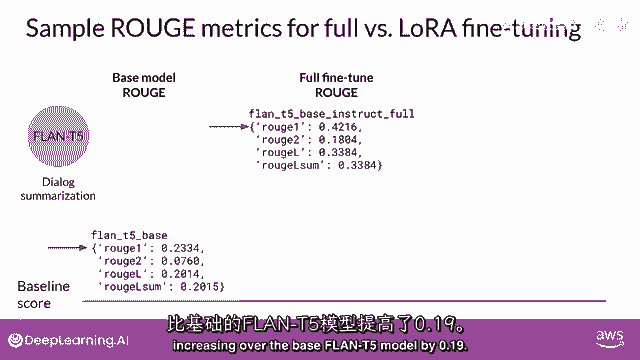

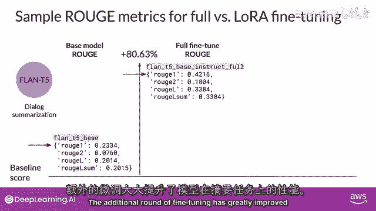

使用ROUGE指标来比较LoRA微调模型、原始基础模型和全量微调版本的性能。我们专注于对模型进行对话摘要任务的微调。

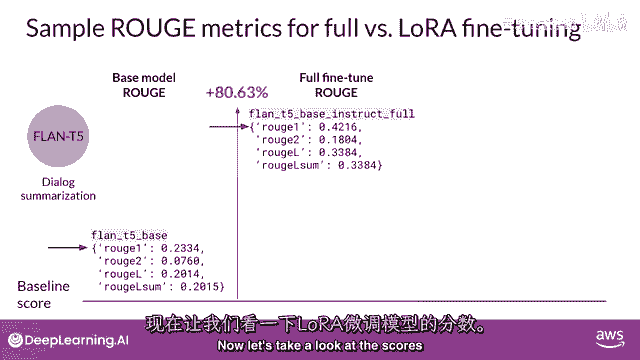

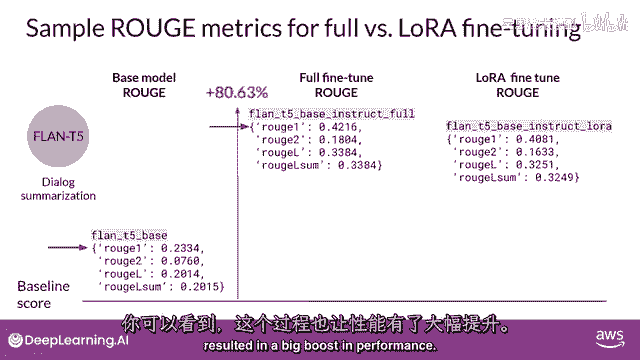

首先，基础模型在摘要任务上的ROUGE-1分数较低，作为基准。

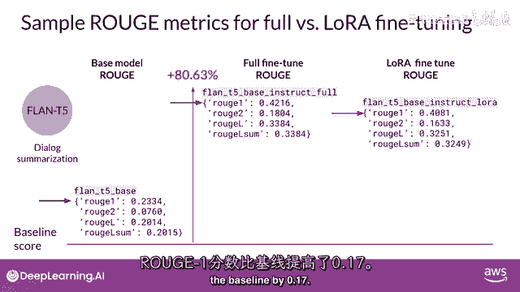

接下来，观察经过额外全量对话摘要微调后的模型分数。尽管基础模型本身能力很强，但针对特定任务进行全量微调（更新所有权重）仍能带来显著收益，其ROUGE-1得分大幅提升（例如提高了0.19）。

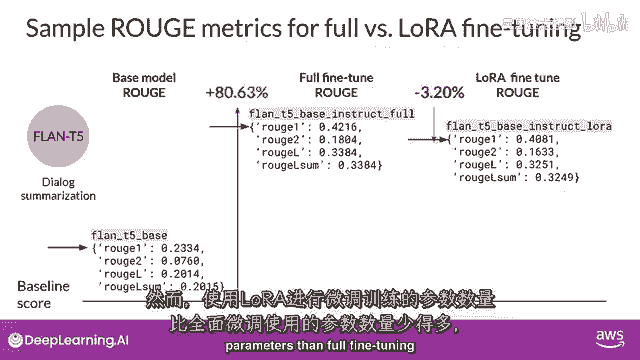

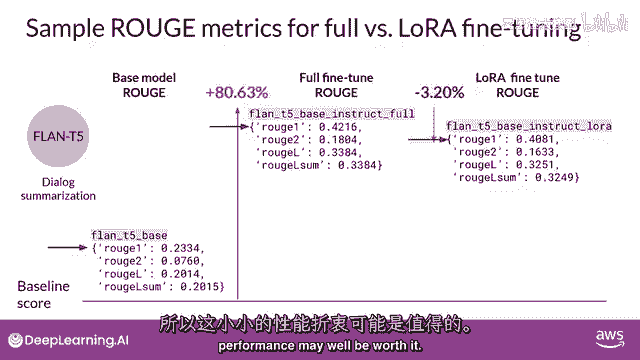

现在，看看LoRA微调模型的得分。此过程也带来了显著的性能提升，ROUGE-1得分较基准提高了0.17。这个分数略低于全量微调，但差距不大。然而，LoRA微调所训练的参数量远少于全量微调，使用的计算资源也更少。因此，这种微小的性能下降对于换取巨大的效率提升而言，通常是非常值得的。

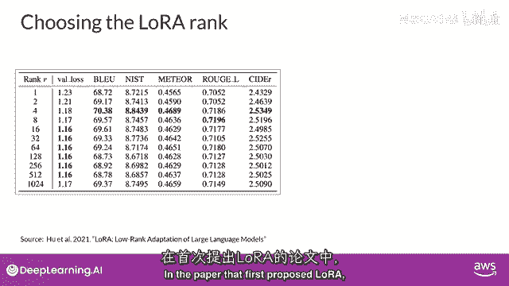

## 如何选择 LoRA 的秩 (Rank)

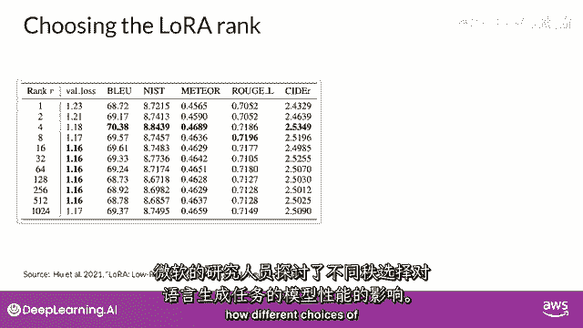

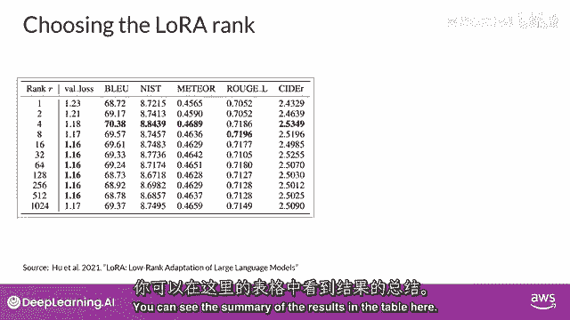

秩的选择是一个重要且活跃的研究领域。原则上，秩越小，可训练参数越少，计算节省越大，但可能会影响模型性能。

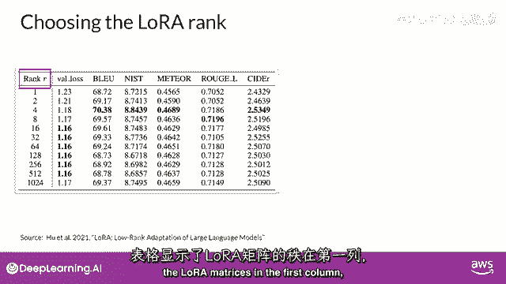

在提出LoRA的论文中，微软研究人员探索了不同秩的选择对模型性能的影响。他们发现，当秩大于16时，损失值达到平稳，意味着使用更大的矩阵并无更多改善。

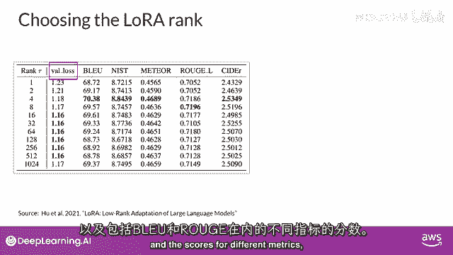

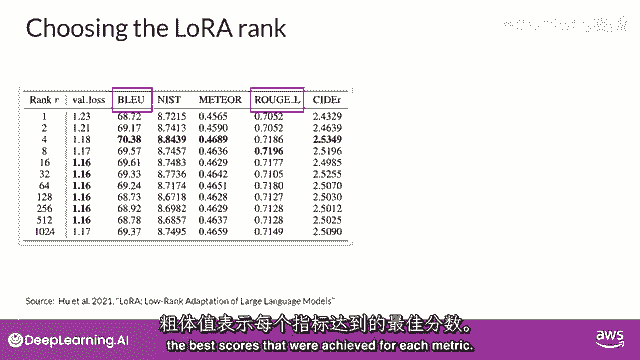

关键要点是，**秩为4或8**通常可以在减少参数数量和保留模型性能之间取得良好的平衡。随着更多实践者使用LoRA，关于秩选择的最佳实践可能会继续演进。

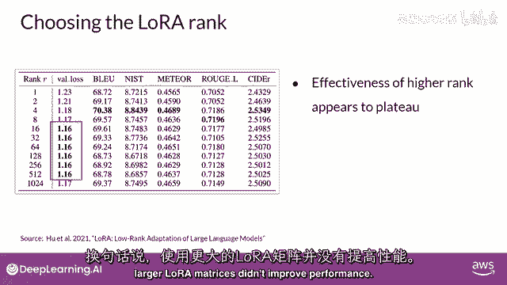

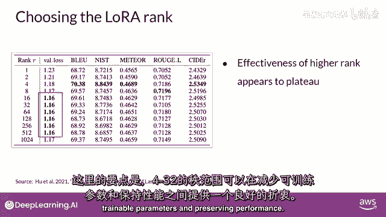

## 总结

本节课中我们一起学习了LoRA（低秩适应）技术。它是一种强大的参数高效微调方法，通过冻结原模型权重并训练注入的低秩矩阵，能够用极少的可训练参数量达到接近全量微调的性能。这种方法不仅适用于训练LLMs，其原理也可应用于其他领域的模型。LoRA的核心优势在于高效、灵活，且对最终模型推理速度影响甚微。