# 082：参数高效微调3——PEFT技术2 - 软提示 🎯

## 概述

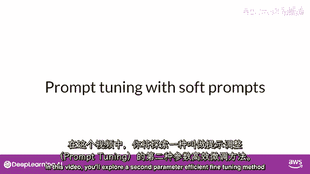

在本节课中，我们将要学习参数高效微调（PEFT）中的第二种核心技术：**提示调整**。我们将探讨它与提示工程的区别，理解其工作原理，并了解它如何以极低的计算成本实现对大型语言模型（LLM）的适配。

---

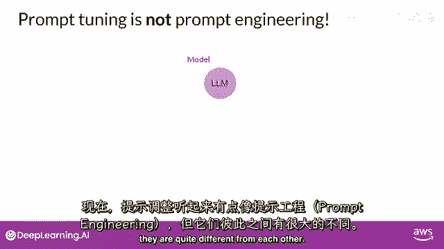

## 提示调整与提示工程的区别

上一节我们介绍了LoRA技术，本节中我们来看看另一种名为“提示调整”的参数高效微调方法。提示调整听起来与提示工程相似，但两者有本质区别。

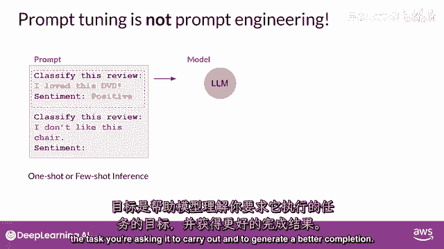

**提示工程**专注于通过优化提示的语言来获取期望的模型输出。这可能包括尝试不同的词汇、短语，或加入少量推理示例。其目标是帮助模型理解任务本质，从而生成更好的结果。

然而，提示工程存在一些限制。它通常需要大量手动尝试，并且受限于模型的上下文窗口长度。最终，仅靠提示工程可能无法达到特定任务所需的性能水平。

**提示调整**则不同。它通过向提示中添加额外的、可训练的标记（称为“软提示”），并利用监督学习过程来确定这些标记的最佳值，从而实现模型适配。

---

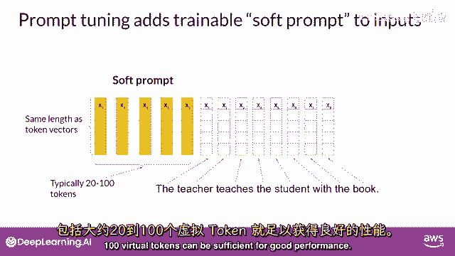

## 软提示的工作原理

以下是软提示的核心概念和实现方式。

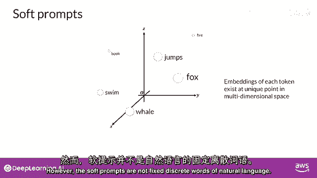

软提示是添加到输入文本嵌入向量之前的一组可训练向量。这些向量的长度与语言标记的嵌入向量长度相同。通常，添加约20到100个虚拟标记就足以获得良好的性能。

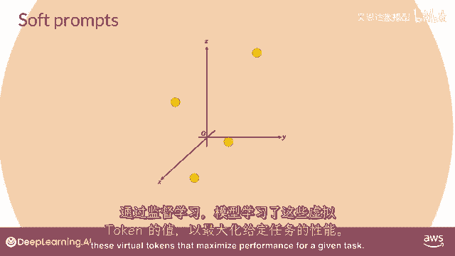

**代码表示**：假设原始输入嵌入为 `E_text`，软提示为 `P_soft`，则模型的输入嵌入变为：
`E_input = concat(P_soft, E_text)`

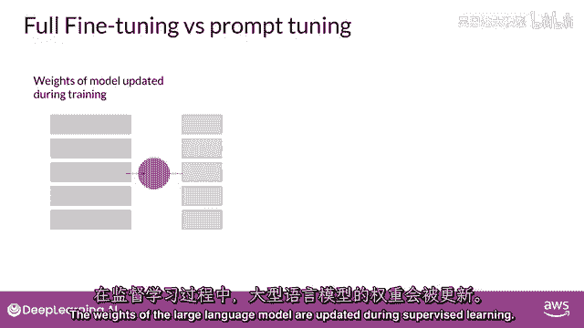

代表自然语言的标记是“硬”的，每个都对应嵌入空间中的一个固定位置。而软提示并非自然语言中的固定词汇。

相反，你可以将它们视为可以在连续的、多维的嵌入空间中取任何值的虚拟标记。通过监督学习，模型学习到的这些虚拟标记的值能够最大化给定任务的性能。

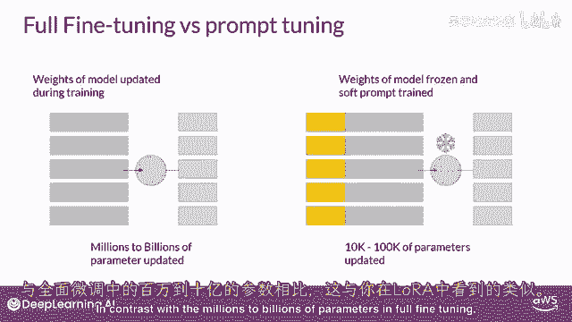

---

## 提示调整的训练过程

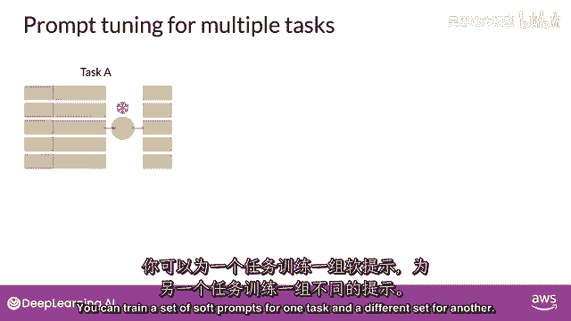

在传统的全参数微调中，训练数据集包括输入提示和输出完成（或标签），大型语言模型的所有权重在监督学习期间都会得到更新。

在提示调整中，大型语言模型本身的权重被**冻结**，底层模型参数不更新。唯一被更新的是**软提示的嵌入向量**。这是一种极其参数高效的策略，因为只有少量参数（软提示）被训练，与全微调需要更新数百万到数十亿参数形成鲜明对比。

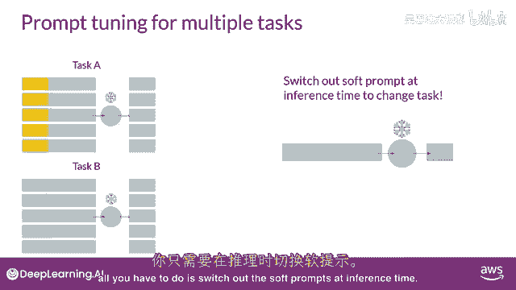

---

## 提示调整的灵活性与效率

类似于LoRA，提示调整允许你为不同任务训练不同的软提示集，并在推理时轻松切换。

以下是其优势：
*   你可以为任务A训练一套软提示，为任务B训练另一套。
*   在推理时，你只需在输入提示前添加对应任务学习到的软提示标记即可切换到该任务。
*   软提示在磁盘上占用空间极小，使得这种微调方法极其高效和灵活。
*   所有任务共享同一个LLM，只需在推理时替换软提示。

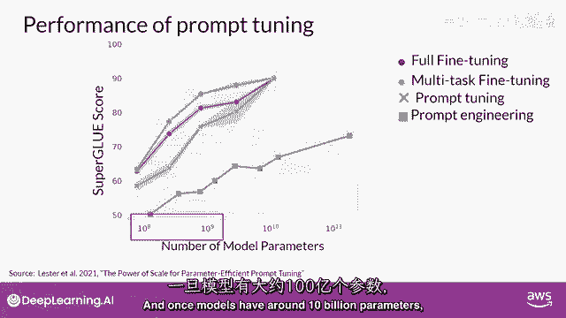

---

## 提示调整的性能表现

那么提示调整的实际效果如何？根据Brian Lester等研究者在原始论文中的探索，我们可以通过以下对比了解其性能。

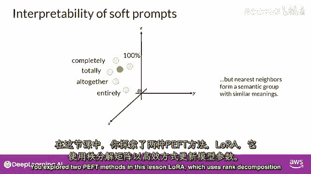

论文在SuperGLUE基准上比较了不同方法在不同模型规模下的性能：
*   **红线**：单任务全参数微调。
*   **橙线**：多任务微调。
*   **绿线**：提示调整。
*   **蓝线**：仅使用提示工程。

从图中可以看出，在较小的LLM上，提示调整的性能不如全参数微调。然而，随着模型规模增大，提示调整的性能迅速提升。**一旦模型参数达到约10亿规模，提示调整的效果可与全微调媲美**，并且显著优于单纯的提示工程。

---

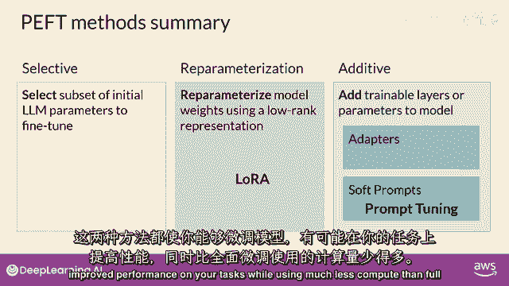

## 软提示的可解释性

一个潜在的问题是，学习到的软提示是否具有可解释性？由于软提示标记可以取嵌入空间中的任何连续值，它们并不直接对应于LLM词汇表中的任何已知单词或短语。

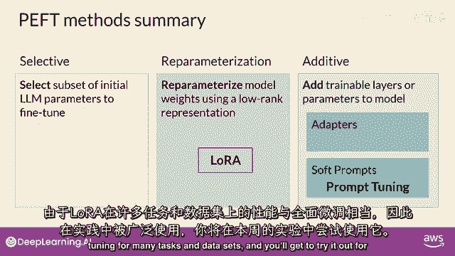

然而，对软提示位置在嵌入空间中的“最近邻”词汇进行分析发现，这些邻近词汇会形成紧密的**语义簇**。换句话说，最接近软提示的词汇通常具有相似的含义，并且这些词汇往往与目标任务相关。这表明软提示正在学习类似于“词”的表示，以引导模型完成特定任务。

---

## 总结

本节课中我们一起学习了参数高效微调（PEFT）的第二种关键技术——提示调整。

我们回顾了本周的核心内容：首先通过指令微调来适配基础模型，然后学习了如何用PEFT技术（包括LoRA和提示调整）来大幅降低微调的计算和内存成本。提示调整通过冻结LLM权重、仅训练添加到输入前的软提示向量来实现高效适配。它在大型模型上表现优异，且能像LoRA一样，为不同任务保存不同的适配器（软提示集），实现灵活切换。

**核心公式/概念回顾**：
*   **提示调整输入**：`E_input = concat(P_soft, E_text)`
*   **参数更新**：仅更新 `P_soft`，冻结LLM权重。
*   **组合技**：PEFT（如LoRA）可与第一周学习的量化技术结合，形成 **QLoRA**，进一步降低资源消耗。

PEFT技术被广泛用于最小化计算和内存资源，最终降低微调成本，是实践中非常强大的工具。在接下来的实验中，你将有机会亲自尝试它。恭喜你完成本周的学习！