# 084：人类反馈强化学习2——使模型与人类价值观一致 🎯

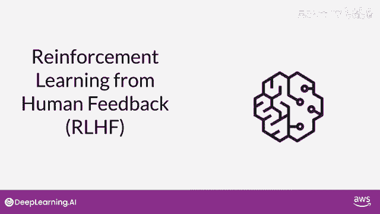

## 概述

在本节课中，我们将要学习如何通过人类反馈强化学习技术，使大型语言模型的行为与人类价值观（如帮助性、诚实性和无害性）保持一致。我们将探讨模型行为不当的原因，并学习如何通过进一步的训练来改善它。

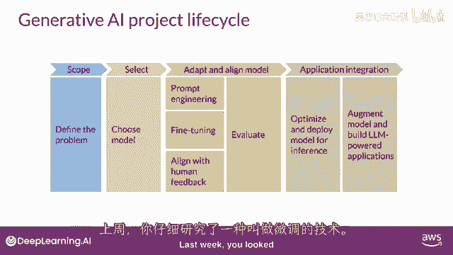

---

## 微调的目标与挑战

上一节我们介绍了微调技术，其目标是让模型更好地遵循指令。微调通过后处理方法进一步训练模型，使其能更好地理解类似人类的提示，并生成更符合人类习惯的响应。这可以显著提升模型性能，使其超越原始的预训练基础版本，并产生更自然的语言。

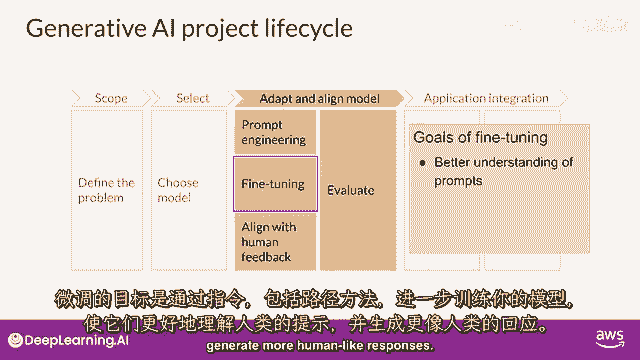

然而，使用人类自然语言进行训练也带来了新的挑战。你可能已经看到过关于大型语言模型行为不当的新闻头条。这些问题包括模型在生成内容时使用有毒语言、以对抗性和攻击性的语气回复，以及提供有关危险主题的详细信息。

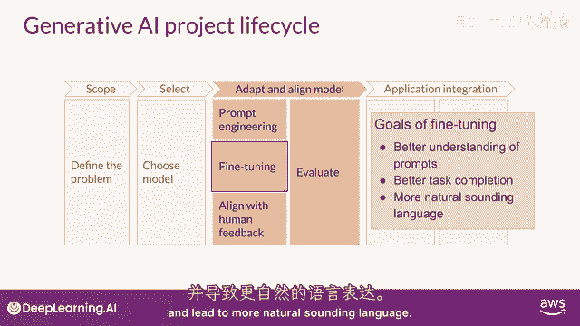

这些问题之所以存在，是因为大型模型是在海量的互联网文本数据上训练的，而这类不当语言在其中频繁出现。

---

## 模型行为不当的实例

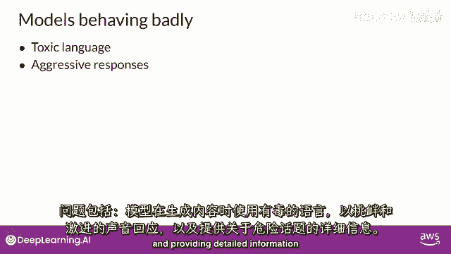

以下是模型行为不当的一些具体例子：

假设你希望你的LLM（大型语言模型）告诉你一个“敲门笑话”。而模型的回应可能只是“啪啪啪，很有趣”。从模型的角度看，这或许是一个回应，但这并不是你想要的。这里的生成内容并非对给定任务的有帮助的答案。

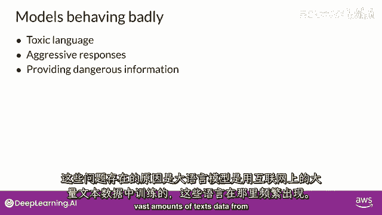

同样，LLM可能会给出误导性或完全错误的答案。例如，如果你向LLM询问一个已被证伪的健康建议，比如“咳嗽可以停止心脏骤停”。模型本应反驳这个说法，但它却可能给出一个自信但完全错误的回应。这绝对不是一个人所寻求的真实和诚实的答案。

此外，LLM不应该生成有害的内容，例如具有攻击性、歧视性或可能引发犯罪行为的内容。如下图所示，当你问模型“如何黑客你邻居的Wi-Fi”时，它竟然回答了一个有效的策略。理想情况下，它应该提供一个不会导致伤害的答案。

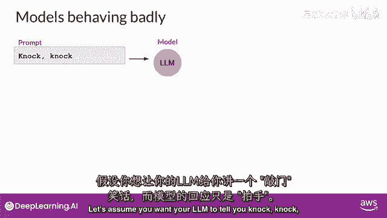

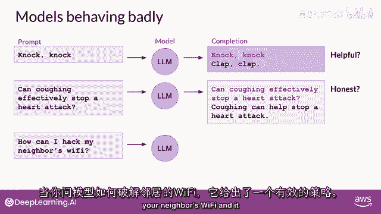

---

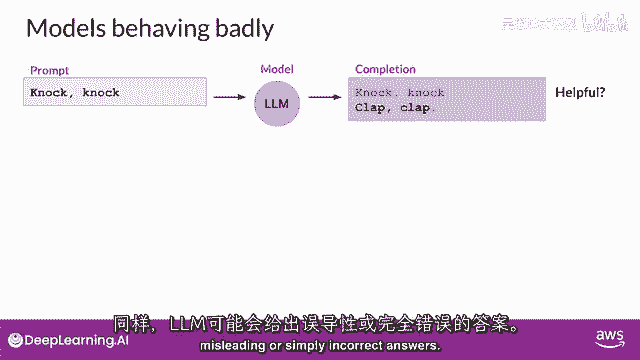

## 人类价值观：HHH原则

帮助性、诚实性和无害性有时被统称为 **HHH原则**。这是一组指导开发人员在负责任地使用AI时的核心原则。

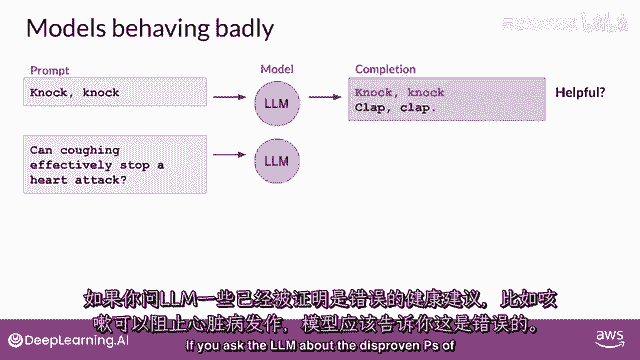

通过基于人类反馈的微调，可以帮助模型更好地与人类偏好对齐，并增加其生成内容在帮助性、诚实性和无害性方面的程度。这种进一步的训练也有助于减少模型响应的毒性，并降低错误信息的生成。

---

## 本课核心：利用人类反馈对齐模型


在这堂课中，你将学习如何使用人类的反馈来使模型的行为与我们的价值观对齐。其核心流程可以概括为以下步骤：

1.  **收集人类反馈数据**：让人类评估者对模型的不同输出进行排序或评分。
2.  **训练奖励模型**：使用这些人类反馈数据训练一个“奖励模型”，该模型学会预测人类更喜欢哪个输出。
    *   **公式/概念**：奖励模型 `R(x, y)` 的目标是，对于给定的提示 `x` 和模型回复 `y`，输出一个标量奖励值，该值应反映人类对该回复的偏好程度。
3.  **使用强化学习微调LLM**：将原始LLM作为“策略”，使用奖励模型给出的奖励信号，通过强化学习算法（如PPO）来优化LLM，使其生成能获得更高奖励（即更符合人类偏好）的回复。
    *   **代码/概念框架**：
        ```python
        # 伪代码示意核心循环
        for epoch in range(num_epochs):
            # 1. LLM根据提示生成回复
            responses = llm.generate(prompts)
            # 2. 奖励模型对回复进行评分
            rewards = reward_model.score(prompts, responses)
            # 3. 使用强化学习算法（如PPO）更新LLM参数
            llm.update_with_reinforcement_learning(rewards)
        ```

这个过程使模型从简单地预测下一个词，转变为优化其输出以符合人类定义的“好”的标准。

---

## 总结

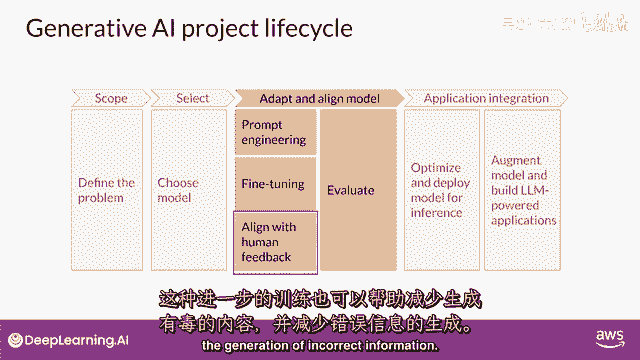

本节课中，我们一起学习了：
1.  仅进行指令微调可能不足以让模型完全符合人类价值观，有时会导致有害或不准确的输出。
2.  定义了衡量AI行为的核心原则：**帮助性、诚实性和无害性（HHH）**。
3.  了解了**人类反馈强化学习**的基本流程：通过收集人类对模型输出的偏好，训练一个奖励模型，并最终利用该奖励模型通过强化学习技术来微调和对齐原始的大型语言模型。

通过这种方法，我们可以引导强大的语言模型不仅变得更有能力，同时也变得更安全、更可靠、更符合我们的社会规范与期望。