# 085：人类反馈强化学习3——通过人类反馈进行强化学习（RLHF） 🧠

在本节课中，我们将要学习如何利用人类反馈来强化学习（RLHF），以微调大型语言模型（LLM），使其输出更符合人类偏好，例如更有用、更准确且无害。

上一节我们介绍了利用人类反馈进行微调的基本概念，本节中我们来看看其核心方法——强化学习从人类反馈（RLHF）的具体原理和应用。

## 任务示例：文本摘要 📝

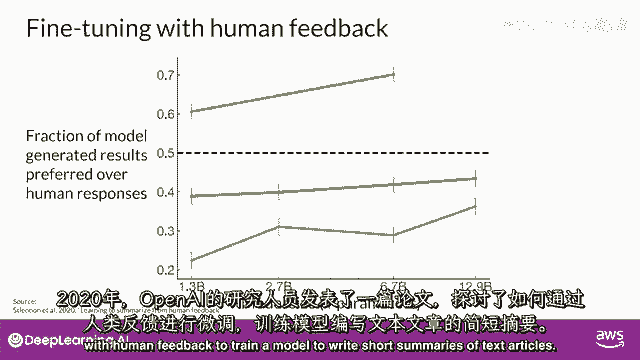

让我们考虑文本摘要的任务。你将使用模型生成短文本片段，以捕获长篇文章中最重要的点。你的目标是通过微调来提高模型的摘要能力。

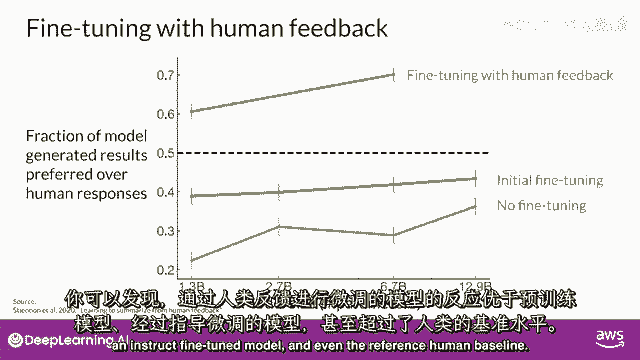

OpenAI的研究人员发表了一篇论文，探索了使用人类反馈进行微调的方法，以训练一个模型来撰写文本文章的短摘要。

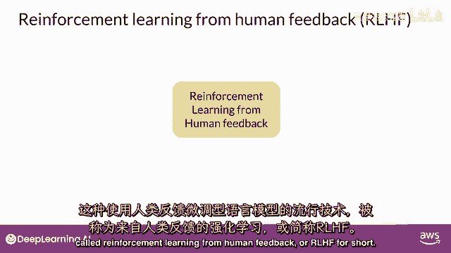

接受人类反馈微调的模型比预训练模型产生了更好的响应，甚至优于指令式微调模型。

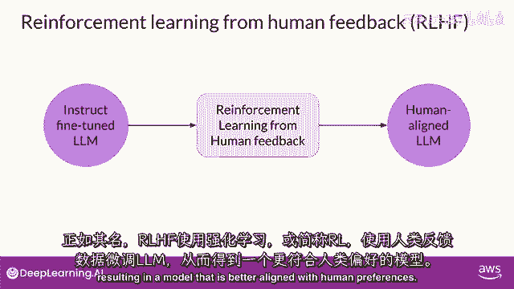

这种在具有人类反馈的大型语言模型中进行微调的技术，被称为**强化学习从人类反馈**，或 **RLHF**。

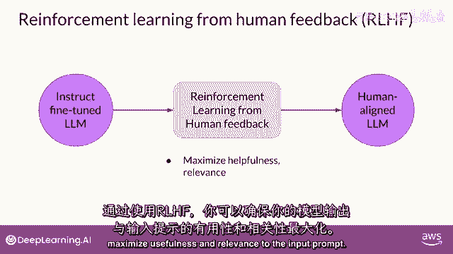

## 什么是RLHF？ 🤔

正如名字所示，RLHF使用**强化学习（RL）**，以人类反馈数据微调LLM，结果产生一个更与人类偏好对齐的模型。

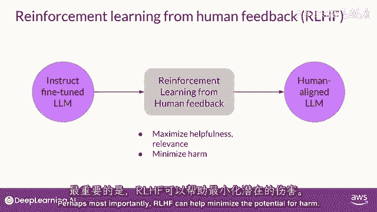

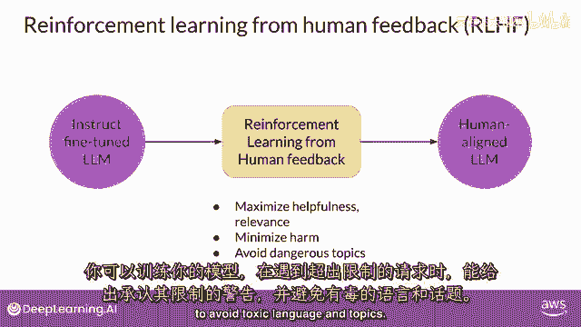

以下是RLHF的主要目标：

*   **最大化有用性和相关性**：确保模型产生的输出对输入提示有用且相关。
*   **最小化潜在伤害**：帮助模型避免产生有害内容。

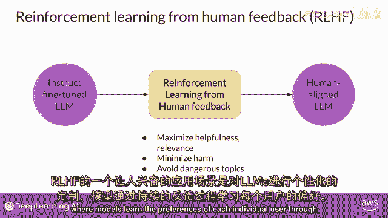

你可以训练你的模型给出承认其限制的警告，并避免在主题上使用有毒语言。

RLHF的一个潜在应用是LLM的个性化。模型通过连续反馈过程学习每个用户的偏好，这可能导致新的技术，如个性化学习计划或个性化AI助手。

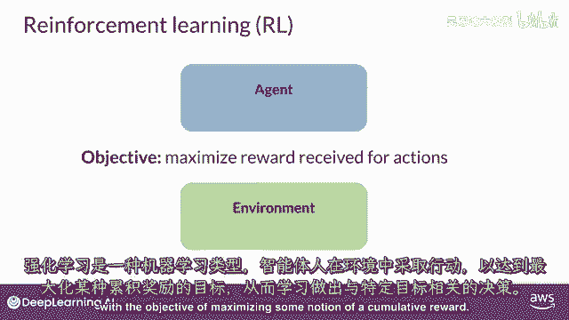

## 强化学习核心概念概述 🎯

要理解RLHF，我们需要先了解强化学习。如果你不熟悉强化学习，这里是对最重要概念的高级概述。

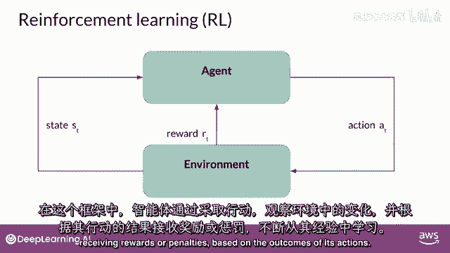

强化学习是一种机器学习方法。在其中，**代理（Agent）** 学习如何做出与特定目标相关的决策，通过在**环境（Environment）** 中采取**行动（Action）**。目标是在这个框架中最大化某种**累积奖励（Cumulative Reward）** 的概念。

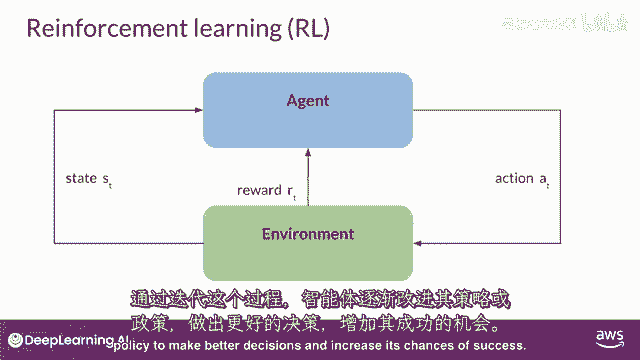

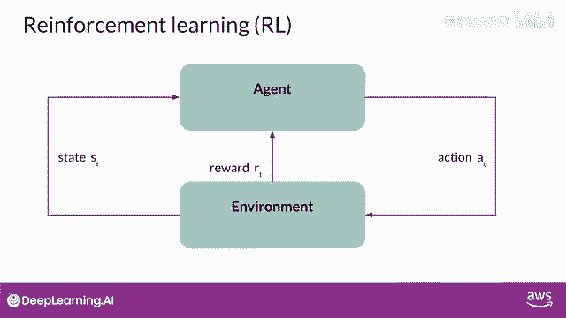

代理通过其行动不断学习，观察环境发生的变化，并根据其行动的结果接收**奖励（Reward）** 或惩罚。

通过这个过程的迭代，代理迅速改进其**策略（Policy）**，以做出更好的决策并增加成功的机会。

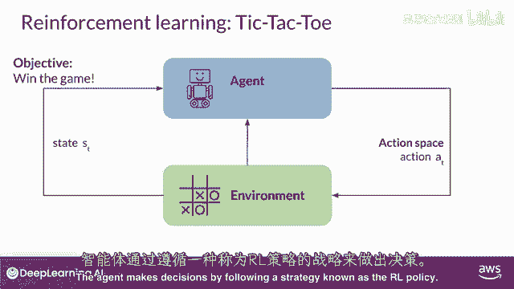

## 强化学习示例：井字棋 ⭕❌

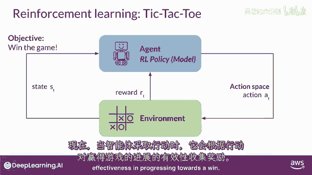

一个有用的例子来说明这些想法是训练模型玩井字棋。

在这个例子中：
*   **代理**：是一个模型或策略，作为井字棋玩家行动。
*   **目标**：赢得游戏。
*   **环境**：是三乘三的游戏板。
*   **状态（State）**：是当前时刻游戏板的配置。
*   **动作空间（Action Space）**：包括基于当前板状态的所有可能落子位置。

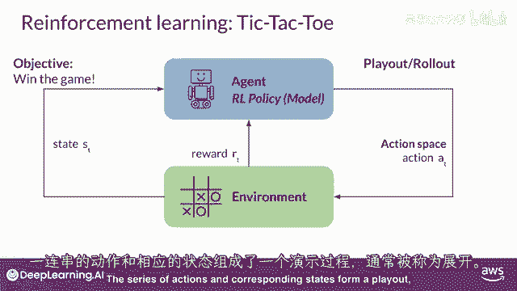

代理通过遵循称为**RL策略**的策略来做出决策。

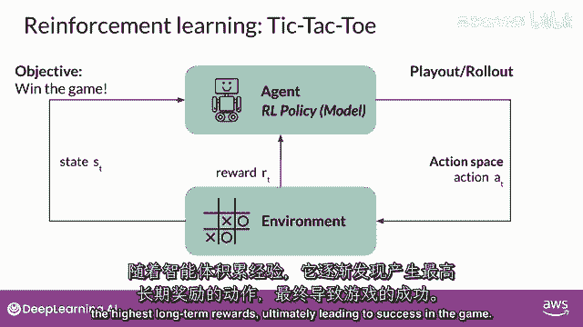

当代理采取行动时，它根据向胜利前进的行动效果收集奖励。

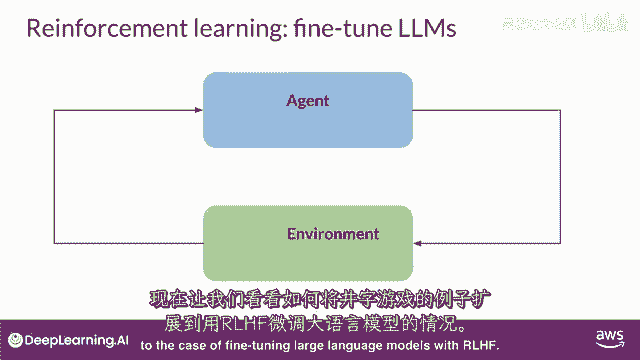

强化学习的目标是让代理学习给定环境中的**最优策略**，以最大化奖励。这个学习过程是迭代的，涉及试错。

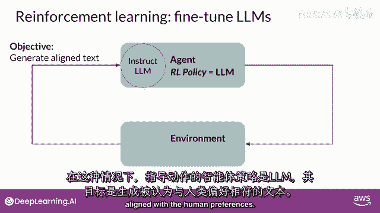

最初，代理采取随机行动，这将导致从当前状态到新状态的状态变化。代理继续探索后续状态以获取进一步行动。一系列行动和相应的状态形成一个游戏序列，通常被称为**轨迹（Trajectory）**。

随着代理的经验积累，它逐渐揭示出能带来最高长期回报的行动，最终导致游戏成功。

## 将RLHF应用于语言模型 🗣️➡️🤖

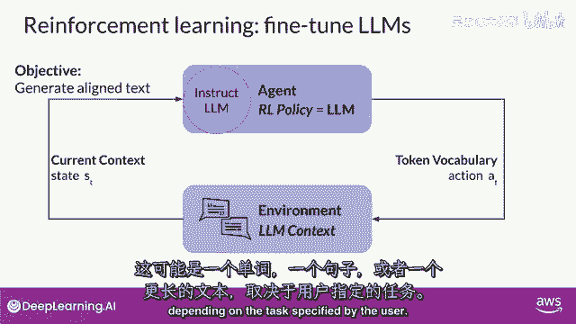

现在，让我们看看如何将井字棋的例子扩展到使用RLHF微调大型语言模型的情况。

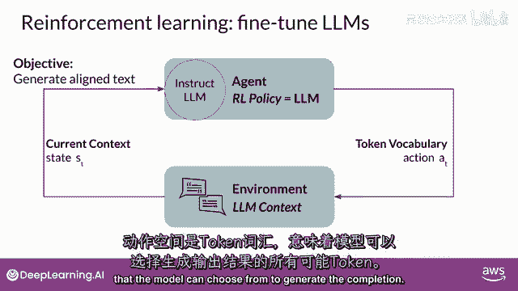

在这种情况下：
*   **代理/策略**：是LLM本身。
*   **目标**：生成被感知为与人类偏好一致（例如，有帮助、准确、无毒）的文本。
*   **环境**：是模型的**上下文窗口（Context Window）**，即提示和输入文本的空间。
*   **状态**：是当前上下文，意味着任何当前包含在窗口中的文本。
*   **动作**：是生成文本（一个词、一句话或更长文本）。
*   **动作空间**：是**标记词汇表（Token Vocabulary）**，即所有模型可以从中选择的潜在标记。

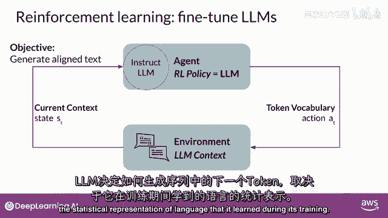

LLM如何决定序列中的下一个标记，取决于它在训练过程中学习到的语言统计表示。模型将采取的行动（即选择的下一个标记）取决于上下文中的提示文本，以及词汇空间上的概率分布。

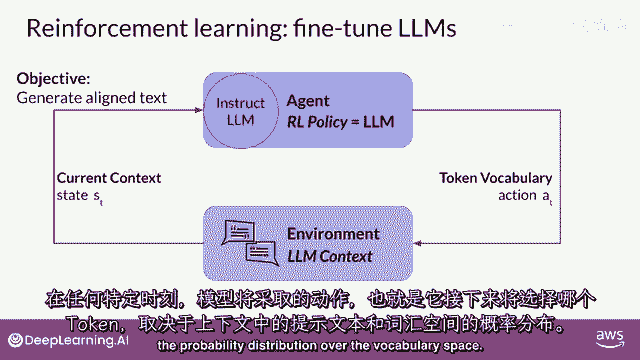

**奖励**被分配，基于生成的文本（完成度）与人类偏好的紧密程度。

## 奖励模型：人类偏好的代理 🏆

考虑到人类对语言的不同反应，确定奖励比井字棋的例子更复杂。

一种直接的方法是让人类评估模型的所有输出，根据某些对齐度量（例如，确定文本是否有毒）打分。这种反馈可以表示为一个标量值（例如，0或1）。LLM的权重然后迭代更新，以最大化从人类分类器获得的奖励，使模型能够生成更好的完成项。

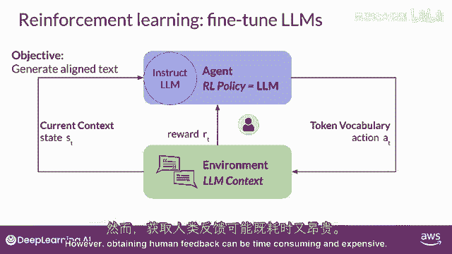

然而，作为实际和可扩展的替代方案，获取人类反馈可能需要时间和金钱。

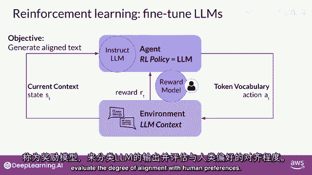

因此，你可以使用另一个模型，被称为**奖励模型（Reward Model）**，来分类LLM的输出，并评估其与人类偏好的吻合程度。

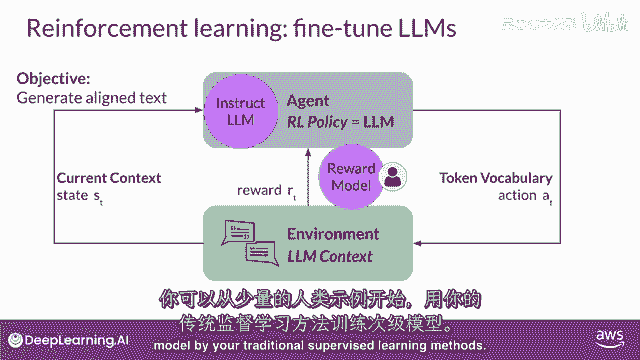

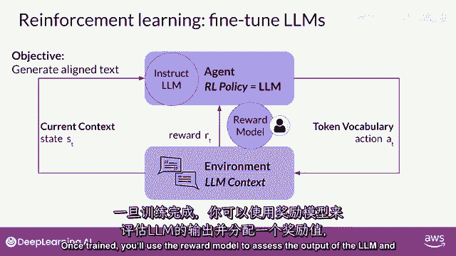

以下是训练和使用奖励模型的步骤：

1.  从少量人类标注的示例开始。
2.  使用传统的监督学习方法训练这个次要的奖励模型。
3.  使用训练好的奖励模型来评估LLM的输出，并分配一个奖励值。
4.  利用这个奖励值来更新LLM的权重，训练出一个新的、与人类偏好更对齐的版本。

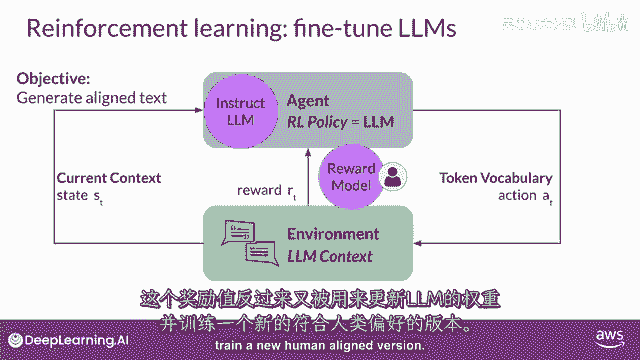

模型完成度被评估时，权重如何更新，具体取决于用于优化策略的强化学习算法。

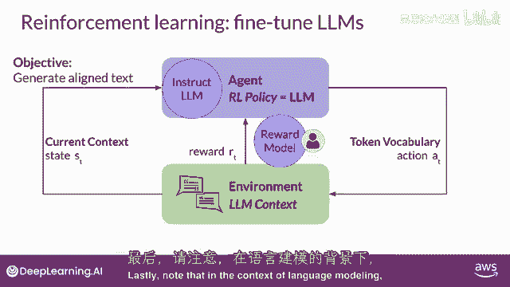

## 关键术语与总结 📚

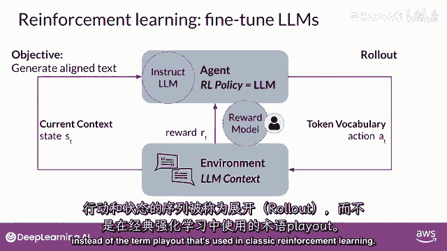

最后请注意，在语言模型的背景下，动作序列和状态序列被称为**轨迹（Trajectory）**，而不是在经典强化学习中常用的术语“回放”。

奖励模型是强化学习过程的核心组件，它编码了从人类反馈中学习的所有偏好，在模型更新其权重的多次迭代中起着核心作用。

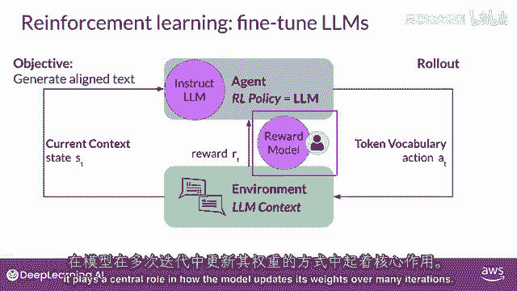

在本节课中，我们一起学习了强化学习从人类反馈（RLHF）的基本框架。我们了解了如何将LLM视为强化学习中的代理，其生成文本的行为如何被一个奖励模型评估和引导，以使其输出更符合人类的价值观和偏好。在下一个视频中，你将看到如何具体训练这个奖励模型，以及如何在强化学习过程中使用它来优化语言模型。