# 086：人类反馈强化学习（RLHF）——获取人类反馈信息 🧠💬

在本节课中，我们将学习人类反馈强化学习（RLHF）流程中的关键第一步：如何获取高质量的人类反馈数据。这是训练奖励模型的基础，对于后续的模型微调至关重要。

## 概述

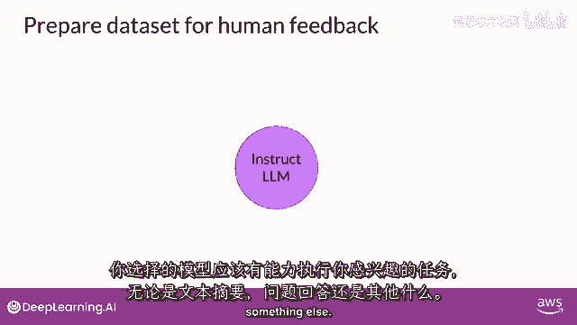

RLHF的第一步是准备一个用于收集人类反馈的数据集。这个过程始于选择一个基础模型，用它来生成多样化的响应，然后由人类评估者根据特定标准对这些响应进行排序和评估。

## 第一步：选择模型并生成响应

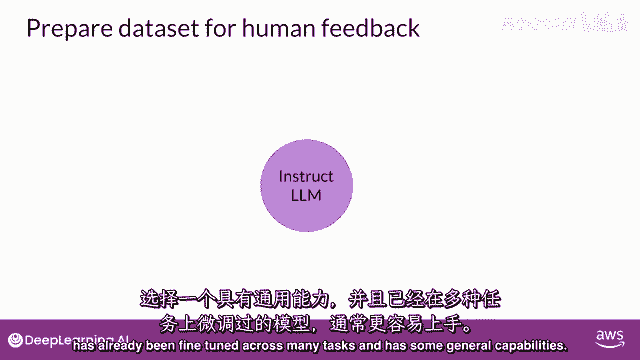

首先，需要选择一个能够执行目标任务的模型开始工作。这个任务可以是文本摘要、问答或其他通用任务。

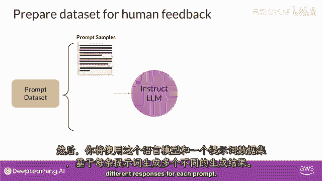

从一个已经过微调、具备多任务处理能力的基础模型开始可能更容易。

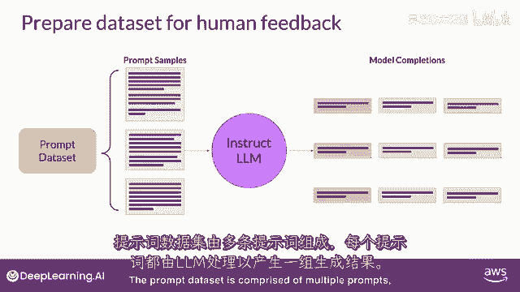

然后，使用这个大型语言模型（LLM）结合一个提示数据集，为每个提示生成多个不同的响应。

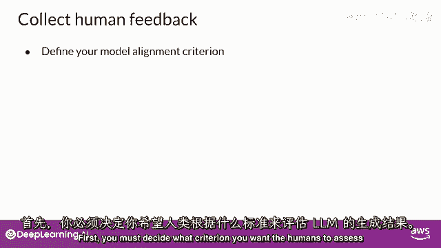

提示数据集由多个提示组成，每个提示都由语言模型处理，以产生一组“完成”（即模型生成的回答）。

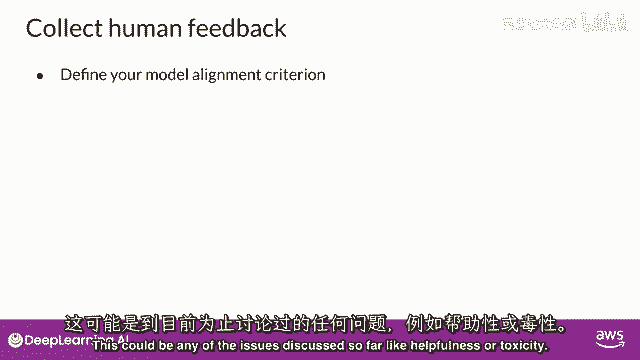

## 第二步：收集人类评估者的反馈

下一步是收集人类标签员对LLM生成的“完成”的反馈。这是“人类反馈”部分的核心。在强化学习中使用人类反馈，您必须首先决定人类评估者应遵循的评估标准。

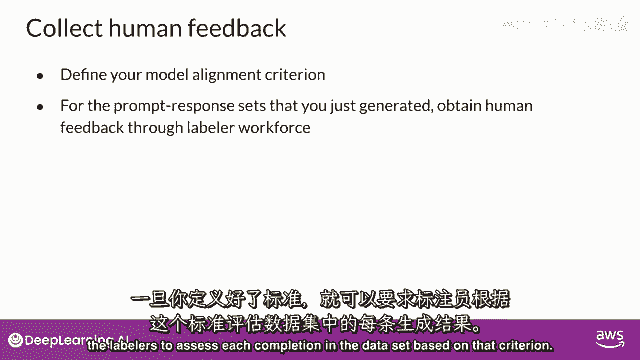

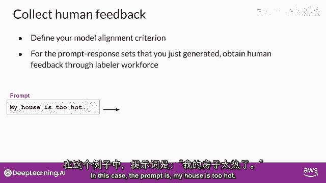

这些评估标准可以是之前讨论过的任何问题，例如回答的“帮助性”或“有害性”。

一旦确定了标准，就请评估者根据该标准，对数据集中的每个“完成”进行评估。

让我们看一个例子。假设提示是：“我家太热。”

将这个提示传递给LLM，生成了三个不同的“完成”。给标签员的任务是按“帮助性”进行排名，从最有帮助到最没有帮助。标签员可能认为“完成二”最有帮助，因为它告诉用户降温的方法。“完成一”或“完成三”可能没有帮助，但标签员可能认为“完成三”最差，因为它的回应与用户输入相悖。标签员将最佳完成排在第二。

这个过程会对多个提示及其对应的“完成”集重复进行，以构建可用于训练奖励模型的数据集。这个奖励模型最终将代替人类执行评估工作。

通常，相同的提示和“完成”集会分配给多个人类标签员，以建立共识并减少错误标签的影响。例如，如果第3个标签员的回答与其他人都不同，可能是误解了说明。这说明清晰的说明对反馈质量至关重要。

标签员通常从全球多样化的样本中抽取。以下是一个呈现给标签员的示例说明：

> **任务说明：选择最佳完成**
>
> 1.  您的总体任务是：对于给定的提示，从几个模型生成的回答（“完成”）中，选择您认为最好的一个。
> 2.  请基于您对回答**正确性**和**信息性**的感知做出决定。您可以使用互联网核实事实或查找额外信息。
> 3.  如果遇到您认为同样正确和信息丰富的“完成”对（平局），可以将其排名为相同，但请尽量减少这种情况。
> 4.  如果遇到无意义、令人困惑或不相关的答案，请选择标记为“F”（低质量）的选项，而不是对其进行排名。

提供详细的指导可以提高获得高质量回复的概率，并确保不同个体完成任务的方式相似。这有助于确保标注完成的集合代表共识观点。

## 第三步：为训练奖励模型准备数据

在人类评估者完成对提示和“完成”集的评估后，您就拥有了训练奖励模型所需的所有数据。这个奖励模型将在后续的强化学习中用于评估模型生成的“完成”，从而替代人类。

然而，在开始训练奖励模型之前，需要将排名数据转换为成对比较的格式。

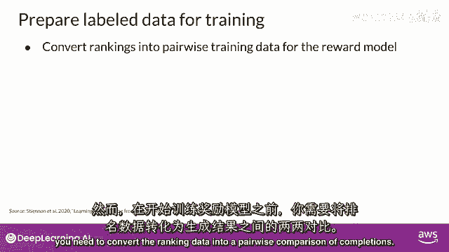

换句话说，需要将一个提示下所有可能的“完成”对，根据人类偏好分类为“胜出”（得1分）或“落败”（得0分）。

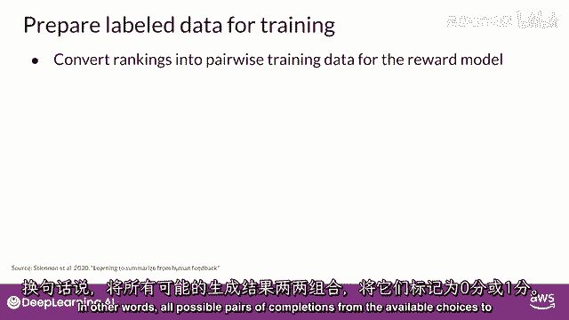

如图所示，对于一个提示有3个“完成”，人类标签员分配的排名为2、1、3（1为最高排名，对应最受欢迎的回应）。

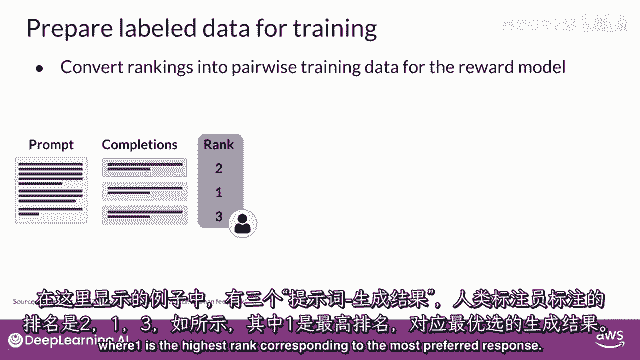

这里有三种不同的“完成”。

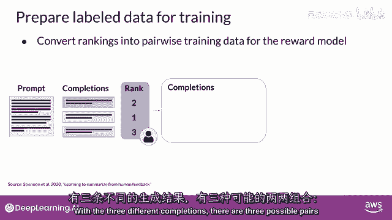

根据提示的备选“完成”数 `n`，每对有 `C(n, 2)` 种组合（即 `n` 选 2）。

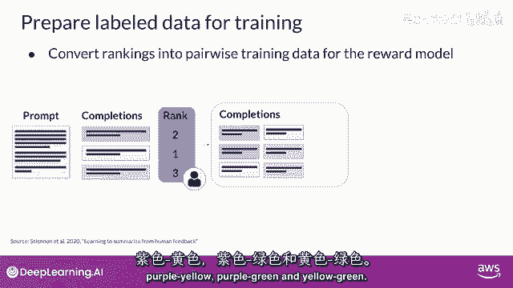

对于每一对，给优选回复打1分，给次选回复打0分。

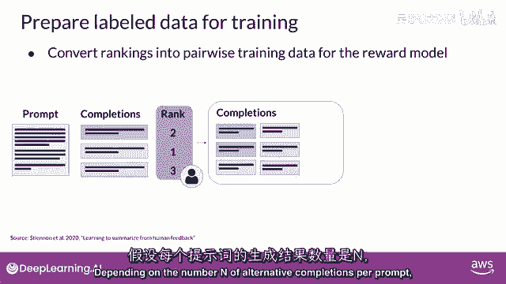

然后，在数据中重新排列提示，确保优选的“完成”在前。这是重要的一步，因为奖励模型在训练时期望输入的“首选完成”（称为 `y_j`）排在前面。

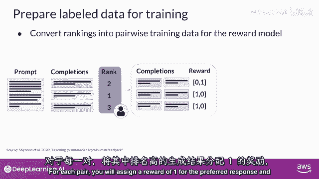

一旦完成此数据重构，人类反馈数据就符合了训练奖励模型所需的格式。

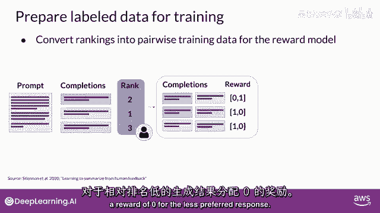

**需要注意**：虽然“点赞/点踩”的反馈通常比排名反馈更容易收集。

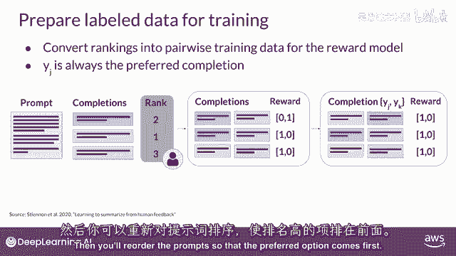

但排名反馈能为训练奖励模型提供更多关于提示和“完成”对的偏好数据。

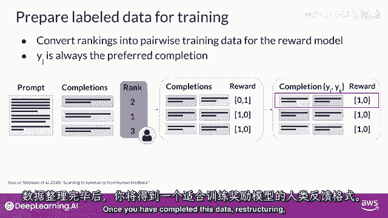

## 总结

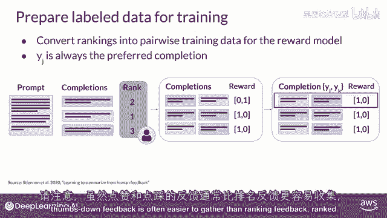

本节课中，我们一起学习了RLHF流程中获取人类反馈的关键步骤：
1.  **选择基础模型并生成响应**：使用一个LLM为一系列提示生成多个“完成”。
2.  **设计并收集人类反馈**：定义清晰的评估标准（如帮助性），并提供详细说明，让人类评估者对“完成”进行排名，以确保数据质量。
3.  **准备训练数据**：将人类排名数据转换为成对比较的格式（胜/负对），以便后续用于训练奖励模型。

这个过程为后续使用强化学习微调语言模型奠定了坚实的基础。清晰的指令和高质量的人类反馈数据是构建有效奖励模型的关键。