# 087：人类反馈强化学习5——RLHF - 奖励模型 🏆

在本节课中，我们将要学习人类反馈强化学习（RLHF）流程中的核心组件——奖励模型。我们将了解如何训练奖励模型来替代人类标注者，自动评估和选择语言模型的输出。

---

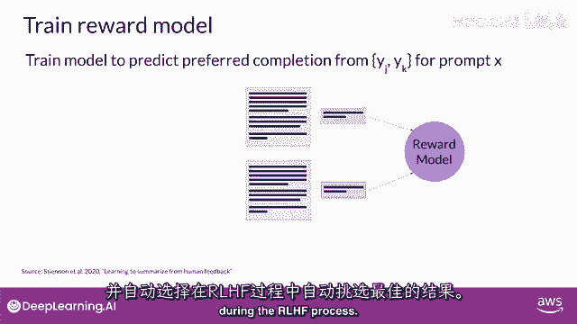

上一节我们介绍了如何通过人类标注获得成对的偏好数据。本节中我们来看看如何利用这些数据来训练一个奖励模型。

好的，目前阶段，你已拥有训练奖励模型的所有必要内容。虽然到达这一点花费了相当多的人力，当你完成训练奖励模型时，将不再需要将人类纳入循环中。相反，奖励模型将有效地脱离人类标注者，并在RLHF过程中自动选择首选完成。

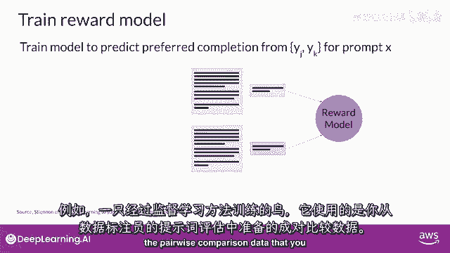

此奖励模型通常也是一个语言模型。例如，使用监督学习方法训练的模型，基于你准备的成对比较数据。

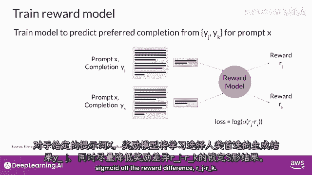

从人类标注者对给定提示 `x` 的评价中，奖励模型学会偏爱人类首选完成 `y_j`，同时最小化奖励差异 `r_j` 减去 `r_k` 的对数sigmoid损失，如上一页所示。

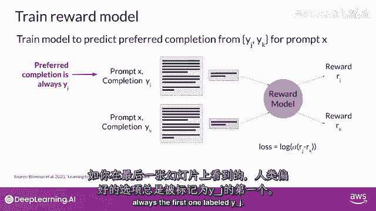

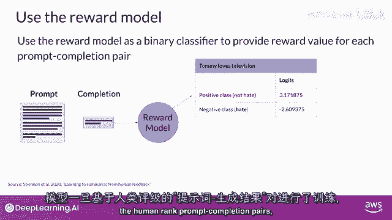

人类首选选项始终是第一个标记为 `y_j` 的。一旦模型在人类排名的提示-完成对上进行训练，你就可以将奖励模型用作二元分类器。

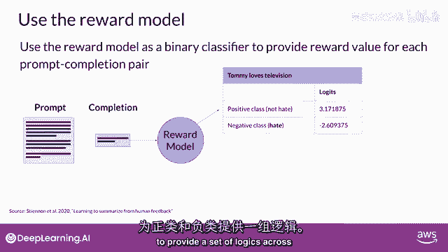

以下是奖励模型作为分类器的工作原理：

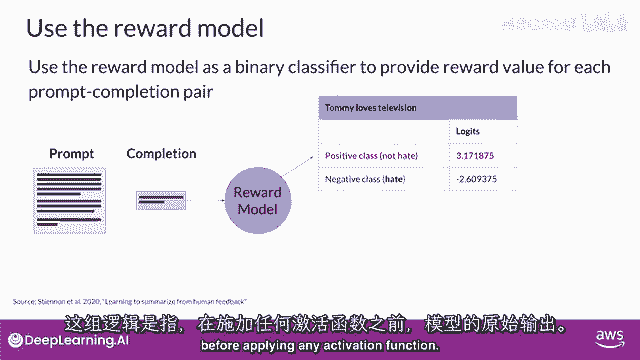

为正负类提供一系列逻辑值。逻辑是未应用任何激活函数的模型原始输出。

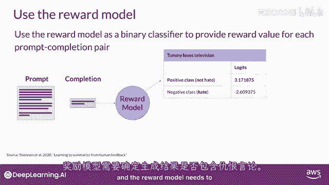

假设你想净化你的LLM，并且奖励模型需要识别完成是否包含仇恨言论。在这种情况下，两个类别将是：
*   **非仇恨**：即你最终希望优化的正面类别。
*   **仇恨**：即你想避免的负面类别。

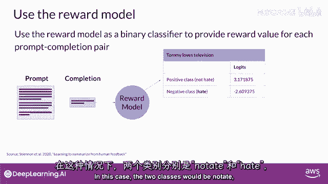

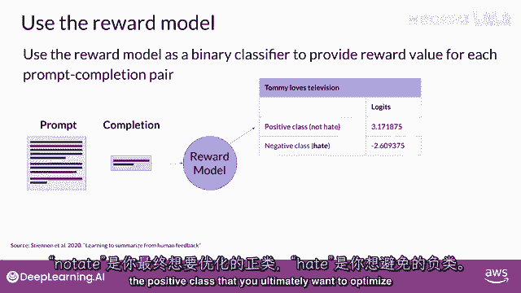

正面类别的逻辑值就是你在RLHF中使用的奖励值。提醒一下，如果你对逻辑值应用softmax函数，你将获得概率。

此示例显示了对非毒性完成的良好奖励：

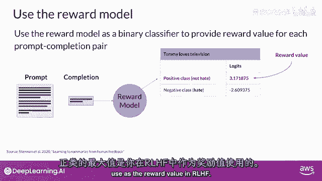

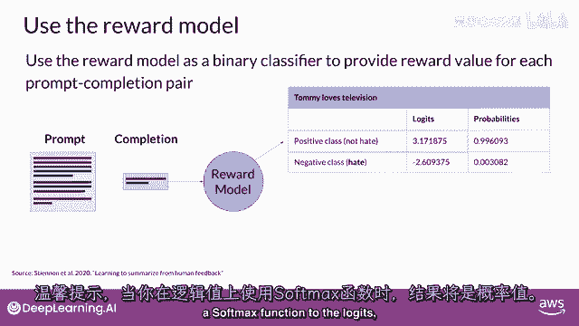

第二个示例显示了对毒性完成的糟糕奖励：

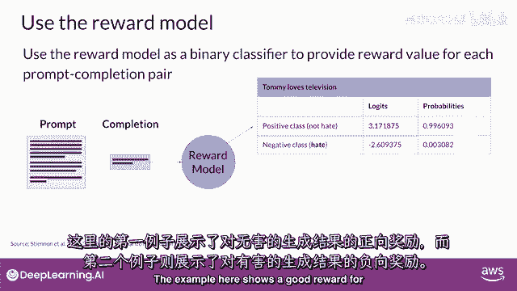

我知道这节课到目前为止已经涵盖了大量内容，但此时你拥有了一个强大的工具——奖励模型，用于对齐你的LLM。

---

本节课中我们一起学习了奖励模型的构建与作用。奖励模型基于人类偏好数据训练，能够自动为语言模型的生成结果打分，从而在后续的强化学习阶段替代人类进行反馈。下一步是探索奖励模型如何在强化学习过程中使用，以训练最终与人类价值观对齐的LLM。