# 088：人类反馈强化学习6——RLHF - 通过强化学习进行微调 - 吴恩达大模型 🧠

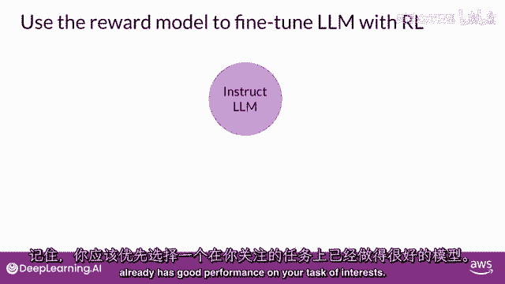

在本节课中，我们将要学习如何整合奖励模型与强化学习算法，以更新大型语言模型的权重，从而生成与人类偏好对齐的模型。我们将详细解析RLHF过程的每个迭代步骤。

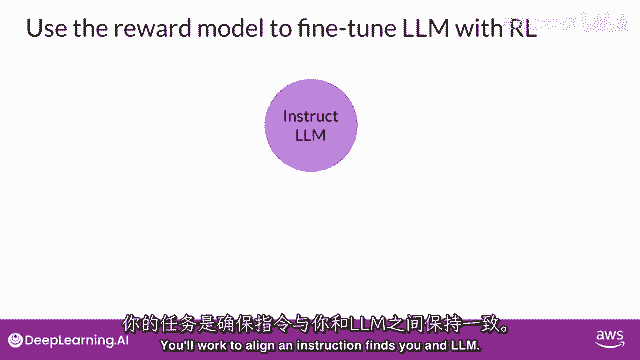

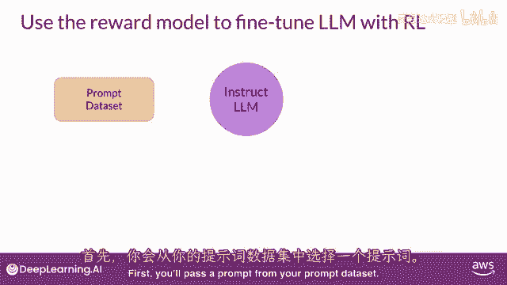

## 概述

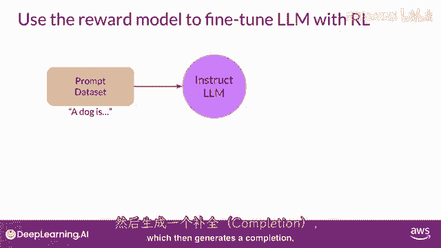

我们将从介绍RLHF的整体流程开始，说明如何利用奖励模型的反馈，通过强化学习算法来优化一个初始表现良好的模型，使其输出更符合人类价值观。

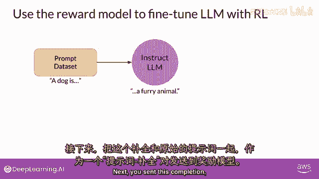

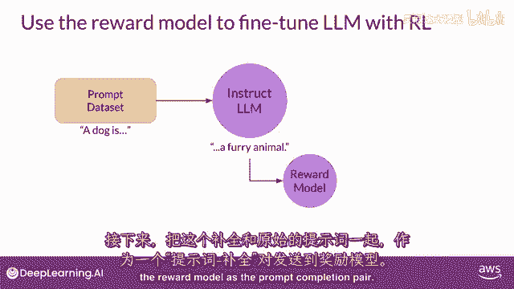

## RLHF流程详解

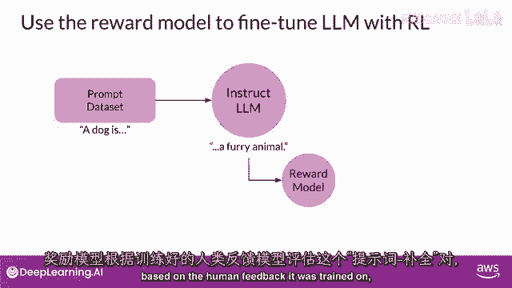

上一节我们介绍了奖励模型的构建，本节中我们来看看如何将其整合到强化学习循环中。

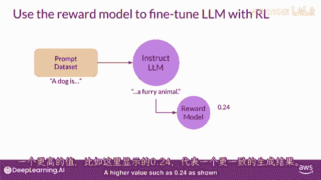

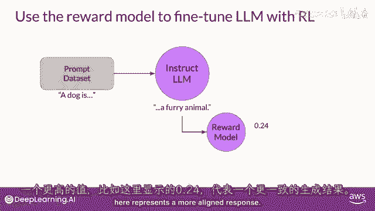

首先，您需要从一个在特定任务上表现良好的预训练模型开始。这个模型将作为我们进行人类对齐优化的起点。

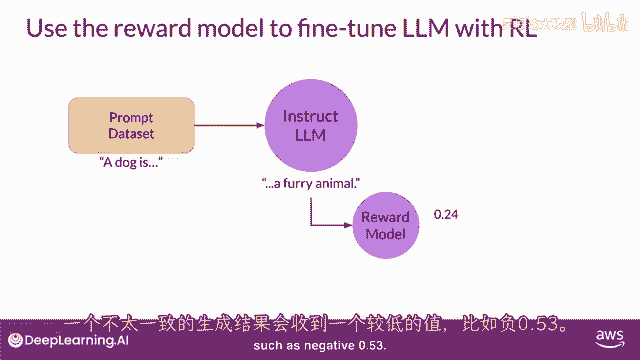

以下是RLHF单次迭代的核心步骤：

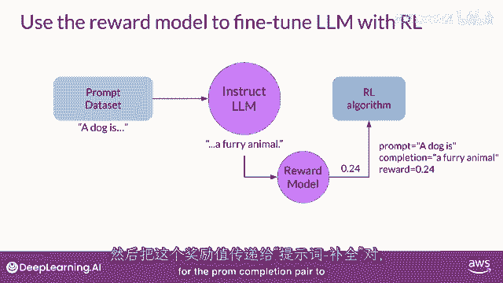

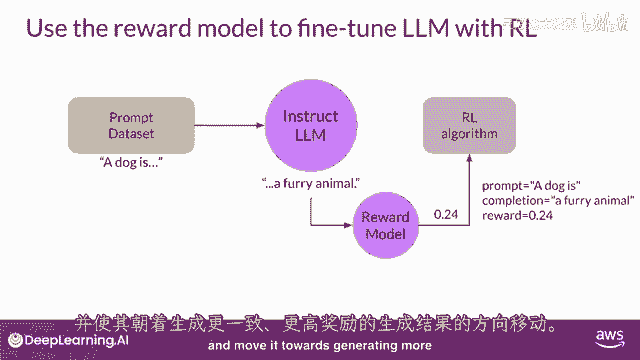

1.  **生成响应**：从提示数据集中取出一个提示，输入给待优化的语言模型，让其生成一个完成文本。
    *   例如，提示是“狗是”，模型可能生成“一条肢体”或“一个毛茸茸的动物”。

2.  **评估奖励**：将上一步生成的“提示-完成”对发送给预先训练好的奖励模型。
    *   奖励模型基于其学习到的人类偏好，对该响应进行评估。
    *   评估结果是一个奖励值。更高的正值（例如 `0.24`）代表响应更符合人类偏好；更低的负值（例如 `-0.53`）代表响应一致性较差。

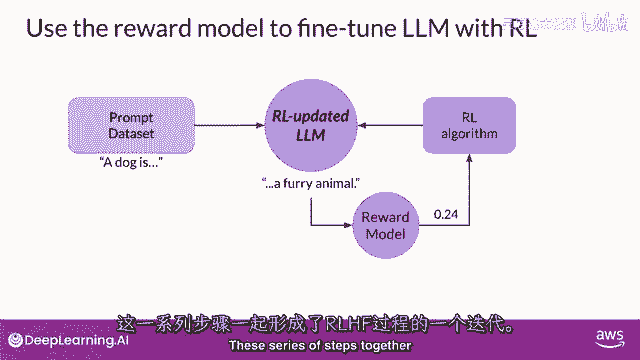

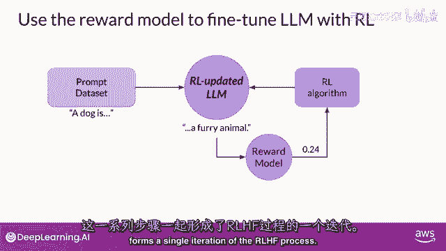

3.  **更新模型**：将这个奖励值连同“提示-完成”对一起，传递给强化学习算法。
    *   强化学习算法利用这个奖励信号来更新语言模型的权重。
    *   更新的目标是使模型未来能生成获得更高奖励（即更对齐）的响应。

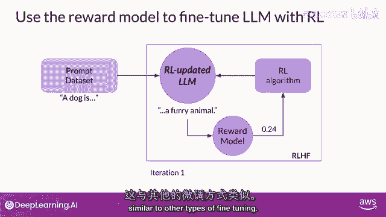

我们将这个经过一轮强化学习更新的中间模型称为 **RL更新LLM**。

这些步骤共同构成了RLHF过程的一次迭代。类似于其他微调方法，您会观察到，经过RL更新的模型生成的响应会获得越来越高的奖励分数，这表明权重更新正在引导模型产生更符合人类偏好的文本。

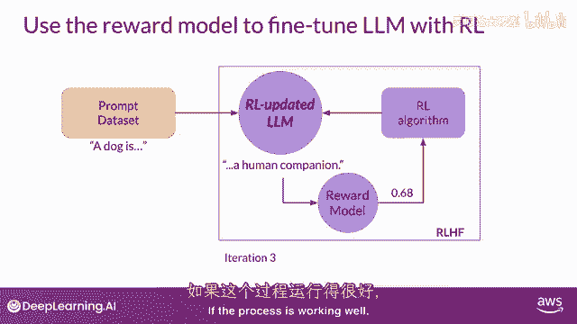

## 迭代与终止

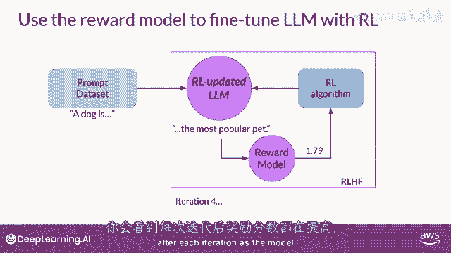

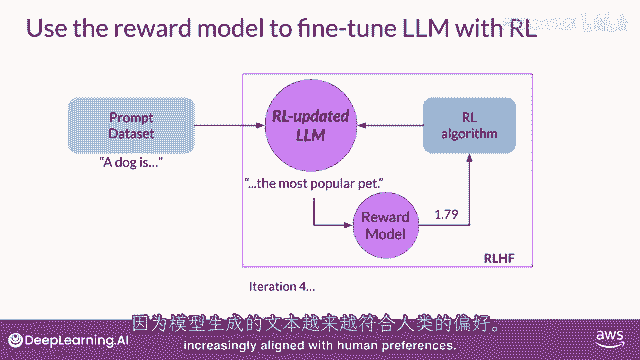

如果过程进展顺利，在每次迭代后，模型的平均奖励值都会有所提升。

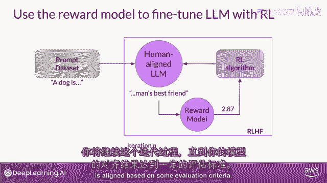

您需要持续这个迭代过程，直到模型达到“对齐”状态。对齐的标准可以基于您定义的评估指标，例如：
*   达到预设的有用性阈值。
*   达到预设的最大训练步数（例如 `20,000` 步）。

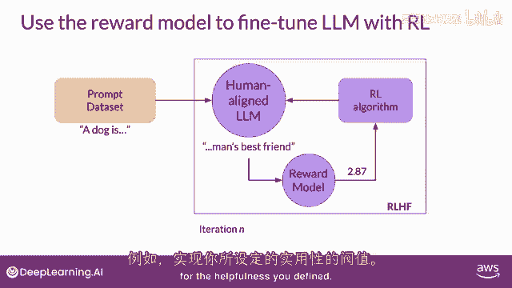

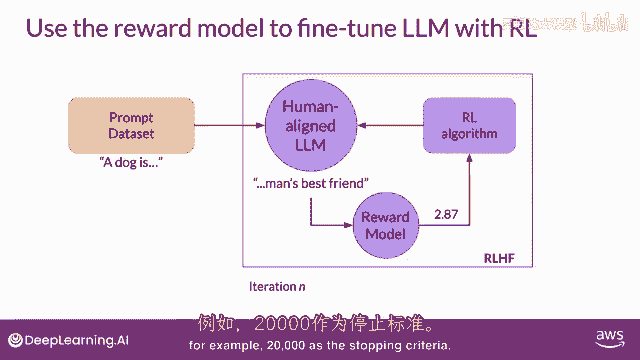

当满足终止条件时，我们便得到了最终的 **人类对齐LLM**。

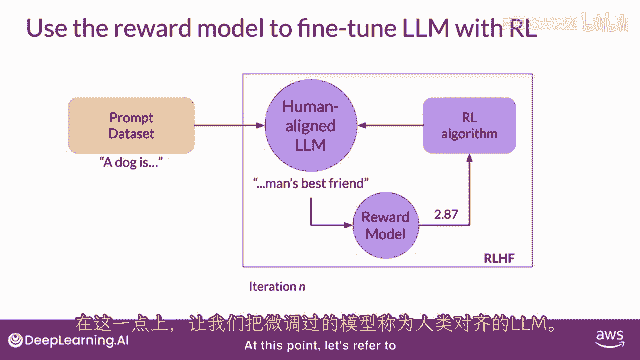

## 关于强化学习算法

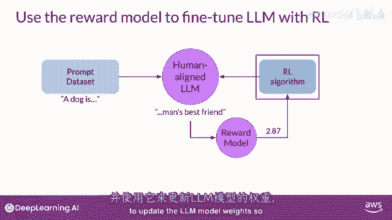

我们尚未详细讨论的一个关键细节是具体使用哪种强化学习算法。该算法的职责是接收奖励模型的输出，并据此更新LLM的权重，以促使奖励得分随时间增长。

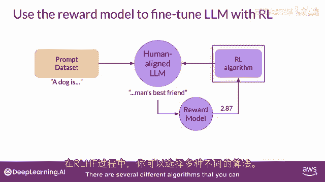

对于RLHF的这一部分，您有几种算法可以选择。一个流行的选择是 **近端策略优化**，简称 **PPO**。

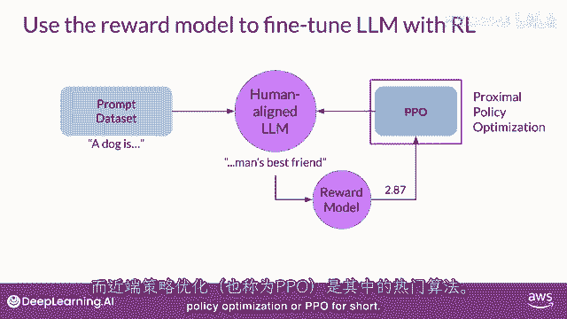

PPO是一个相当复杂的算法。对于应用而言，您无需熟悉其所有内部细节即可使用它。然而，由于实现难度较高，更深入地了解其工作原理将有助于您在遇到问题时进行调试。

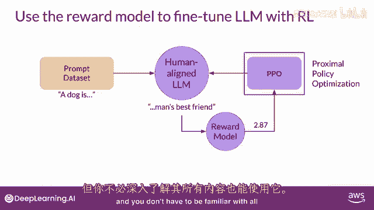

> 注：关于PPO算法的详细技术解释，我们将在下一个可选视频中由专家进行深入探讨。您可以选择跳过该视频，这不会影响完成本周的测验或作业。但由于LLM日益重要，我们鼓励有兴趣的学习者查看详情。

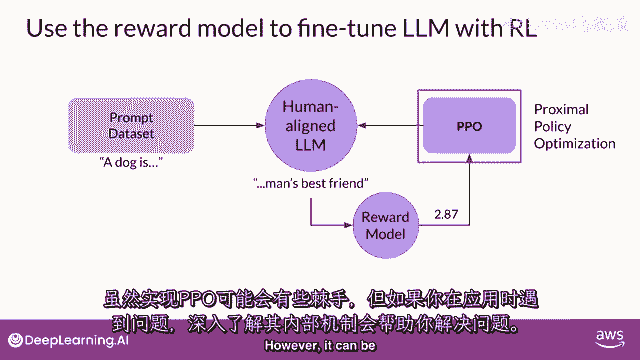

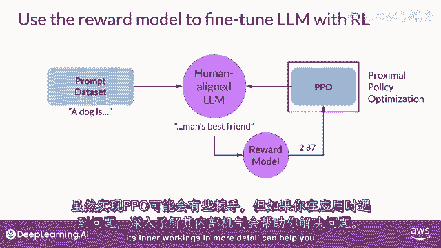

## 总结

本节课中我们一起学习了RLHF（人类反馈强化学习）的完整微调流程。我们了解到，该流程始于一个基础模型，通过迭代地生成响应、使用奖励模型进行评估、并应用强化学习算法（如PPO）更新模型权重，最终训练出一个与人类偏好高度对齐的语言模型。整个过程的核心目标是让模型的输出越来越符合人类的价值观和意图。