# 089：人类反馈强化学习7——PPO增强学习算法深度解析 🧠

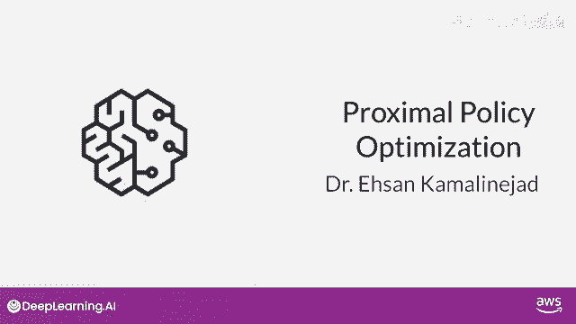

## 概述

在本节课中，我们将要学习近端策略优化算法。这是一种用于强化学习的强大算法，特别适用于根据人类反馈来微调大型语言模型，使其输出更符合人类的偏好。

---

## PPO算法简介

PPO代表近端策略优化。顾名思义，PPO优化策略，使大型语言模型更符合人类偏好。经过多次迭代，PPO会更新大型语言模型，但更新幅度很小且被限制在一定范围内。结果是一个与先前版本非常接近的更新后模型，因此名为“近端”策略优化。将变化保持在这个小区域内，能带来更稳定的学习过程。

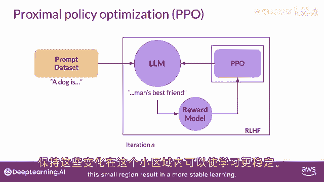

上一节我们介绍了PPO的基本概念，本节中我们来看看它的具体工作流程。

---

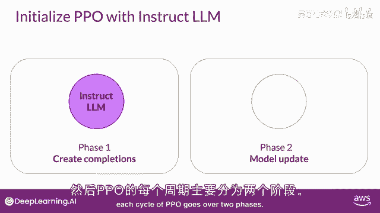

## PPO的工作流程

从高层次来看，每个PPO周期包括两个阶段。

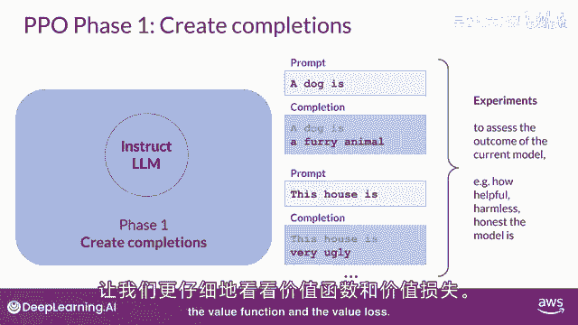

在第一阶段，使用大型语言模型进行一系列实验，以完成给定的提示。这些实验为第二阶段更新模型以对抗奖励模型提供了数据。奖励模型旨在捕获人类偏好，例如，奖励可以定义为响应有多有帮助、无害和诚实。

以下是PPO第一阶段的核心步骤：
*   使用初始指导性大型语言模型生成对一系列提示的完成文本。
*   使用奖励模型计算每个“提示-完成”对的奖励值。

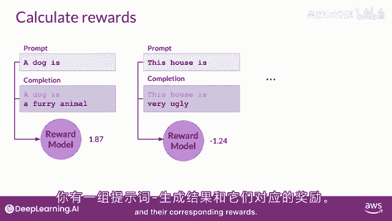

---

## 价值函数与价值损失

完成奖励是一个重要的PPO目标量。我们通过大型语言模型的一个单独头部——价值函数来估计这个量。

价值函数估计给定状态 `s` 的预期总奖励。在大型语言模型的上下文中，状态 `s` 是到当前为止生成的令牌序列。价值损失衡量预测奖励与实际奖励之间的差异，可视为一个基准，用于评估完成质量与对齐标准。

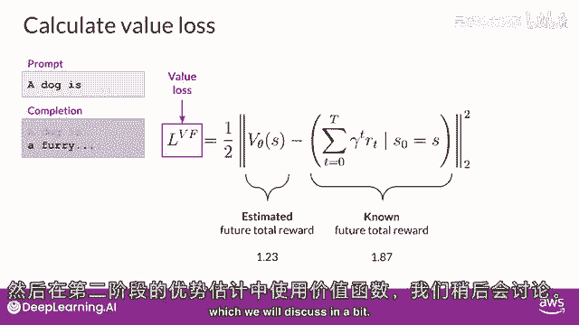

假设在生成某个令牌时，价值函数预测未来总奖励为 `0.34`。生成下一个令牌时，预测值增至 `1.23`。价值损失的目标是减少预测值与实际未来总奖励（例如 `1.87`）之间的差距。优化价值损失能使未来奖励的估计更准确。价值函数的输出将在第二阶段用于优势估计。

这类似于你开始写文章时，对最终形式有一个大致的想法。

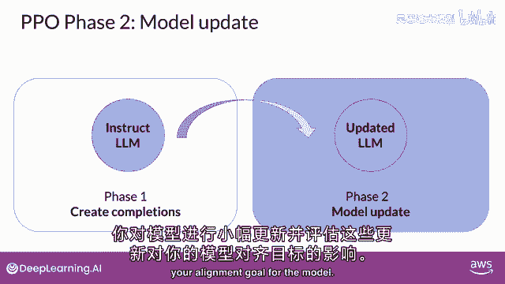

---

## PPO的第二阶段：策略更新

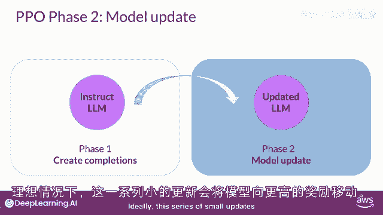

你提到第一阶段确定的损失和奖励用于第二阶段，以更新权重来更新大型语言模型。现在我们来更详细地解释此过程。

在第二阶段，对模型进行小幅更新，并评估这些更新对模型对齐目标的影响。模型权重的更新由“提示-完成”对、损失和奖励值引导。PPO确保模型更新被限制在一个小区域内，称为信任区域，这正是PPO“近端”特性的体现。理想情况下，这些小更新会将模型推向能获得更高奖励的方向。

以下是第二阶段的关键点：
*   对模型权重进行小幅更新。
*   更新被限制在“信任区域”内，以确保稳定性。
*   目标是使更新后的模型能产生获得更高奖励的响应。

---

## PPO策略目标

PPO策略目标是此方法的核心成分。其目标是找到预期奖励高的策略，即更新大型语言模型，使其权重能产生更符合人类偏好的完成文本，从而获得更高奖励。策略损失是PPO算法在训练中试图优化的主要目标。

我知道相关公式看起来很复杂，但实际上它比看起来简单。让我们逐步分解。

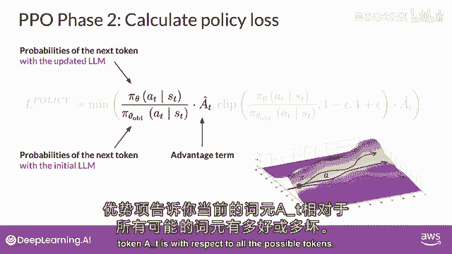

首先，关注主要表达式 `(π_θ(a_t|s_t) / π_θ_old(a_t|s_t)) * A_t`。
*   在大型语言模型的上下文中，`π_θ(a_t|s_t)` 是给定当前提示和已生成令牌序列（状态 `s_t`）的条件下，选择下一个令牌（动作 `a_t`）的概率。
*   分母 `π_θ_old(a_t|s_t)` 是初始（冻结）版本的大型语言模型生成该令牌的概率。
*   分子 `π_θ(a_t|s_t)` 是更新后的大型语言模型生成该令牌的概率，我们可以改变它以获得更好奖励。
*   `A_t` 是特定动作选择的估计优势项。优势项估计当前动作与该状态下所有可能动作的平均水平相比的好坏。

优势项告诉你当前选择的令牌，相对于所有可能令牌的好坏。正优势意味着建议的令牌优于平均，因此增加其概率是好的策略；负优势则意味着建议的令牌比平均差，应降低其概率。

所以，最大化 `(π_θ(a_t|s_t) / π_θ_old(a_t|s_t)) * A_t` 这个表达式，理论上会导致更好对齐的大型语言模型。

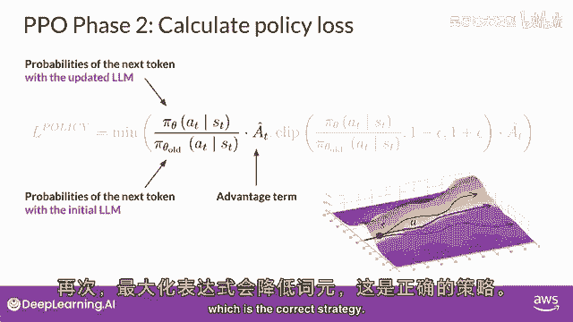

---

## 信任区域与完整目标函数

那么我们是否只需最大化这个表达式？直接最大化该表达式会导致问题，因为我们的优势估计仅在旧策略和新策略接近时才有效。这就是完整PPO目标函数中其他部分发挥作用的地方。

完整的PPO策略目标函数为：
`L_t(θ) = min( r_t(θ) * A_t, clip(r_t(θ), 1-ε, 1+ε) * A_t )`
其中 `r_t(θ) = π_θ(a_t|s_t) / π_θ_old(a_t|s_t)`。

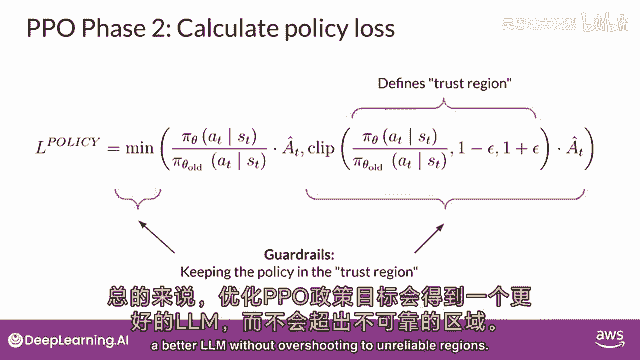

该函数选择两个项中较小的一个：我们刚刚讨论的原始比率项，以及一个经过裁剪的版本。裁剪操作 `clip(r_t(θ), 1-ε, 1+ε)` 定义了两个策略必须保持接近的区域（即信任区域）。这些附加条款是护栏，确保更新不会过度偏离到优势估计不可靠的区域。

总之，优化PPO策略目标可以在不过度偏离到不可靠区域的前提下，得到更好的大型语言模型。

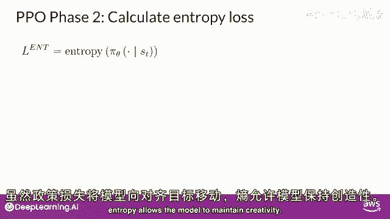

---

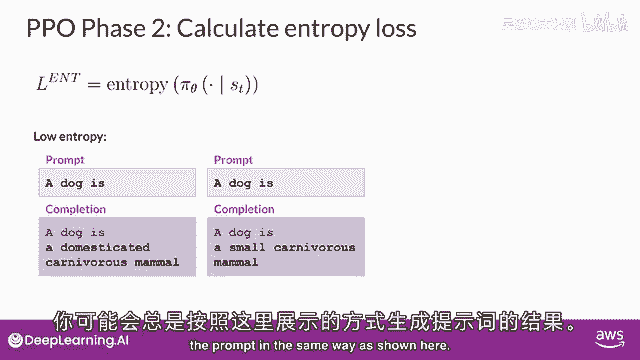

## 熵损失与总体目标

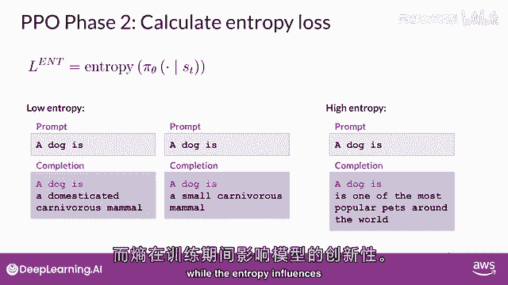

策略损失使模型向对齐方向移动，而熵损失则允许模型保持一定的创造性。如果熵保持很低，模型可能会总是以相同的方式完成提示。更高的熵会引导大型语言模型产生更多样化、更有创意的输出。

这类似于在模型推理时调整“温度”参数。区别在于，温度影响模型在推理时的创造力，而熵损失影响模型在训练期间的创造力。

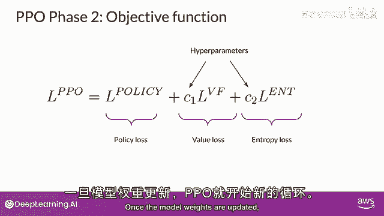

将所有项作为加权总和，我们得到完整的PPO目标函数：
`L_total = L_policy + c1 * L_value + c2 * L_entropy`
其中 `c1` 和 `c2` 是超参数。PPO目标通过反向传播来更新模型权重。

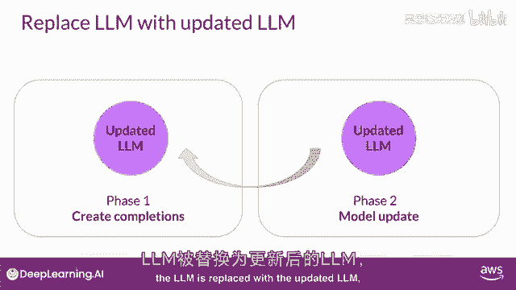

一旦模型权重更新，PPO便开始新的周期进行下一次迭代，用更新后的模型替换旧的模型。经过多次迭代后，最终会得到一个与人类偏好更好对齐的大型语言模型。

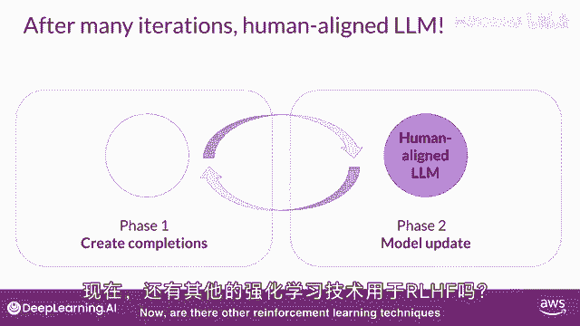

---

## 其他技术与总结

还有其他强化学习技术可用于基于人类反馈的强化学习吗？是的，例如Q学习是另一种通过强化学习微调大型语言模型的技术。但PPO是目前最流行的方法，因为它实现了复杂性和性能的良好平衡。

尽管如此，通过人类或AI反馈微调大型语言模型是一个活跃的研究领域。我们可以期待这个领域在不久的将来会有更多发展。例如，就在录制本视频之前，斯坦福的研究人员发表了一篇描述称为“直接偏好优化”的技术论文，这是一种比基于人类反馈的强化学习更简单的替代方法。像这样的新方法仍在积极开发中，需要更多工作来理解其优缺点。

本节课中我们一起学习了近端策略优化算法的核心原理、两阶段工作流程（数据收集与策略更新）、关键组件（价值函数、优势估计、策略目标、信任区域和熵损失），以及它在对齐大型语言模型中的应用。PPO通过稳定、渐进式的更新，有效地利用人类反馈来优化模型行为，是当前最流行的对齐技术之一。