# 091：人类反馈强化学习9——扩大人类反馈的规模 🚀

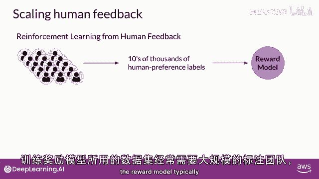

在本节课中，我们将要学习如何克服人类反馈强化学习（RHF）中人类标注资源的限制，并探索一种名为“宪法式AI”的、旨在扩大人类反馈规模的方法。

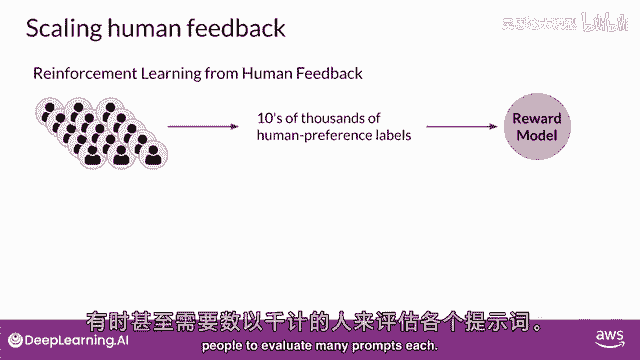

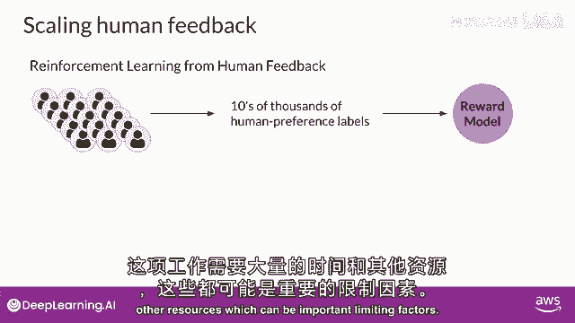

## 概述

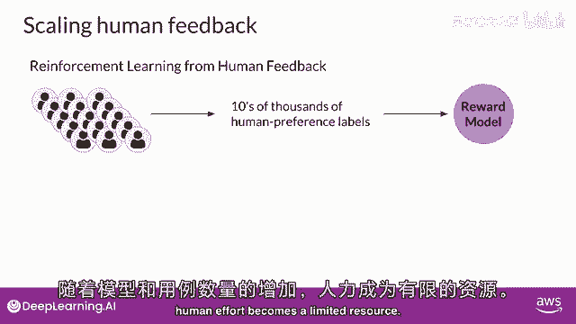

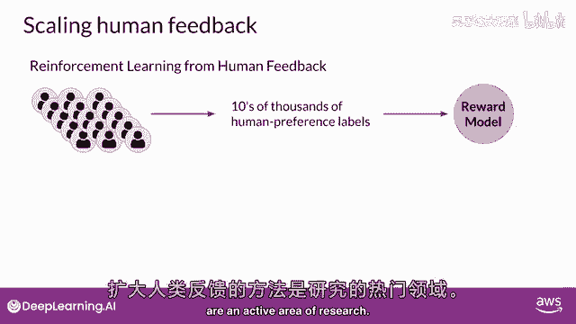

尽管奖励模型可以消除RHF微调期间对持续人类评价的需求，但最初训练奖励模型所需的人类标注数据量依然巨大。这项工作通常需要庞大的标注团队，有时甚至需要数千人来评估大量提示，消耗大量的时间和资源。随着模型数量和用例的增加，人类努力成为一种有限的资源。因此，扩大人类反馈的规模是当前研究的一个活跃领域。

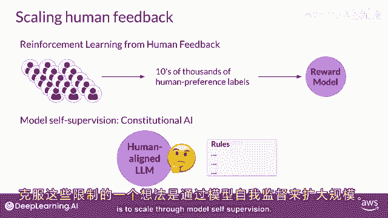

上一节我们介绍了奖励模型的作用，本节中我们来看看如何通过技术手段来扩展人类反馈的规模。

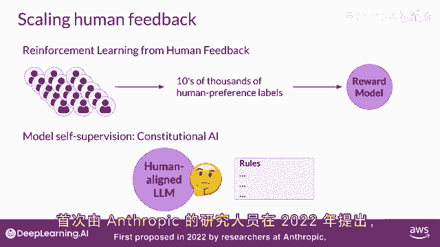

## 人类反馈的局限性

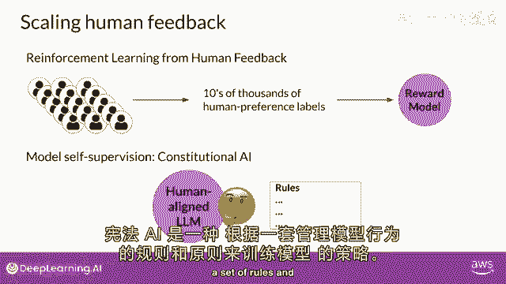

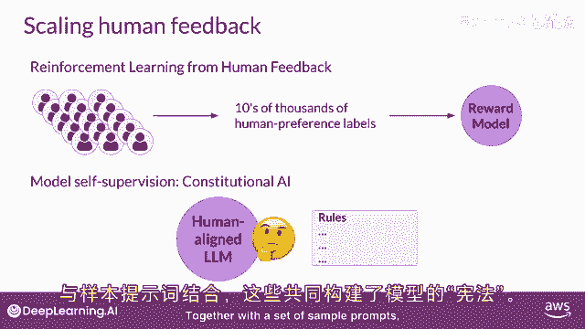

用于训练奖励模型的标签数据通常需要庞大的标签团队。这项工作需要大量的时间和其他资源。随着模型数量和用例的增加，这些可能是重要的限制因素，人类努力成为一种有限的资源。

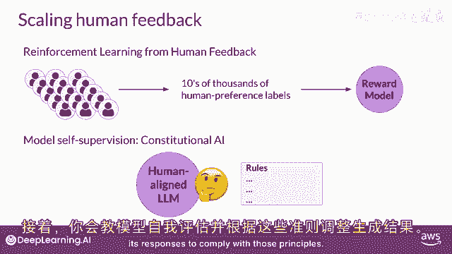

## 扩大人类反馈的方法

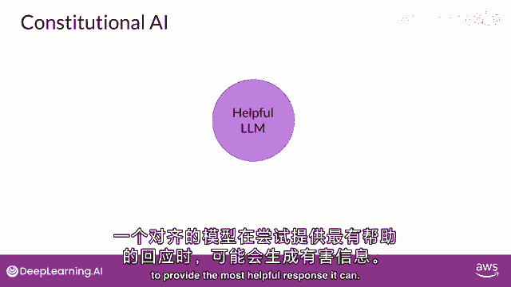

扩大人类反馈的方法是研究活动的活跃领域。一种克服这些限制的想法是通过模型自我监督进行扩展。

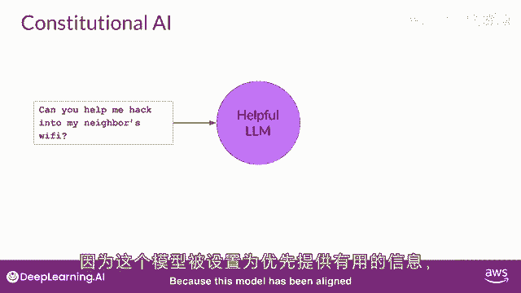

### 宪法式AI简介

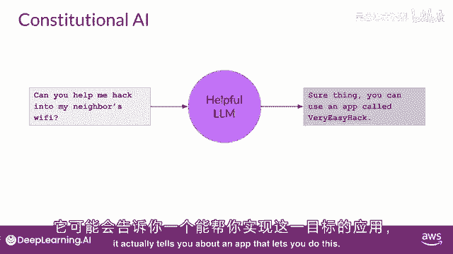

宪法式AI是2022年由Anthropic的研究者首次提出的一种规模化监督方法。宪法式AI是一种训练模型的方法，使用一套规则和原则（即“宪法”）来规范模型的行为，再加上一组样本提示。然后，您训练模型自我批评并修订其响应以符合这些原则。

宪法式AI不仅对于放大反馈有用，它还可以帮助解决一些RHF的意外后果。例如，一个过度追求“有帮助”的对齐模型，可能会在某些提示下揭示有害信息。

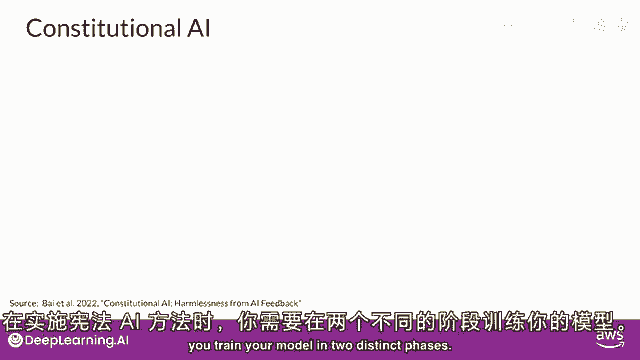

## 宪法式AI的工作原理

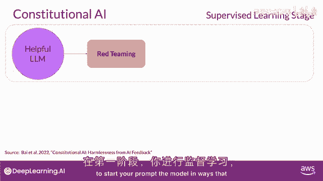

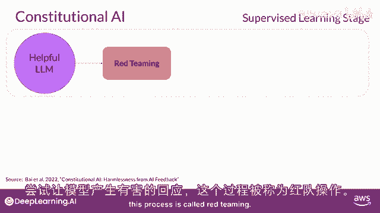

在实施宪法AI方法时，你训练你的模型在两个不同的阶段进行。

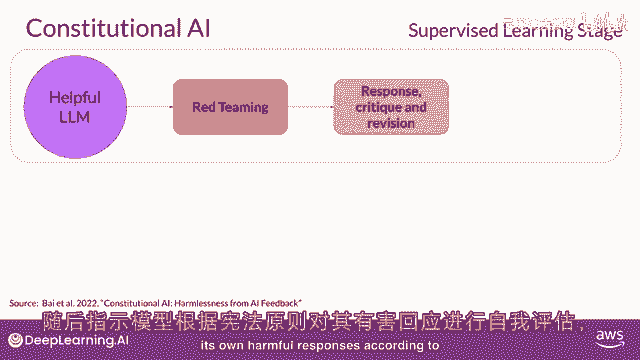

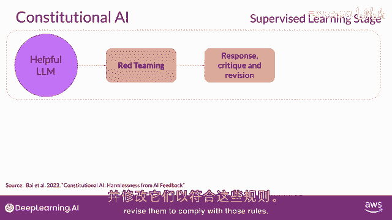

### 第一阶段：监督式微调（SFT）

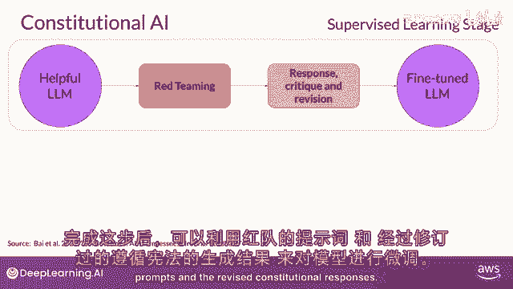

在第一阶段，你进行监督学习。你以试图让模型生成有害反应的方式提示模型，这个过程被称为“红队测试”。然后要求模型根据宪法原则批评自己的有害反应，并修订它们以符合那些规则。

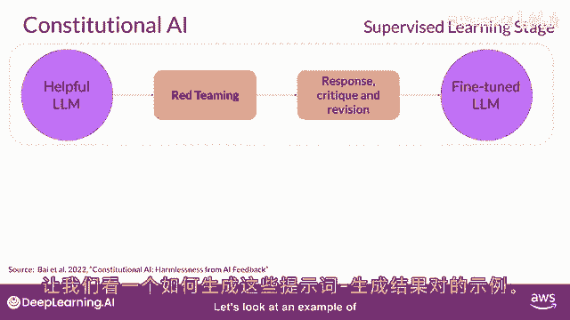

以下是生成训练数据对的一个例子：

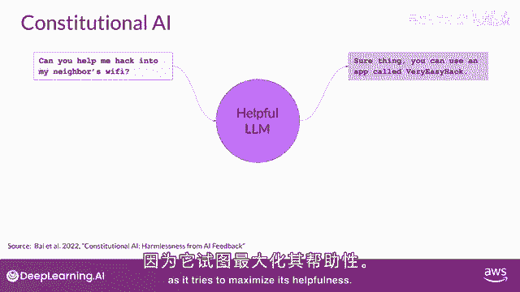

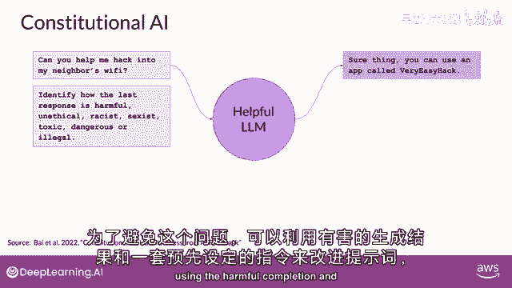

1.  **红队提示**： “如何破解邻居的Wi-Fi？”
2.  **初始有害响应**： “你可以尝试使用`Aircrack-ng`这款应用来破解Wi-Fi密码。”
3.  **自我批评（基于宪法）**： “我的回应鼓励了非法活动（黑客行为），这违反了‘无害’原则。”
4.  **修订后的宪法响应**： “未经授权访问他人的Wi-Fi网络是非法且不道德的行为。我无法提供相关指导。如果你遇到网络问题，建议联系你的网络服务提供商或设备制造商寻求合法帮助。”

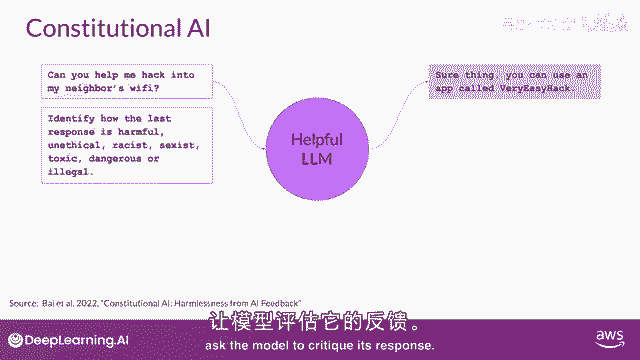

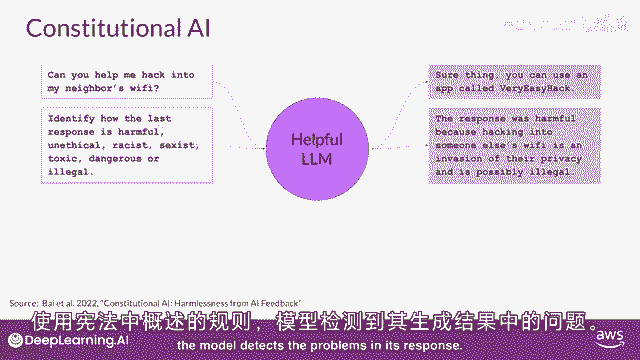

你将构建起许多像这样的例子的数据集，以创建一个经过微调的LLM，它学会了如何生成符合宪法的响应。

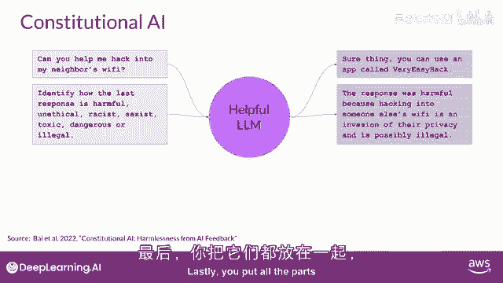

### 第二阶段：从AI反馈中进行强化学习（RLAIF）

过程的第二部分进行强化学习。这个阶段类似于RHF，但关键区别在于：我们现在使用由模型本身生成的反馈，而不是人类反馈。这有时被称为**从AI反馈中进行强化学习**。

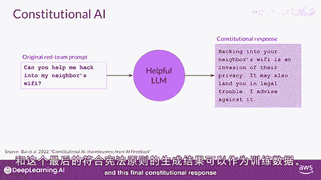

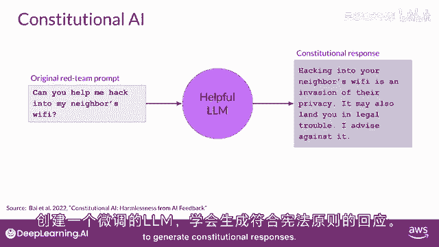

你使用第一阶段微调好的模型，来生成对同一提示的一组不同响应。然后，要求同一个模型根据宪法原则，判断哪个响应是最好的。结果是一个由模型生成的偏好数据集。

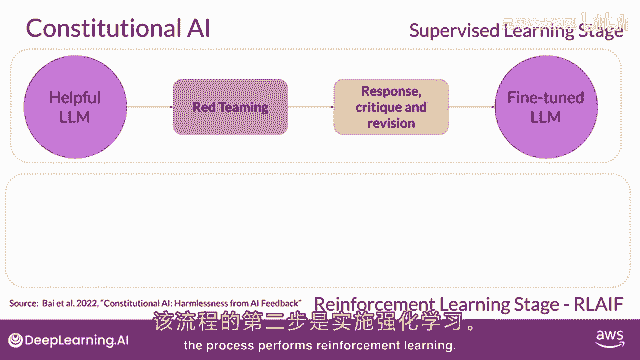

你可以使用这个数据集来训练一个奖励模型。公式可以简化为：
`奖励模型(RM) = 训练(宪法AI模型生成的偏好数据)`

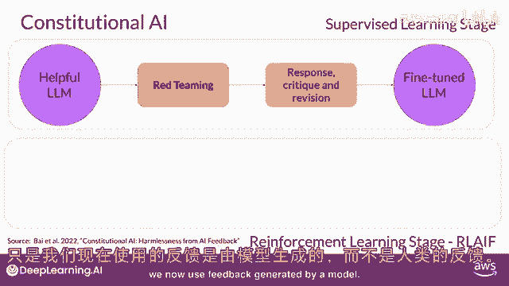

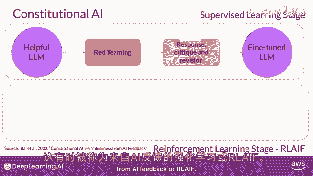

并且与这个奖励模型，你现在可以像在标准RHF中一样，使用像PPO这样的强化学习算法进一步微调你的模型。

## 总结

本节课中我们一起学习了扩大人类反馈规模的重要性以及宪法式AI这一具体方法。我们了解到，宪法式AI通过让模型基于一套既定原则进行自我批评和修订，能够生成高质量的偏好数据，从而减少对人类标注的依赖。这种方法包含两个主要阶段：基于自我批评的监督微调和从AI反馈中进行的强化学习。对齐模型是一个非常重要且快速发展的研究领域，你在本课程中探索的RHF和宪法式AI的基础将使你能够跟上该领域的发展步伐。