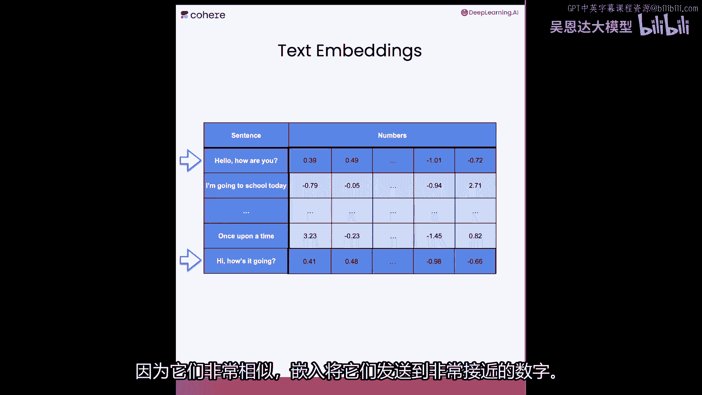
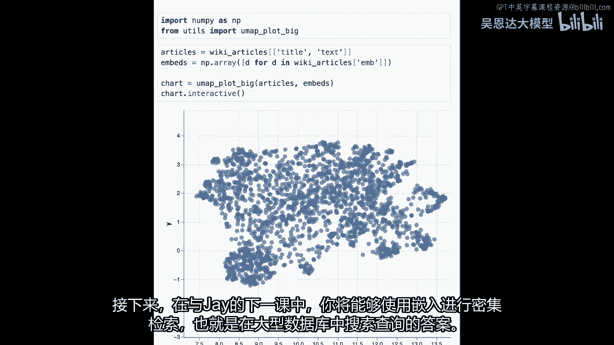
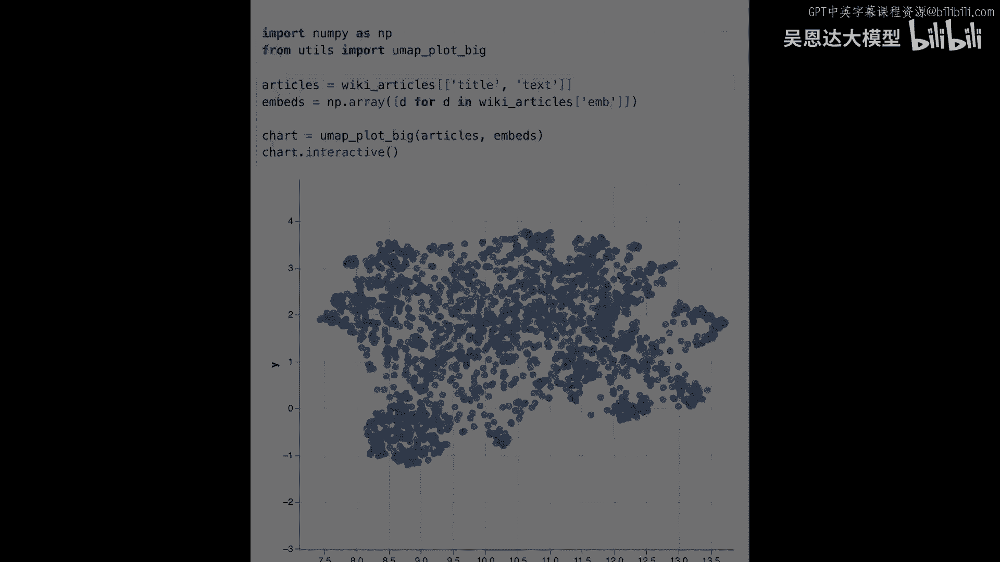

# 094：L2-嵌入技术 🧠


## 概述


在本节课中，我们将要学习**嵌入**技术。嵌入是文本的数值表示形式，它能让计算机更容易地理解和处理文本。作为大型语言模型的核心组件之一，嵌入技术对于实现语义搜索、文本分类和内容推荐等功能至关重要。

---

## 什么是嵌入？ 📊

上一节我们介绍了嵌入的基本概念，本节中我们来看看它的具体表现形式。

嵌入可以将一个单词、短语或句子转换为一串数字（即向量）。这些数字在多维空间中的位置，代表了文本的语义信息。语义相近的文本，其对应的向量在空间中的位置也越接近。

例如，单词“苹果”和“水果”的向量会比较接近，而“苹果”和“汽车”的向量则会相距较远。在实践中，嵌入模型通常会将文本转换为包含数百甚至数千个维度的向量。

**核心概念公式**：
`文本 -> 嵌入模型 -> 数值向量（例如：[-0.2, 0.5, 0.1, ..., 0.7]）`

---

## 使用Cohere库创建嵌入 ⚙️

理解了嵌入的概念后，接下来我们学习如何使用工具来生成嵌入。我们将使用Cohere库，这是一个提供大型语言模型API调用的函数库。

以下是创建嵌入的基本步骤：

1.  **安装必要的库**：首先需要安装`cohere`、`pandas`等Python包。
    ```python
    # 示例安装命令（课堂环境通常已配置好）
    # pip install cohere pandas umap-learn altair wikipedia
    ```

2.  **导入库并设置客户端**：导入Cohere库，并使用你的API密钥创建客户端。
    ```python
    import cohere
    import pandas as pd

    # 使用你的API密钥初始化Cohere客户端
    co = cohere.Client('YOUR_API_KEY')
    ```

3.  **准备数据并生成嵌入**：将需要处理的文本数据放入一个表格（如Pandas DataFrame），然后调用嵌入函数。
    ```python
    # 创建一个包含三个单词的小表格
    three_words = pd.DataFrame({'text': ['joy', 'happiness', 'potato']})

    # 调用Cohere的嵌入函数
    # `model`参数指定使用的嵌入模型
    embeddings = co.embed(
        texts=three_words['text'].tolist(),
        model='embed-english-v3.0'
    ).embeddings

    # 查看第一个单词“joy”的嵌入向量（前10个维度）
    print(embeddings[0][:10])
    ```

---

## 可视化嵌入：理解文本关系 👀

仅仅看到数字向量还不够直观。为了理解嵌入如何表示文本之间的关系，我们可以将高维向量降维（例如降到2维）并进行可视化。



以下是可视化嵌入的步骤：

1.  **准备句子数据**：我们使用一组相关联的问答句子作为例子。
    ```python
    sentences = pd.DataFrame({
        'text': [
            'What color is the sky?',
            'The sky is blue.',
            'What is an apple?',
            'An apple is a fruit.',
            'Where does a bear live?',
            'A bear lives in the forest.',
            'Where was the World Cup?',
            'The World Cup was in Qatar.'
        ]
    })
    ```

2.  **生成句子嵌入**：同样使用Cohere API为每个句子生成嵌入向量。
    ```python
    sentence_embeddings = co.embed(
        texts=sentences['text'].tolist(),
        model='embed-english-v3.0'
    ).embeddings
    ```

3.  **降维与绘图**：使用UMAP算法将高维嵌入降至2维，并用Altair库绘制散点图。
    ```python
    from umap import UMAP
    import altair as alt
    import numpy as np

    # 降维
    reducer = UMAP(n_components=2, random_state=42)
    reduced_embeddings = reducer.fit_transform(sentence_embeddings)

    # 创建绘图用的DataFrame
    plot_df = pd.DataFrame(reduced_embeddings, columns=['x', 'y'])
    plot_df['sentence'] = sentences['text']

    # 绘制交互式图表
    chart = alt.Chart(plot_df).mark_circle(size=60).encode(
        x='x',
        y='y',
        tooltip=['sentence']
    ).interactive()
    chart.save('embeddings_plot.html')
    ```
    在生成的图表中，你会发现语义相近的句子（如问题与其对应的答案）在图上位置非常接近。这直观地展示了嵌入如何捕捉语义相似性。

---

## 在大规模数据集上应用嵌入 🌐

掌握了小规模数据的处理方法后，我们可以将嵌入技术应用于大规模数据集，例如维基百科文章。

以下是处理大规模数据集的思路：

1.  **加载数据集**：加载一个包含大量文章标题和首段文本的数据集。
2.  **批量生成嵌入**：由于数据量巨大，可能需要分批调用API来生成所有文章的嵌入向量，并存储结果。
3.  **分析与探索**：同样使用降维和可视化技术，观察整个数据集中文章主题的分布情况。你会发现，关于相似主题（如“不同国家”、“历史人物”、“体育项目”）的文章，其嵌入向量在空间中会形成聚集。

这种方法为后续的**密集检索**奠定了基础。通过比较查询问题的嵌入向量与知识库中文档的嵌入向量，可以快速找到最相关的文档来回答问题。

---

## 总结

本节课中我们一起学习了嵌入技术的核心概念与应用。



*   **嵌入的本质**：是将文本转换为数值向量，使计算机能处理语义信息。
*   **嵌入的生成**：我们使用Cohere等库的API，可以轻松为单词、句子甚至段落生成嵌入。
*   **嵌入的可视化**：通过降维和绘图，我们可以直观地看到语义相似的文本在向量空间中彼此靠近。
*   **嵌入的应用**：从小规模示例到维基百科大规模数据集，嵌入技术是实现语义搜索和**检索增强生成**模型的关键第一步。



在下一节课程中，你将学习如何利用这些嵌入向量进行**密集检索**，从而构建更强大的问答系统。