# 095：4.L3-密集检索 🎯


## 概述


在本节课中，我们将学习**密集检索**，这是利用嵌入向量进行语义搜索的核心技术。我们将首先回顾如何使用向量数据库进行搜索，然后从零开始构建一个简单的向量搜索索引，并探讨其背后的原理与应用。


---

## 第一部分：使用向量数据库进行语义搜索

上一节我们介绍了嵌入向量的概念。本节中，我们来看看如何利用这些嵌入向量进行语义搜索。

### 连接数据库与设置环境

首先，我们需要连接到数据库并设置必要的环境。以下是连接数据库和设置Cohere Python SDK的代码：

```python
import cohere
import weaviate

# 设置API密钥
cohere_api_key = "YOUR_COHERE_API_KEY"
weaviate_client = weaviate.Client("YOUR_WEAVIATE_ENDPOINT")
```

### 理解密集检索的原理

密集检索基于一个核心思想：在嵌入空间中，语义相似的文本距离更近。

假设我们有一个查询：“加拿大的首都是什么？”。在我们的文档库中，有五个句子：
1. 加拿大的首都是渥太华。
2. 法国的首都是巴黎。
3. 天空是蓝色的。
4. 草是绿色的。
5. 玫瑰是红色的。

当我们把这些句子和查询都投影到同一个嵌入空间时，关于“首都”的句子会彼此靠近，而查询“加拿大的首都是什么？”会最接近“加拿大的首都是渥太华”这个句子。这就是密集检索利用嵌入向量进行搜索的方式。

### 执行向量搜索

以下是使用Weaviate进行向量搜索的代码示例。与之前的关键词搜索不同，这里我们使用“nearText”参数进行语义搜索。

```python
def dense_retrieval(query):
    response = weaviate_client.query.get(
        "Document",
        ["text"]
    ).with_near_text({
        "concepts": [query]
    }).with_limit(3).do()
    return response['data']['Get']['Document']
```

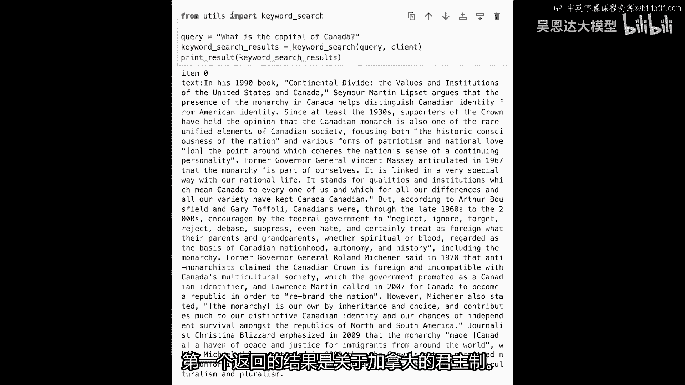

### 搜索示例与比较

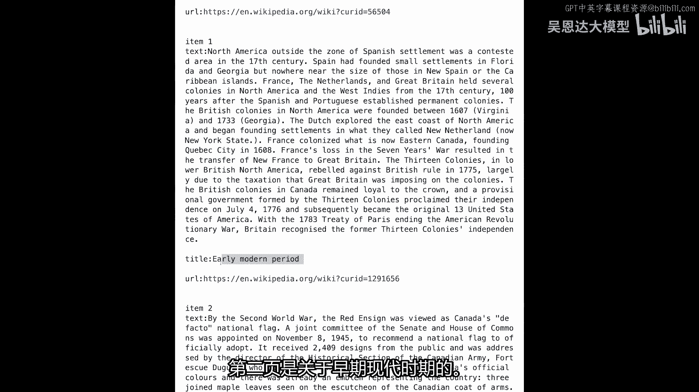

让我们运行几个查询，比较密集检索和传统关键词搜索的结果。


**查询1：谁写了《哈姆雷特》？**

以下是密集检索返回的前两个结果：
1. 威廉·莎士比亚创作了《哈姆雷特》。
2. 这部悲剧由莎士比亚撰写。

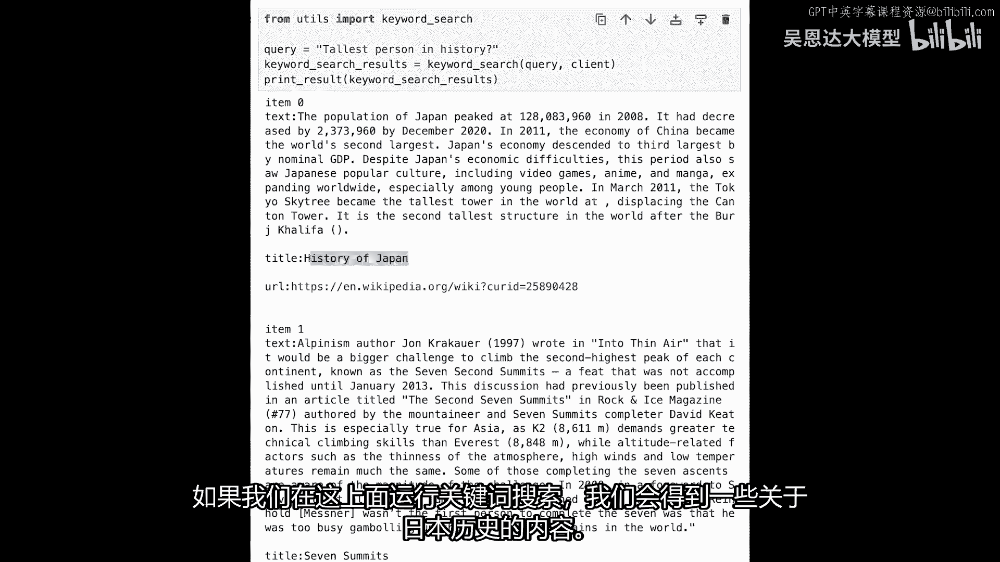

**查询2：加拿大的首都是什么？**

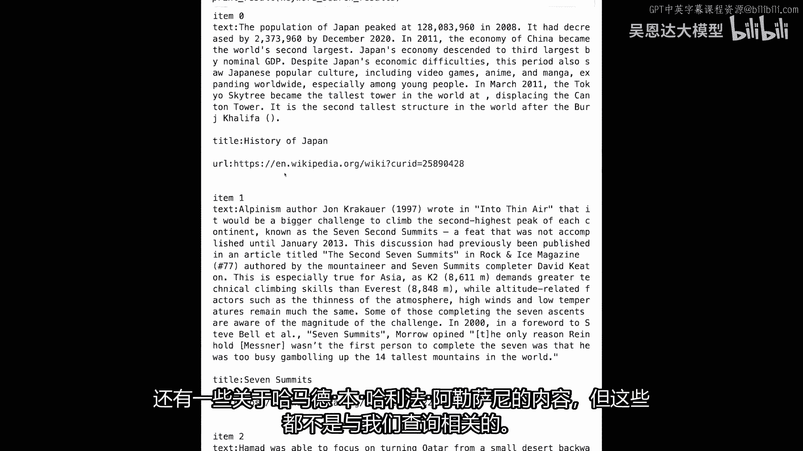

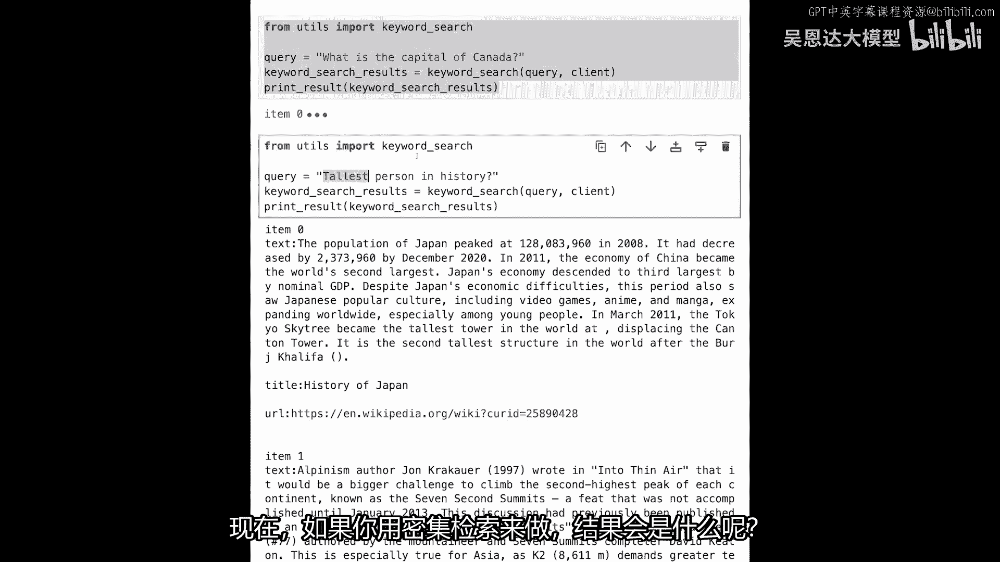

密集检索返回的结果是：“渥太华是加拿大的首都。”

相比之下，关键词搜索可能返回包含“加拿大”和“首都”但不直接回答问题的页面，例如关于加拿大历史或国旗的页面。

**查询3：历史上最高的人是谁？**

密集检索能够准确返回：“罗伯特·沃德洛是有记录以来最高的人。”

### 多语言搜索的优势

密集检索模型通常是多语言的。这意味着即使用另一种语言（如德语或阿拉伯语）进行查询，模型也能匹配到正确的结果。

例如，用阿拉伯语查询“历史上最高的人是谁？”，模型依然能返回关于罗伯特·沃德洛的正确信息。

---

## 第二部分：从零开始构建向量搜索索引

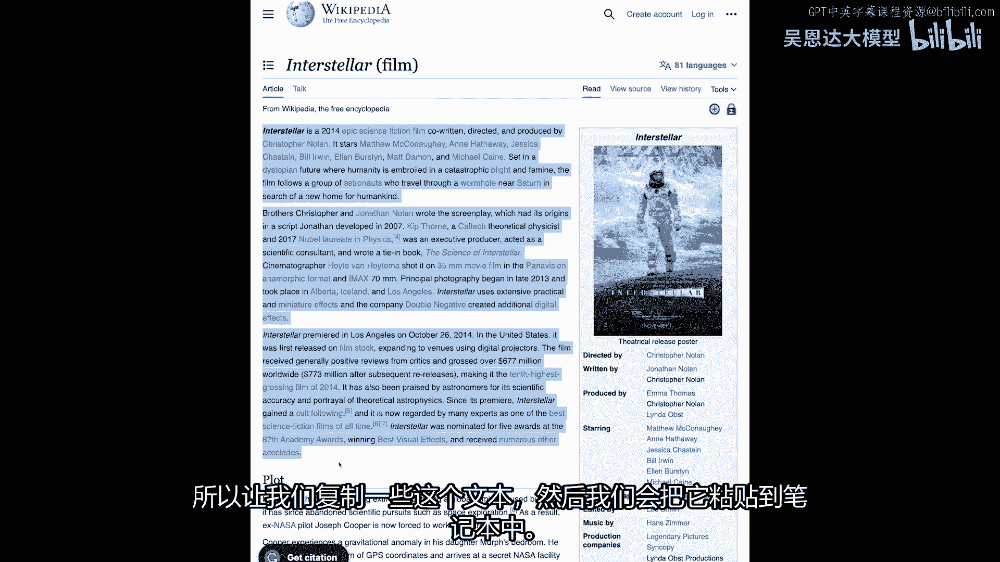

现在我们已经熟悉了如何使用现成的向量数据库。本节中，我们将学习如何从原始文本开始，自己构建一个向量搜索索引。

### 导入必要的库

我们需要导入一些库来处理文本和构建索引。

```python
from annoy import AnnoyIndex
import numpy as np
import cohere
```

### 准备文本数据

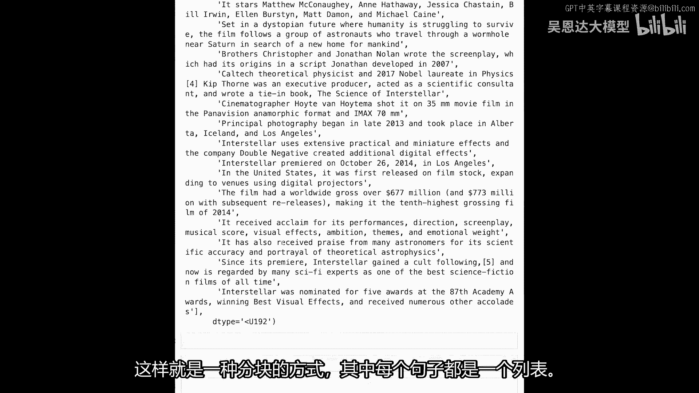

我们以电影《星际穿越》的维基百科页面文本为例。

```python
text = """
Interstellar is a 2014 epic science fiction film...
The film is set in a dystopian future...
...
"""
```

### 文本分块策略

将长文本分解成更小的块（分块）是构建索引的关键步骤。分块的大小和方式会影响搜索效果。

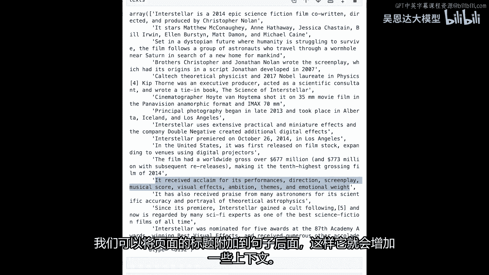

常见的分块方法包括：
*   **按句子分割**：在每个句号处分割。
*   **按段落分割**：在每个换行处分割。

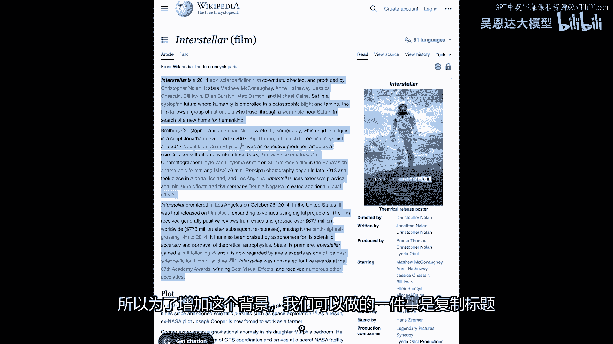

选择哪种方式取决于你的应用场景。通常，我们希望每个块包含一个完整的想法。

以下是按句子分割的示例代码：

```python
# 简单按句号分割（实际应用中可能需要更复杂的句子分割器）
chunks = text.split('. ')
# 为每个块添加上下文（例如页面标题）
title = "Interstellar (film)"
chunks_with_context = [f"{title}: {chunk}" for chunk in chunks]
```


### 生成嵌入向量

接下来，我们使用嵌入模型为每个文本块生成向量表示。

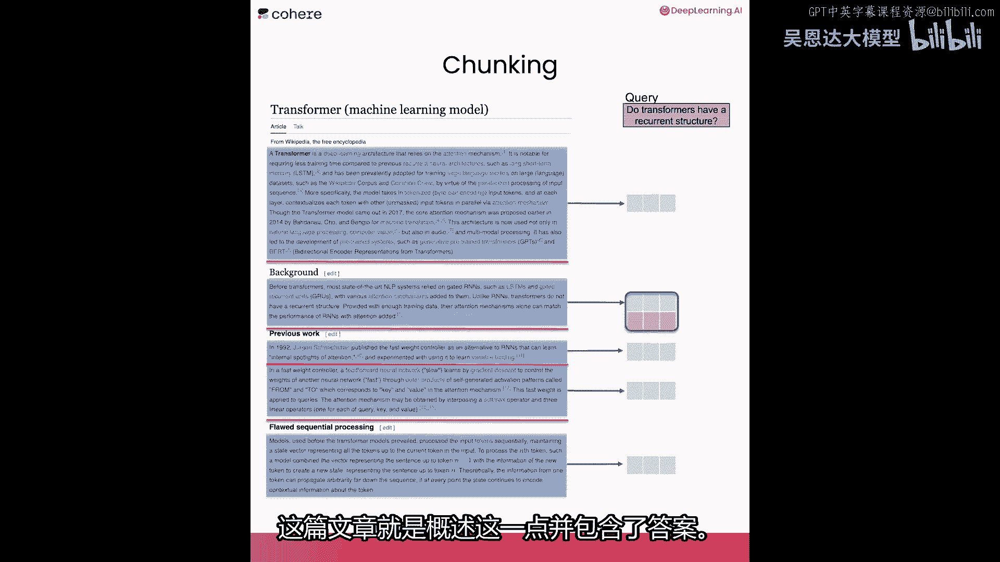

```python
co = cohere.Client('YOUR_API_KEY')
response = co.embed(texts=chunks_with_context, model='embed-multilingual-v2.0')
embeddings = np.array(response.embeddings)  # 形状: (句子数量, 向量维度)
```

### 构建近似最近邻索引

我们将使用Annoy库来构建一个高效的近似最近邻搜索索引。

```python
# 假设嵌入向量的维度是4096
dimension = embeddings.shape[1]
index = AnnoyIndex(dimension, 'angular')

# 将每个嵌入向量添加到索引中
for i, vec in enumerate(embeddings):
    index.add_item(i, vec)

# 构建索引树，树的数量影响精度和速度
index.build(10)
# 将索引保存到磁盘
index.save('interstellar_index.ann')
```

### 执行搜索

现在，我们可以定义一个搜索函数，它接受一个查询，并返回最相关的文本块。

```python
def search(query, top_k=3):
    # 获取查询的嵌入向量
    query_embed = np.array(co.embed(texts=[query], model='embed-multilingual-v2.0').embeddings[0])
    # 在索引中搜索最近邻
    indices, distances = index.get_nns_by_vector(query_embed, top_k, include_distances=True)
    # 返回对应的文本块和距离
    results = [(chunks_with_context[i], dist) for i, dist in zip(indices, distances)]
    return results

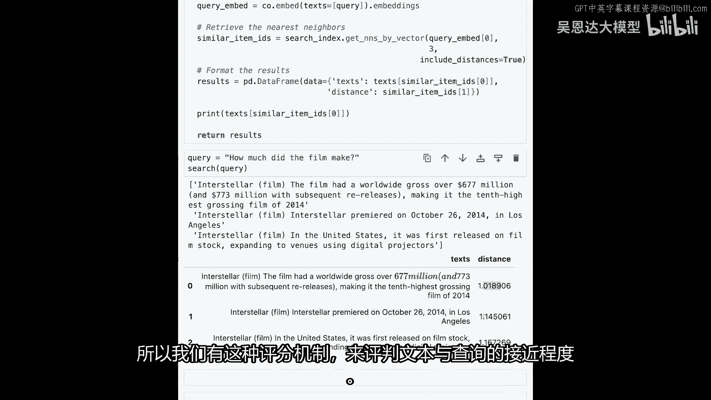

# 示例查询
results = search("这部电影赚了多少钱？")
for text, distance in results:
    print(f"距离: {distance:.4f}\n文本: {text}\n")
```

---

## 工具比较：近似最近邻库 vs. 向量数据库

我们已经看到了如何进行密集检索。让我们谈谈使用像Annoy这样的近似最近邻库与完整向量数据库之间的区别。

### 近似最近邻库

*   **代表工具**：Annoy (Spotify), Faiss (Facebook), ScaNN (Google)。
*   **特点**：设置简单，主要专注于高效存储和检索向量。通常需要手动管理原始文本的关联。

### 向量数据库

*   **代表工具**：Weaviate, Pinecone, Qdrant, Chroma。
*   **特点**：
    *   **功能更丰富**：不仅存储向量，还存储关联的元数据（如文本），并管理两者之间的关系。
    *   **易于更新**：支持动态添加、删除和更新记录，无需重建整个索引。
    *   **高级查询**：支持过滤（如按语言、日期）和更复杂的组合查询。

### 混合搜索：结合关键词与语义搜索

在实际应用中，你不需要完全用向量搜索取代关键词搜索。它们可以互补，形成**混合搜索**流水线。

当收到一个查询时，系统可以同时执行：
1.  **关键词搜索**：基于词频和精确匹配。
2.  **向量搜索**：基于语义相似度。

每个搜索组件都会为文档库中的文档分配一个分数。然后，我们可以聚合这些分数（有时还会加入其他信号，如页面的权威性），以呈现最佳的综合结果。

---

## 总结

本节课中我们一起学习了**密集检索**的核心内容：
1.  **原理**：利用嵌入向量在语义空间中的距离进行相似性搜索。
2.  **应用**：通过向量数据库（如Weaviate）执行多语言、语义感知的搜索。
3.  **实践**：从文本分块、生成嵌入到使用Annoy库构建自己的向量搜索索引。
4.  **工具对比**：了解了近似最近邻库与功能更全面的向量数据库之间的差异。
5.  **混合搜索**：认识到将语义搜索与传统关键词搜索结合能产生更强大的效果。

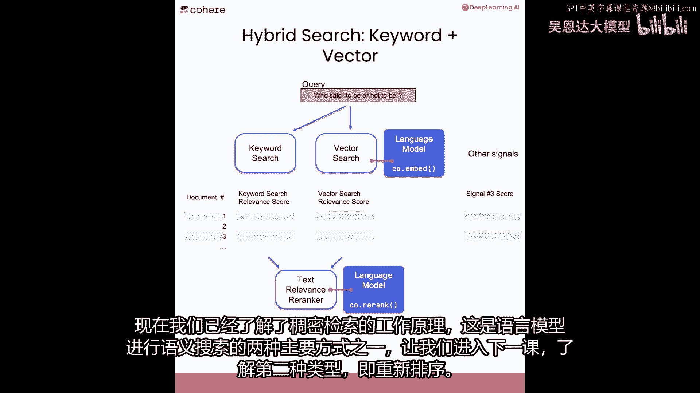

密集检索是利用大语言模型进行智能搜索的基石之一。下一节课，我们将学习另一种重要的语义搜索技术：**重排**。