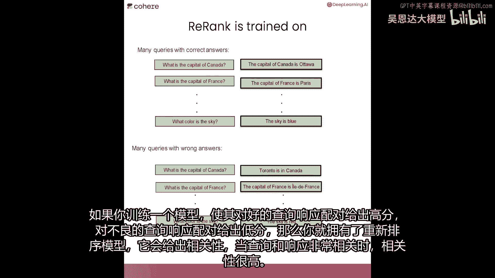
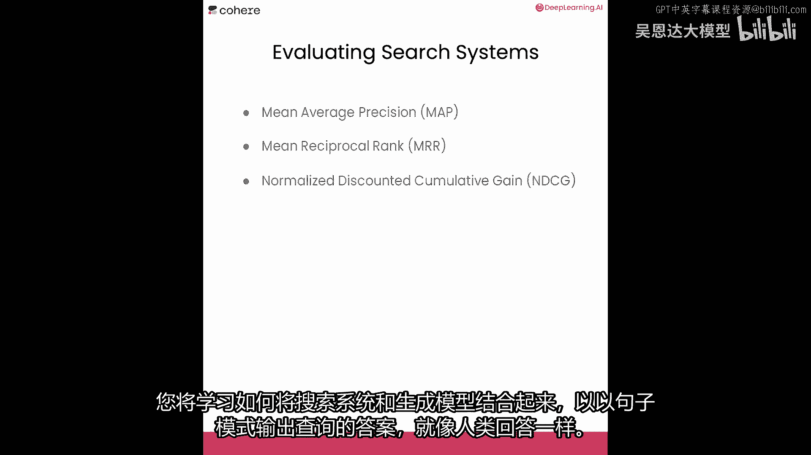

# 096：5.L4-rerank.zh - 吴恩达大模型 - BV1gLeueWE5N


## 概述 📖


在本节课中，我们将要学习一种名为“重新排名”的技术。这是一种改进关键词搜索和密集检索结果的方法，也是构建高效语义搜索系统的第二个关键组成部分。我们将通过实例了解其工作原理，并学习如何应用它来提升检索质量。


## 什么是重新排名？ 🎯


上一节我们介绍了密集检索，它通过向量相似度来查找相关文档。然而，密集检索有时会返回语义相近但并非问题答案的文档。本节中我们来看看“重新排名”如何解决这个问题。

重新排名是一种利用大型语言模型对初步检索结果进行二次排序的技术。它基于查询与每个候选文档之间的相关性，为它们分配一个分数，从而将最相关的文档排在前面。

其核心思想是：给定一个查询和一组候选文档（例如由密集检索返回的前K个结果），重新排名模型会计算每个文档与查询的**相关性得分**。得分最高的文档被认为是最可能包含答案的文档。


## 重新排名的工作原理 ⚙️

为了理解重新排名为何有效，让我们看一个示意图。假设查询是“加拿大的首都是什么？”，初步检索可能返回以下五个句子：
1.  加拿大的首都是渥太华。（正确答案）
2.  多伦多在加拿大。
3.  法国的首都是巴黎。
4.  加拿大的首都是悉尼。（错误答案）
5.  安大略省的首都是多伦多。

密集检索基于向量相似度，可能会将句子5（“安大略省的首都是多伦多”）排在前面，因为它与查询在向量空间上很接近，但它并非问题的直接答案。

重新排名模型则被训练来直接评估“查询-文档”对的相关性。它会为上述五个句子分别打分，例如：
*   句子1：0.9
*   句子2：0.3
*   句子3：0.1
*   句子4：0.05
*   句子5：0.6

这样，正确答案（句子1）就能凭借最高的相关性得分被排到最前面。

**模型是如何训练的？**
重新排名模型通过大量“查询-相关文档”正样本和“查询-不相关文档”负样本进行训练。模型学习为高度相关的配对赋予高分，为不相关的配对赋予低分。


## 实践：改进关键词搜索与密集检索 🧪

现在，让我们在代码中看看重新排名的实际应用。我们将分别用它来改进关键词搜索和密集检索的结果。

首先，我们需要设置环境并导入必要的库和函数。

```python
# 导入必要的库和API密钥
import cohere
# 假设已导入关键词搜索函数 `keyword_search` 和密集检索函数 `dense_retrieval`
# 假设已导入重新排名函数 `rerank`
```

### 改进关键词搜索

关键词搜索可能返回大量包含查询词汇但不一定回答问题的文档。

以下是使用关键词搜索并应用重新排名的步骤：

1.  使用关键词搜索获取大量初步结果（例如500个）。
2.  使用重新排名模型对这些结果进行评分和排序。
3.  选取相关性得分最高的前几个结果。



```python
# 示例查询
query = "加拿大的首都是什么？"

# 1. 关键词搜索获取大量初步结果
initial_results = keyword_search(query, client, n_results=500)

# 2. 应用重新排名
reranked_results = rerank(query, initial_results)


# 3. 打印重新排名后的前10个结果
print_results(reranked_results[:10])
```
应用重新排名后，系统能成功地从大量噪声中识别出“渥太华是加拿大首都”等相关性最高的文档。

### 改进密集检索

密集检索效果更好，但重新排名可以进一步精炼结果。

以下是一个示例，查询为“历史上最高的人是谁？”：

```python
# 使用密集检索获取初步结果
dense_results = dense_retrieval(query, client)

# 应用重新排名对结果进行精炼
reranked_dense_results = rerank(query, dense_results)

# 查看精炼后的结果
print_results(reranked_dense_results)
```
在这个例子中，重新排名帮助确认了“罗伯特·瓦德洛”是相关性最高的答案，并降低了其他相关度较低文档的排名。

**动手尝试：**
建议你暂停阅读，尝试创建自己的查询，分别使用关键词搜索和密集检索，然后应用重新排名，观察结果如何得到改善。


## 如何评估搜索系统？ 📊

当我们构建了多种检索系统（如关键词搜索、密集检索及结合重新排名的系统）后，自然需要评估它们的性能。

以下是几种常用的评估指标：

*   **平均精度均值**：衡量系统在所有查询上的平均精度。
*   **平均倒数排名**：衡量正确答案在结果列表中排名的倒数平均值。
*   **归一化折损累计增益**：考虑排名位置的因素，对高相关度文档排在前面给予更高奖励。

构建评估测试集需要一组“查询”和对应的“标准答案”或“相关文档”。通过比较系统返回的结果与标准答案，可以计算上述指标。


## 总结 🎓

本节课中我们一起学习了“重新排名”技术。我们了解到，尽管关键词搜索和密集检索能有效找到相关文档，但重新排名通过直接评估查询与文档的相关性，能够进一步精炼结果，将最可能包含答案的文档排到最前面。这是构建高效语义搜索流水线中至关重要的一步。





在下一节课中，你将学习一些更酷的内容：如何将搜索系统与生成模型结合起来，直接输出查询的完整句子答案。