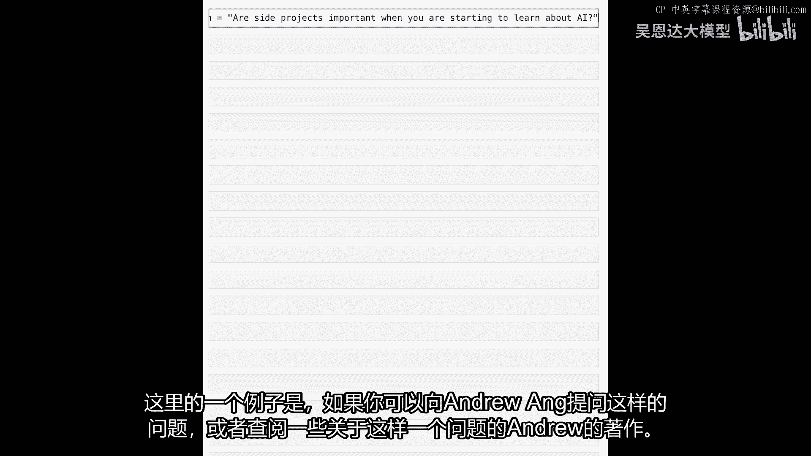
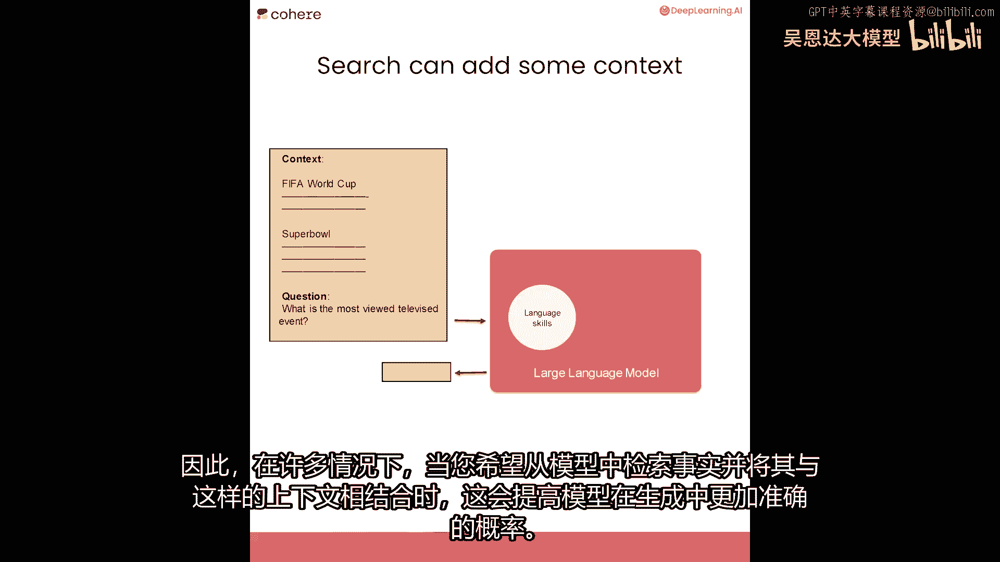
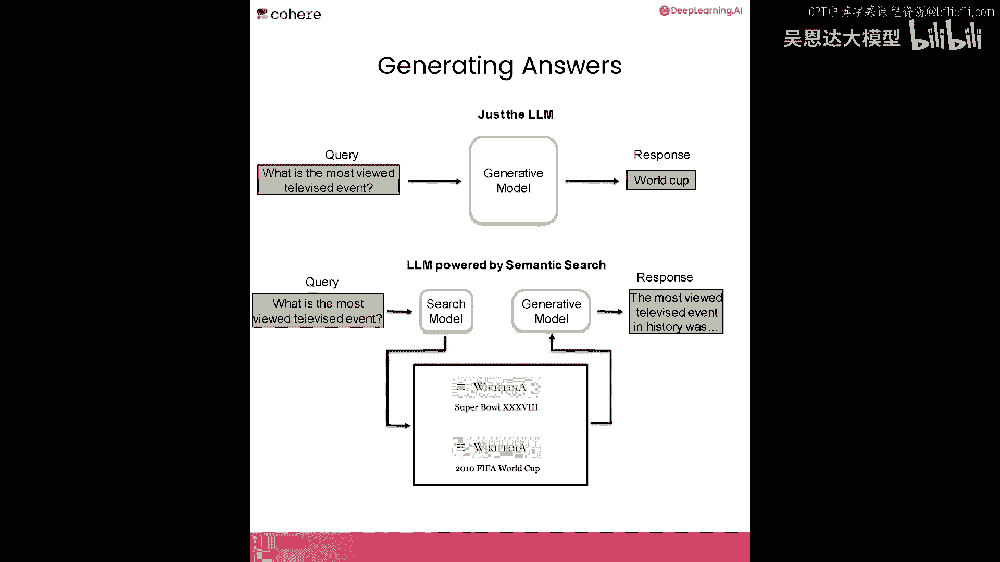
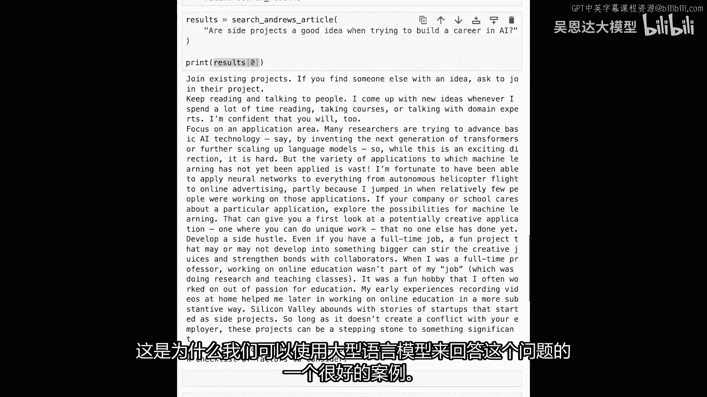
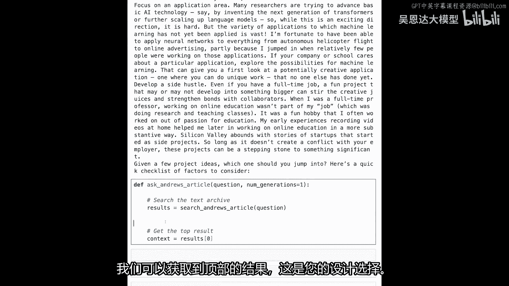
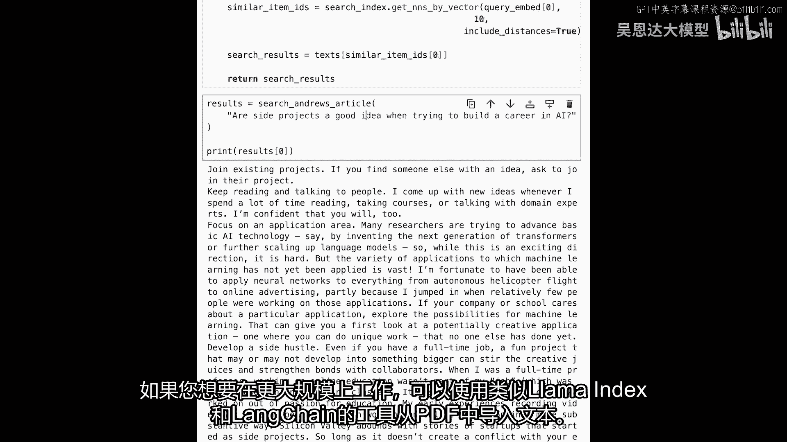
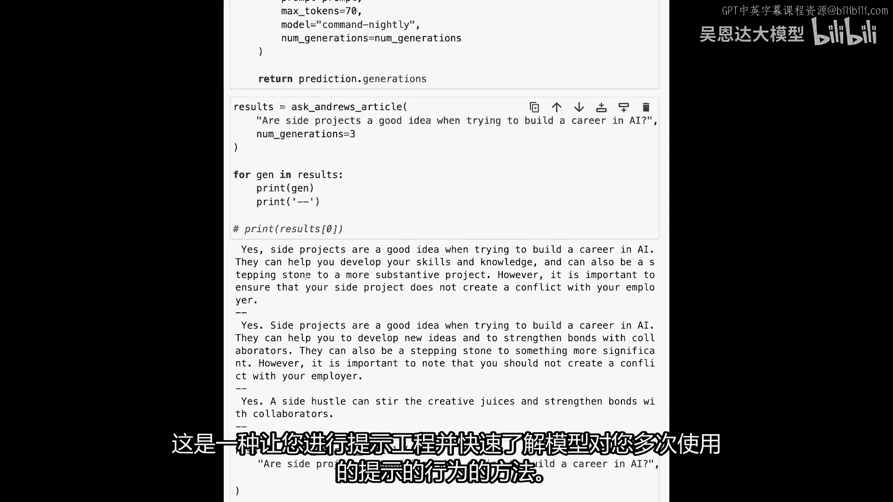

# 097：6.L5-生成答案 🧠


## 概述


在本节课中，我们将学习如何将“生成答案”的步骤整合到搜索管道的末端。通过这种方式，我们可以直接获得基于特定文档内容的答案，而不仅仅是相关的搜索结果。

---



## 从搜索到生成答案

上一节我们介绍了如何构建一个语义搜索系统来查找相关文档。本节中，我们来看看如何利用这些搜索结果，让大型语言模型生成一个具体的答案。


这是一种构建用户可以与文档或书籍聊天的应用程序的有效方法。例如，大型语言模型虽然擅长许多任务，但在某些需要特定知识背景的用例中，直接提问可能无法得到最佳答案。

假设你有一个问题：“当你开始学习AI时，边项目重要吗？”你可以直接问大型语言模型，它可能会给出一些有趣的回答。但更有价值的是，如果你能基于特定专家（如吴恩达）的著作来获取答案。

幸运的是，我们可以访问吴恩达的一些文章。例如，他在《批量》新闻通讯中有一个名为《如何在AI中建立职业生涯》的系列文章。我们将使用本课程所学的知识，先搜索这些文章，然后利用生成式大型语言模型从中生成答案。



---

## 搜索增强生成的工作原理



你可以直接向大型语言模型提问，它能回答许多问题。但有时我们希望模型基于特定的文档或档案来回答。这就是为什么我们可以在生成步骤之前添加一个搜索组件来改进生成质量。


当你依赖大型语言模型的直接答案时，你依赖的是其内部存储的世界信息。但你可以通过先前的搜索步骤，在提示中提供具体的上下文信息，从而改善生成结果。当你希望将模型锚定到特定领域、文章或文档（如我们的文本档案）时，这种方法尤其有用，同时也提高了生成内容的事实准确性。

因此，在许多情况下，当你希望从模型中检索事实信息时，使用上下文来增强提示可以提高模型生成事实性内容的概率。

这两个步骤的关键区别在于：我们不是仅仅向生成模型提问并查看其输出，而是首先将问题呈现给搜索系统（如我们之前构建的），检索出最相关的结果，然后将这些结果与原始问题一起放入提示中，提供给生成模型。这样，我们就能得到一个基于上下文的、更准确的响应。

---

## 构建文本档案与搜索索引

以下是构建文本档案和搜索索引的步骤：

1.  **准备文本数据**：我们打开目标文章，将其文本内容复制并存储在一个变量中。在本例中，我们使用了三篇文章的文本。
2.  **分割文本**：将长文本分割成更小的、语义上连贯的块（例如段落）。
3.  **生成嵌入向量**：使用嵌入模型（如Cohere的模型）将每个文本块转换为向量表示。
4.  **构建向量索引**：使用向量搜索库（如Annoy）基于这些嵌入向量构建一个可快速检索的索引。

以下是相关代码的核心部分：


```python
# 假设 text 变量包含了所有文章的文本
text_chunks = split_text_into_chunks(text) # 分割文本
embeddings = cohere_client.embed(texts=text_chunks) # 生成嵌入向量



# 构建向量索引
import annoy
index = annoy.AnnoyIndex(embeddings.shape[1], 'angular')
for i, vec in enumerate(embeddings):
    index.add_item(i, vec)
index.build(10) # 构建索引
index.save('my_index.ann') # 保存索引
```

---



## 定义搜索与生成函数

接下来，我们定义两个关键函数。

首先，定义一个搜索函数，用于在文本档案中查找与查询最相关的段落：

```python
def search_articles(query, top_k=1):
    # 1. 嵌入查询
    query_embedding = cohere_client.embed([query])
    # 2. 在向量索引中搜索最相似的项
    indices, distances = index.get_nns_by_vector(query_embedding[0], top_k, include_distances=True)
    # 3. 返回对应的文本块
    results = [text_chunks[i] for i in indices]
    return results
```

然后，定义一个生成答案的函数。这个函数会先调用搜索函数获取上下文，再构造提示词让语言模型生成答案：

```python
def ask_article(question, num_generations=1):
    # 1. 搜索获取相关上下文
    context = search_articles(question)[0] # 获取最相关的一个结果

    # 2. 构造提示词
    prompt = f"""
    以下是来自吴恩达关于如何构建AI职业生涯的文章摘录：
    --------------------
    {context}
    --------------------
    问题：{question}
    请仅根据上面提供的文章摘录来回答问题。如果摘录中没有相关信息，请回答“根据提供的文章，无法找到相关信息”。
    答案：
    """

    # 3. 调用生成模型
    response = cohere_client.generate(
        model='command-nightly', # 使用最新的模型
        prompt=prompt,
        max_tokens=150,
        num_generations=num_generations
    )
    # 4. 返回生成的答案
    return response.generations
```

---

## 测试与优化

现在我们可以测试整个流程。例如，提问：“在构建AI职业时，做副项目是个好主意吗？”

运行 `ask_article` 函数后，我们可能会得到类似这样的答案：“是的，副项目是个好主意。它们可以帮助你发展技能和知识，也是与他人建立联系的好方式。但你应该注意不要与雇主产生冲突...”



**开发小技巧**：在测试模型行为时，可以将 `num_generations` 参数设置为大于1（例如3）。这样，模型会为同一个提示生成多个答案，方便你快速比较和评估模型响应的稳定性，而无需多次手动运行。

```python
# 获取3个不同的生成结果
answers = ask_article(“你的问题”, num_generations=3)
for i, gen in enumerate(answers):
    print(f"生成结果 {i+1}: {gen.text}\n")
```

---

## 总结



本节课中，我们一起学习了如何将搜索与生成两个步骤结合，构建一个检索增强生成（RAG）的应用。我们首先构建了一个基于特定文档的语义搜索系统，然后利用检索到的上下文信息来引导大型语言模型生成更准确、更具事实依据的答案。这种方法极大地扩展了大型语言模型的应用场景，使其能够基于私有或特定领域的知识库进行问答，是当前构建智能对话和知识检索系统的重要范式。