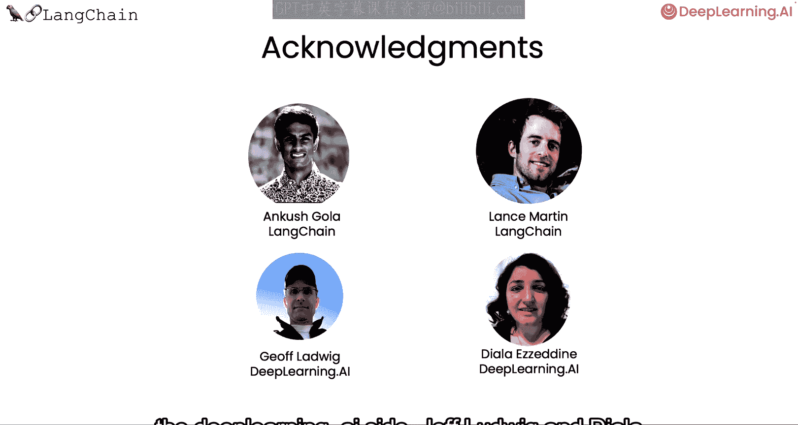

# 001：课程介绍与概述 🚀

在本节课中，我们将要学习如何利用LangChain框架，使大型语言模型能够与你的私有数据进行对话。我们将概述整个课程的目标、核心挑战以及你将学到的关键技术模块。

---

大型语言模型（LLMs），例如ChatGPT，能够回答许多领域的问题。但一个孤立的大型语言模型仅知道其训练数据中的内容，这并不包括你的个人数据。例如，如果你在一家公司，拥有未公开在互联网上的专有文档，或者模型训练完成后才出现的数据和文章。

那么，如果你或你的客户能够与这些文档进行对话，并利用其中的信息通过大型语言模型来回答问题，这将会非常有用。

在这门短期课程中，我们将介绍如何使用LangChain来与你的数据对话。LangChain是一个用于构建LLM应用的开源开发者框架。它由多个模块化组件以及更完整的端到端模板构成。

LangChain中的模块化组件包括：**提示词（Prompts）**、**模型（Models）**、**索引（Indexes）**、**链（Chains）** 和 **智能体（Agents）**。若想更详细地了解这些组件，你可以参考我与Andrew共同讲授的第一门课程。

在本课程中，我们将聚焦于LangChain一个非常流行的应用场景：如何使用LangChain与你的数据对话。

---

## 课程内容路线图 🗺️

以下是本课程将涵盖的核心步骤：

首先，我们将学习如何使用LangChain的文档加载器（Document Loaders）从各种来源加载数据。

上一节我们介绍了课程目标，本节中我们来看看数据处理的第一步。接着，我们将探讨如何将这些文档分割成具有语义意义的片段。这个预处理步骤看似简单，实则包含许多细节。

接下来，我们将概述语义搜索（Semantic Search），这是一种根据用户问题获取相关信息的基本方法。这是入门最简单的方法，但在某些情况下会失效。我们将讨论这些情况，并学习如何修复它们。

然后，我们将展示如何利用检索到的文档，使大型语言模型能够回答关于文档的问题。但此时，要完全复现聊天机器人的体验，还缺少一个关键部分。

最后，我们将填补这个缺失的部分——记忆（Memory），并展示如何构建一个功能完整的聊天机器人，让你能够真正地与你的数据对话。

---

## 课程团队与资源 💡

这将是一门激动人心的短期课程。我们非常感谢Ansh Goer以及LangChain团队的Lance Martin，他们与稍后为大家讲解的Harrison共同准备了所有课程材料。在DeepLearning.AI方面，感谢Jeff Ludwig和Dila Eadin。

如果你在学习本课程时，希望复习一下LangChain的基础知识，我鼓励你也去学习Harrison之前提到的、关于LLM应用开发的早期短期课程。

---

本节课中我们一起学习了本课程的核心目标：利用LangChain解锁大型语言模型与私有数据对话的能力。我们概述了从数据加载、处理、检索到最终构建对话系统的完整路径。

接下来，让我们进入下一个视频，Harrison将向你展示如何使用LangChain非常便捷的文档加载器集合。