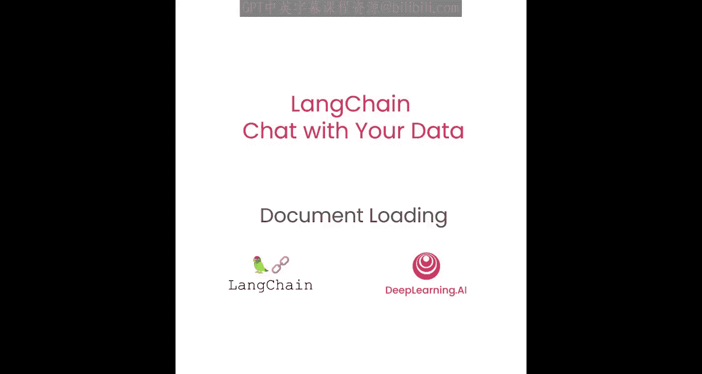
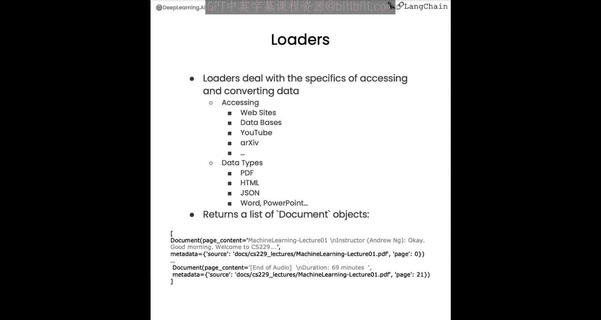
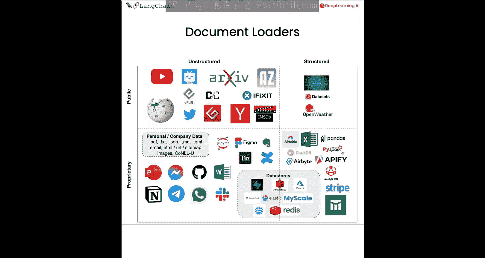
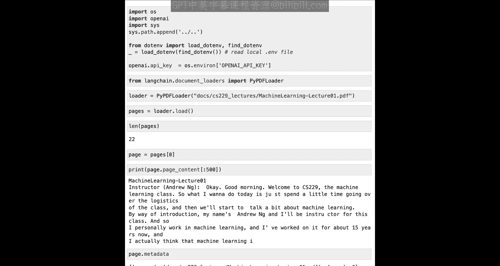
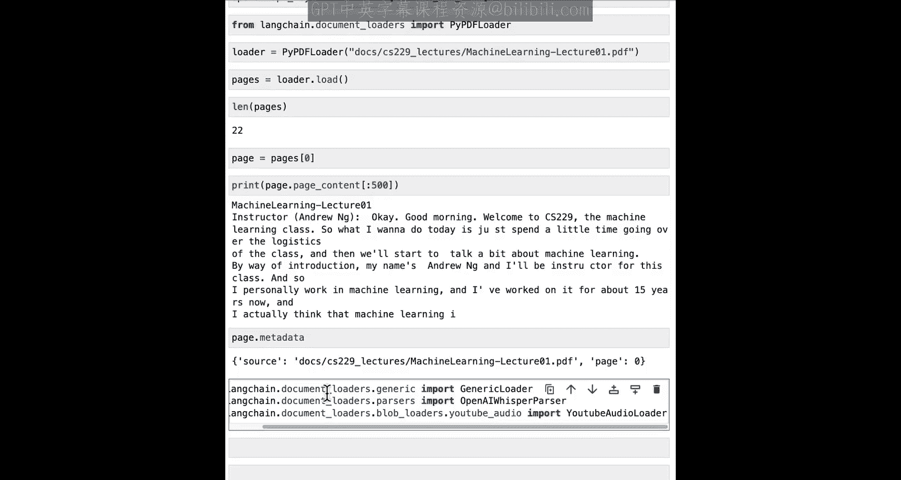
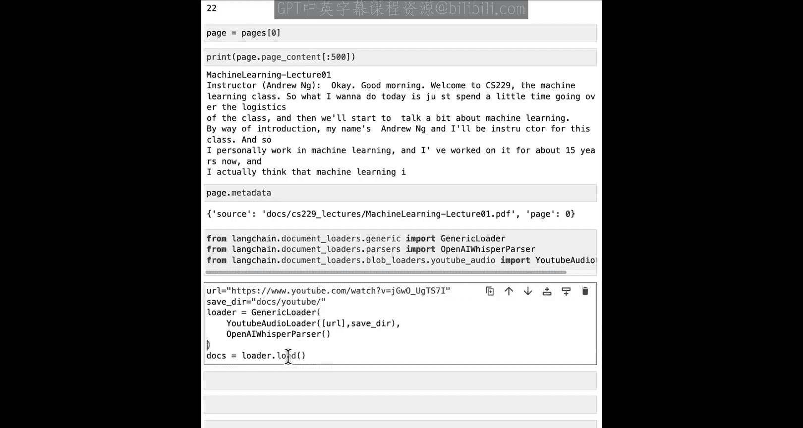
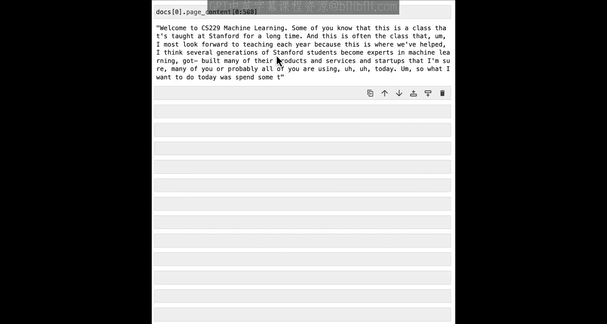
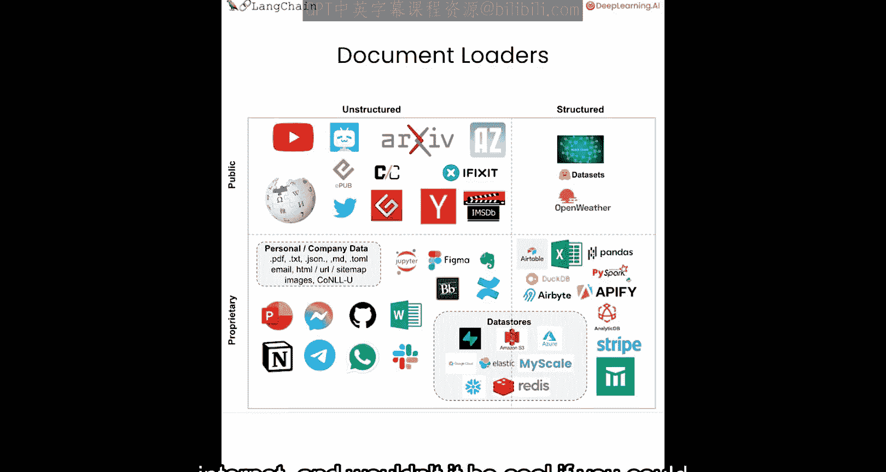
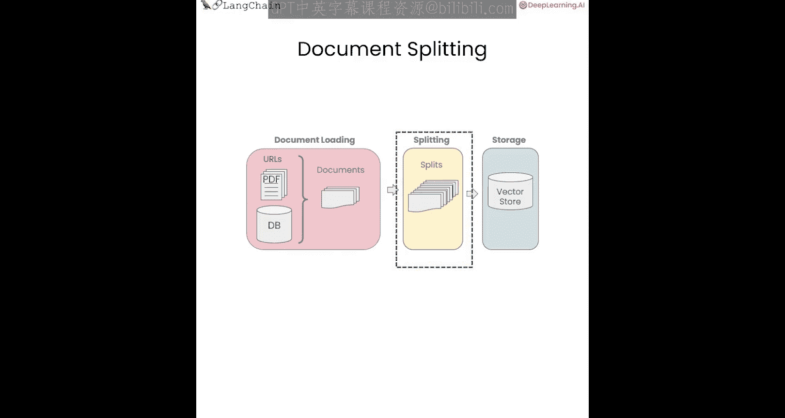

# 002：文档加载器 📄

在本节课中，我们将学习如何将不同来源和格式的数据加载到LangChain应用程序中。这是构建“与数据对话”应用的第一步。

为了创建一个能与你的数据对话的应用程序，首先需要将数据加载到一种可以处理的格式中。这正是LangChain文档加载器的作用所在。LangChain提供了超过80种不同类型的文档加载器。在本节中，我们将介绍其中最重要的一些，并帮助你熟悉这个概念。

## 文档加载器的作用

文档加载器处理从各种不同格式和来源访问和转换数据的细节，并将其转换为标准化格式。

数据可能来自不同的地方，例如网站、数据库、YouTube。这些文档也可以是不同的数据类型，如PDF、HTML、JSON。因此，文档加载器的全部目的是将这些多样的数据源加载到一个标准的文档对象中，该对象由内容和相关的元数据组成。

## 文档加载器的分类

LangChain中有很多不同类型的文档加载器，我们无法一一介绍，但这里对现有的80多种加载器进行一个粗略的分类。

许多加载器用于从公共数据源（如YouTube、Twitter、Hacker News）加载非结构化数据（如文本文件）。还有更多加载器用于从你或你的公司可能拥有的专有数据源（如Figma、Notion）加载非结构化数据。

文档加载器也可用于加载结构化数据，即表格格式的数据。这些表格的某些单元格或行中可能包含文本数据，你仍然希望对其进行问答或语义搜索。这类数据源包括Airtable、Stripe等。

## 使用文档加载器

现在，让我们开始实际使用文档加载器。首先，我们需要加载一些必要的环境变量，例如OpenAI API密钥。

我们将要处理的第一类文档是PDF。让我们从LangChain导入相关的文档加载器。我们将使用`PyPDFLoader`。

工作区的`documents`文件夹中已加载了一些PDF文件。让我们选择一个并将其路径放入加载器。现在，通过调用`load`方法来加载文档。

让我们看看具体加载了什么。默认情况下，这会加载一个文档列表。在这个例子中，这个PDF有22个不同的页面，每个页面都是一个独立的文档。让我们查看第一个文档，看看它包含什么。

文档首先包含一些页面内容，即该页的文本。这可能有点长，所以我们只打印前几百个字符。另一个非常重要的信息是与每个文档关联的元数据，可以通过`metadata`属性访问。

你可以看到这里有两部分信息。一个是来源信息，即我们加载的PDF文件名。另一个是`page`字段，它对应于加载的PDF页面。

## 加载YouTube视频

接下来我们要看的文档加载器是从YouTube加载的。YouTube上有许多有趣的内容，因此很多人使用这个文档加载器来向他们喜欢的视频、讲座等提问。

我们将在这里导入几个不同的东西。关键部分是`YoutubeAudioLoader`，它从YouTube视频加载音频文件。另一个关键部分是`OpenAIWhisperParser`。这将使用OpenAI的Whisper模型（一个语音转文本模型）将YouTube音频转换为我们可以处理的文本格式。

现在我们可以指定一个URL，指定一个保存音频文件的目录，然后将通用加载器创建为`YoutubeAudioLoader`和`OpenAIWhisperParser`的组合。然后我们可以调用`loader.load()`来加载与此YouTube视频对应的文档。

这可能需要几分钟，所以我们加速并跳过等待。加载完成后，我们可以查看加载内容的页面内容。这是YouTube视频转录文本的第一部分。这是一个很好的时机，你可以暂停，去选择你最喜欢的YouTube视频，看看这个转录是否适合你。

## 加载网页URL

接下来我们将学习如何从互联网加载URL。互联网上有很多非常棒的教育内容，如果你能直接与它对话，岂不是很酷？

我们将通过从LangChain导入`WebBaseLoader`来实现这一点。然后我们可以选择任何URL，这里我们选择这个GitHub页面上的一个Markdown文件，并为其创建一个加载器。接下来，我们可以调用`loader.load()`，然后查看页面的内容。

在这里，你会注意到有很多空白，后面跟着一些初始文本，然后是更多文本。这是一个很好的例子，说明了为什么实际上需要对信息进行一些后处理，才能将其变成可用的格式。

## 加载Notion数据

最后，我们将介绍如何从Notion加载数据。Notion是个人和公司数据非常流行的存储库。很多人已经创建了与他们的Notion数据库对话的聊天机器人。

在你的笔记本中，你会看到如何将数据从Notion数据库导出为我们可以加载到LangChain的格式的说明。一旦我们有了这种格式的数据，就可以使用`NotionDirectoryLoader`来加载它，并获得我们可以处理的文档。

如果我们查看这里的内容，可以看到它是Markdown格式，这个Notion文档来自Bdel的员工手册。我相信很多听众都使用过Notion，并且有一些他们想与之对话的Notion数据库，所以这是一个很好的机会，可以导出这些数据，将其导入这里，并开始以这种格式处理它。

## 总结与过渡

以上就是文档加载的内容。我们介绍了如何从各种来源加载数据，并将其转换为标准化的文档接口。

然而，这些文档仍然相当大。因此，在下一节中，我们将介绍如何将它们分割成更小的块。这一点很重要，因为在进行检索增强生成时，你只需要检索最相关的内容片段，而不是我们在这里加载的整个文档，而是只检索与你谈论的主题最相关的段落或几句话。

这也是一个更好的机会，去思考目前还没有加载器但我们可能仍想探索的数据源。谁知道呢，也许你甚至可以向LangChain提交一个PR（拉取请求）来添加它？