# 003：文档分块 📄

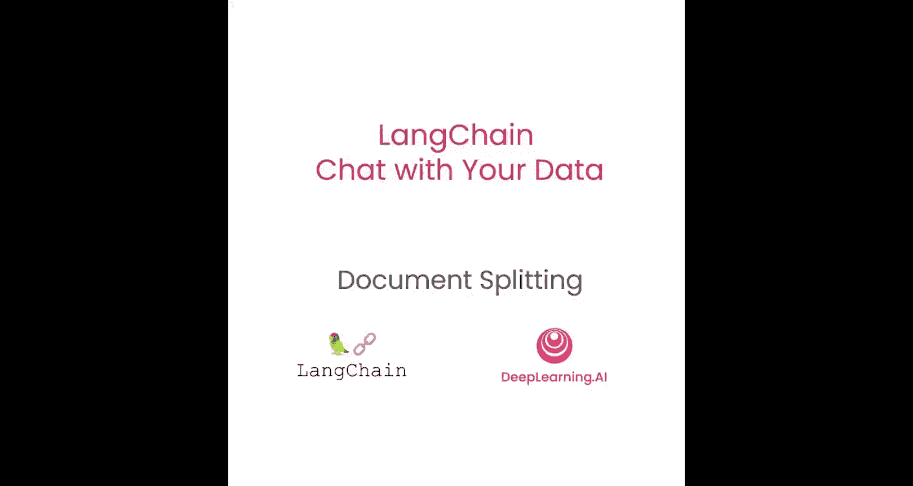

## 概述
在本节课中，我们将要学习如何将加载好的文档分割成更小的、语义相关的“块”。这是构建高效检索系统（RAG）的关键步骤，直接影响后续检索和问答的质量。

我们刚刚介绍了如何将文档加载为标准格式。现在，我们来探讨如何将它们分割成更小的块。这听起来可能很简单，但其中有许多细微之处，会对后续流程产生重大影响。

让我们开始吧。

## 文档分块的重要性
文档分块发生在将数据加载为文档格式之后，但在存入向量数据库之前。这看似非常简单，例如，你可以简单地根据字符长度来分割文本。但为了说明这个过程为何既棘手又重要，让我们看一个例子。

我们有一段关于丰田凯美瑞及其规格的句子。如果我们进行简单的分割，可能会导致句子的前半部分在一个块中，后半部分在另一个块中。那么，当我们后续尝试回答“凯美瑞的规格是什么？”这个问题时，实际上没有任何一个块包含完整的信息，信息被分割开了。因此，我们将无法正确回答这个问题。

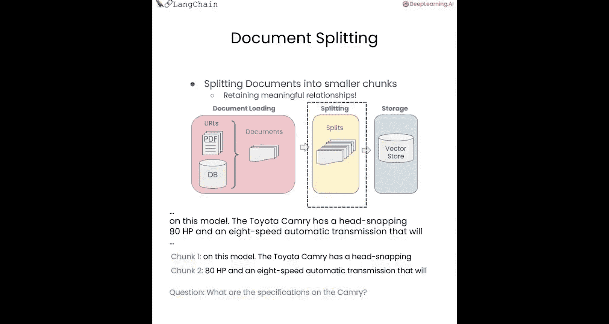

所以，如何分割块以获得语义相关的片段，这其中有很多细节和重要性。

## 分块的基本原理
LangChain中所有文本分割器的基础都涉及：按照某个块大小进行分割，并保留一定的块重叠。

下图展示了这个概念：
*   **块大小** 对应一个块的长度，可以通过几种不同的方式来衡量（我们将在课程中讨论几种）。我们允许传入一个长度函数来衡量块的大小，通常是字符数或令牌数。
*   **块重叠** 通常是在两个块之间保留一点重叠，就像从一个块滑动到下一个块的滑动窗口。这允许同一段上下文出现在一个块的末尾和下一个块的开头，有助于保持一定的连贯性。

LangChain中的文本分割器都有 `create_documents` 和 `split_documents` 方法。它们内部的逻辑相同，只是暴露的接口略有不同：一个接收文本列表，另一个接收文档列表。

## 分割器的类型
LangChain中有许多不同类型的分割器，我们将在本节课中介绍其中几种。但我鼓励你在空闲时间查看其余的分割器。

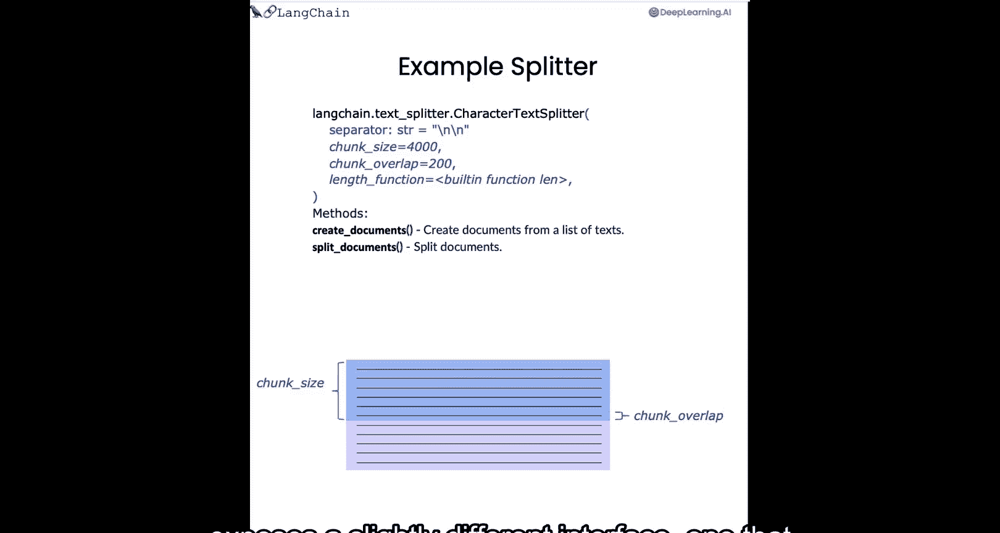

这些文本分割器在多个维度上有所不同：
*   **分割方式**：它们如何分割块，使用哪些字符作为分隔符。
*   **长度衡量方式**：是按字符、按令牌，还是其他方式。
*   **智能分割**：有些分割器甚至使用较小的模型来确定句子的结尾，并以此作为分割块的依据。
*   **元数据处理**：分块的另一个重要部分是元数据。需要在所有块中保持相同的元数据，同时在相关时添加新的元数据片段。因此，有些文本分割器专门关注这一点。

分块通常取决于我们正在处理的文档类型，这在分割代码时尤为明显。因此，我们有一个**语言文本分割器**，它针对多种不同语言（如Python、Ruby、C）有一系列不同的分隔符。在分割这些文档时，它会考虑这些不同的语言及其相关的分隔符。

## 实践：使用字符分割器
首先，我们将像之前一样设置环境，加载OpenAI API密钥。

接下来，我们将导入LangChain中最常见的两种文本分割器：**递归字符文本分割器** 和 **字符文本分割器**。

我们将首先使用几个简单的示例来感受一下它们的具体功能。

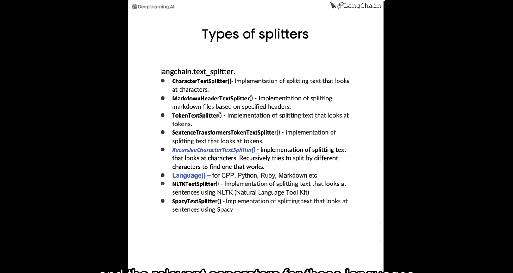

我们将设置一个相对较小的块大小（26）和一个更小的块重叠（4），以便观察它们的效果。

让我们初始化这两种不同的文本分割器，分别命名为 `r_splitter` 和 `c_splitter`。

然后，让我们看几个不同的用例。首先加载一个字符串“ABCD...Z”，看看使用不同分割器时会发生什么。

当我们用递归字符文本分割器分割它时，它仍然是一个字符串。这是因为它的长度正好是26个字符，而我们指定的块大小是26，所以实际上不需要进行任何分割。

现在，让我们对一个稍长的字符串进行操作，其长度超过了指定的26个字符的块大小。

这里我们可以看到创建了两个不同的块。第一个块以“Z”结尾，即26个字符。下一个块以“WXYZ”开头，这四个字符就是块重叠的部分，然后继续字符串的其余部分。

让我们看一个稍微复杂一点的例子，其中字符之间有很多空格。

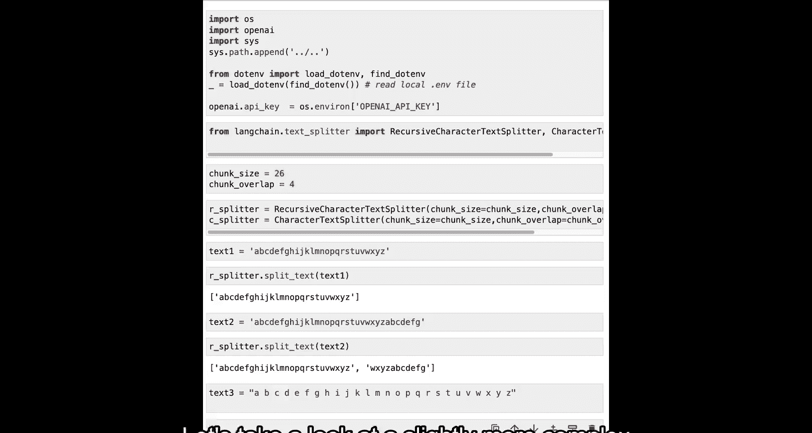

现在我们可以看到它被分成了三个块。因为有空格，所以占用了更多空间。如果我们查看重叠部分，可以看到第一个块中有“L”和“M”，而“L”和“M”也出现在第二个块中。看起来只有两个字符，但由于“L”和“M”之间以及“L”之前和“M”之后的空格，实际上构成了四个字符的块重叠。

现在让我们尝试使用字符文本分割器。

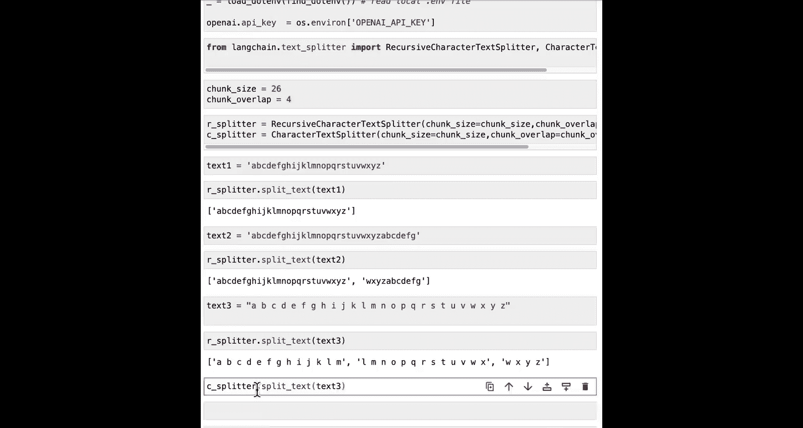

我们可以看到，当我们运行它时，它实际上根本没有尝试分割。这是怎么回事？问题在于，字符文本分割器默认在单个字符（换行符）上进行分割，但这里没有换行符。

如果我们把分隔符设置为一个空格，看看会发生什么。

这里它以与之前相同的方式进行了分割。这是一个暂停视频的好时机，尝试一些新的例子。你可以用自己编造的不同字符串进行尝试，也可以更换分隔符，看看会发生什么。尝试调整块大小和块重叠也很有趣，通过几个简单的例子来感受一下底层发生了什么，这样当我们转向更真实的例子时，你就能对底层机制有很好的直觉。

## 实践：更真实的例子
现在让我们在一些更真实的例子上尝试。我们这里有这个长段落，可以看到这里有一个双换行符，这是段落之间典型的分隔符。让我们检查一下这段文本的长度。

我们可以看到它大约是500个字符。现在让我们定义我们的两个文本分割器。我们将像之前一样使用以空格为分隔符的字符文本分割器，然后初始化递归字符文本分割器。这里我们传入一个分隔符列表，这些是默认的分隔符，但我们把它们放在这个笔记本中是为了更好地展示发生了什么。我们可以看到我们有一个列表：双换行符、单换行符、空格，然后是空字符串。

这些意味着当你分割一段文本时，它会首先尝试用双换行符分割，如果仍然需要进一步分割单个块，它会继续使用单换行符，如果还需要，就使用空格，最后如果确实需要，它会逐个字符分割。

观察这些分割器在上述文本上的表现，我们可以看到字符文本分割器在空格处分割，因此我们在句子中间得到了奇怪的分割。

而递归文本分割器首先尝试在双换行符处分割。因此，这里它被分割成了两个段落，即使第一个段落的长度小于我们指定的450个字符。这可能是一个更好的分割，因为现在两个各自独立的段落分别位于各自的块中，而不是在句子中间被分割。

现在让我们把它分割成更小的块，以便更好地理解发生了什么。

我们还将添加一个句号分隔符。这是为了在句子之间进行分割。

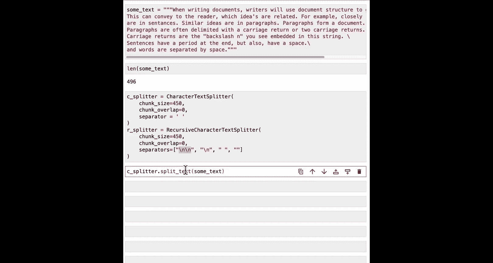

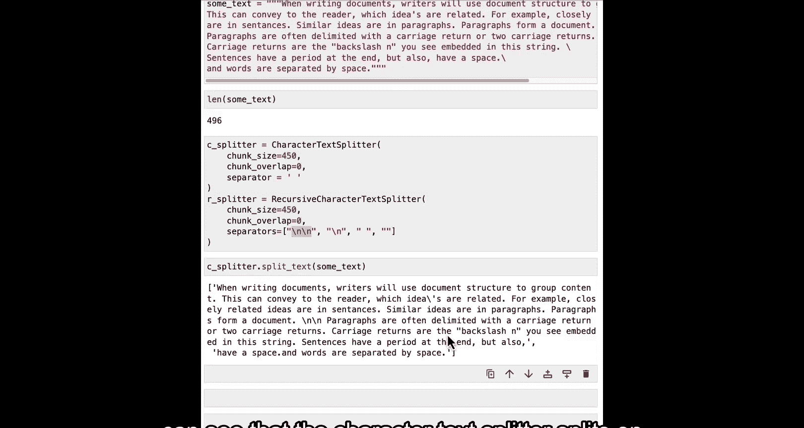

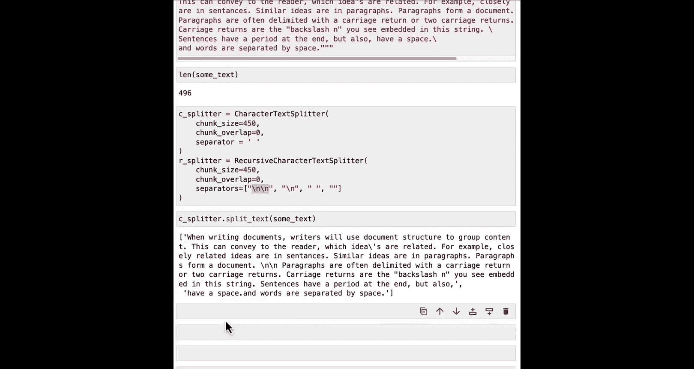

如果我们运行这个文本分割器，可以看到它按句子进行了分割，但句号实际上放错了位置。这是因为底层使用了正则表达式。

为了解决这个问题，我们可以指定一个稍微复杂一点、带有“后顾断言”的正则表达式。现在，如果我们运行这个。

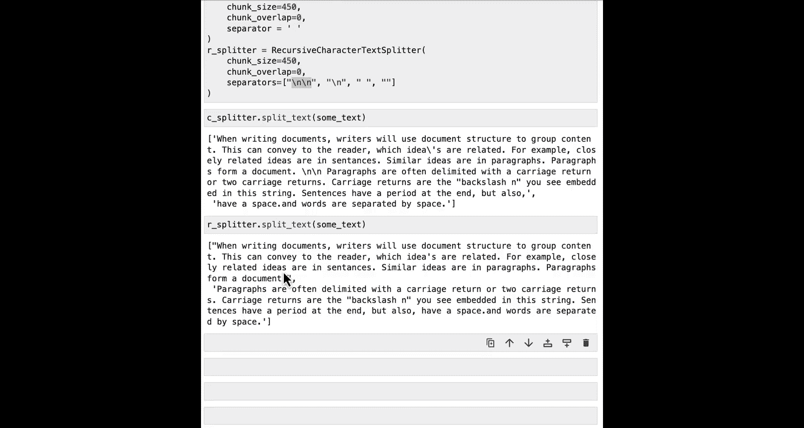

我们可以看到它被分割成了句子，并且分割正确，句号放在了正确的位置。

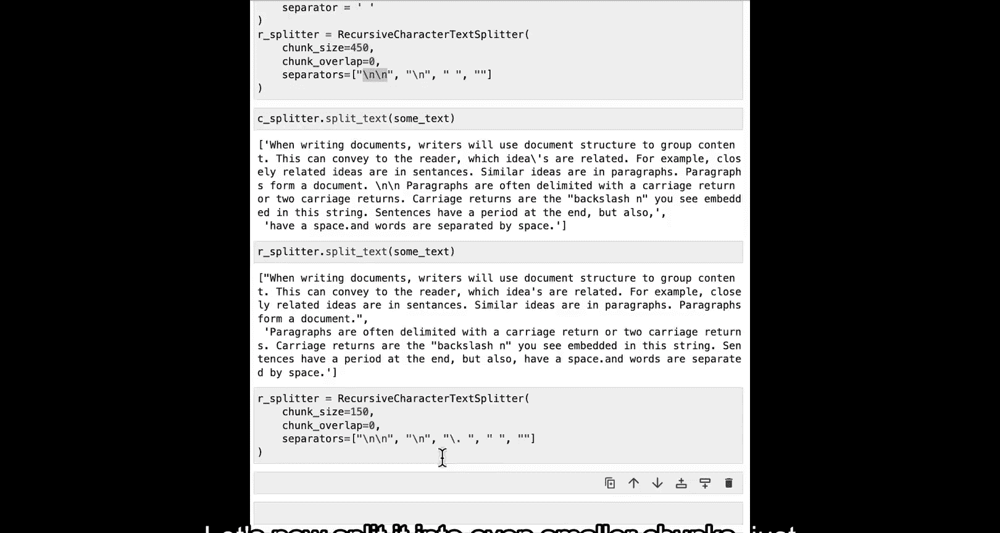

## 实践：处理真实文档
现在让我们在一个更真实的例子中应用这个方法，使用我们在第一个文档加载部分处理过的PDF之一。

让我们加载它，然后在这里定义我们的文本分割器。这里我们传递了长度函数，这是使用Python内置的`len`函数，这是默认设置，但我们指定它是为了更清楚地了解底层发生了什么，这是在计算字符的长度。因为我们现在想使用文档，所以我们使用`split_documents`方法，并传入一个文档列表。

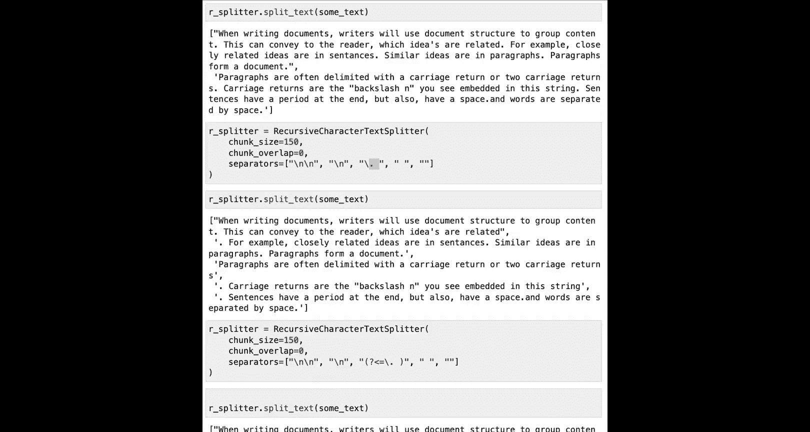

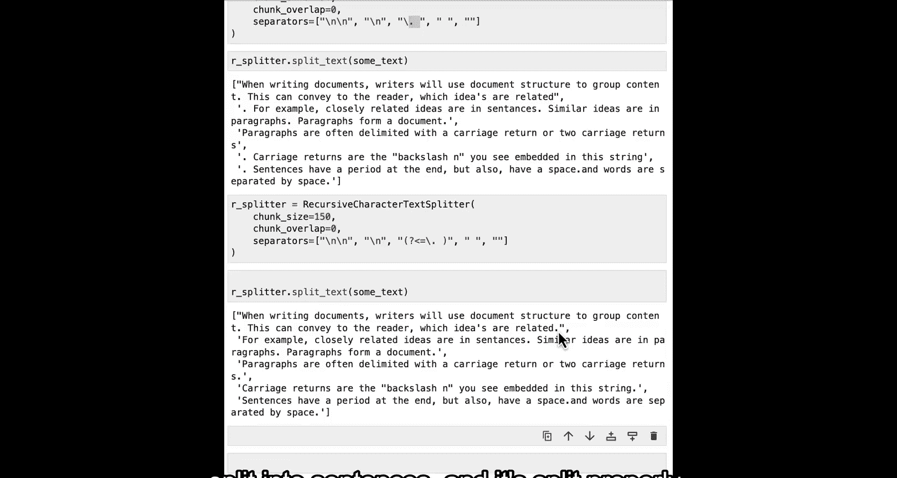

如果我们比较这些文档的长度与原始页面的长度。

我们可以看到，由于这次分割，创建了更多的文档。

我们可以对第一讲中使用过的Notion数据库做类似的事情。

再次比较原始文档的长度与新分割文档的长度，我们可以看到，在完成所有分割后，我们现在有了更多的文档。

## 实践：基于令牌的分割
这是一个暂停视频并尝试一些新例子的好时机。到目前为止，我们都是基于字符进行分割，但还有另一种分割方式，即基于**令牌**。为此，让我们导入令牌文本分割器。

这种方式很有用，因为通常LLM的上下文窗口是由令牌数量指定的。因此，了解令牌是什么、它们出现在哪里很重要，然后我们可以基于它们进行分割，以便更准确地了解LLM会如何看待它们。

为了真正理解令牌和字符之间的区别，让我们用块大小为1、块重叠为0来初始化令牌文本分割器。这样会将任何文本分割成相关令牌的列表。让我们创建一个虚构的文本。

当我们分割它时，我们可以看到它被分割成了许多不同的令牌，它们在长度和字符数上都略有不同。第一个是“fo”，然后是一个空格和“bar”，然后是一个空格和“b”，接着是“az”、“zy”，然后是“fo”再次出现。这显示了基于字符分割和基于令牌分割之间的一些区别。

让我们以类似的方式将其应用到上面加载的文档中。

类似地，我们可以在页面上调用`split_documents`。

如果我们查看第一个文档，我们有了新的分割文档，其页面内容大致是标题，然后我们有了来源和页码的元数据。

你可以看到，这里的来源和页码元数据与原始文档中的相同。为了确认，我们可以查看一下。第0页的元数据，我们可以看到它是对齐的。这很好，它正在将元数据适当地传递到每个块。

但也可能存在这样的情况：你实际上希望在分割块时向块添加更多元数据。这可以包含诸如块在文档中的位置、相对于文档中其他内容或概念的位置等信息。通常，这些信息可以在回答问题时用于提供关于这个块到底是什么的更多上下文。

为了看一个具体的例子，让我们看看另一种类型的文本分割器，它实际上会向每个块的元数据中添加信息。

你现在可以暂停并尝试一些你自己想出的例子。

这个文本分割器是**Markdown标题文本分割器**。

它的作用是：根据标题或任何子标题来分割Markdown文件。然后，它会将这些标题作为内容添加到元数据字段中，这些元数据将传递给源自这些分割的任何块。

让我们先做一个简单的例子，玩转一个文档，其中有一个标题，然后是第1章的子标题，接着是一些句子，然后是另一个更小子标题的部分，然后我们跳回到第2章和一些句子。

让我们定义一个我们想要分割的标题列表以及这些标题的名称。首先，我们有一个单井号，我们称之为`header1`；然后有两个井号，`header2`；三个井号，`header3`。然后，我们可以用这些标题初始化Markdown标题文本分割器。

然后分割我们上面的简单示例。如果我们查看其中几个例子，可以看到第一个例子的内容是“Hi, this is Jim. Hi, this is Joe.”，在元数据中，我们有`header1`为“Title”，`header2`为“Chapter 1”，这来自于上面示例文档中的这里。

让我们看看下一个例子，我们可以看到我们已经跳到了一个更小的子部分，因此内容为“Hi this is Lance”，现在我们不仅有`header1`，还有`header2`和`header3`。这同样来自于上面Markdown文档中的内容和名称。

## 实践：处理真实Markdown文档
让我们在一个真实世界的例子中尝试一下。之前我们使用Notion目录加载器加载了Notion目录，这会将文件加载为Markdown格式，这与Markdown标题分割器相关。

所以让我们加载这些文档，然后用`header1`作为单井号、`header2`作为双井号来定义Markdown分割器。

我们分割文本并得到分割结果。如果我们查看它们。

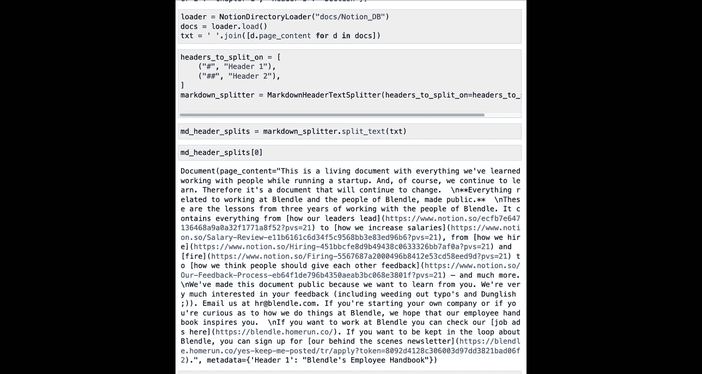

我们可以看到第一个的内容是某个页面，现在如果我们向下滚动到元数据，可以看到我们已将`header1`加载为“Bdle's Employee Handbook”。

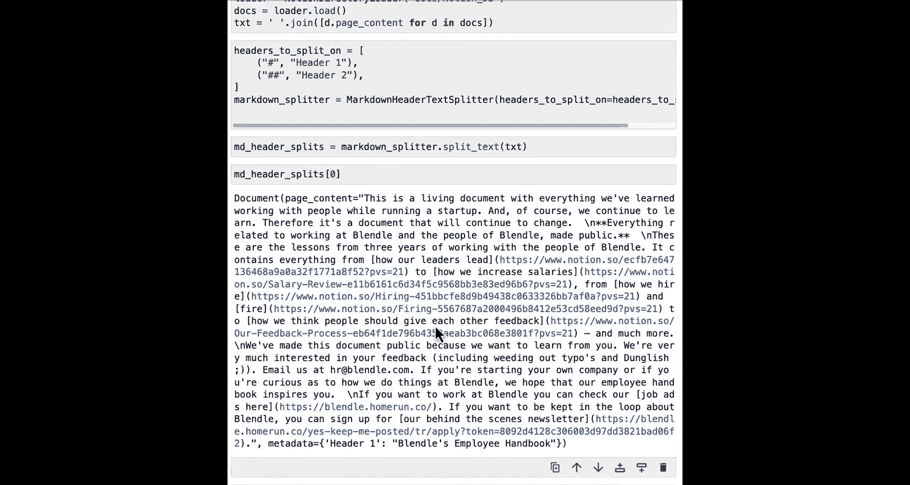

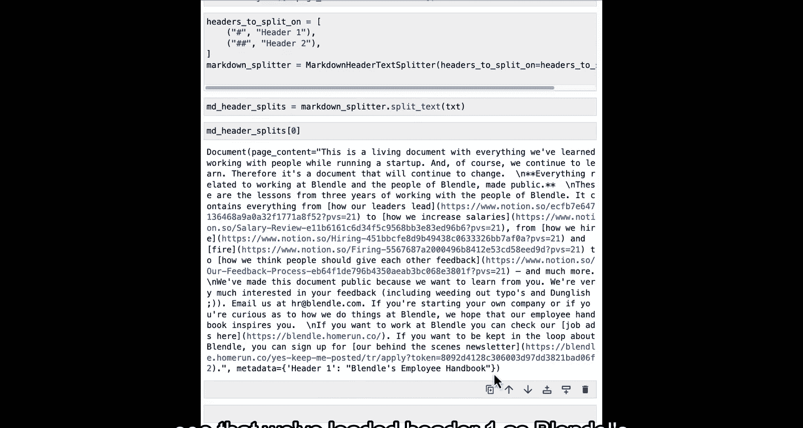

## 总结
本节课中，我们一起学习了如何将文档分割成语义相关的块，并保留或添加适当的元数据。我们介绍了分块的基本原理、不同类型的分割器（如字符分割器、递归字符分割器、令牌分割器和Markdown标题分割器），并通过实践了解了它们在不同场景下的应用。

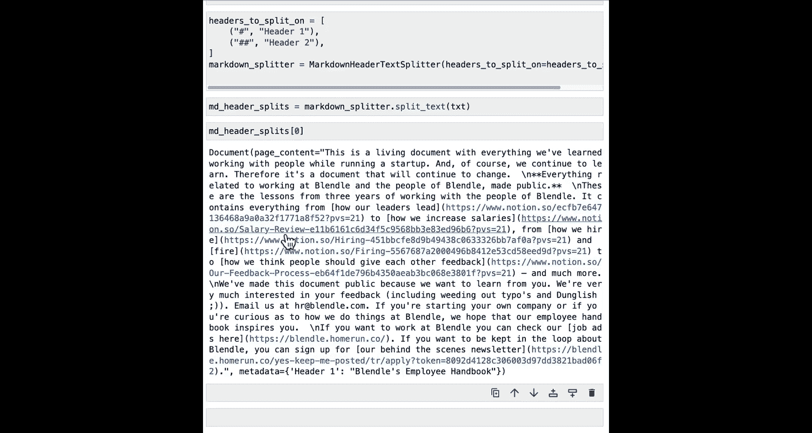

我们已经介绍了如何获得具有适当元数据的语义相关块。下一步是将这些数据块移动到向量数据库中，我们将在下一节中介绍。