# 004：嵌入与向量存储


在本节课中，我们将学习如何将分割好的文档块转换为数值表示（嵌入），并将其存储在向量数据库中，以便后续高效地检索与问题相关的信息。

上一节我们介绍了如何将文档分割成有意义的块。本节中，我们来看看如何将这些块存储起来，以便在回答问题时能快速找到它们。为此，我们将利用**嵌入**和**向量存储**技术。

## 什么是嵌入与向量存储？

我们在之前的课程中简要介绍过，但这里需要更深入地探讨，因为它们是构建数据聊天机器人的核心。同时，我们也会讨论这种通用方法可能失效的边缘情况。

嵌入的作用是接收一段文本，并为其创建一个数值表示。内容相似的文本，其数值向量在向量空间中也相似。这意味着我们可以通过比较向量来找到语义相近的文本片段。

以下是完整的工作流程：
1.  从文档开始。
2.  将文档分割成较小的块。
3.  为这些文档块创建嵌入向量。
4.  将所有向量存储在向量存储中。

向量存储是一种数据库，可以方便地查找相似的向量。当我们试图找到与当前问题相关的文档时，这非常有用。我们可以将问题也转换为嵌入向量，然后与向量存储中的所有向量进行比较，并选出最相似的N个。最后，将这N个最相似的文本块与问题一起输入给大语言模型，从而获得答案。

## 实践：创建与比较嵌入

首先，我们需要设置环境变量。我们将使用CS 229讲座的文档，并特意复制了第一讲，以模拟存在重复数据的情况。

加载文档后，我们使用递归字符文本分割器来创建块。现在，我们有了超过200个不同的文本块，是时候为它们创建嵌入向量了。我们将使用OpenAI的模型来生成这些嵌入。

在进入真实示例之前，我们先通过几个简单的测试句子来理解其底层原理。以下是几个示例句子，前两个非常相似，第三个则无关。

```python
# 示例：创建和比较嵌入
from langchain.embeddings import OpenAIEmbeddings
import numpy as np

embeddings = OpenAIEmbeddings()
sentences = [
    "I have a dog.",
    "I have a pet.",
    "I drive a car."
]
vec1 = embeddings.embed_query(sentences[0])
vec2 = embeddings.embed_query(sentences[1])
vec3 = embeddings.embed_query(sentences[2])

# 使用点积比较相似度，数值越高表示越相似
similarity_1_2 = np.dot(vec1, vec2)
similarity_1_3 = np.dot(vec1, vec3)
```
运行代码后，我们发现前两个句子的嵌入向量相似度很高（约0.96），而它们与第三个句子的相似度则低得多（约0.77）。这表明嵌入模型成功捕捉了语义相似性。

## 构建向量存储

现在回到真实示例。我们需要为所有PDF文本块创建嵌入，并将它们存储到向量存储中。本节课我们使用Chroma，因为它轻量且支持内存存储，易于上手。LangChain集成了超过30种向量存储，Chroma是其中之一。

以下是创建和保存向量存储的步骤：
```python
# 创建并持久化向量存储
from langchain.vectorstores import Chroma

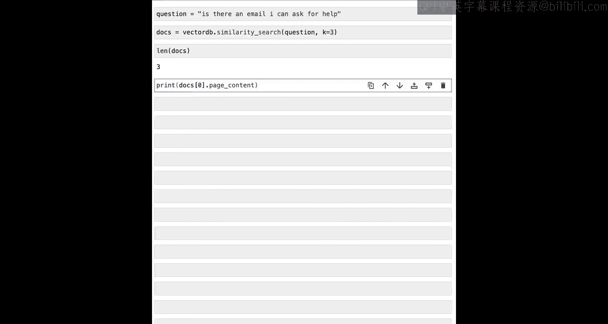

persist_directory = ‘./docs/chroma‘
# 确保目录干净（示例中为演示而清理）
vectorstore = Chroma.from_documents(
    documents=splits, # 之前创建的文本块
    embedding=OpenAIEmbeddings(),
    persist_directory=persist_directory
)
print(vectorstore._collection.count()) # 应输出209，与块数量一致
```

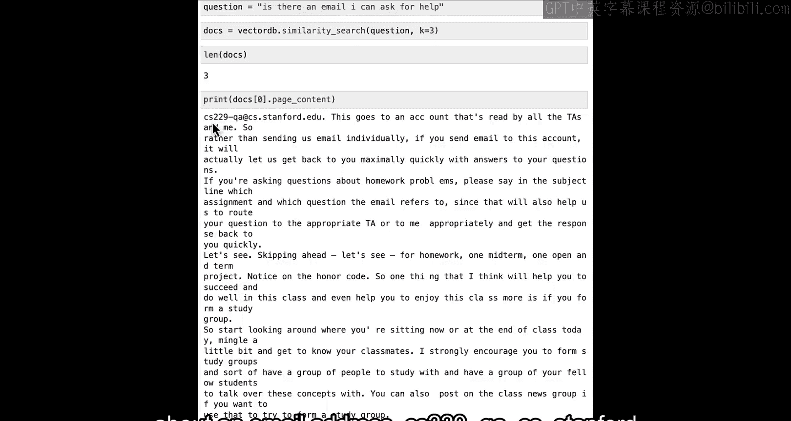

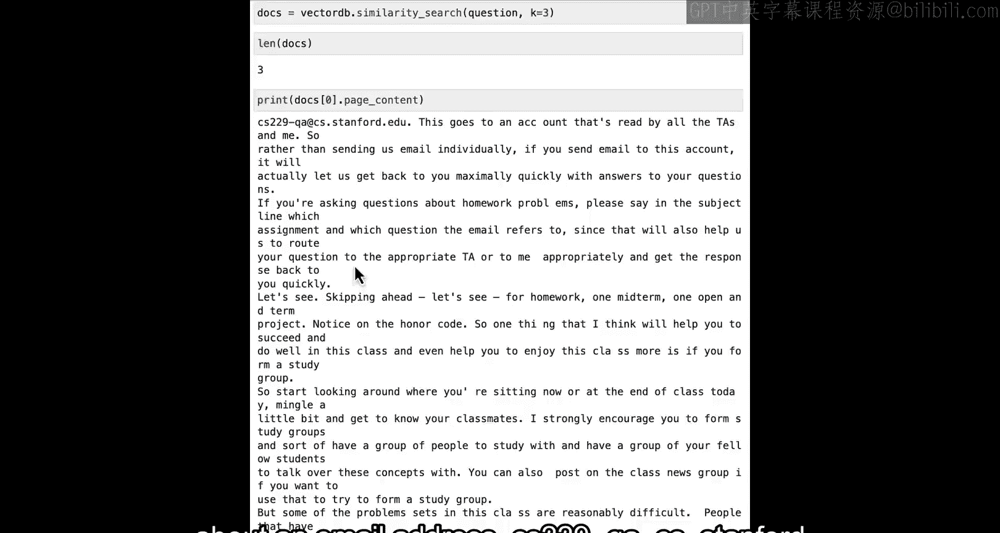

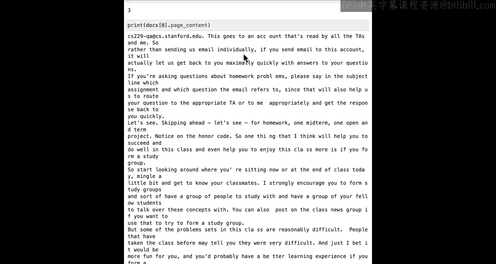

## 进行语义搜索

向量存储构建完成后，我们就可以开始使用它了。假设我们想问一个关于课程的问题：“如果有问题，可以联系哪个邮箱寻求帮助？”

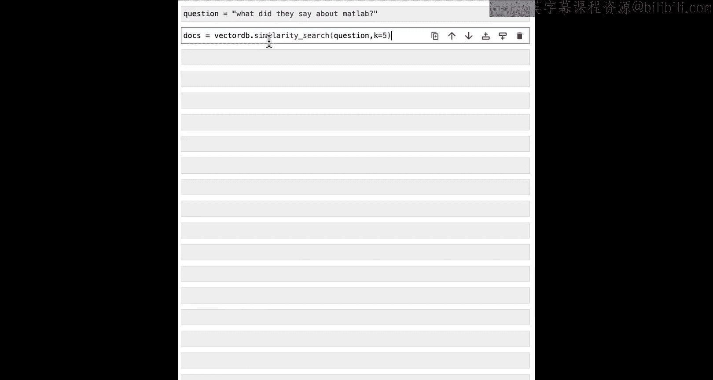

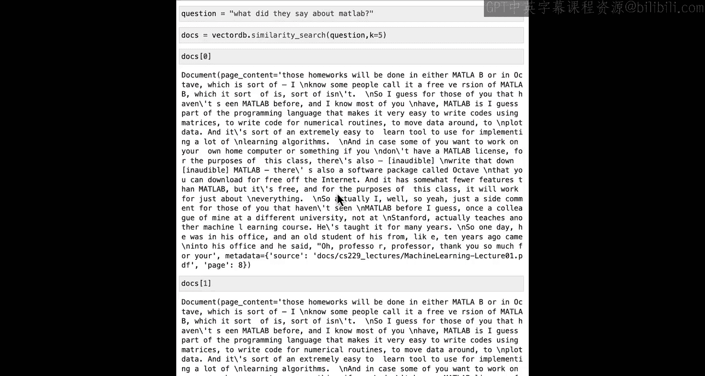

我们使用`similarity_search`方法，传入问题并指定返回最相似的3个文档块（K=3）。
```python
# 在向量存储中进行相似性搜索
question = “Is there an email I can ask for help if I need help with the course?”
docs = vectorstore.similarity_search(question, k=3)
print(len(docs)) # 输出 3
print(docs[0].page_content) # 查看最相关块的内容
```
搜索结果显示，最相关的文本块确实包含了课程助教的邮箱地址：`cs229qa@cs.stanford.edu`。这证明基本的语义搜索是有效的。

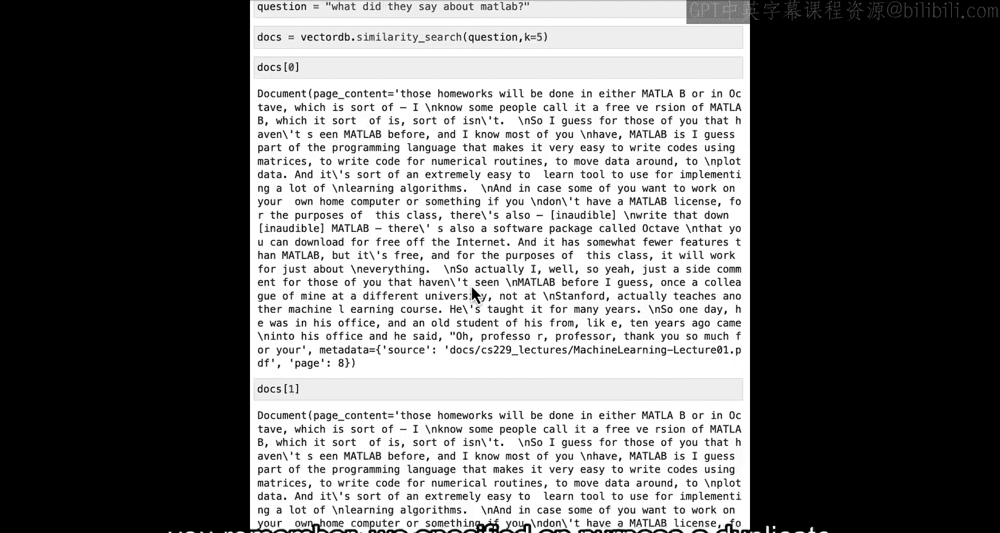

最后，记得持久化向量数据库以供后续课程使用：
```python
vectorstore.persist()
```

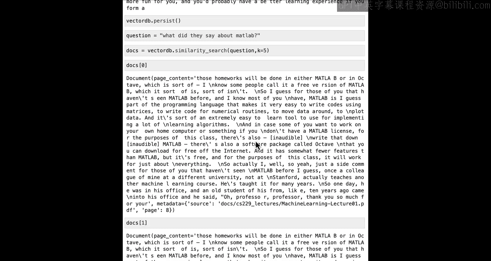

## 当前方法的局限性

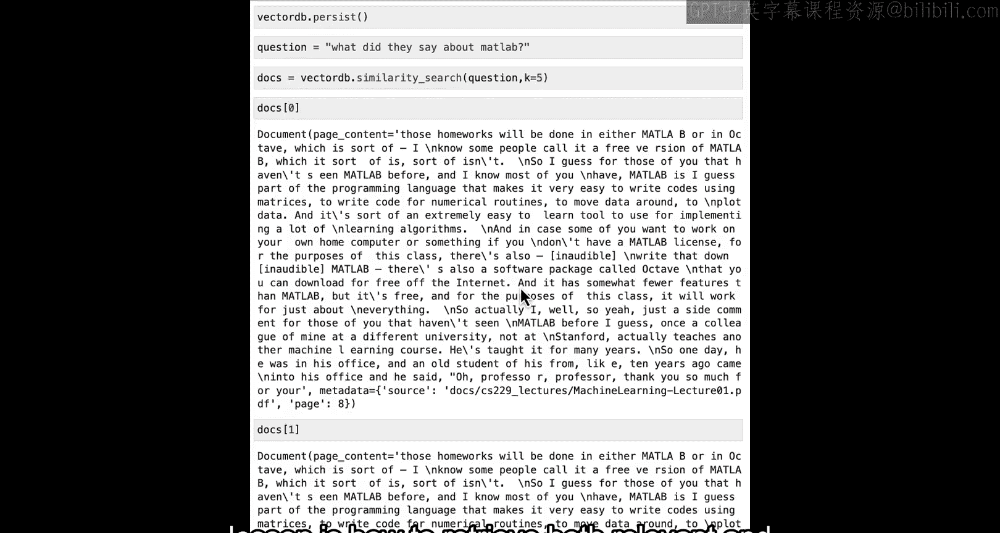

虽然基本搜索效果不错，但该方法并不完美。我们接下来探讨几个它可能失效的边缘情况。

**1. 重复信息问题**
当我们询问“关于Matlab他们说了什么？”并获取前5个结果（K=5）时，会发现前两个结果完全相同。这是因为我们在加载数据时故意引入了重复的文档。这会导致将重复信息传递给语言模型，浪费资源且无助于生成更好的答案。

**2. 结构化信息缺失问题**
另一个失效情况出现在询问需要结合结构化信息的查询时。例如，问题：“在第三讲中，他们关于回归说了什么？”直觉上，我们希望所有返回的文档都来自第三讲。

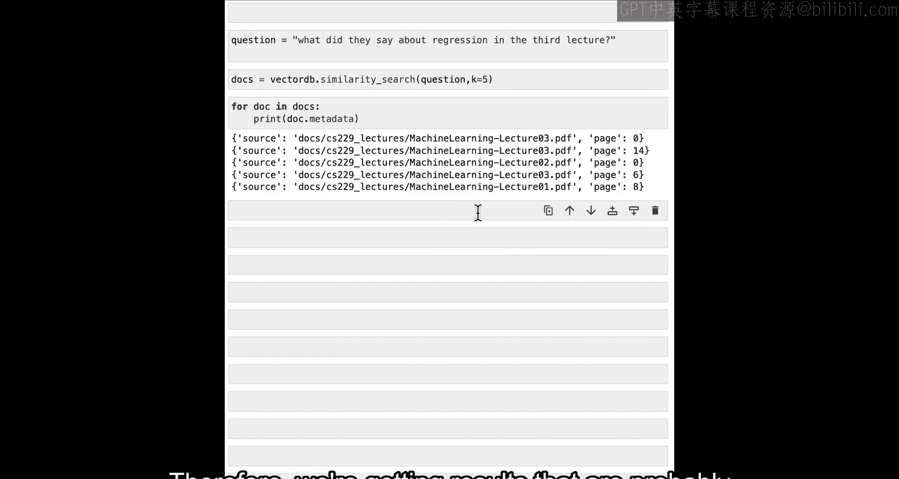

但当我们检查返回文档的元数据时，会发现结果混合了第一讲、第二讲和第三讲的内容。这是因为当前的语义搜索主要基于整个句子的嵌入相似度，它捕捉到了“回归”这个关键词，但未能有效捕捉“仅限第三讲”这个结构化过滤条件。

## 小结与下节预告

本节课中我们一起学习了：
1.  **嵌入**的概念：将文本转换为数值向量，语义相似的文本其向量也相似。
2.  **向量存储**的作用：存储嵌入向量，以便快速进行相似性检索。
3.  基本的语义搜索流程：将问题嵌入，在向量库中查找最相似的文档块。
4.  当前方法的两个主要局限性：**重复信息**和**难以处理结构化查询条件**。

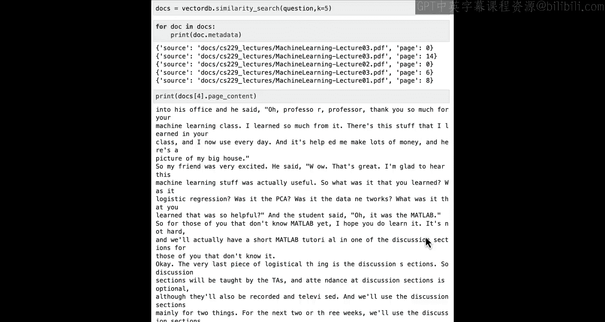

现在我们已经掌握了语义搜索的基础及其一些失效模式，下一节课我们将探讨如何解决这些问题，并增强我们的检索能力。