# 005：高级检索技术

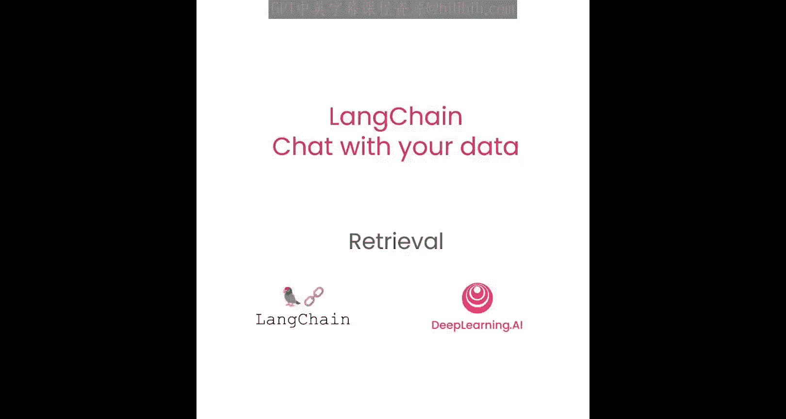

在本节课中，我们将深入学习检索环节，并探讨几种更先进的方法来克服上一课中提到的边缘情况。检索是查询时的关键步骤，当用户提出问题时，我们需要找到最相关的文本片段。上一课我们介绍了语义相似性搜索，本节课我们将介绍几种不同的、更高级的检索方法。

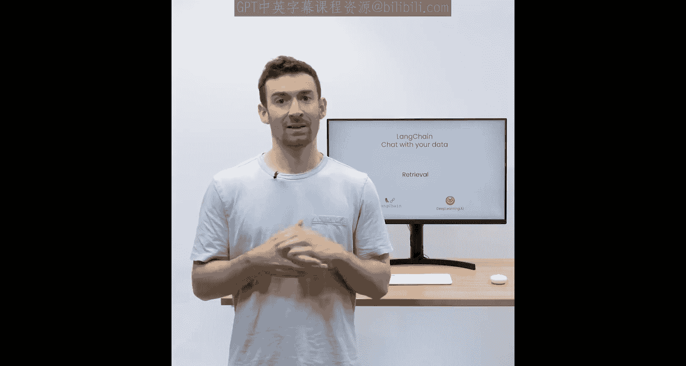

## 最大边际相关性 (MMR)

上一节我们介绍了语义搜索的基础，本节中我们来看看如何通过**最大边际相关性**来提升检索结果的多样性。如果我们总是选择在嵌入空间中最相似查询的文档，可能会错过多样化的信息，正如我们在一个边缘案例中看到的那样。

以下是MMR的工作原理：
1.  首先，根据语义相似性获取一组初始文档（数量由 `fetch_k` 参数控制）。
2.  然后，在这组较小的文档中，同时优化**相关性**和**多样性**。
3.  最后，从这组文档中选择最终 `k` 个文档返回给用户。

其核心思想是避免返回内容高度重复的文档。

## 自查询检索器

接下来，我们探讨**自查询检索器**。这种方法适用于用户问题不仅包含需要语义查找的内容，还包含需要基于元数据进行过滤的条件的情况。

例如，对于问题：“1980年有哪些关于外星人的电影？”，它包含两个部分：
*   **语义部分**：关于“外星人”。
*   **元数据部分**：年份等于“1980”。

自查询检索器会利用语言模型将原始问题拆分为**过滤条件**和**搜索词**。大多数向量数据库都支持元数据过滤，因此可以轻松筛选出符合年份等条件的记录。

## 上下文压缩

最后，我们来了解**上下文压缩**。这种方法有助于从检索到的长文档中提取出最相关的部分。

例如，当回答一个问题时，你可能会得到整个存储的文档，即使只有前一两句话是相关的。通过上下文压缩，你可以将所有文档通过一个语言模型运行，提取出最相关的片段，然后只将这些最相关的片段传递给最终的语言模型调用。这样做的代价是需要更多次调用语言模型，但能确保最终答案聚焦于最重要的信息，是一种权衡。

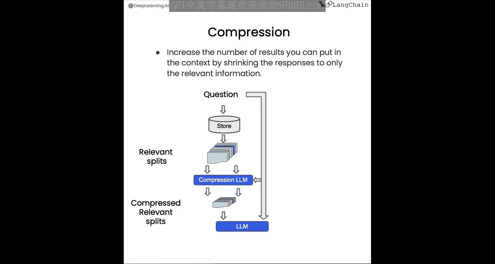

让我们看看这些不同技术的实际应用。

## 实践：最大边际相关性 (MMR)

我们首先像往常一样加载环境变量，并导入之前使用过的Chroma和OpenAI。可以看到，我们的集合中包含了之前加载的209个文档。

现在，我们回顾一下关于蘑菇的例子。我们加载示例文本，其中包含蘑菇的信息。为了演示，我们创建一个小型数据库作为示例。

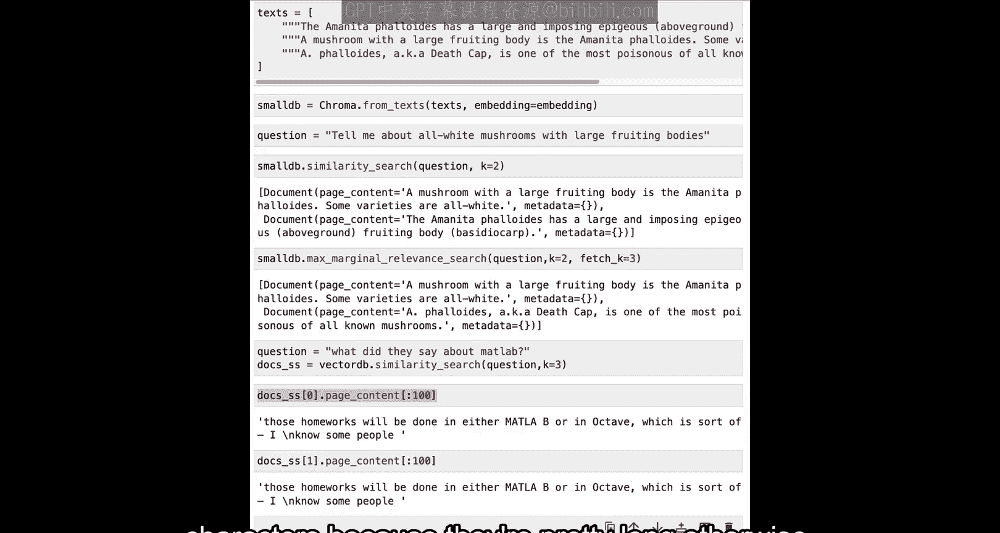

我们有一个问题：“所有白色的蘑菇是什么？”。现在运行相似性搜索，设置 `k=2` 只返回两个最相关的文档。我们可以看到，返回的文档中没有提到它是有毒的。

现在使用MMR运行检索。我们设置 `k=2`（最终返回2个文档），但 `fetch_k=3`（最初获取3个文档）。现在我们可以看到，返回的文档中包含了“有毒”的信息。

让我们回到上一课中关于“MATLAB”的例子，当时我们得到了包含重复信息的文档。运行MMR后，我们可以看到第一个结果与之前相同（因为它最相似），但第二个结果不同了，它引入了多样性。

## 实践：自查询检索器

这是关于“他们在第三讲中关于回归说了什么？”的例子。之前，它返回的结果不仅来自第三讲，还来自第一和第二讲。

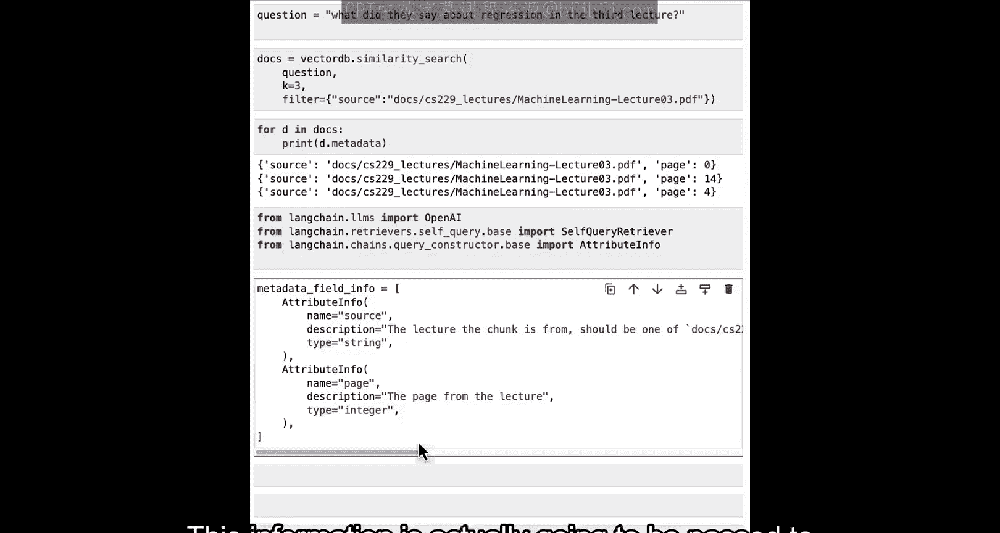

如果手动修复，我们会指定一个元数据过滤器，要求来源等于第三讲的PDF。这样，检索到的文档都将来自那堂课。

我们可以使用语言模型自动完成这个任务。为此，我们导入语言模型（OpenAI）、自查询检索器以及属性信息。我们只有两个元数据字段：`source` 和 `page`。我们为每个属性填写名称、描述和类型。这些信息将传递给语言模型，因此尽可能描述清楚非常重要。

然后，我们指定文档存储中的内容信息，初始化语言模型和自查询检索器。设置 `verbose=True` 可以让我们看到语言模型在推断查询和元数据过滤器时的内部过程。

当我们用这个问题运行自查询检索器时，得益于 `verbose=True`，我们可以看到内部过程：我们得到了一个关于“回归”的查询（语义部分），以及一个过滤器，要求 `source` 属性等于第三讲机器学习的路径。这意味着在语义空间中查找“回归”，同时过滤出源值为该路径的文档。遍历文档并打印元数据，可以看到它们都来自第三讲。

## 实践：上下文压缩

最后，我们来讨论上下文压缩。我们导入相关模块：上下文压缩检索器和LLM链提取器。这将从每个文档中提取仅相关的部分，然后将这些部分作为最终返回的响应。

我们定义一个函数来漂亮地打印文档，因为它们通常很长且混乱。然后，我们用LLM链提取器创建一个压缩器，再用这个压缩器和向量数据库的基础检索器创建上下文压缩检索器。

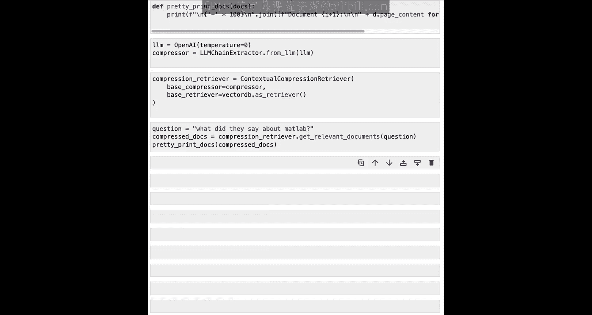

当我们问“关于MATLAB他们说了什么？”并查看压缩后的文档时，可以看到两点：一是它们比正常文档短得多；二是仍然存在一些重复内容。这是因为底层仍然在使用语义搜索算法，而这是我们之前用MMR解决的问题。这是一个结合多种技术以获得最佳结果的好例子。

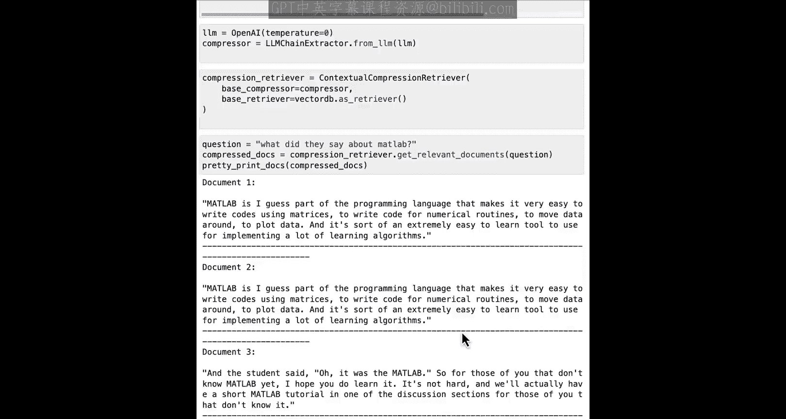

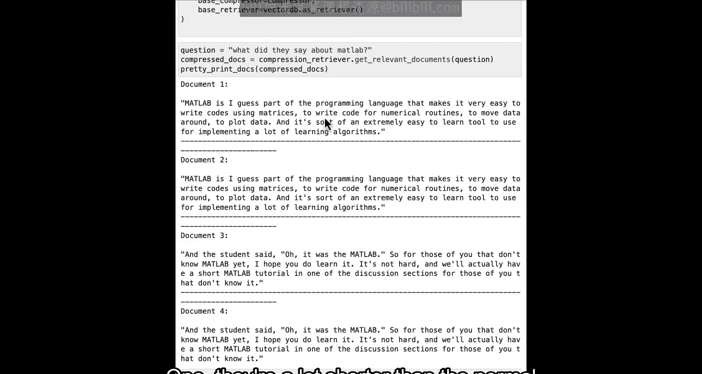

为此，在从向量数据库创建检索器时，我们可以将搜索类型设置为MMR。重新运行后，我们可以看到返回了一组经过过滤、不包含重复信息的结果。

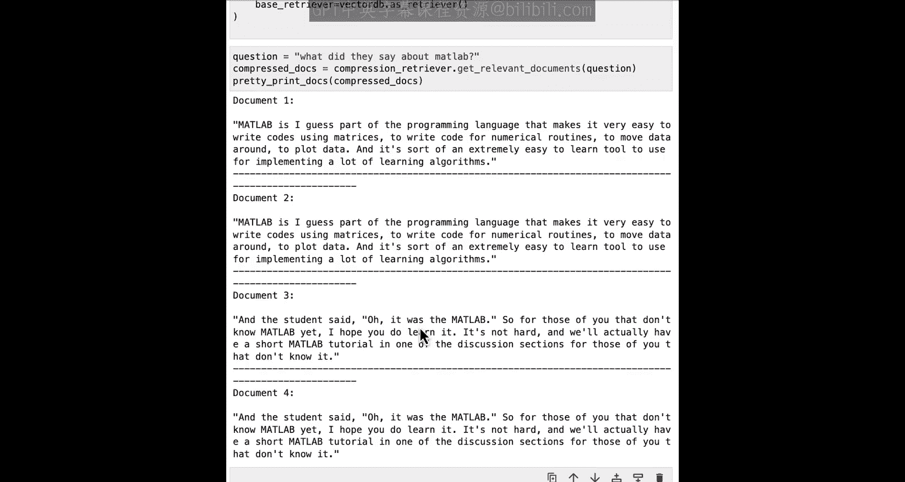

## 其他检索技术

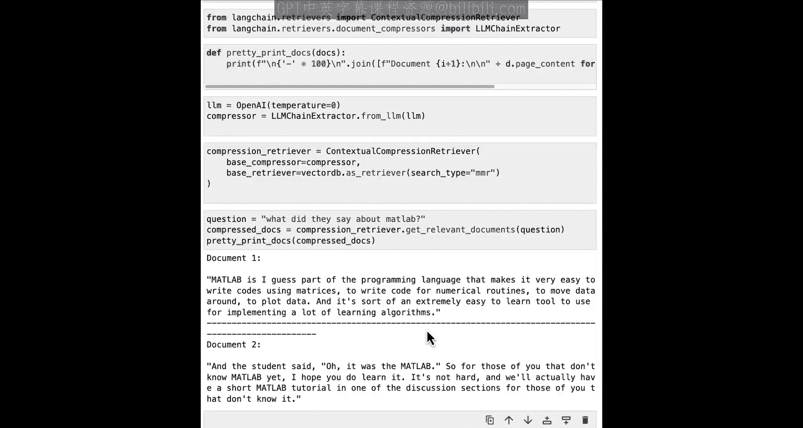

到目前为止，我们提到的所有额外检索技术都建立在向量数据库之上。值得注意的是，还有其他类型的检索根本不使用向量数据库，而是使用其他更传统的NLP技术。

这里，我们将用两种不同类型的检索器重新创建检索流程：SVM检索器和TF-IDF检索器。如果你从传统NLP或机器学习中认出了这些术语，那很好；如果不认识，也没关系。这只是其他现有技术的一个例子，除了这些还有很多，我鼓励你去探索一下。

我们可以快速完成加载和分割文本的常规流程。然后，这两种检索器都暴露了一个 `from_texts` 方法。SVM检索器需要一个嵌入模块，而TF-IDF检索器直接接收分割后的文本。

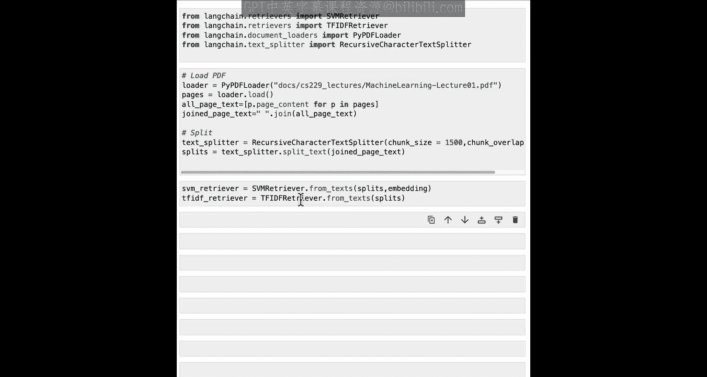

现在我们可以使用这些检索器了。将“关于MATLAB他们说了什么？”传递给SVM检索器，查看返回的顶部文档，可以看到它提到了很多关于MATLAB的内容，效果不错。我们也可以在TF-IDF检索器上尝试，可以看到结果看起来稍差一些。

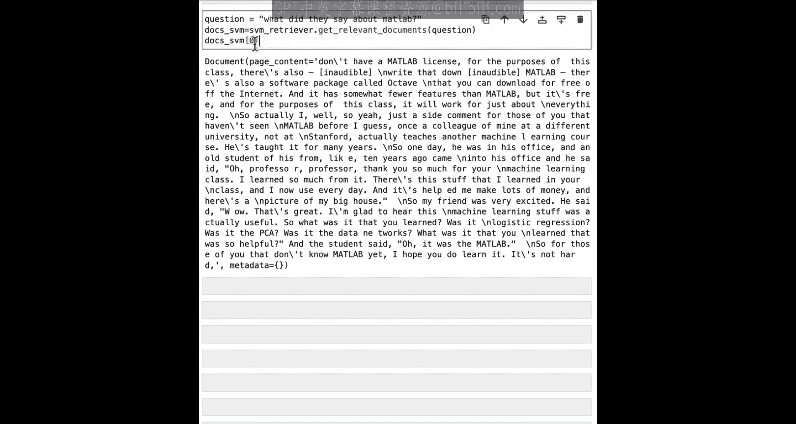

现在是一个很好的时机，可以暂停并尝试所有这些不同的检索技术。你会发现其中一些技术在不同方面比其他技术更好。我鼓励你在各种各样的问题上尝试。特别是自查询检索器是我的最爱，我建议尝试使用更复杂的元数据过滤器，甚至可以创建一些具有嵌套元数据结构的场景，尝试让LLM推断出来。我认为这非常有趣，也是一些更高级的内容，我很高兴能与你们分享。

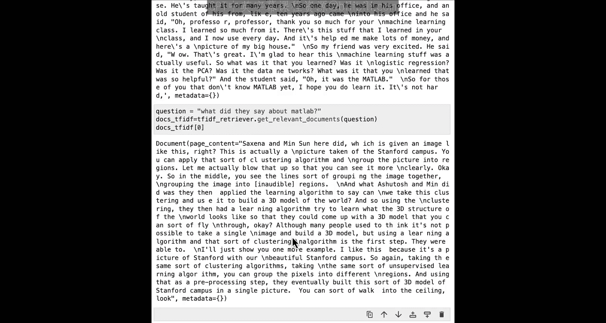

## 总结

本节课中，我们一起学习了三种高级检索技术：
1.  **最大边际相关性**：用于在返回结果时平衡相关性与多样性，避免信息冗余。
2.  **自查询检索器**：利用语言模型自动将用户问题分解为语义查询和元数据过滤条件，实现精准检索。
3.  **上下文压缩**：通过额外的语言模型调用，从长文档中提取最相关的片段，使最终答案更聚焦。

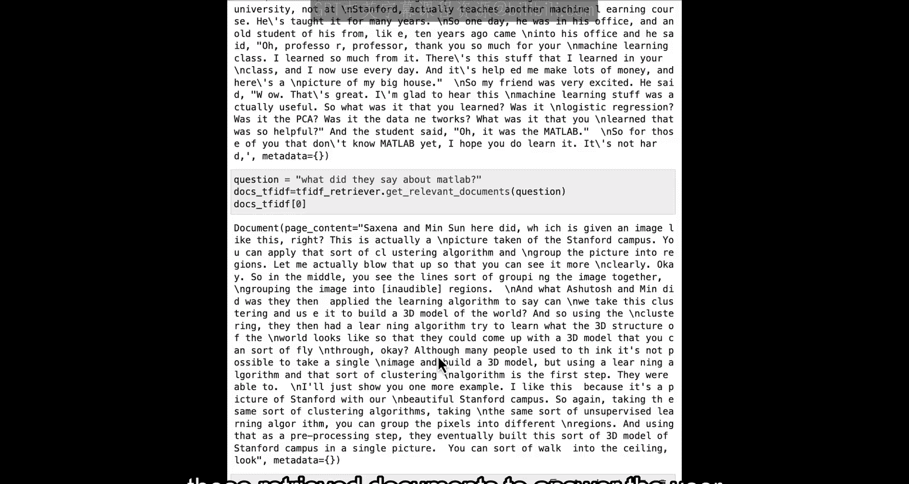

我们还了解到，这些技术可以组合使用（例如，MMR + 上下文压缩），并且除了基于向量的方法，还存在如SVM、TF-IDF等传统检索技术。掌握这些方法将帮助你构建更强大、更灵活的问答系统。