# 006：基于检索的问答

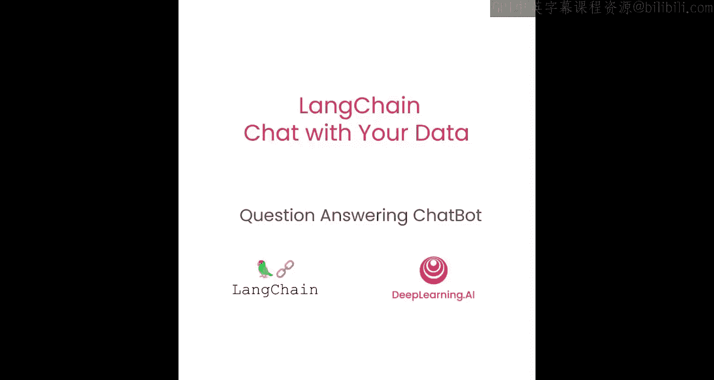


在本节课中，我们将学习如何利用检索到的相关文档，结合语言模型来回答问题。我们将介绍几种不同的方法，并分析它们的优缺点。

我们已经介绍了如何为给定问题检索相关文档。下一步是获取这些文档和原始问题，将它们一起传递给语言模型，并要求它回答问题。本节课将介绍这个过程，以及完成此任务的几种不同方法。

## 环境与数据准备

首先，我们像往常一样加载环境变量。

```python
import os
from dotenv import load_dotenv
load_dotenv()
```

接着，我们加载之前持久化保存的向量数据库。

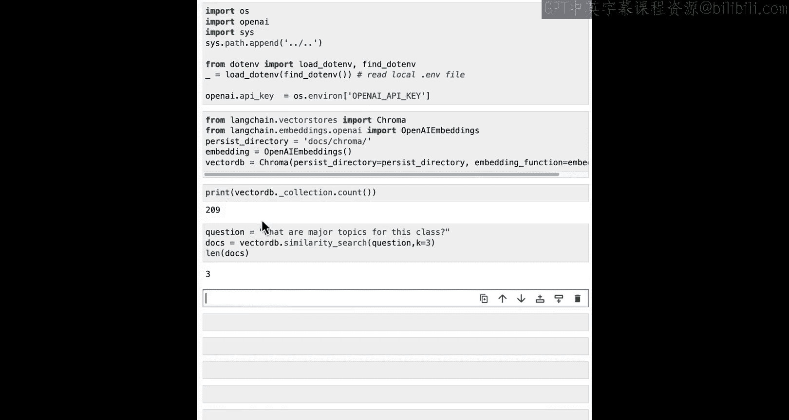

```python
from langchain.vectorstores import Chroma
from langchain.embeddings import OpenAIEmbeddings

embedding = OpenAIEmbeddings()
vectordb = Chroma(persist_directory="./chroma_db", embedding_function=embedding)
```

我们检查数据库是否正确加载，确认它包含之前相同的209个文档。

```python
print(f"文档数量: {vectordb._collection.count()}")
```

为了确保检索功能正常工作，我们对问题“这门课的主要主题是什么？”进行一个快速的相似性搜索测试。

```python
docs = vectordb.similarity_search("这门课的主要主题是什么？", k=3)
for doc in docs:
    print(doc.page_content[:100])
```

## 初始化语言模型与问答链

现在，我们初始化用于回答问题的语言模型。我们将使用ChatOpenAI模型（GPT-3.5），并将温度设置为0。这在需要事实性答案时非常有效，因为它具有较低的可变性，通常能提供最高保真度和最可靠的答案。

```python
from langchain.chat_models import ChatOpenAI
llm = ChatOpenAI(model_name="gpt-3.5-turbo", temperature=0)
```

然后，我们导入`RetrievalQA`链。这个链执行基于检索步骤的问答任务。我们可以通过传入语言模型和作为检索器的向量数据库来创建它。

```python
from langchain.chains import RetrievalQA
qa_chain = RetrievalQA.from_chain_type(llm, retriever=vectordb.as_retriever())
```

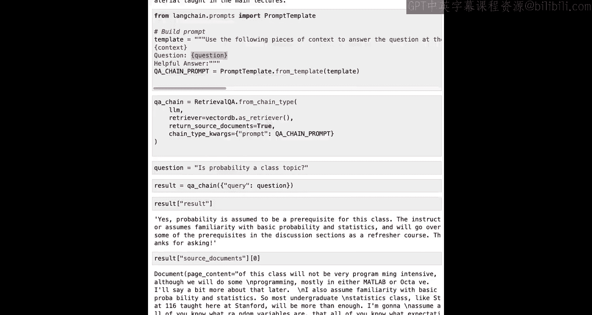

我们可以用我们想问的问题来调用它。

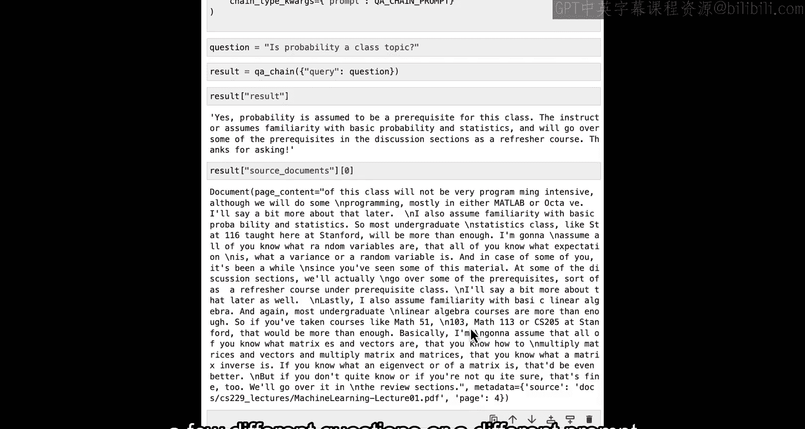

```python
question = "这门课的主要主题是什么？"
result = qa_chain.run({"query": question})
print(result)
```

返回的答案可能是：“这门课的主要主题是机器学习。此外，课程可能涵盖统计学和代数作为讨论部分的复习内容。在本季度后期，讨论部分还将涵盖主讲座中教授内容的扩展。”

## 理解底层机制与自定义提示

为了更好地理解底层发生了什么，并展示一些可以调整的参数，我们需要关注所使用的提示词。这个提示词接收文档和问题，并将它们传递给语言模型。

以下是定义提示模板的示例：

```python
from langchain.prompts import PromptTemplate

template = """请使用以下上下文信息来回答问题。如果你不知道答案，就说你不知道，不要试图编造答案。请使用三句话以内回答，并保持答案简洁。
上下文：{context}
问题：{question}
有帮助的答案："""
QA_CHAIN_PROMPT = PromptTemplate.from_template(template)
```

现在，我们创建一个新的`RetrievalQA`链。我们将使用相同的语言模型和向量数据库，但传入一些新参数。我们将`return_source_documents`设置为`True`，以便轻松检查检索到的文档。同时，我们传入上面定义的`QA_CHAIN_PROMPT`作为提示词。

```python
qa_chain_custom = RetrievalQA.from_chain_type(
    llm,
    retriever=vectordb.as_retriever(),
    return_source_documents=True,
    chain_type_kwargs={"prompt": QA_CHAIN_PROMPT}
)
```

让我们尝试一个新问题：“概率是课程主题吗？”

```python
result = qa_chain_custom({"query": "概率是课程主题吗？"})
print("答案:", result['result'])
print("\n--- 来源文档片段 ---")
for i, doc in enumerate(result['source_documents'][:2]):
    print(f"文档 {i+1}: {doc.page_content[:200]}...")
```

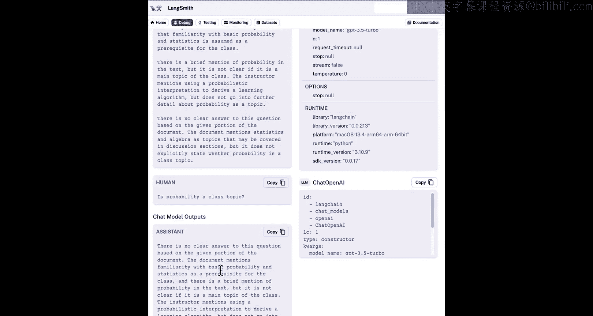

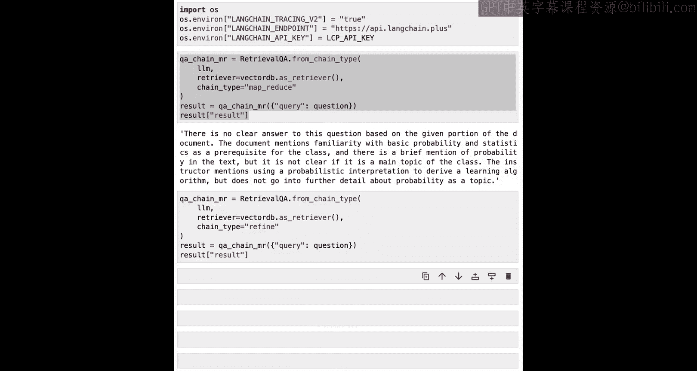

返回的结果可能是：“是的，概率被假定为这门课程的先修知识。讲师假设学生熟悉基本的概率和统计学，并将在讨论部分复习一些先修知识作为复习课程。谢谢提问。” 模型甚至友好地回应了我们。

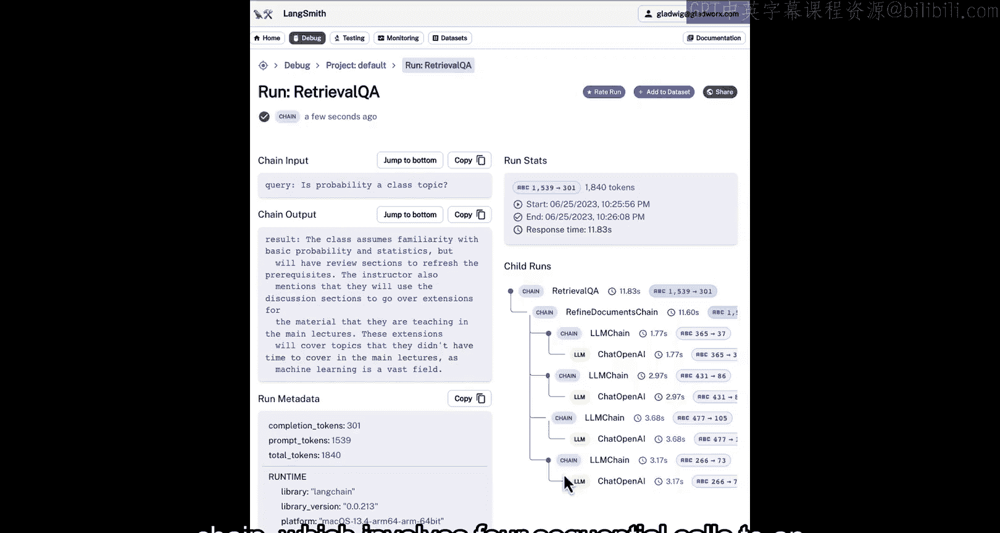

为了更好地了解答案的数据来源，我们可以查看一些返回的源文档。浏览它们，你会发现所有回答中的信息都包含在这些源文档之一中。

现在是暂停的好时机，尝试一些不同的问题或你自己的不同提示模板，看看结果如何变化。

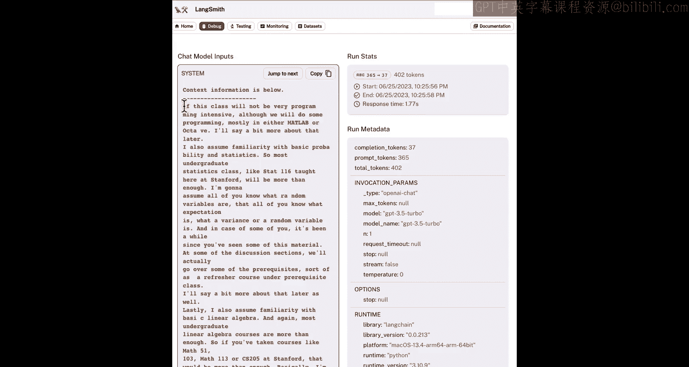

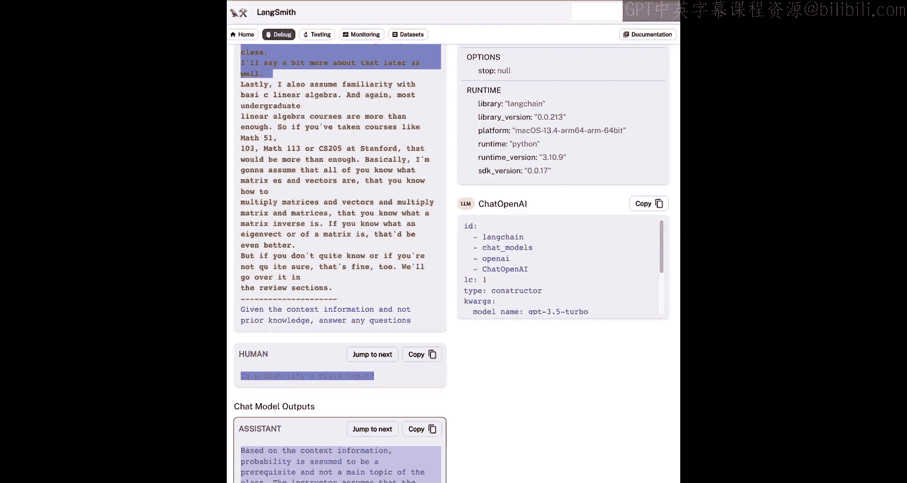

## 超越“Stuff”方法：MapReduce与Refine

到目前为止，我们一直使用默认的“stuff”技术，即简单地将所有文档塞入最终的提示词中。这种方法很好，因为它只涉及一次语言模型调用。然而，它有一个限制：如果文档太多，它们可能无法全部放入上下文窗口中。

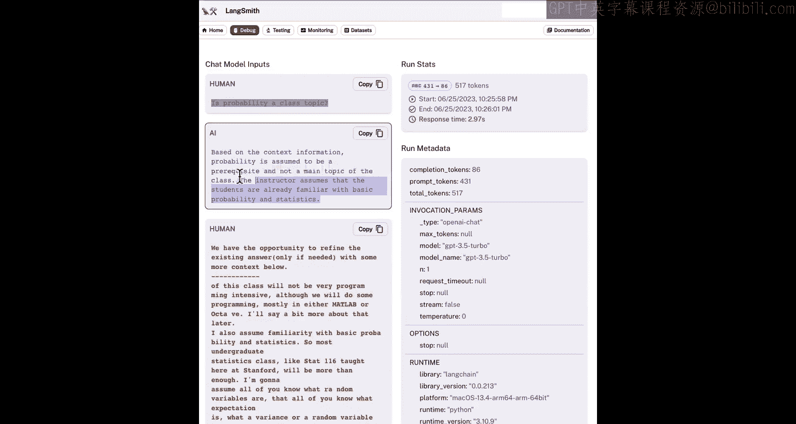

我们可以使用另一种类型的技术来对文档进行问答，即“MapReduce”技术。在这种技术中，每个单独的文档首先被单独发送到语言模型以获得初始答案，然后这些答案通过最后一次语言模型调用被组合成最终答案。这涉及更多次的语言模型调用，但它的优点是可以处理任意多的文档。

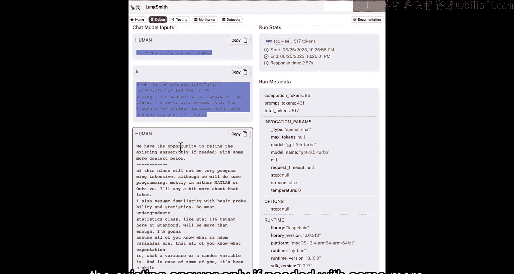

当我们通过这个链运行之前的问题时，我们可以看到这种方法的另一个限制：首先，它慢得多；其次，结果实际上更差。例如，它可能回答：“根据给定的文档部分，这个问题没有明确的答案。” 这可能是因为它是基于每个文档单独回答的。因此，如果信息分布在两个文档中，它就无法在同一上下文中获得所有信息。

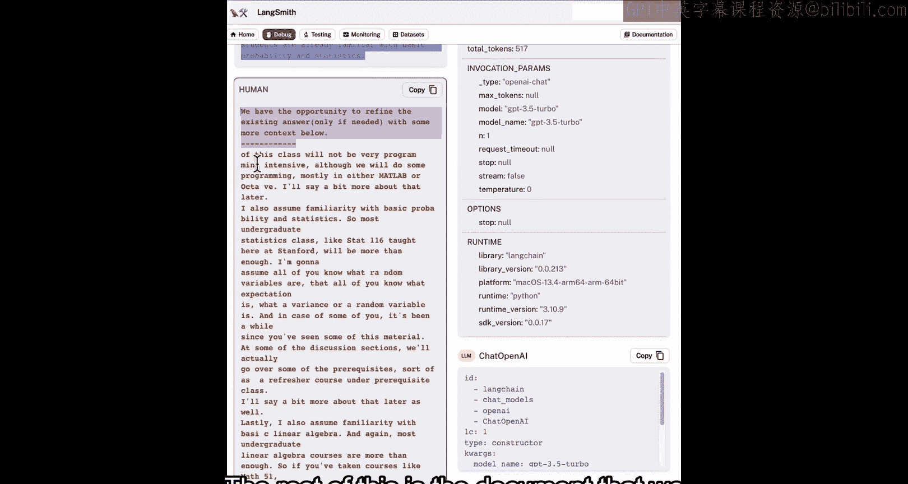

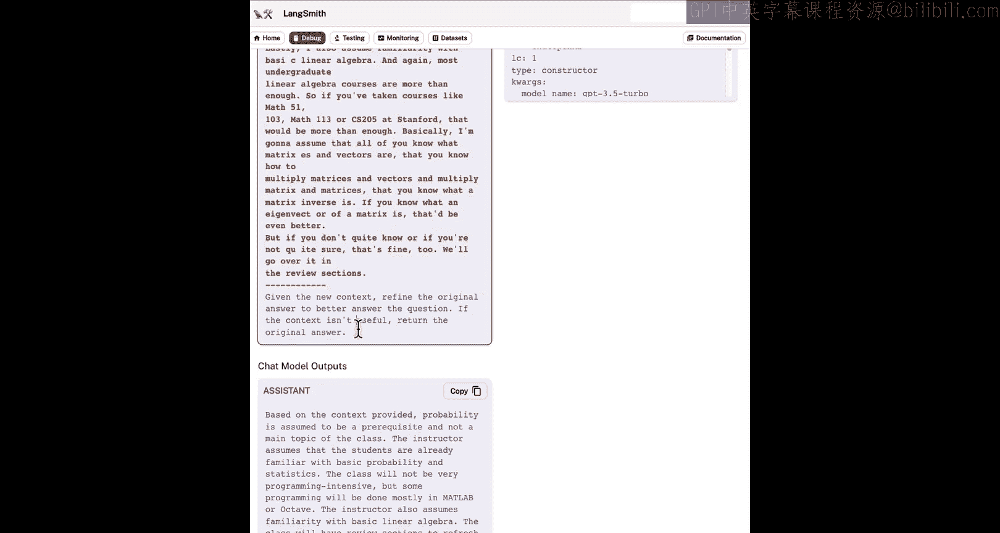

这是一个使用LangChain平台更好地了解这些链内部情况的好机会。我们将在这里演示，如果你想自己使用它，课程材料中会有关于如何获取API密钥的说明。

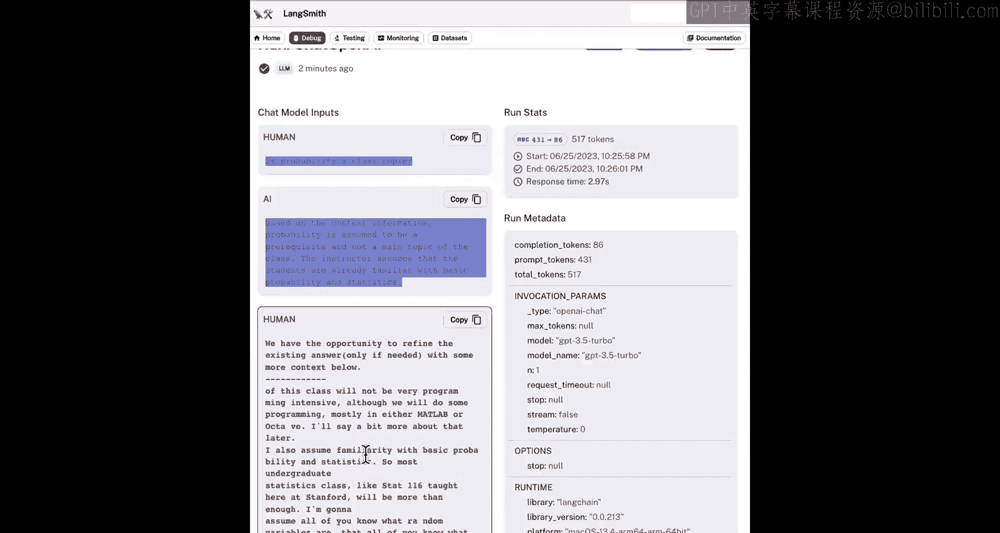

设置好环境变量后，我们可以重新运行MapReduce链，然后切换到UI界面查看底层发生了什么。从那里，我们可以找到刚刚运行的记录，点击进入，可以看到输入和输出。然后，我们可以查看子运行记录，以很好地分析底层发生的情况。首先，我们有“MapReduceDocumentsChain”。这实际上涉及四次单独的语言模型调用。点击其中一个调用，我们可以看到输入和输出是针对每个文档的。返回后，我们可以看到在处理完每个文档后，它在一个最终链——“StuffedDocumentsChain”中组合，将所有响应塞入最终调用中。点击进入，我们可以看到系统消息，其中包含来自先前文档的四个摘要，然后是用户问题，接着就是答案。

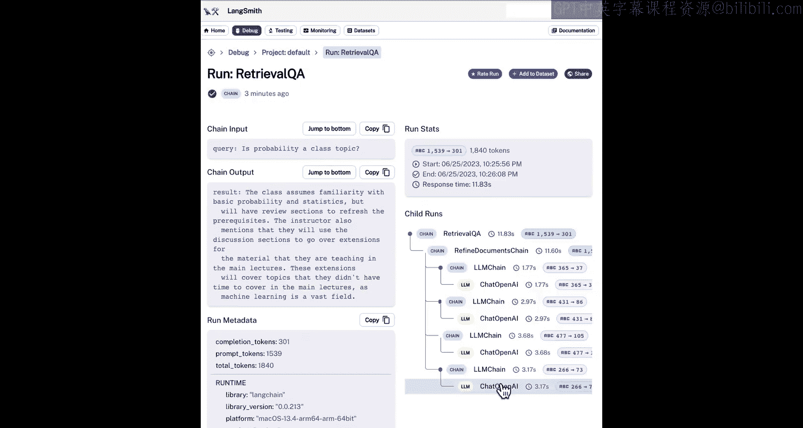

我们也可以做类似的事情，将链类型设置为“refine”。这是一种新型的链，让我们看看它在底层是什么样子。在这里，我们可以看到它调用了“RefineDocumentsChain”，这涉及对LLM链的四次顺序调用。让我们看看这个链中的第一次调用，以了解发生了什么。在这里，我们有了发送给语言模型之前的提示词。我们可以看到由几部分组成的系统消息。“以下是上下文信息”这部分是系统消息的一部分，是我们事先定义的提示模板的一部分。接下来的这一大段文本，这是我们检索到的一个文档。然后，我们在这里有用户问题，接着答案就在这里。如果我们返回，可以查看下一次语言模型调用。这里，我们发送给语言模型的最终提示词是一个序列，它将先前的响应与新数据结合起来，然后要求一个改进的响应。所以我们可以看到，这里有原始的用户问题，然后是答案（和之前一样）。接着我们说“我们有机会在需要时用以下更多上下文来完善现有答案”，这是提示模板的一部分，是指令的一部分。其余部分是我们检索到的文档，即列表中的第二个文档。然后，在最后，我们可以看到更多的指令：“根据新的上下文，完善原始答案以更好地回答问题。” 然后在下面，我们得到一个最终答案。但这只是第二个“最终”答案，所以这个过程运行四次，遍历所有文档后才得出最终答案。而这个最终答案就在这里：“该课程假设学生熟悉基本的概率和统计学，但将有复习部分来温习先修知识。” 你会注意到，这个结果比MapReduce链的结果更好，因为使用Refine链确实允许你（尽管是顺序地）组合信息，并且它实际上比MapReduce链更能鼓励信息的传递。

这是一个暂停的好机会，尝试一些问题、不同的链、不同的提示模板，看看在UI中是什么样子，这里有很多可以探索的内容。

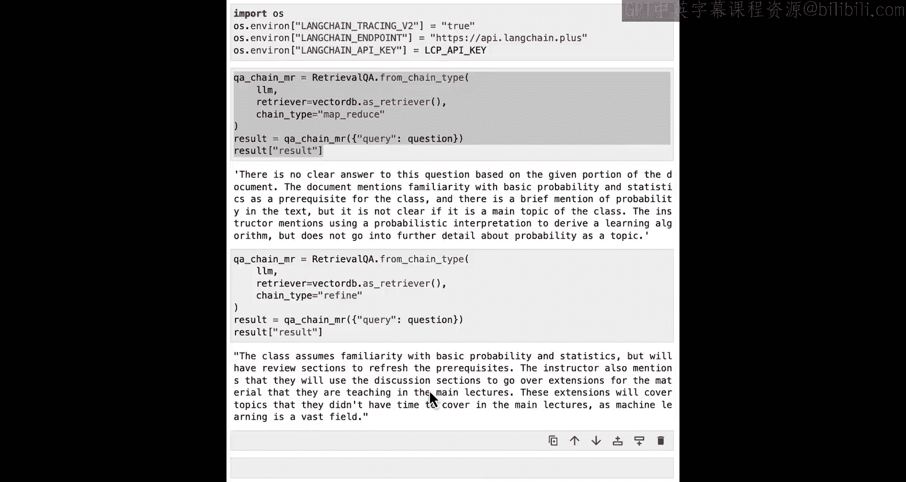

## 对话的挑战：引入记忆

聊天机器人如此受欢迎的一个伟大之处在于，你可以提出后续问题，可以要求澄清先前的答案。让我们在这里尝试一下。让我们创建一个QA链，就使用默认的“stuff”方法。问它一个问题：“概率是课程主题吗？” 然后问一个后续问题，它提到概率应该是先修知识，那么让我们问“为什么需要这些先修知识？” 然后我们得到一个答案：“该课程的先修知识被假定为计算机科学的基础知识和基本的计算机技能与原理。” 这和我们之前问概率时的答案完全无关。

这里发生了什么？基本上，我们正在使用的链没有任何状态概念，它不记得之前的问题或答案。为此，我们需要引入记忆，这将是我们下一节要介绍的内容。

## 总结

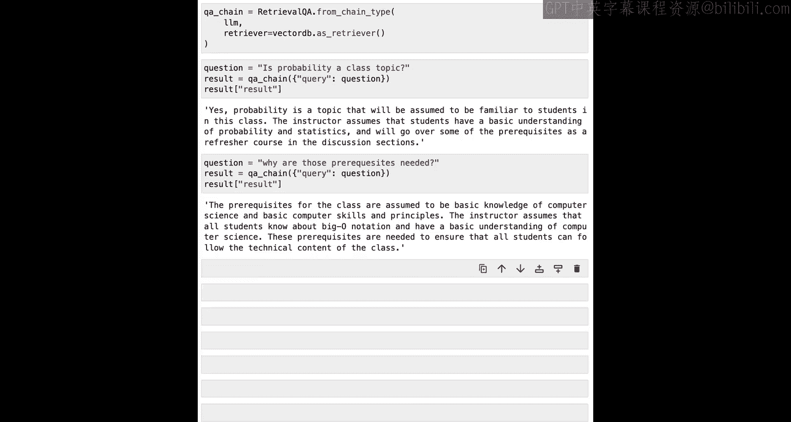

在本节课中，我们一起学习了如何利用检索到的文档进行问答。我们首先介绍了基础的“stuff”方法，它简单高效，但受限于上下文窗口的长度。接着，我们探讨了“MapReduce”和“Refine”这两种能够处理大量文档的方法，并通过LangChain平台可视化了它们的内部工作流程。最后，我们指出了当前简单链在对话场景中的局限性——缺乏记忆能力，为下一节课引入记忆机制做好了铺垫。