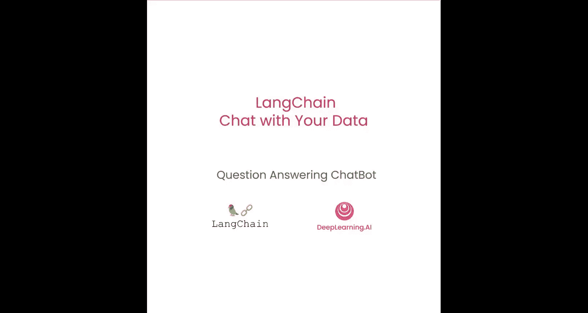
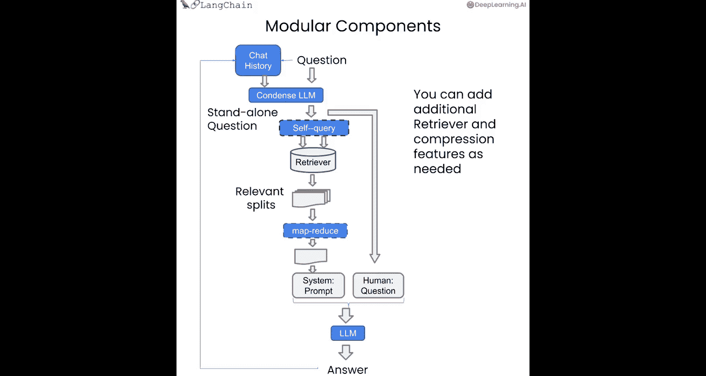
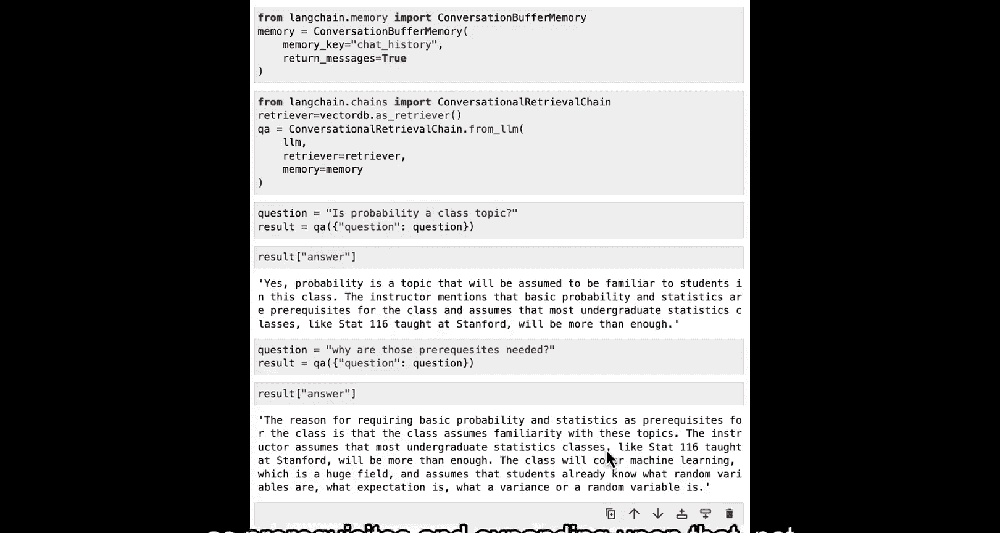
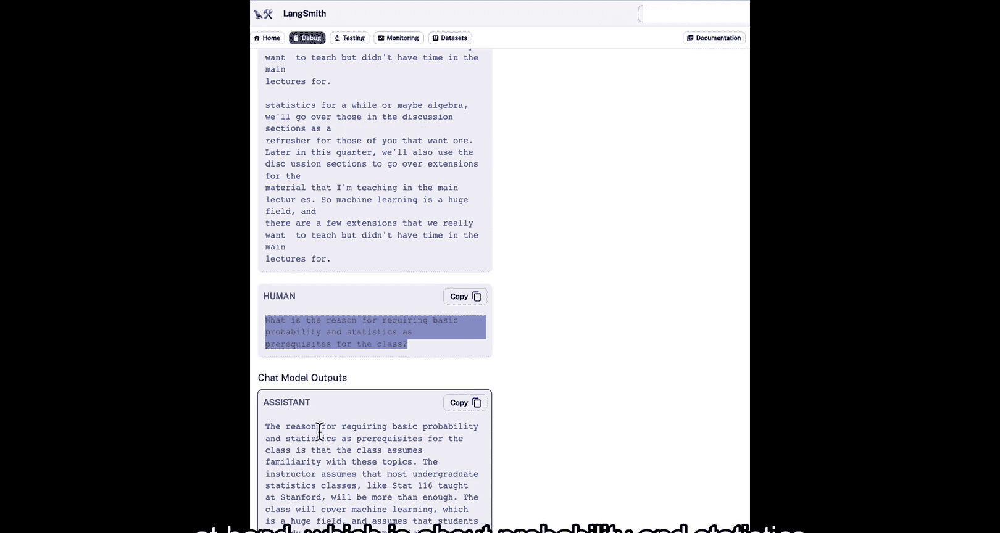
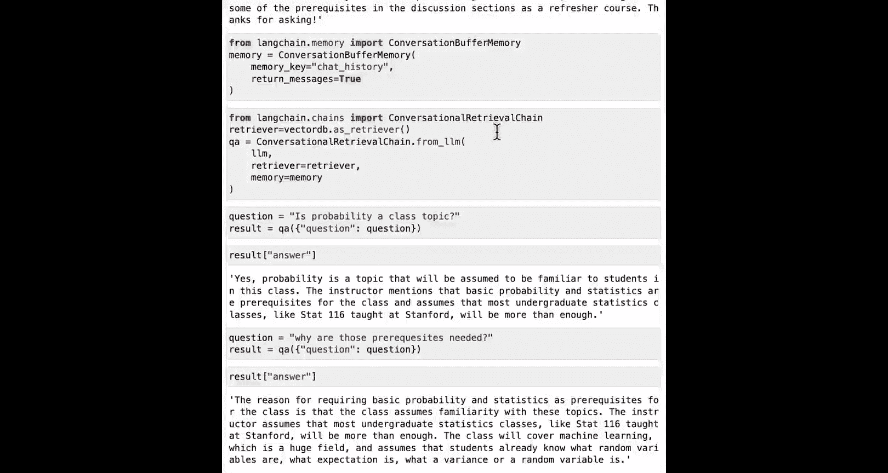
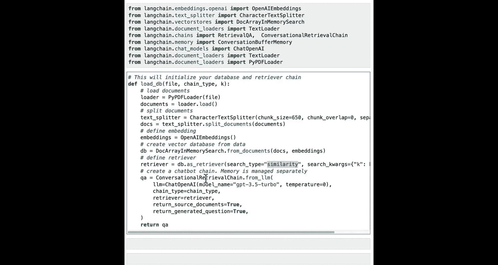
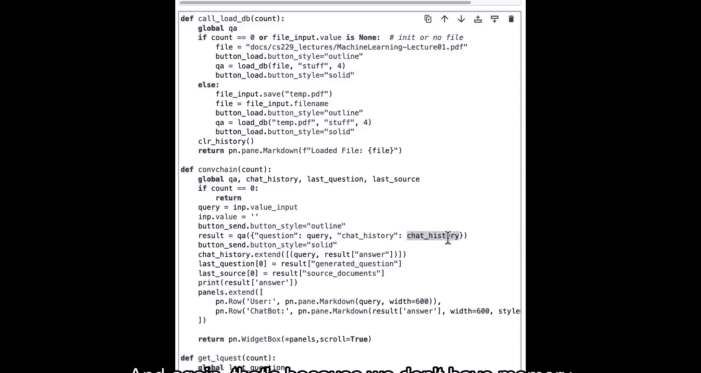
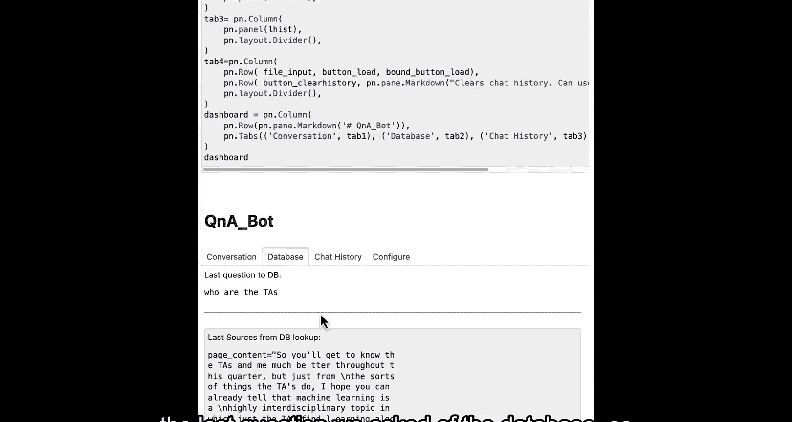
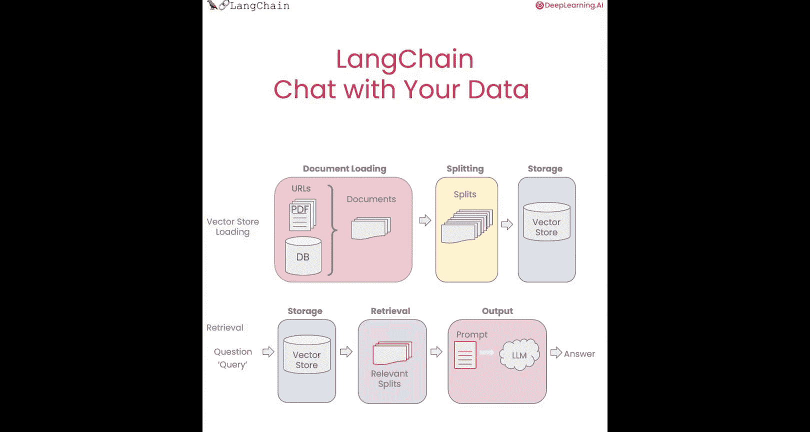

# 007：构建带记忆的对话机器人



在本节课中，我们将学习如何为我们的问答机器人添加对话记忆功能，使其能够处理后续问题，实现真正的对话交互。


---

我们已经非常接近构建一个功能完整的聊天机器人了。我们首先学习了如何加载文档，然后对文档进行分割。接着，我们创建了向量存储库，并讨论了不同类型的检索方法。我们已经展示了如何回答问题，但还无法处理后续提问，无法进行真正的对话。好消息是，我们将在本节课中解决这个问题。让我们来看看具体如何实现。

## 添加对话历史记忆

上一节我们介绍了基础的检索式问答链，本节中我们来看看如何为其添加记忆功能，使其能够理解对话上下文。



我们将创建一个问答聊天应用。这个应用看起来与之前类似，但我们会加入“聊天历史”这个概念。聊天历史指的是你与链交换过的所有先前对话或消息。这使得链在尝试回答问题时，能够将聊天历史作为上下文考虑进去。因此，当你提出一个后续问题时，它能知道你指的是什么。

需要指出的是，我们之前讨论过的所有高级检索类型，如自查询检索、压缩检索等，都可以在这里使用。我们讨论的所有组件都是模块化的，可以很好地组合在一起。我们现在只是加入聊天历史这个概念。

## 实现步骤与代码

让我们看看具体如何实现。首先，和往常一样，我们需要加载环境变量。如果你设置了平台，最好从一开始就打开它，这样可以看到很多底层运行的细节。

我们将加载包含所有课程资料嵌入向量的向量存储库。我们可以对向量库运行基础的相似性搜索。接着，初始化我们将用作聊天机器人的语言模型。然后，初始化提示模板，创建检索式问答链，传入问题并获取结果。这些都是之前的内容，所以快速带过。

现在，让我们添加一些记忆功能。我们将使用“对话缓冲记忆”。它的作用是简单地维护一个聊天消息历史缓冲区列表，并在每次提问时，将这些历史连同新问题一起传递给聊天机器人。

以下是关键代码实现：

```python
# 导入必要的库
from langchain.memory import ConversationBufferMemory

# 创建对话缓冲记忆
memory = ConversationBufferMemory(
    memory_key="chat_history",  # 与提示模板中的输入变量对齐
    return_messages=True  # 以消息列表形式返回历史，而非单个字符串
)
```

我们指定 `memory_key` 为“chat_history”，这是为了与提示模板中的输入变量对齐。然后指定 `return_messages=True`，这将把聊天历史作为消息列表返回，而不是单个字符串。这是最简单的记忆类型。

现在，让我们创建一个新类型的链：**对话检索链**。

```python
from langchain.chains import ConversationalRetrievalChain



# 创建对话检索链
qa = ConversationalRetrievalChain.from_llm(
    llm,  # 语言模型
    retriever=vectordb.as_retriever(),  # 检索器
    memory=memory  # 记忆
)
```

对话检索链在检索式问答链的基础上增加了一个新步骤：它不仅包含记忆，还增加了一个步骤，该步骤将历史和新问题合并，重新组织成一个独立的、完整的问题，再传递给向量存储库以查找相关文档。我们稍后会在用户界面中查看这个效果。

现在让我们试试看。我们可以先问一个问题（此时没有任何历史），看看返回的结果。然后，我们可以针对那个答案提出一个后续问题。

例如：
*   第一个问题：“概率是课程主题吗？” 我们得到一个答案：“讲师假设学生已具备概率论与数理统计的基础知识。”
*   第二个问题（后续）：“为什么需要这些先决条件？” 我们得到的答案会引用“基础概率论与数理统计”作为先决条件并进行阐述，而不会像之前那样与计算机科学混淆。

## 理解底层机制

让我们通过用户界面看看底层发生了什么。我们可以看到，现在链的输入不仅包含问题，还有聊天历史。聊天历史来自记忆，在链被调用之前就已应用并记录在日志系统中。

如果我们查看追踪记录，会发现有两个独立的过程：首先是对一个项目的调用，然后是对“StuffDocuments”链的调用。



查看第一个调用，我们可以看到一段提示词，其指令类似于：“给定以下对话和一个后续问题，请将后续问题重新表述为一个独立的问题。” 这里包含了之前的历史（第一个问题和助手答案），然后输出一个独立的问题，例如：“为什么这门课程要求基础概率论与数理统计作为先决条件？”



这个独立的问题随后被传递给检索器，我们检索到指定数量的文档（例如3或4个）。然后，这些文档被传递给“StuffDocuments”链，以尝试回答原始问题。在这个链中，我们有系统指令：“使用以下上下文片段来回答用户的问题。” 接着是一堆上下文，下面是独立的问题，最后我们得到一个与当前问题相关的答案。

## 尝试与定制

这是一个很好的时机，可以暂停并尝试这个链的不同选项。你可以传入不同的提示模板，不仅用于回答问题，也用于将问题重新表述为独立问题。你还可以尝试不同类型的记忆。这里有很多不同的选项可以探索。

## 整合到用户界面

之后，我们将把所有功能整合到一个漂亮的用户界面中。创建这个界面会有很多代码，但核心部分就在这里。具体来说，这是对整个课程内容的一个完整演练。



以下是核心流程代码：

```python
# 加载数据库和检索链
def load_db(file, chain_type, k):
    # 使用PDF加载器加载文件
    loader = PyPDFLoader(file)
    documents = loader.load()
    # 分割文档
    text_splitter = RecursiveCharacterTextSplitter(chunk_size=1000, chunk_overlap=150)
    docs = text_splitter.split_documents(documents)
    # 创建嵌入向量并存入向量存储库
    embeddings = OpenAIEmbeddings()
    vectordb = Chroma.from_documents(docs, embeddings)
    # 将向量库转为检索器，使用相似性搜索，设置检索数量k
    retriever = vectordb.as_retriever(search_type="similarity", search_kwargs={"k": k})
    # 创建对话检索链（注意：此处未传入memory，将在外部管理）
    qa = ConversationalRetrievalChain.from_llm(
        llm=llm,
        chain_type=chain_type,
        retriever=retriever,
        return_source_documents=True
    )
    return qa
```



这里需要注意的一点是，我们没有在链中传入记忆。为了下面图形用户界面的便利，我们将在外部管理记忆。这意味着聊天历史必须在链的外部进行管理。



后续还有很多代码，我们不花太多时间讲解，但需要指出的是，在这里我们将聊天历史传入链中（再次强调，因为链本身没有附加记忆），然后我们用得到的结果来扩展聊天历史。最后，我们可以将所有部分组合起来运行，得到一个可以通过其进行交互的漂亮用户界面。

## 与聊天机器人互动

现在，我们可以向聊天机器人提问了。例如：“讲师是谁？” 它会回答：“讲师是Paul Bumt和Katie Chin。”

你会注意到这里有几个可以点击的标签页。例如，如果我们点击“数据库”，可以看到我们向数据库提出的最后一个问题，以及从查找中返回的来源。这些文档是分割后我们检索到的每个文本块。

我们还可以看到包含输入和输出的聊天历史。此外，还有一个配置区域，你可以在那里上传文件。我们也可以问后续问题，例如：“他们的专业是什么？” 我们会得到一个关于之前提到的讲师的答案，可以看到Paul研究机器学习和计算机视觉，而Katie实际上是一位神经科学家。

## 课程总结

本节课中，我们一起学习了如何利用LangChain构建一个功能完整的、具备对话记忆的端到端聊天机器人。

我们首先介绍了如何从多种文档源加载数据，使用了LangChain的80多种不同的文档加载器。接着，我们将文档分割成块，并讨论了在此过程中出现的许多细微差别。之后，我们获取这些文本块，为它们创建嵌入向量，并将其放入向量存储库，展示了这如何轻松实现语义搜索。但我们也讨论了语义搜索的一些缺点，以及在特定边缘情况下它可能失败的地方。

接下来我们涵盖了检索部分，这可能是本课程中最喜欢的部分。我们讨论了许多新颖、先进且非常有趣的检索算法，用于克服那些边缘情况。在下一部分中，我们将其与大型语言模型结合，获取检索到的文档和用户问题，将其传递给LLM，从而生成原始问题的答案。但还缺少一个东西，那就是对话的交互性。

而这正是我们完成本课程的地方：通过创建一个在你的数据上完全运行的端到端聊天机器人。

---



**总结**：本节课中，我们一起学习了如何为LangChain问答链添加“对话缓冲记忆”，从而构建出能够理解上下文、处理后续问题的智能对话机器人。我们探讨了`ConversationalRetrievalChain`的工作原理，它通过将聊天历史和新问题重构成独立问题来改进检索，并最终将所有组件集成到一个交互式用户界面中。现在，你可以上传自己的文档，与你的数据进行真正的对话了。