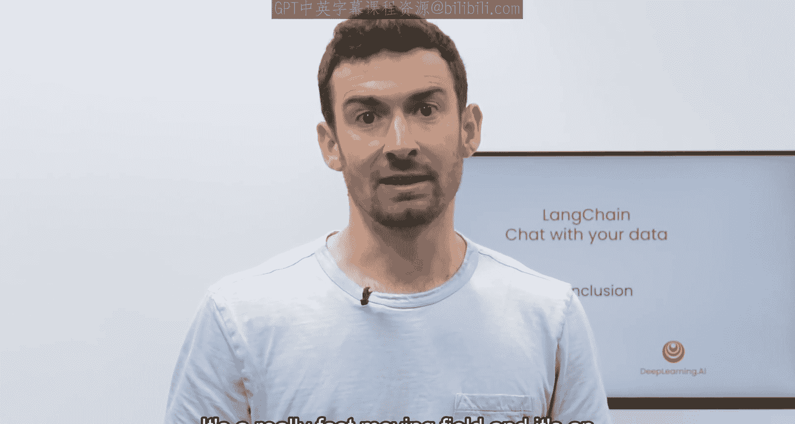

# 008：课程总结 🎯

在本节课中，我们将回顾整个《LangChain：与你的数据对话》课程的核心内容与学习路径。课程涵盖了从数据加载到构建完整对话式应用的完整流程。

---

## 课程内容回顾

上一节我们介绍了如何构建一个端到端的聊天机器人。本节中，我们来对整个课程进行总结。

课程从如何使用LangChain加载数据开始。我们介绍了利用LangChain提供的**80多种不同的文档加载器**，从各种文档源加载数据。

以下是数据加载后的关键处理步骤：

1.  **文档分块**：将加载的文档分割成较小的片段。我们深入探讨了执行此操作时可能出现的许多细微差别。
2.  **向量化与存储**：为这些文档块创建嵌入向量，并将其存入向量数据库。这轻松实现了语义搜索功能。
3.  **检索策略**：我们讨论了语义搜索的一些缺点及其在某些边缘情况下可能失效的问题。因此，课程介绍了许多新颖、先进且实用的检索算法来克服这些边缘情况。
4.  **与大语言模型结合**：在检索到相关文档后，结合用户问题，将其传递给大语言模型，从而生成对原始问题的答案。
5.  **构建对话应用**：最后，我们通过创建一个功能完整的端到端聊天机器人，为课程收尾，实现了数据的对话式交互。

---

## 致谢与展望

我十分享受教授这门课程，也希望你们喜欢学习它。我要感谢开源社区中的每一个人，他们贡献了许多使这门课程成为可能的内容，例如所有的提示词和你们看到的许多功能。

当你们使用LangChain进行构建，并发现新的方法、技巧和技术时，我希望你们能在Twitter上分享所学，甚至在LangChain中提交一个PR。这是一个快速发展的领域，也是一个激动人心的时刻。我真的很期待看到你们如何应用在本课程中学到的一切。

---

## 总结

本节课中，我们一起学习了《LangChain：与你的数据对话》的完整知识体系。从数据加载、分块、嵌入存储，到高级检索、与大模型结合生成答案，最终构建出交互式聊天机器人。希望这门课程能为你开启利用LangChain探索数据对话能力的大门。