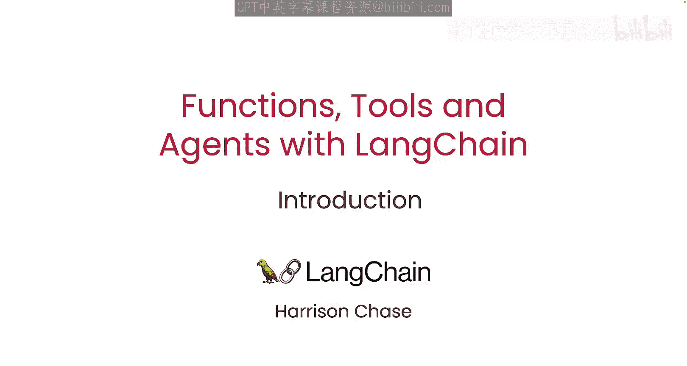
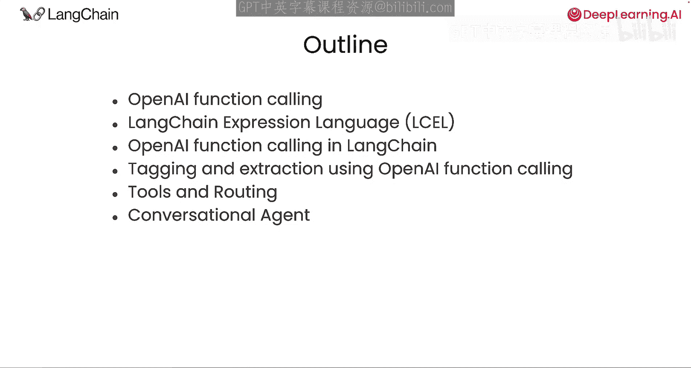
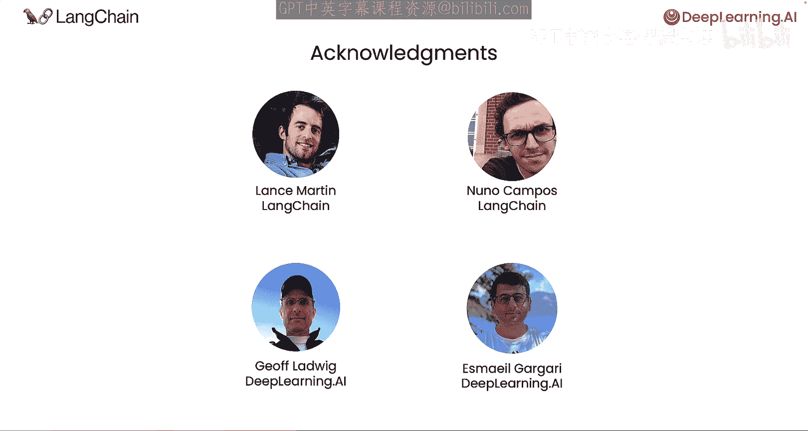

# 001：课程介绍 🚀

在本节课中，我们将要学习LangChain如何利用大语言模型的新功能——函数调用，来连接传统软件系统，并构建能够使用工具和执行多步推理的智能体。

---

大语言模型展现了使用自然语言与人类互动的惊人能力，这为许多新应用打开了大门。但是，大语言模型如何与现有的软件基础设施交互呢？例如，让它决定何时调用其他程序中的函数来获取更多信息或执行操作。

大语言模型最初是为人类生成文本而设计的，但现在一些模型经过训练，可以输出格式化的数据，例如存储为JSON的值。这使得让大语言模型决定何时将其他代码作为子程序调用变得容易。这极大地扩展了大语言模型的能力，例如让它们从结构化或表格数据中提取信息，而这通常是大语言模型的弱项。

接下来，LangChain的联合创始人兼首席执行官Harrison Chase将为我们详细介绍。Harrison，欢迎回来。

谢谢Andrew，很高兴再次回来。你说得对，OpenAI称之为“函数调用”的这个新功能，对于使用大语言模型的开发者来说确实非常有帮助。

Harrison，你在之前的课程中介绍过LangChain，但也许可以描述一下发生了什么变化，以及本课程将涵盖哪些内容。

当然。如你所知，LangChain是一个开源库，帮助开发者在传统软件和大语言模型之间架起桥梁。它允许开发者支持任意数量不同的大语言模型，并提供了超过500个与不同语言模型、向量存储和工具的集成。同时，它还支持记忆、链和智能体。

在本课程中，你将了解到两个重要的变化。第一个是LangChain表达式语言（LCEL）的发展，它使得组合组件或链变得更简单、更直观。第二个变化是为了利用新的函数调用能力。你将学习如何直接使用它，我们还将展示如何用它来完成诸如数据标记或提取等任务。

函数调用使得为大语言模型构建工具变得更简单、更可靠。你将构建一些工具，然后用它们来构建一个对话式智能体。智能体可以进行复杂的多步推理，并可以选择工具来帮助它们使用和解决问题。你将在课程和最终项目中用到所有这些元素。

这听起来很棒，Harrison。我认为这对于许多希望学习利用这些新高级功能的人来说会非常有用。

许多人为本课程的制作付出了努力。我们感谢来自LangChain的Lance Martin和Nuno Campos。在DeepLearning.AI方面，Jeff Ladwig和Emer Gagari也为课程做出了贡献。那么，让我们进入下一个视频，开始学习吧。

---

本节课中，我们一起学习了本课程的概述。我们了解到，大语言模型通过函数调用能力，可以与外部软件交互，从而极大地扩展了其应用范围。LangChain作为一个桥梁，通过其表达式语言和工具集成，简化了利用这一能力构建复杂应用（如智能体）的过程。在接下来的课程中，我们将深入实践这些概念。