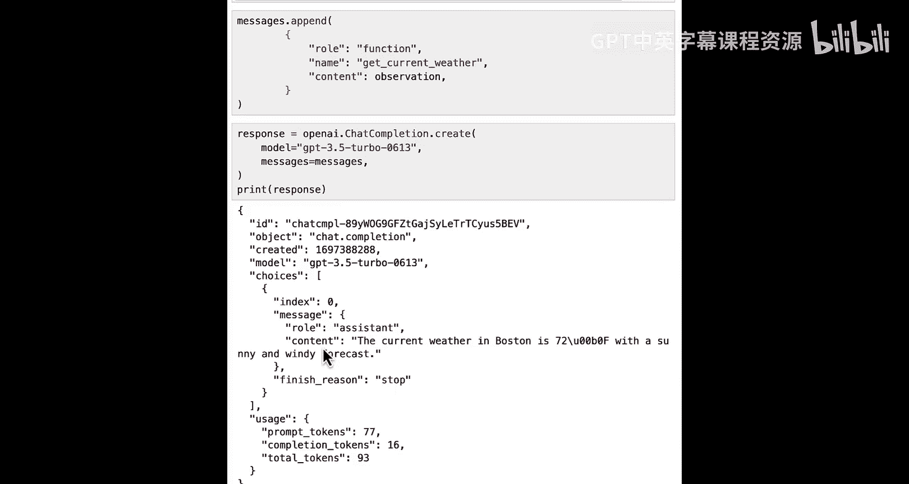
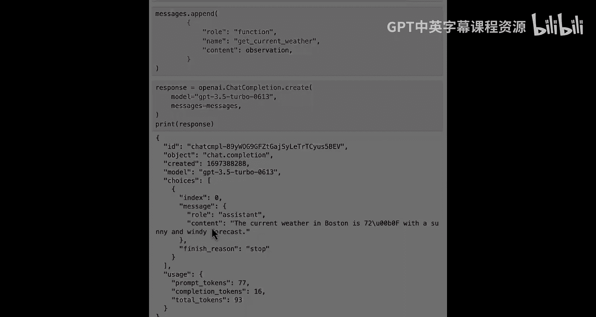

# 002：OpenAI函数调用详解 🧠


在本节课中，我们将学习OpenAI API在几个月前新增的一项功能：函数调用。我们将详细介绍如何使用这项功能，并分享一些获得最佳效果的技巧。

## 概述

函数调用允许开发者向语言模型描述一组函数，模型可以智能地判断是否需要调用其中某个函数，并在需要时生成调用该函数所需的参数。这极大地增强了语言模型与外部工具和API交互的能力。

## 环境设置与函数定义

首先，我们需要设置环境，加载OpenAI API密钥。

```python
import openai
import os

# 假设您的API密钥已存储在环境变量中
openai.api_key = os.getenv("OPENAI_API_KEY")
```

接下来，我们定义一个示例函数。这个函数是OpenAI官方在发布此功能时使用的例子，非常适合教学，因为获取天气信息是语言模型自身无法完成的任务。

```python
def get_current_weather(location, unit="fahrenheit"):
    """获取指定地点的当前天气信息。"""
    # 注意：这是一个硬编码的示例。在生产环境中，这里应该调用一个真实的天气API。
    weather_info = {
        "location": location,
        "temperature": "72",
        "unit": unit,
        "forecast": ["sunny", "windy"],
    }
    return weather_info
```

## 如何向模型传递函数信息

OpenAI通过一个新的参数 `functions` 来接收函数定义列表。以下是完整的函数定义格式：

```python
functions = [
    {
        "name": "get_current_weather",
        "description": "获取指定城市的当前天气信息。",
        "parameters": {
            "type": "object",
            "properties": {
                "location": {
                    "type": "string",
                    "description": "城市和州，例如：San Francisco, CA",
                },
                "unit": {
                    "type": "string",
                    "enum": ["celsius", "fahrenheit"],
                    "description": "温度单位。",
                },
            },
            "required": ["location"],
        },
    }
]
```

**关键点**：
*   `description` 参数（包括函数描述和参数描述）至关重要，因为模型会直接读取这些信息来决定是否以及如何调用函数。
*   所有希望模型用来做决策的信息，都必须包含在这些描述中。

## 调用模型并处理响应

现在，让我们使用定义好的函数来调用语言模型。

首先，创建一个消息列表：

```python
messages = [
    {"role": "user", "content": "波士顿的天气怎么样？"}
]
```

然后，调用Chat Completion端点：

```python
response = openai.ChatCompletion.create(
    model="gpt-3.5-turbo-0613", # 确保使用支持函数调用的较新模型
    messages=messages,
    functions=functions,
    function_call="auto", # 默认值，让模型自行决定
)
```

让我们查看完整的响应：

```python
response_message = response.choices[0].message
print(response_message)
```

输出可能类似于：
```
{
  "role": "assistant",
  "content": null,
  "function_call": {
    "name": "get_current_weather",
    "arguments": "{\"location\": \"Boston, MA\", \"unit\": \"fahrenheit\"}"
  }
}
```

**重要说明**：
1.  OpenAI的函数调用**不会直接执行函数**，它只是返回函数名和参数。开发者需要自己编写代码来执行函数。
2.  模型返回的 `arguments` 是一个JSON字符串，可以使用 `json.loads()` 将其转换为Python字典。
3.  虽然模型经过训练以返回JSON，但这并非严格强制，解析时可能需要添加错误处理。

## 函数调用模式详解

`function_call` 参数控制模型的行为，它有三种模式：

### 1. `“auto”` (默认)
模型自行决定是否调用函数。如果用户输入与函数无关，模型会正常回复。

```python
# 使用与天气无关的输入
messages = [{"role": "user", "content": "谁是美国第一任总统？"}]
response = openai.ChatCompletion.create(
    model="gpt-3.5-turbo-0613",
    messages=messages,
    functions=functions,
    function_call="auto",
)
# 响应将只包含 `role` 和 `content`，没有 `function_call`
```

### 2. `“none”`
强制模型不使用任何提供的函数。

```python
# 即使用户询问天气，也强制不调用函数
messages = [{"role": "user", "content": "波士顿的天气怎么样？"}]
response = openai.ChatCompletion.create(
    model="gpt-3.5-turbo-0613",
    messages=messages,
    functions=functions,
    function_call="none",
)
# 模型会尝试用自身知识回答，不会触发函数调用
```

### 3. `{“name”: “<function_name>”}`
强制模型调用指定的函数。

```python
# 强制调用 `get_current_weather` 函数
response = openai.ChatCompletion.create(
    model="gpt-3.5-turbo-0613",
    messages=messages,
    functions=functions,
    function_call={"name": "get_current_weather"},
)
# 即使输入信息不足，模型也会尝试生成参数（可能不准确）
```

**注意**：如果强制调用函数但用户输入未提供足够信息，模型可能会“编造”参数。

## 将函数结果返回给模型

一个常见的模式是：让模型决定调用函数 -> 执行函数 -> 将函数结果返回给模型以生成最终回复。

以下是实现此模式的步骤：

```python
# 1. 获取模型建议的函数调用
response = openai.ChatCompletion.create(
    model="gpt-3.5-turbo-0613",
    messages=messages,
    functions=functions,
    function_call="auto",
)
assistant_message = response.choices[0].message

# 2. 将模型的函数调用建议添加到消息历史中
messages.append(assistant_message)

# 3. 执行函数（这里使用我们硬编码的函数）
import json
if assistant_message.get("function_call"):
    function_name = assistant_message["function_call"]["name"]
    function_args = json.loads(assistant_message["function_call"]["arguments"])
    # 在实际应用中，这里应该是一个函数调用，例如：
    # function_response = call_weather_api(**function_args)
    function_response = get_current_weather(**function_args)
    observation = json.dumps(function_response)

    # 4. 将函数执行结果作为新消息追加
    messages.append({
        "role": "function",
        "name": function_name,
        "content": observation, # 函数返回的结果
    })

    # 5. 再次调用模型，让它基于函数结果生成最终回复
    second_response = openai.ChatCompletion.create(
        model="gpt-3.5-turbo-0613",
        messages=messages,
    )
    final_reply = second_response.choices[0].message.content
    print(final_reply) # 例如：“波士顿当前天气为72华氏度，晴朗有风。”
```

## 注意事项与最佳实践

1.  **令牌消耗**：函数定义和描述会占用提示令牌。在构建消息时，不仅要考虑消息长度，还要考虑函数定义的长度。
2.  **错误处理**：解析模型返回的JSON参数时，应添加 `try-except` 块来处理可能的格式错误。
3.  **描述清晰**：为函数和参数编写清晰、准确的描述，这是模型正确决策的关键。

## 总结

本节课中，我们一起学习了OpenAI函数调用的核心概念和使用方法。我们了解到，函数调用通过 `functions` 和 `function_call` 参数，使语言模型能够智能地与外部工具交互。我们探讨了三种调用模式（`auto`, `none`, 强制调用），并实践了“模型决策 -> 执行函数 -> 返回结果”的完整工作流。





这项功能是构建智能代理（Agents）和增强语言模型能力的基础。在接下来的课程中，我们将学习如何结合LangChain框架来更便捷、高效地使用函数调用功能。