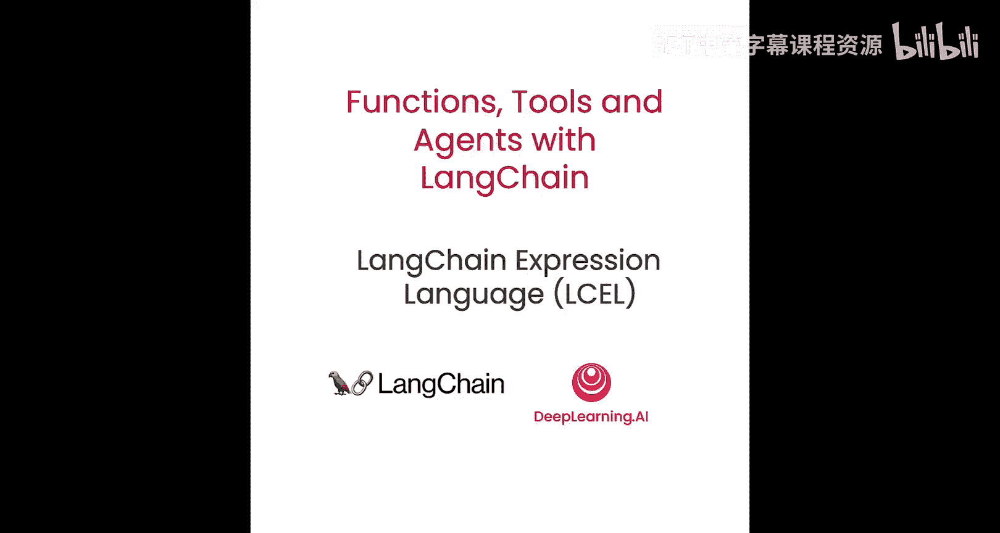
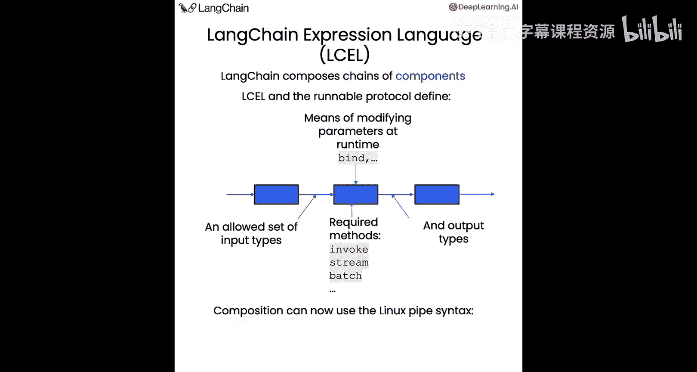
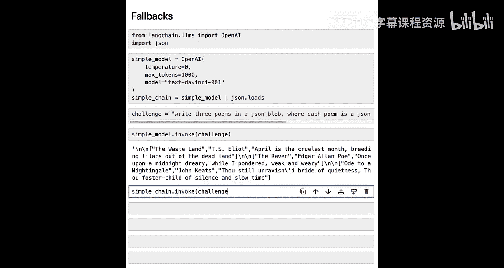
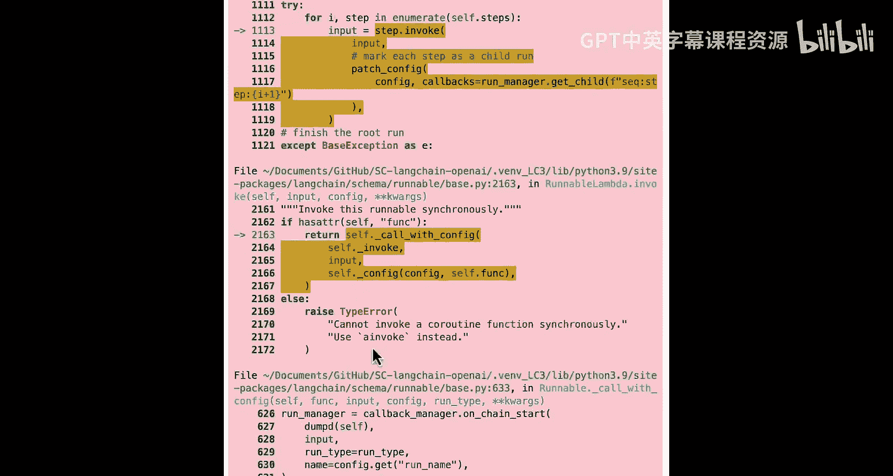
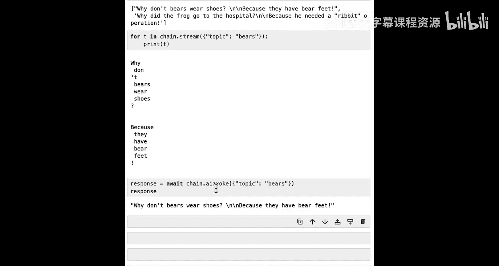

# 003：LangChain表达式语言（LCEL）详解 🚀




在本节课中，我们将学习LangChain表达式语言（LCEL）。这是一种新的语法，它能让我们更简单、更透明地构建和使用不同的链（Chains）与智能体（Agents）。

## 概述

LCEL和可运行协议（Runnable Protocol）是LangChain的核心新特性。它们定义了一套标准接口，允许我们以统一、灵活的方式组合各种组件，并原生支持异步、批处理、流式输出和故障回退等高级功能。



## 什么是LCEL与可运行协议？

LangChain的强大之处在于将不同组件组合成链。LCEL和可运行协议为此提供了一种新方法。

可运行协议主要定义了以下几点：
1.  一组允许的输入类型和对应的输出类型。
2.  一系列所有可运行对象都会暴露的标准方法。
3.  支持在运行时修改参数、添加故障回退等选项。
4.  可以使用类似Linux的管道（`|`）语法进行所有组合操作。

## 可运行对象的通用接口

所有可运行对象都遵循一个通用接口，包含以下核心方法：
*   **`invoke`**：在单个输入上调用可运行对象。
*   **`stream`**：在单个输入上调用，并以流式方式返回响应。
*   **`batch`**：在输入列表上调用。

对于上述所有同步方法，都有对应的异步版本：`ainvoke`、`astream`、`abatch`。

所有可运行对象还拥有一些通用属性，主要是**输入模式（input schema）**和**输出模式（output schema）**，用于定义输入和输出的类型。

## 为什么使用LCEL？

使用LCEL能带来以下好处：
1.  **开箱即用的异步、批处理和流式支持**：即使你最初以同步方式编写和测试代码，也能轻松移植到需要异步、批处理或流式处理的生产环境中。
2.  **易于附加故障回退**：大语言模型（LLM）有时不可预测。LCEL允许你不仅为LLM，甚至为整个链轻松附加安全回退机制。
3.  **并行处理**：LLM调用可能很耗时。LCEL语法使得并行运行它们变得容易。
4.  **内置日志记录**：随着链和智能体变得越来越复杂，能够查看步骤序列以及输入输出对于构建LLM应用至关重要。LCEL原生支持记录所有信息，并且可以与LangSmith等平台集成进行日志记录和调试。

## 构建你的第一个链

现在，让我们通过代码看看LCEL的实际应用。首先，像往常一样设置环境并导入必要的组件。

我们将导入以下组件：
*   一个提示模板（Prompt Template）
*   一个语言模型（这里使用OpenAI）
*   一个输出解析器（Output Parser），用于将聊天消息转换为字符串

以下是构建一个简单链的步骤，该链的流程是：提示模板 -> 语言模型 -> 输出解析器。

```python
# 1. 创建提示模板
prompt = PromptTemplate.from_template("Tell me a short joke about {topic}")

# 2. 初始化语言模型
model = ChatOpenAI()

# 3. 创建输出解析器
output_parser = StrOutputParser()

# 4. 使用管道语法组合成链
chain = prompt | model | output_parser

# 5. 调用链
response = chain.invoke({"topic": "bears"})
print(response) # 输出一个关于熊的笑话
```

现在是一个很好的时机，你可以暂停一下，尝试向这个函数传入其他参数，或者修改提示词，感受一下这些不同组件以及使用管道语法组合它们的方式。

## 构建更复杂的链：检索增强生成（RAG）

在之前的课程中，我们介绍了检索增强生成（RAG）。现在，我们将使用LCEL来复现相同的过程。

首先，我们需要设置检索器（Retriever）。我们将创建一个简单的向量存储（Vector Store）。

```python
# 创建包含两个文本的简单向量存储
texts = ["Harrison worked at Kensho", "Bears like to eat honey"]
embeddings = OpenAIEmbeddings()
vectorstore = FAISS.from_texts(texts, embeddings)

# 创建检索器
retriever = vectorstore.as_retriever()

# 测试检索器
docs = retriever.get_relevant_documents("Where did Harrison work?")
print(docs) # 应返回包含"Harrison worked at Kensho"的文档
```

接下来，我们创建RAG管道。我们希望链的唯一输入是用户问题，然后获取相关上下文，将其与问题一起传入提示模板，再传给模型，最后解析输出。

以下是构建此链的思路：
1.  创建一个步骤，将单个问题转换为包含`context`和`question`两个键的字典。
2.  将上一步的输出传入提示模板。
3.  将提示传入模型。
4.  将模型输出传入解析器。

我们可以使用`RunnableMap`来实现第一步。

```python
from langchain.schema.runnable import RunnableMap

# 定义提示模板
prompt = PromptTemplate.from_template("Answer the question based only on the following context:\n{context}\n\nQuestion: {question}")

# 创建链
chain = RunnableMap({
    "context": lambda x: retriever.get_relevant_documents(x["question"]),
    "question": lambda x: x["question"]
}) | prompt | model | output_parser

# 调用链
response = chain.invoke({"question": "Where did Harrison work?"})
print(response) # 应输出：Harrison worked at Kensho.
```

为了更清楚地了解幕后过程，我们可以单独查看`RunnableMap`的输出：

```python
inputs = RunnableMap({
    "context": lambda x: retriever.get_relevant_documents(x["question"]),
    "question": lambda x: x["question"]
})
print(inputs.invoke({"question": "Where did Harrison work?"}))
# 输出：包含‘context’（文档列表）和‘question’的字典。
```

## 绑定参数与使用函数调用

我们可以使用`bind`方法向可运行对象绑定参数。这在结合OpenAI函数调用时非常有用。

假设我们有一个函数列表，我们希望语言模型能调用这些函数。

```python
# 定义函数列表
functions = [
    {
        "name": "weather_search",
        "description": "Search for weather",
        "parameters": {...}
    }
]

# 创建链并绑定函数
model_with_functions = model.bind(functions=functions)
chain = prompt | model_with_functions

# 调用链
response = chain.invoke({"topic": "What's the weather in SF?"})
print(response) # AI消息中应包含函数调用信息
```

如果你想更新函数，只需重新绑定即可：

```python
# 添加另一个函数
functions.append({
    "name": "sports_search",
    "description": "Search for recent sports events",
    "parameters": {...}
})

# 更新模型绑定的函数
model_with_new_functions = model.bind(functions=functions)
new_chain = prompt | model_with_new_functions
```

## 实现故障回退

LCEL的一个强大功能是可以轻松附加故障回退，不仅针对单个组件，还可以针对整个序列。

让我们看一个例子：尝试让语言模型输出JSON。我们将故意使用一个旧版模型，它不太擅长输出JSON，然后为其设置回退到更擅长此任务的新模型。





```python
from langchain.llms import OpenAI
import json

# 1. 创建一个可能失败的简单链（使用旧模型）
simple_model = OpenAI(model_name="text-davinci-001", temperature=0)
simple_chain = simple_model | json.loads

# 2. 创建一个能成功的新链（使用新模型）
good_model = ChatOpenAI()
good_chain = good_model | StrOutputParser() | json.loads

# 3. 为简单链设置回退
final_chain = simple_chain.with_fallbacks([good_chain])

# 4. 测试
challenge = "Write three poems in a JSON blob, each with title, author, first line."
try:
    result = final_chain.invoke(challenge)
    print("Success:", result)
except Exception as e:
    print("Failed:", e)
```
运行流程是：`simple_chain`首先被调用，如果失败（输出无效JSON），则会尝试调用`good_chain`。这样确保了链的鲁棒性。

## 探索可运行对象的其他方法

让我们回顾一下之前创建的讲笑话的链，并探索其接口的其他方法。

```python
chain = prompt | model | output_parser
```

*   **`invoke`**：我们已经使用过的同步单次调用。
*   **`batch`**：批量处理多个输入，内部会尽可能并行执行。

    ```python
    inputs = [{"topic": "bears"}, {"topic": "frogs"}]
    results = chain.batch(inputs)
    print(results)
    ```

*   **`stream`**：流式返回响应，对于需要长时间运行的LLM应用非常重要，可以提供更好的用户体验。

    ```python
    for chunk in chain.stream({"topic": "bears"}):
        print(chunk, end="", flush=True)
    ```

*   **异步方法**：所有方法都有对应的异步版本。

    ```python
    import asyncio
    async_result = await chain.ainvoke({"topic": "bears"})
    print(async_result)
    ```

## 总结

在本节课中，我们一起深入学习了LangChain表达式语言（LCEL）。我们了解了如何通过统一的`Runnable`接口和直观的管道语法（`|`）来组合提示模板、模型、检索器、解析器等组件，构建出从简单到复杂的处理链。

我们掌握了LCEL的核心优势：**开箱即用的异步/批处理/流式支持**、**强大的故障回退机制**、**便捷的并行处理**以及**内置的日志记录能力**。我们还实践了如何构建一个检索增强生成（RAG）管道，如何为模型绑定函数，以及如何为整个链添加安全回退。

LCEL使得构建和维护复杂的LLM应用变得更加模块化、清晰和可靠。在动手尝试构建自己的多步处理链时，你会发现它的强大与灵活。



在下一节课中，我们将把刚学到的LCEL知识与之前学习的OpenAI函数调用结合起来，展示如何将这两者协同使用，构建出功能更强大的智能体。