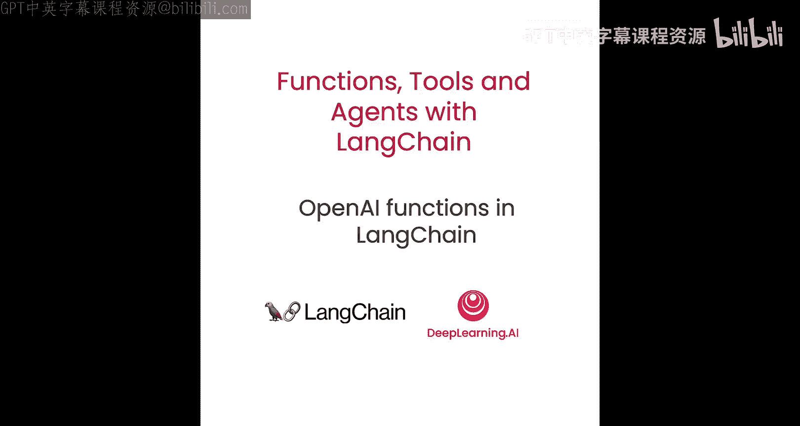
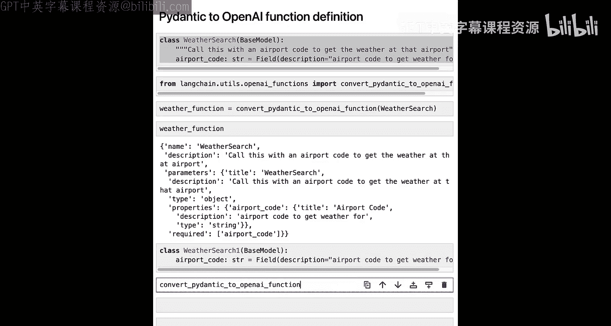
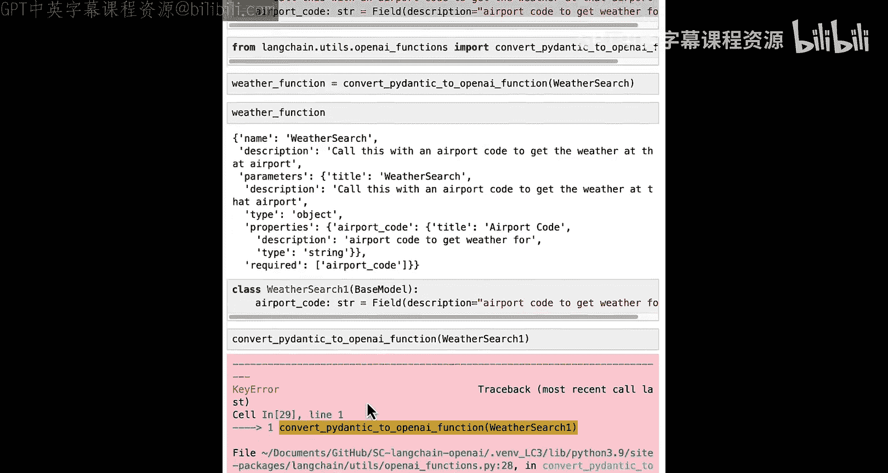
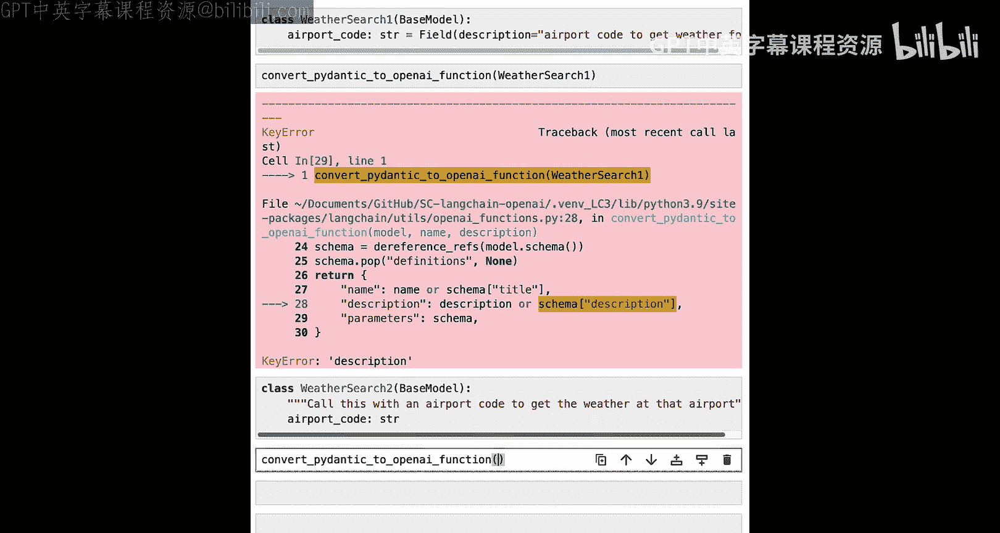
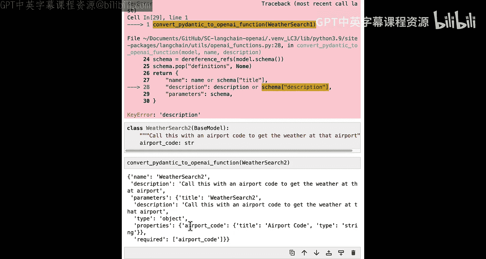
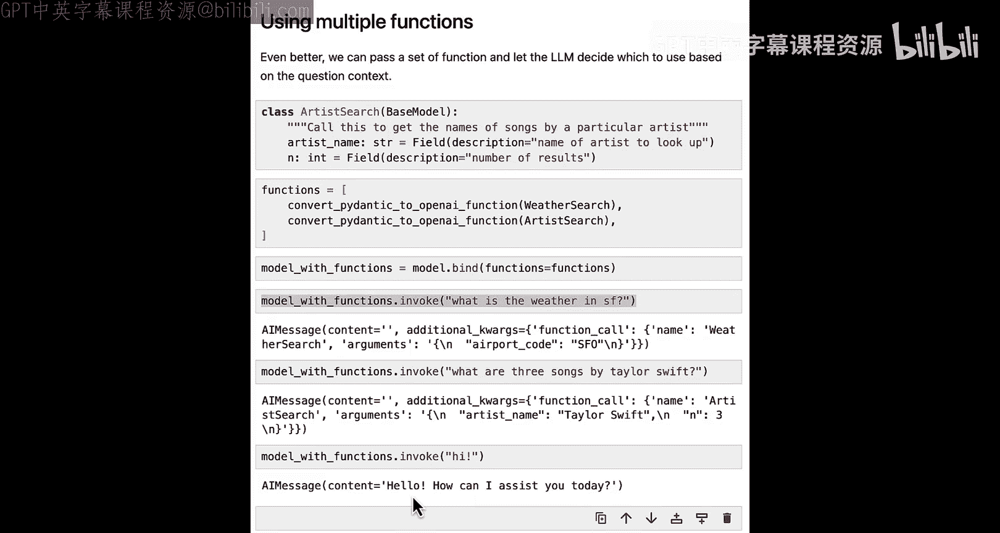

# 004：结合LangChain表达式语言与OpenAI函数




## 概述

在本节课中，我们将结合前两节课所学知识，讲解如何在LangChain表达式语言中使用OpenAI函数。我们还将介绍Pydantic库，这是一个能简化OpenAI函数构建过程的Python库。

## 什么是Pydantic？🔧

Pydantic是一个用于Python的数据验证库。它使得定义不同数据模式变得非常容易，同时也便于将这些模式导出为JSON格式。这非常有用，因为我们可以使用Pydantic对象来创建OpenAI函数的描述。回想一下，OpenAI函数描述是一个包含多个组件的JSON对象。与其手动处理所有这些细节，我们可以利用Pydantic来简化这个过程。

我们将通过定义一个Pydantic类来实现这一点。它看起来与普通的Python类非常相似。主要区别在于，我们不需要编写`__init__`方法，而是直接在类定义下列出属性及其类型。我们实际上不会使用这些类来执行任何操作，只是用它们来创建OpenAI函数的JSON描述。

## 实践：Pydantic基础

首先，我们加载环境变量，并导入一些Pydantic类以及稍后将用到的类型提示。

让我们从一个普通的Python类开始。这是一个名为`User`的普通Python类，它有`__init__`方法，接收`name`、`age`和`email`参数。

```python
class User:
    def __init__(self, name: str, age: int, email: str):
        self.name = name
        self.age = age
        self.email = email
```

如果我们创建这个类的一个实例，就可以正常访问其元素。然而，如果我们为`age`传入一个无效的值（例如字符串`"bar"`），它仍然会创建成功，并且我们可以访问这个元素。这并不理想，因为我们希望当声明`age`是整数时，它确实是一个整数。

现在，让我们看看如何使用Pydantic实现同样的功能。

```python
from pydantic import BaseModel

class PUser(BaseModel):
    name: str
    age: int
    email: str
```

我们可以像平常一样创建对象。如果我们检查这个对象，会发现它能够清晰地打印出所有元素，这是Pydantic的一个优点。同样，我们可以访问单个元素。现在，如果我们尝试为`age`传入一个无效的参数（例如字符串`"bar"`），它会抛出一个验证错误。这是Pydantic在幕后进行的额外输入验证，是它的另一个优点。

Pydantic的另一个功能是我们可以嵌套这些数据结构。例如，我们可以定义一个`Classroom`类，它继承自`BaseModel`，其唯一属性`students`是一个`PUser`对象的列表。

```python
class Classroom(BaseModel):
    students: list[PUser]
```

现在，我们可以创建一个符合这种结构的对象。以上是对Pydantic的简要介绍。如果你想了解更多，建议查阅其官方文档。现在也是一个尝试使用它的好时机，可以试试不同的类型提示，看看结果如何。

## 使用Pydantic创建OpenAI函数定义 🛠️

接下来，我们将讨论如何使用Pydantic来创建OpenAI函数定义。我们将创建一个Pydantic对象，然后将其转换为我们在第一课中提到的JSON模式。重要的是，我们创建的Pydantic对象本身并不执行任何功能，我们只是用它来生成模式。

我们将创建一个名为`WeatherSearch`的类，这与我们之前创建的函数相对应。它继承自`BaseModel`。我们添加了一个文档字符串，稍后会看到它如何反映在结果中。我们只有一个参数`airport_code`，类型为字符串，并使用`Field`为它添加了描述。

```python
from pydantic import BaseModel, Field

class WeatherSearch(BaseModel):
    """获取指定机场的天气信息"""
    airport_code: str = Field(..., description="要查询天气的机场代码")
```

然后，我们从`langchain`导入一个函数：`convert_pydantic_to_openai_function`。这个函数的功能正如其名，它将一个Pydantic对象转换为OpenAI函数所期望的JSON模式。

```python
from langchain.utils.openai_functions import convert_pydantic_to_openai_function

weather_function = convert_pydantic_to_openai_function(WeatherSearch)
```

我们传入的是类本身，而不是其实例。返回的`weather_function`是一个JSON模式，其形式与我们在第一课中传递给OpenAI的相同。我们可以看到它有名称`WeatherSearch`（来自Python类名），有描述（来自文档字符串）。在参数部分，它有一个属性列表，其中一个是`airport_code`，其描述来自`Field`，类型是字符串。

我们对如何创建OpenAI函数做了一些假设。其中一个特别的要求是，我们强制要求必须有文档字符串，因为它会被用作函数的描述。正如我们之前讨论的，函数本质上也是提示词的一部分，因此传入函数时，需要对其功能进行良好的描述。我们添加了一些检查来强制执行这一点。

如果我们有另一个没有文档字符串的类`WeatherSearch1`，并对其调用`convert_pydantic_to_openai_function`，就会得到一个错误。不过，我们并不强制要求所有字段都必须有描述。如果我们移除`airport_code`的描述并创建`WeatherSearch2`，转换会成功，但`airport_code`参数将没有描述。在LangChain中，参数的描述是可选的，不是必需的。

## 结合LangChain表达式语言与OpenAI函数 ⚙️





现在，让我们看看如何将OpenAI函数与LangChain表达式语言结合使用。



首先，导入聊天模型并创建一个实例。



```python
from langchain.chat_models import ChatOpenAI

model = ChatOpenAI()
```

现在，我们直接与模型交互。具体来说，我们将调用模型的`invoke`方法。我们问一个需要天气函数的问题：“今天旧金山的天气怎么样？”，然后传入我们定义的`weather_function`。

```python
response = model.invoke("What is the weather in SF today?", functions=[weather_function])
```

从模型返回的将是一个内容为空的`AIMessage`，但在`additional_kwargs`字段中，会有一个`function_call`参数，其中包含名称`WeatherSearch`和参数`{"airport_code": "SFO"}`。这表明它正确地使用了函数。

我们还可以将函数绑定到模型上。这样做的一个原因是，我们可以将模型和函数作为一个整体传递，而不必总是传入这些函数关键字参数。

```python
model_with_function = model.bind(functions=[weather_function])
response = model_with_function.invoke("What is the weather in SF?")
```

我们还可以强制模型使用某个函数。我们可以像上面一样绑定天气函数，然后绑定`function_call`参数，将其值设置为我们想要调用的函数名称`WeatherSearch`。

```python
model_forced = model.bind(functions=[weather_function], function_call={"name": "WeatherSearch"})
response = model_forced.invoke("Hi")
```

现在，我们可以像通常使用模型一样，在链中使用这个绑定了函数的模型。为此，我们导入一个提示模板。

```python
from langchain.prompts import ChatPromptTemplate

prompt = ChatPromptTemplate.from_messages([
    ("system", "You are a helpful assistant."),
    ("user", "{input}")
])
```

然后，我们通过将提示模板和绑定了函数的模型连接起来创建一个链。

```python
chain = prompt | model_with_function
response = chain.invoke({"input": "What is the weather in SF?"})
```

下一步，我们可以传入一个函数列表，让语言模型根据问题上下文决定使用哪一个。

我们创建另一个Pydantic模型`ArtistSearch`，其描述是“获取特定艺术家的歌曲名称”。它有两个参数：`artist_name`（字符串）和`n`（整数，表示要查找的结果数量）。

```python
class ArtistSearch(BaseModel):
    """获取特定艺术家的歌曲名称"""
    artist_name: str = Field(..., description="艺术家的名字")
    n: int = Field(..., description="要查找的结果数量")
```

然后，我们创建一个包含两个函数的新列表：`weather_function`和`artist_function`。

```python
artist_function = convert_pydantic_to_openai_function(ArtistSearch)
functions = [weather_function, artist_function]
model_with_functions = model.bind(functions=functions)
```

现在，让我们尝试用不同的输入来调用它，看看会发生什么。首先问天气，它会调用天气搜索工具。然后问音乐相关的问题，例如“Taylor Swift的三首歌是什么？”，它会调用艺术家搜索工具，参数正确。如果我们只是说“Hi”，它应该不使用任何函数来回应。

现在是一个很好的暂停点，可以尝试一下：传入几个不同的Pydantic对象进行转换，获取多个函数的列表，将它们绑定到一个模型，然后传入各种输入，看看响应结果如何。

## 总结



本节课中，我们一起学习了如何将LangChain表达式语言与OpenAI函数结合使用。我们介绍了Pydantic库，它可以帮助我们轻松地定义数据模式并生成OpenAI函数所需的JSON描述。我们演示了如何创建Pydantic类、将其转换为函数定义、将函数绑定到语言模型，以及如何让模型在多个函数中智能选择。在下一课中，我们将探讨这类功能的一个主要应用场景：标记和提取。