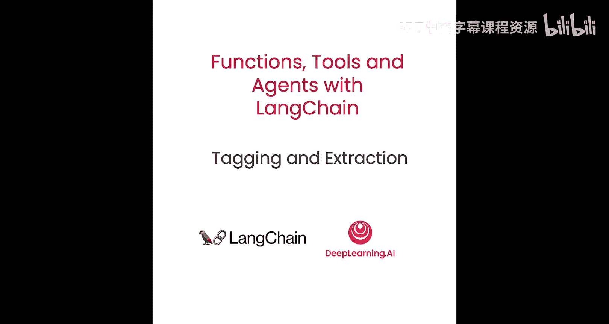
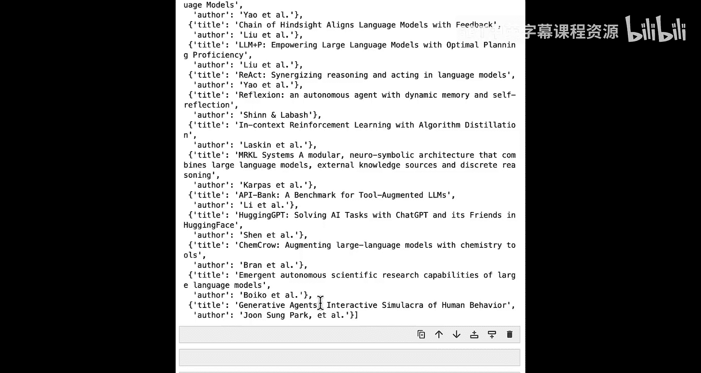
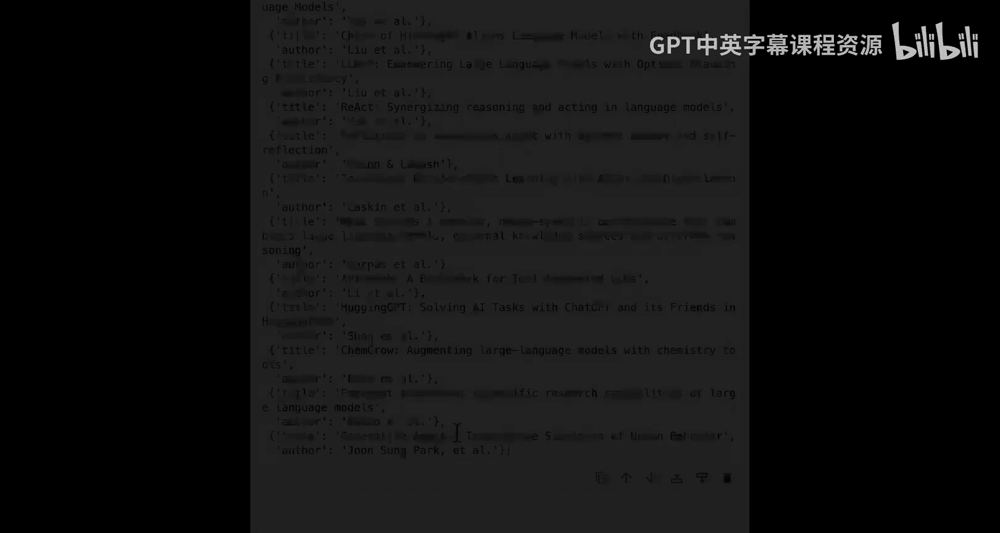

# 005：使用OpenAI函数进行标记与提取 📝




在本节课中，我们将学习开发者使用OpenAI函数的一个主要应用场景：**标记**与**提取**。这使我们能够从非结构化文本中提取出结构化的数据。

## 概述

我们将首先介绍**标记**，即让大语言模型根据我们定义的结构化描述，对输入文本进行推理并生成结构化输出。接着，我们将学习**提取**，即从文本中提取出多个特定实体的列表。课程将通过代码示例，展示如何使用LangChain和Pydantic模型来实现这些功能，并最终构建一个从真实网页文章中提取信息的端到端示例。

---

## 标记：从文本中提取结构化信息

上一节我们概述了课程内容，本节中我们来看看**标记**的具体实现。在标记任务中，我们向大语言模型传入一段非结构化文本和一个结构化描述，模型会推理文本内容，并以我们指定的结构化格式生成响应。

例如，我们想生成一个包含文本情感和语言标签的对象。我们传入文本和描述，模型就会返回一个带有`sentiment`和`language`标签的对象。

以下是实现标记的步骤：

首先，我们需要导入必要的库并设置环境。

```python
from typing import List
from pydantic import BaseModel, Field
from langchain.utils.openai_functions import convert_pydantic_to_openai_function
from langchain.prompts import ChatPromptTemplate
from langchain.chat_models import ChatOpenAI
from langchain.output_parsers.openai_functions import JsonOutputFunctionsParser
```

接下来，我们定义一个Pydantic模型来描述我们想要提取的结构。

```python
class Tagging(BaseModel):
    """Tag the piece of text with particular info."""
    sentiment: str = Field(description="The sentiment of the text, should be `pos`, `neg`, or `neutral`")
    language: str = Field(description="The language of the text, should be an ISO 639-1 code")
```

然后，我们将这个模型转换为OpenAI函数所需的格式。

```python
tagging_functions = [convert_pydantic_to_openai_function(Tagging)]
```

现在，我们创建语言模型和提示词模板，并将它们与函数绑定。

```python
model = ChatOpenAI(temperature=0)
prompt = ChatPromptTemplate.from_messages([
    ("system", "You are a helpful assistant."),
    ("user", "{input}")
])
model_with_functions = model.bind(functions=tagging_functions, function_call={"name": "Tagging"})
```

最后，我们创建处理链并调用它。

```python
tagging_chain = prompt | model_with_functions | JsonOutputFunctionsParser()
result = tagging_chain.invoke({"input": "I love this food!"})
print(result)  # 输出: {'sentiment': 'pos', 'language': 'en'}
```

---

## 提取：从文本中获取实体列表

上一节我们介绍了如何对单条信息进行标记，本节中我们来看看如何提取**多个实体**。提取与标记类似，但目标是获取一个实体列表，而不仅仅是单个结构化对象。

首先，我们定义想要提取的实体结构。

```python
class Person(BaseModel):
    name: str = Field(description="The person's name")
    age: int | None = Field(description="The person's age")

class Information(BaseModel):
    people: List[Person]
```

然后，我们设置提取链。与标记类似，但这次我们使用`JsonKeyOutputFunctionsParser`来只提取我们关心的特定键（如`people`列表）。

```python
from langchain.output_parsers.openai_functions import JsonKeyOutputFunctionsParser

extraction_functions = [convert_pydantic_to_openai_function(Information)]
extraction_model = model.bind(functions=extraction_functions, function_call={"name": "Information"})

extraction_prompt = ChatPromptTemplate.from_messages([
    ("system", "Extract the relevant information. If not explicitly provided, do not guess. Extract partial info."),
    ("user", "{input}")
])

extraction_chain = extraction_prompt | extraction_model | JsonKeyOutputFunctionsParser(key_name="people")
result = extraction_chain.invoke({"input": "Joe is 30. His mom is Martha."})
print(result)  # 输出: [{'name': 'Joe', 'age': 30}, {'name': 'Martha'}]
```

---

## 实战：从网页文章中提取信息 🕸️

前面我们学习了标记和提取的基础知识，现在让我们将这些技术应用到一个更真实的场景中：从一篇网络文章中提取信息。

首先，我们加载一篇关于AI智能体的博客文章。

```python
from langchain.document_loaders import WebBaseLoader

loader = WebBaseLoader("https://lilianweng.github.io/posts/2023-06-23-agent/")
documents = loader.load()
doc = documents[0]
page_content = doc.page_content[:10000]  # 先处理前10000个字符
```

### 对文章进行标记

我们创建一个模型来获取文章的概览信息。

```python
class Overview(BaseModel):
    summary: str = Field(description="A short summary of the article")
    language: str = Field(description="The language the article is written in")
    keywords: List[str] = Field(description="The main keywords or topics covered")

overview_functions = [convert_pydantic_to_openai_function(Overview)]
overview_model = model.bind(functions=overview_functions, function_call={"name": "Overview"})
overview_chain = prompt | overview_model | JsonOutputFunctionsParser()

overview_result = overview_chain.invoke({"input": page_content})
print(overview_result)
```

### 从文章中提取引用的论文

接下来，我们尝试提取文章中提到的所有学术论文。

```python
class Paper(BaseModel):
    title: str = Field(description="The title of the paper")
    author: str | None = Field(description="The author of the paper")

class PaperInfo(BaseModel):
    papers: List[Paper]

# 使用更精确的提示词来指导模型
extraction_prompt_detailed = ChatPromptTemplate.from_messages([
    ("system", """You are given an article. Extract from it all papers that are mentioned by this article.
    Do not extract the name of the article itself.
    If no papers are mentioned, return an empty list.
    Do not make up or guess any extra information. Only extract exactly what is in the text."""),
    ("user", "{input}")
])

paper_functions = [convert_pydantic_to_openai_function(PaperInfo)]
paper_model = model.bind(functions=paper_functions, function_call={"name": "PaperInfo"})
paper_extraction_chain = extraction_prompt_detailed | paper_model | JsonKeyOutputFunctionsParser(key_name="papers")

paper_result = paper_extraction_chain.invoke({"input": page_content})
print(paper_result)
```

### 处理长文档：拆分与并行处理

如果文章非常长，超出了模型的上下文窗口，我们需要将其拆分成多个部分分别处理，然后合并结果。

以下是处理长文档的步骤：

首先，我们定义一个文本拆分器。

```python
from langchain.text_splitter import RecursiveCharacterTextSplitter

text_splitter = RecursiveCharacterTextSplitter(chunk_size=2000, chunk_overlap=200)
splits = text_splitter.split_text(doc.page_content)
```

然后，我们创建一个处理链，它能够将长文档拆分、并行提取每个部分的信息，最后将结果扁平化合并。

```python
from langchain.schema.runnable import RunnableLambda

def flatten_list(list_of_lists):
    return [item for sublist in list_of_lists for item in sublist]

def prep_inputs(text: str):
    splits = text_splitter.split_text(text)
    return [{"input": split} for split in splits]

# 构建处理链
chain = (
    RunnableLambda(prep_inputs)
    | paper_extraction_chain.map()  # 对每个拆分部分并行运行提取链
    | flatten_list  # 将列表的列表扁平化
)

all_papers = chain.invoke(doc.page_content)
print(f"总共提取到 {len(all_papers)} 篇论文。")
```

---

## 总结

本节课中我们一起学习了使用OpenAI函数进行**标记**与**提取**的核心技术。

*   **标记**用于从文本中提取预定义的、单一的结构化信息。
*   **提取**用于从文本中抽取出多个相同类型的实体。
*   我们使用**Pydantic模型**来定义期望的数据结构，并通过`convert_pydantic_to_openai_function`将其转换为OpenAI函数格式。
*   我们利用**LangChain的链**和**输出解析器**（如`JsonOutputFunctionsParser`和`JsonKeyOutputFunctionsParser`）来简化调用流程并格式化输出。
*   对于长文档，我们结合**文本拆分**和**并行映射**技术，实现了高效的大规模信息提取。





这些技术是构建能够理解并处理非结构化文本的智能应用的基础。在下一节课中，我们将探讨OpenAI函数的另一个重要用途：让模型自主决定调用哪个函数。